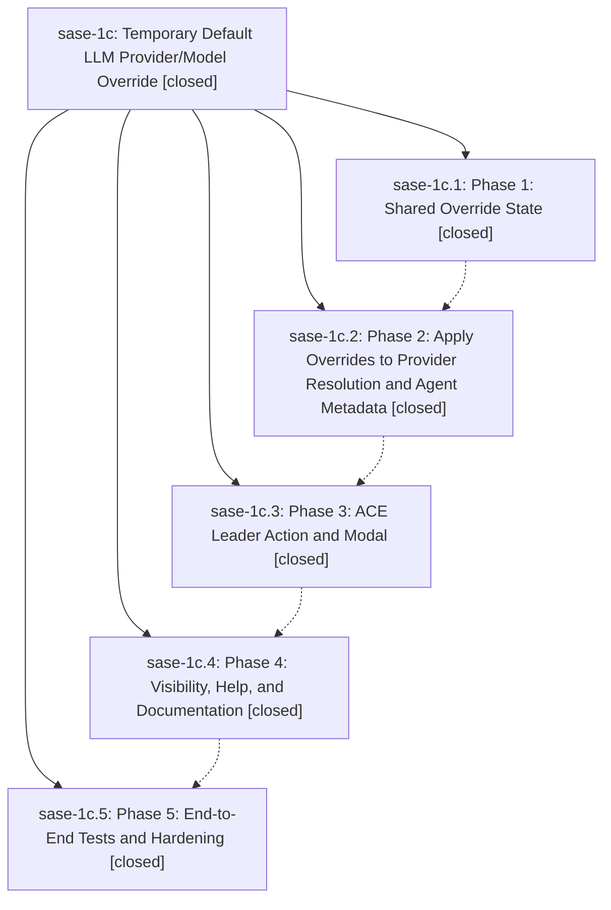

# Bead: sase-1c — Temporary Default LLM Provider/Model Override

[Bead Pages](../README.md) / sase-1c

**Status:** ✓ closed · **Resolution:** (unrecorded) · **Type:** plan · **Tier:** epic
**Owner:** `bryanbugyi34@gmail.com`
**Created:** 2026-04-29 21:30:55 UTC · **Closed:** 2026-04-29 22:55:53 UTC
**Plan:** [202604/temporary\_llm\_override.md](https://github.com/sase-org/sase--plans/blob/main/202604/temporary_llm_override.md)

## Phases

| Bead | Title | Status | Size | Agents | Commits |
|---|---|---|---|---:|---:|
| [sase-1c.1](sase-1c.1.md) | Phase 1: Shared Override State | ✓ closed | small | 0 | 1 |
| [sase-1c.2](sase-1c.2.md) | Phase 2: Apply Overrides to Provider Resolution and Agent Metadata | ✓ closed | small | 0 | 1 |
| [sase-1c.3](sase-1c.3.md) | Phase 3: ACE Leader Action and Modal | ✓ closed | small | 0 | 1 |
| [sase-1c.4](sase-1c.4.md) | Phase 4: Visibility, Help, and Documentation | ✓ closed | small | 0 | 1 |
| [sase-1c.5](sase-1c.5.md) | Phase 5: End-to-End Tests and Hardening | ✓ closed | small | 0 | 1 |

## Lineage

## Commits

| Commit | Subject | Bead | Committed (UTC) |
|---|---|---|---|
| [`3e08698`](https://github.com/sase-org/sase/commit/3e086980d9cc70479f4277253bdf73d0ad069543) | feat: Phase 1 — shared temporary LLM override state (sase-1c.1) | [sase-1c.1](sase-1c.1.md) | 2026-04-29 21:42:02 |
| [`246131e`](https://github.com/sase-org/sase/commit/246131e7cc92f82b729ddda07752dbdb4e1be57a) | feat: Phase 2 — apply temp LLM override to provider resolution and metadata (sase-1c.2) | [sase-1c.2](sase-1c.2.md) | 2026-04-29 22:04:56 |
| [`5058640`](https://github.com/sase-org/sase/commit/505864094dc446ce64c64a6d4cd63b4d82ef81c7) | feat: Phase 3 — ACE leader-mode TUI for the temporary LLM override (sase-1c.3) | [sase-1c.3](sase-1c.3.md) | 2026-04-29 22:18:52 |
| [`6fefd43`](https://github.com/sase-org/sase/commit/6fefd43f265956e23ae0987ed9ec6a7333f8a900) | chore: Phase 4 — visibility and docs for the temporary LLM override (sase-1c.4) | [sase-1c.4](sase-1c.4.md) | 2026-04-29 22:27:56 |
| [`ca9b53a`](https://github.com/sase-org/sase/commit/ca9b53a26bf72fa18b69b2afb117d8d5e0691fa7) | test: Phase 5 — end-to-end tests and hardening for the temporary LLM override (sase-1c.5) | [sase-1c.5](sase-1c.5.md) | 2026-04-29 22:51:25 |
