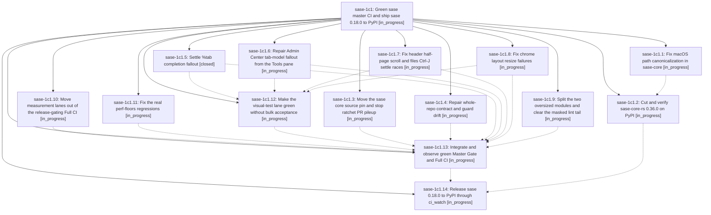

# Bead: sase-1c1 — Green sase master CI and ship sase 0.18.0 to PyPI

[Bead Pages](../README.md) / sase-1c1

**Status:** ◐ in_progress · **Type:** ▸ plan · **Tier:** epic
**Owner:** `bryanbugyi34@gmail.com` · **Created by:** [bbugyi200.athena.0ti](https://github.com/sase-org/sase--agents/blob/main/sessions/bbugyi200.athena.0ti.md) · **Assignee:** `sase-1c1.land`
**Created:** 2026-09-28 07:09:22 EDT
**Plan:** [202609/master\_ci\_green\_and\_0\_18\_release.md](https://github.com/sase-org/sase--plans/blob/main/202609/master_ci_green_and_0_18_release.md)

## Description

sase-core-rs 0.36.0 and sase 0.18.0 are live on PyPI and install cleanly from a fresh venv. They get there through the normal release path: Master Gate green on master HEAD, a green Full CI no older than 6 hours, the core-floor smoke on PR #299, and ci_watch merging #299. Full CI is restructured so that measurement and soak lanes can no longer block a release.

## Phases

| Bead | Title | Status | Size | Created | Agents | Commits |
|---|---|---|---|---|---:|---:|
| [sase-1c1.1](sase-1c1.1.md) | Fix macOS path canonicalization in sase-core | ◐ in_progress | small | 2026-09-28 | 1 | 0 |
| [sase-1c1.10](sase-1c1.10.md) | Move measurement lanes out of the release-gating Full CI | ◐ in_progress | medium | 2026-09-28 | 1 | 0 |
| [sase-1c1.11](sase-1c1.11.md) | Fix the real perf-floors regressions | ◐ in_progress | medium | 2026-09-28 | 1 | 0 |
| [sase-1c1.12](sase-1c1.12.md) | Make the visual-test lane green without bulk acceptance | ◐ in_progress | medium | 2026-09-28 | 1 | 0 |
| [sase-1c1.13](sase-1c1.13.md) | Integrate and observe green Master Gate and Full CI | ◐ in_progress | medium | 2026-09-28 | 1 | 0 |
| [sase-1c1.14](sase-1c1.14.md) | Release sase 0.18.0 to PyPI through ci\_watch | ◐ in_progress | small | 2026-09-28 | 1 | 0 |
| [sase-1c1.2](sase-1c1.2.md) | Cut and verify sase-core-rs 0.36.0 on PyPI | ◐ in_progress | small | 2026-09-28 | 1 | 0 |
| [sase-1c1.3](sase-1c1.3.md) | Move the sase core source pin and stop ratchet PR pileup | ◐ in_progress | small | 2026-09-28 | 1 | 0 |
| [sase-1c1.4](sase-1c1.4.md) | Repair whole-repo contract and guard drift | ◐ in_progress | medium | 2026-09-28 | 1 | 0 |
| [sase-1c1.5](sase-1c1.5.md) | Settle %tab completion fallout | ✓ closed | medium | 2026-09-28 | 1 | 1 |
| [sase-1c1.6](sase-1c1.6.md) | Repair Admin Center tab-model fallout from the Tools pane | ◐ in_progress | medium | 2026-09-28 | 1 | 0 |
| [sase-1c1.7](sase-1c1.7.md) | Fix header half-page scroll and files Ctrl-J settle races | ◐ in_progress | medium | 2026-09-28 | 1 | 0 |
| [sase-1c1.8](sase-1c1.8.md) | Fix chrome layout resize failures | ◐ in_progress | medium | 2026-09-28 | 1 | 0 |
| [sase-1c1.9](sase-1c1.9.md) | Split the two oversized modules and clear the masked lint tail | ◐ in_progress | medium | 2026-09-28 | 1 | 0 |

## Lineage

## Agents

| Agent | Bead | Commits |
|---|---|---:|
| [bbugyi200.athena.sase-1c1.1](https://github.com/sase-org/sase--agents/blob/main/sessions/bbugyi200.athena.sase-1c1.1.md) | [sase-1c1.1](sase-1c1.1.md) | 0 |
| [bbugyi200.athena.sase-1c1.10](https://github.com/sase-org/sase--agents/blob/main/agents/bbugyi200.athena.sase-1c1.10/README.md) | [sase-1c1.10](sase-1c1.10.md) | 0 |
| [bbugyi200.athena.sase-1c1.11](https://github.com/sase-org/sase--agents/blob/main/agents/bbugyi200.athena.sase-1c1.11/README.md) | [sase-1c1.11](sase-1c1.11.md) | 0 |
| [bbugyi200.athena.sase-1c1.12](https://github.com/sase-org/sase--agents/blob/main/agents/bbugyi200.athena.sase-1c1.12/README.md) | [sase-1c1.12](sase-1c1.12.md) | 0 |
| [bbugyi200.athena.sase-1c1.13](https://github.com/sase-org/sase--agents/blob/main/agents/bbugyi200.athena.sase-1c1.13/README.md) | [sase-1c1.13](sase-1c1.13.md) | 0 |
| [bbugyi200.athena.sase-1c1.14](https://github.com/sase-org/sase--agents/blob/main/agents/bbugyi200.athena.sase-1c1.14/README.md) | [sase-1c1.14](sase-1c1.14.md) | 0 |
| [bbugyi200.athena.sase-1c1.2](https://github.com/sase-org/sase--agents/blob/main/agents/bbugyi200.athena.sase-1c1.2/README.md) | [sase-1c1.2](sase-1c1.2.md) | 0 |
| [bbugyi200.athena.sase-1c1.3](https://github.com/sase-org/sase--agents/blob/main/sessions/bbugyi200.athena.sase-1c1.3.md) | [sase-1c1.3](sase-1c1.3.md) | 0 |
| [bbugyi200.athena.sase-1c1.4](https://github.com/sase-org/sase--agents/blob/main/agents/bbugyi200.athena.sase-1c1.4/README.md) | [sase-1c1.4](sase-1c1.4.md) | 0 |
| [bbugyi200.athena.sase-1c1.5](https://github.com/sase-org/sase--agents/blob/main/agents/bbugyi200.athena.sase-1c1.5/README.md) | [sase-1c1.5](sase-1c1.5.md) | 1 |
| [bbugyi200.athena.sase-1c1.6](https://github.com/sase-org/sase--agents/blob/main/agents/bbugyi200.athena.sase-1c1.6/README.md) | [sase-1c1.6](sase-1c1.6.md) | 0 |
| [bbugyi200.athena.sase-1c1.7](https://github.com/sase-org/sase--agents/blob/main/agents/bbugyi200.athena.sase-1c1.7/README.md) | [sase-1c1.7](sase-1c1.7.md) | 0 |
| [bbugyi200.athena.sase-1c1.8](https://github.com/sase-org/sase--agents/blob/main/agents/bbugyi200.athena.sase-1c1.8/README.md) | [sase-1c1.8](sase-1c1.8.md) | 0 |
| [bbugyi200.athena.sase-1c1.9](https://github.com/sase-org/sase--agents/blob/main/agents/bbugyi200.athena.sase-1c1.9/README.md) | [sase-1c1.9](sase-1c1.9.md) | 0 |
| [bbugyi200.athena.sase-1c1.land](https://github.com/sase-org/sase--agents/blob/main/agents/bbugyi200.athena.sase-1c1.land/README.md) | [sase-1c1](README.md) | 0 |

## Commits

| Repo | Commit | Subject | Bead | Committed |
|---|---|---|---|---|
| sase | [`a0fd993`](https://github.com/sase-org/sase/commit/a0fd993c6e7057a55363809e9b08d3946420444a) | fix(ace-tui): gate tab completion behind agent\_tabs flag (sase-1c1.5) | [sase-1c1.5](sase-1c1.5.md) | 2026-09-28 07:23:39 EDT |
