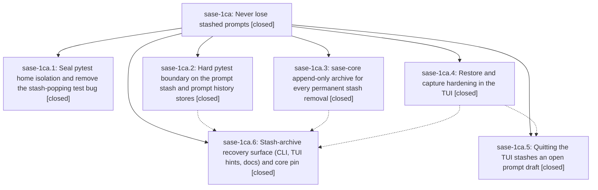

# Bead: sase-1ca — Never lose stashed prompts

[Bead Pages](../README.md) / sase-1ca

**Status:** ✓ closed · **Resolution:** done · **Type:** ▸ plan · **Tier:** epic
**Owner:** `bryanbugyi34@gmail.com` · **Created by:** [bbugyi200.athena.0tt.w0](https://github.com/sase-org/sase--agents/blob/main/sessions/bbugyi200.athena.0tt.w0.md) · **Assignee:** `sase-1ca.land`
**Created:** 2026-09-28 17:30:07 EDT · **Closed:** 2026-09-28 19:44:13 EDT
**Plan:** [202609/never\_lose\_stashed\_prompts.md](https://github.com/sase-org/sase--plans/blob/main/202609/never_lose_stashed_prompts.md)

<!-- sase:links:start -->

## Links

| Relation | Artifact | Why |
| --- | --- | --- |
| implemented-by | [plan:202609/never_lose_stashed_prompts.md][1] | derived from the plan's `bead_id:` frontmatter field |

[1]: https://github.com/sase-org/sase--plans/blob/main/202609/never_lose_stashed_prompts.md

<!-- sase:links:end -->

## Description

A pytest process can never read or mutate the user's real prompt stash or history, every row that permanently leaves the prompt stash is archived first and recoverable with `sase prompt stash-archive`, and the TUI's restore, stash-capture, and quit paths can no longer silently drop a prompt draft.

## Notes

[2026-09-28T23:22:40Z · sase-1ca.land] LAND FOLLOW-UP TRIAGE (sase-1ca.land): (1) flags-lint PROPOSED FOLLOW-UPs from sase-1ca.1 #1, .2 #2, .4 #1, .5 #1: not caused by this epic. The failure is now rule 8 (sase-1be open while f379c64179 / sase-1bc.12 removed the agent_tabs definition), so it went to active epic sase-1bc as a DISCOVERED ISSUE note, not a task. (2) sase-1ca.2 #1 agent-loader test failures: still fail deterministically, traced to 548bbe9284 (no owning epic); created task sase-1cd (ci, small). (3) The plan's out-of-scope candidates were never recorded by any phase worker, so they were routed here: $EDITOR temp file deleted on non-zero exit -> sase-1ce (bug); silent failed prompt-history save -> sase-1cf (bug); crash-safe draft journal -> sase-1ch (feature); short/frontmatter-only drafts -> sase-1ci (feature). Declined: archive retention/rotation (the plan says revisit only if growth is measurable, and none is measured yet: corpus-before-mechanism); deleting the unreachable StashedPromptsModal (its delete path goes through the facade pop, which sase-1ca.3 now archives, so no data-loss risk remains; pure dead code, not worth a triage gate). (4) Found while verifying: TUI restart still drops a draft when the pre-restart stash write fails. This predates the epic (quit is fixed), so it became task sase-1cg (bug). (5) sase-1ca.6's KNOWN/FLAKY triaged failures were not follow-up proposals; nothing to route.

[2026-09-28T23:24:54Z · sase-1ca.land] LAND VERIFICATION (sase-1ca.land, master 4f4764b42d): phases 2 (facade/history guards), 3 (sase-core df23cce archive: fsynced, fail-closed, all four reasons, recover API; pinned) and 6 (stash-archive CLI list/restore/show, facade guards, docs, e2e test) match the plan. Remaining epic work found: (1) the phase-1 _sandbox_session_home is reverted after each worker's first test, because tests/conftest.py pytest_runtest_protocol restores a pre-session env snapshot; HOME/SASE_HOME are not in _ENV_KEYS_TO_IGNORE. Reproduced with two probe modules: module B's baseline was /home/bryan with SASE_HOME unset. (2) The seal regression test is tautological (it sets HOME to the sandbox itself). (3) The stash-task done-callback uses logger.exception outside an except block, so the log has no traceback. (4) _rollback_stash_restore swallows append failures but still toasts 'put back'. (5) _stop_axe_and_quit stops the watchdog and scheduler before a failed quit-draft stash cancels the exit. (6) The purge confirm says 'cannot be undone' next to the archive hint, and the Stash->Trash eviction toast lacks the hint. Integration: the concurrent commits (f379c64179, b390be0780, d1063d161c, a3327e02bf, 96c03436e0) do not conflict, and nothing bypasses the guarded facade. No --epic-symbol entries. Proposing a landing tale that fixes 1-6 and closes the epic.

[2026-09-28T23:44:13Z · sase-1ca.land] LAND VERIFICATION (land_never_lose_stashed_prompts): phases 1-6 verified against sase commits ee75c62d81, aba5d035c2, 703b042c23, 67f4a1d1ec, 4f4764b42d and sase-core df23cce (pinned in sase-core-revision.txt). Land fixes Gaps 1-6 with regression tests: (1) HOME/SASE_HOME added to _ENV_KEYS_TO_IGNORE with docstring + ignore-list asserts; (2) seal test rewritten on a module-scoped HOME/SASE_HOME baseline plus ordering test test_session_sandbox_seal_is_not_first_test (proved to fail with the keys removed, passes with the fix); (3) stash-task failure logged with exc_info=exc plus exc_info-type assert; (4) _rollback_stash_restore returns bool, failed rollback toasts the archive hint, plus rollback-failure test asserting sase prompt stash-archive and archive reason popped; (5) _stop_axe_and_quit stashes the quit draft first and returns early on failure, plus scheduler-untouched test; (6) purge/confirm/outcome copy uses STASH_ARCHIVE_RECOVERY_HINT with updated string tests. Affected modules pass: isolation guards trio 29 passed; restore_confirm/handler/quit/trash_pane/prompts_modal_trash/stash_archive/axe_stop_quit 116 passed. sase tool run check b402edf: every gate green except the known lint (feature flags) rule 8 on flag bead sase-1be / key agent_tabs owned by epic sase-1bc; just symvision is clean. Integration review: concurrent commits f379c64179, b390be0780, d1063d161c, a3327e02bf and 96c03436e0 do not conflict with the epic; the sase-1bc availability edits touch a different branch of check_app_action, and no code calls the prompt-stash Rust bindings outside the guarded facade. Follow-ups remain in the LAND FOLLOW-UP TRIAGE note already on sase-1ca (tasks sase-1cd through sase-1ci and the declined items).

## Phases

| Bead | Title | Status | Size | Created | Agents | Commits |
|---|---|---|---|---|---:|---:|
| [sase-1ca.1](sase-1ca.1.md) | Seal pytest home isolation and remove the stash-popping test bug | ✓ closed | medium | 2026-09-28 | 1 | 1 |
| [sase-1ca.2](sase-1ca.2.md) | Hard pytest boundary on the prompt stash and prompt history stores | ✓ closed | small | 2026-09-28 | 1 | 1 |
| [sase-1ca.3](sase-1ca.3.md) | sase-core append-only archive for every permanent stash removal | ✓ closed | medium | 2026-09-28 | 1 | 1 |
| [sase-1ca.4](sase-1ca.4.md) | Restore and capture hardening in the TUI | ✓ closed | medium | 2026-09-28 | 1 | 1 |
| [sase-1ca.5](sase-1ca.5.md) | Quitting the TUI stashes an open prompt draft | ✓ closed | small | 2026-09-28 | 1 | 1 |
| [sase-1ca.6](sase-1ca.6.md) | Stash-archive recovery surface (CLI, TUI hints, docs) and core pin | ✓ closed | medium | 2026-09-28 | 1 | 1 |

## Lineage

## Agents

| Agent | Bead | Commits |
|---|---|---:|
| [bbugyi200.athena.sase-1ca.1](https://github.com/sase-org/sase--agents/blob/main/sessions/bbugyi200.athena.sase-1ca.1.md) | [sase-1ca.1](sase-1ca.1.md) | 1 |
| [bbugyi200.athena.sase-1ca.2](https://github.com/sase-org/sase--agents/blob/main/agents/bbugyi200.athena.sase-1ca.2/README.md) | [sase-1ca.2](sase-1ca.2.md) | 1 |
| [bbugyi200.athena.sase-1ca.3](https://github.com/sase-org/sase--agents/blob/main/agents/bbugyi200.athena.sase-1ca.3/README.md) | [sase-1ca.3](sase-1ca.3.md) | 1 |
| [bbugyi200.athena.sase-1ca.4](https://github.com/sase-org/sase--agents/blob/main/agents/bbugyi200.athena.sase-1ca.4/README.md) | [sase-1ca.4](sase-1ca.4.md) | 1 |
| [bbugyi200.athena.sase-1ca.5](https://github.com/sase-org/sase--agents/blob/main/sessions/bbugyi200.athena.sase-1ca.5.md) | [sase-1ca.5](sase-1ca.5.md) | 1 |
| [bbugyi200.athena.sase-1ca.6](https://github.com/sase-org/sase--agents/blob/main/sessions/bbugyi200.athena.sase-1ca.6.md) | [sase-1ca.6](sase-1ca.6.md) | 1 |
| [bbugyi200.athena.sase-1ca.land](https://github.com/sase-org/sase--agents/blob/main/sessions/bbugyi200.athena.sase-1ca.land.md) | [sase-1ca](README.md) | 1 |

## Commits

| Repo | Commit | Subject | Bead | Committed |
|---|---|---|---|---|
| sase | [`ee75c62`](https://github.com/sase-org/sase/commit/ee75c62d8156672cc815f698f692cac48c4b1d4f) | feat(prompt-stash): guard prompt stash and history writes to test-isolated stores | [sase-1ca.2](sase-1ca.2.md) | 2026-09-28 17:45:15 EDT |
| sase | [`aba5d03`](https://github.com/sase-org/sase/commit/aba5d035c2e35849b455edad569fcdbd695cbac7) | fix(ace): harden prompt stash restore, capture, and availability guards | [sase-1ca.4](sase-1ca.4.md) | 2026-09-28 17:46:02 EDT |
| sase-core | [`sase-core@df23cce`](https://github.com/sase-org/sase-core/commit/df23ccee7b5e06e95d760f8d9e20f0ebd802b538) | feat(prompt-stash): append-only archive for every permanent stash removal | [sase-1ca.3](sase-1ca.3.md) | 2026-09-28 17:53:28 EDT |
| sase | [`703b042`](https://github.com/sase-org/sase/commit/703b042c236d915bcc44635e702267cad36361be) | feat(ace): add tmux launch, isolation guards, notification settlement and stash-restore coverage | [sase-1ca.1](sase-1ca.1.md) | 2026-09-28 18:18:35 EDT |
| sase | [`67f4a1d`](https://github.com/sase-org/sase/commit/67f4a1d1ec72670cfe936f587b200eb1766c71fa) | feat(ace): stash open prompt draft on TUI quit paths | [sase-1ca.5](sase-1ca.5.md) | 2026-09-28 18:32:25 EDT |
| sase | [`4f4764b`](https://github.com/sase-org/sase/commit/4f4764b42de68472daae86e4b8d421f422a14021) | feat(prompt-stash): recoverable stash archive with CLI, TUI hints, and docs | [sase-1ca.6](sase-1ca.6.md) | 2026-09-28 19:01:22 EDT |
| sase | [`119f97d`](https://github.com/sase-org/sase/commit/119f97da8078cc265d6f2219cd94c91b8cbda43e) | feat(prompt-stash): land sase-1ca hardening gaps 1-6 with regression tests | [sase-1ca](README.md) | 2026-09-28 19:46:15 EDT |
