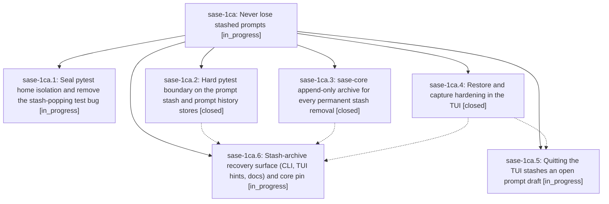

# Bead: sase-1ca — Never lose stashed prompts

[Bead Pages](../README.md) / sase-1ca

**Status:** ◐ in_progress · **Type:** ▸ plan · **Tier:** epic
**Owner:** `bryanbugyi34@gmail.com` · **Created by:** [bbugyi200.athena.0tt.w0](https://github.com/sase-org/sase--agents/blob/main/sessions/bbugyi200.athena.0tt.w0.md) · **Assignee:** `sase-1ca.land`
**Created:** 2026-09-28 17:30:07 EDT
**Plan:** [202609/never\_lose\_stashed\_prompts.md](https://github.com/sase-org/sase--plans/blob/main/202609/never_lose_stashed_prompts.md)

## Description

A pytest process can never read or mutate the user's real prompt stash or history, every row that permanently leaves the prompt stash is archived first and recoverable with `sase prompt stash-archive`, and the TUI's restore, stash-capture, and quit paths can no longer silently drop a prompt draft.

## Phases

| Bead | Title | Status | Size | Created | Agents | Commits |
|---|---|---|---|---|---:|---:|
| [sase-1ca.1](sase-1ca.1.md) | Seal pytest home isolation and remove the stash-popping test bug | ◐ in_progress | medium | 2026-09-28 | 1 | 0 |
| [sase-1ca.2](sase-1ca.2.md) | Hard pytest boundary on the prompt stash and prompt history stores | ✓ closed | small | 2026-09-28 | 1 | 0 |
| [sase-1ca.3](sase-1ca.3.md) | sase-core append-only archive for every permanent stash removal | ✓ closed | medium | 2026-09-28 | 1 | 1 |
| [sase-1ca.4](sase-1ca.4.md) | Restore and capture hardening in the TUI | ✓ closed | medium | 2026-09-28 | 1 | 0 |
| [sase-1ca.5](sase-1ca.5.md) | Quitting the TUI stashes an open prompt draft | ◐ in_progress | small | 2026-09-28 | 1 | 0 |
| [sase-1ca.6](sase-1ca.6.md) | Stash-archive recovery surface (CLI, TUI hints, docs) and core pin | ◐ in_progress | medium | 2026-09-28 | 1 | 0 |

## Lineage

## Agents

| Agent | Bead | Commits |
|---|---|---:|
| [bbugyi200.athena.sase-1ca.1](https://github.com/sase-org/sase--agents/blob/main/sessions/bbugyi200.athena.sase-1ca.1.md) | [sase-1ca.1](sase-1ca.1.md) | 0 |
| [bbugyi200.athena.sase-1ca.2](https://github.com/sase-org/sase--agents/blob/main/agents/bbugyi200.athena.sase-1ca.2/README.md) | [sase-1ca.2](sase-1ca.2.md) | 0 |
| [bbugyi200.athena.sase-1ca.3](https://github.com/sase-org/sase--agents/blob/main/agents/bbugyi200.athena.sase-1ca.3/README.md) | [sase-1ca.3](sase-1ca.3.md) | 1 |
| [bbugyi200.athena.sase-1ca.4](https://github.com/sase-org/sase--agents/blob/main/agents/bbugyi200.athena.sase-1ca.4/README.md) | [sase-1ca.4](sase-1ca.4.md) | 0 |
| [bbugyi200.athena.sase-1ca.5](https://github.com/sase-org/sase--agents/blob/main/agents/bbugyi200.athena.sase-1ca.5/README.md) | [sase-1ca.5](sase-1ca.5.md) | 0 |
| [bbugyi200.athena.sase-1ca.6](https://github.com/sase-org/sase--agents/blob/main/agents/bbugyi200.athena.sase-1ca.6/README.md) | [sase-1ca.6](sase-1ca.6.md) | 0 |
| [bbugyi200.athena.sase-1ca.land](https://github.com/sase-org/sase--agents/blob/main/agents/bbugyi200.athena.sase-1ca.land/README.md) | [sase-1ca](README.md) | 0 |

## Commits

| Repo | Commit | Subject | Bead | Committed |
|---|---|---|---|---|
| sase-core | [`sase-core@df23cce`](https://github.com/sase-org/sase-core/commit/df23ccee7b5e06e95d760f8d9e20f0ebd802b538) | feat(prompt-stash): append-only archive for every permanent stash removal | [sase-1ca.3](sase-1ca.3.md) | 2026-09-28 17:53:28 EDT |
