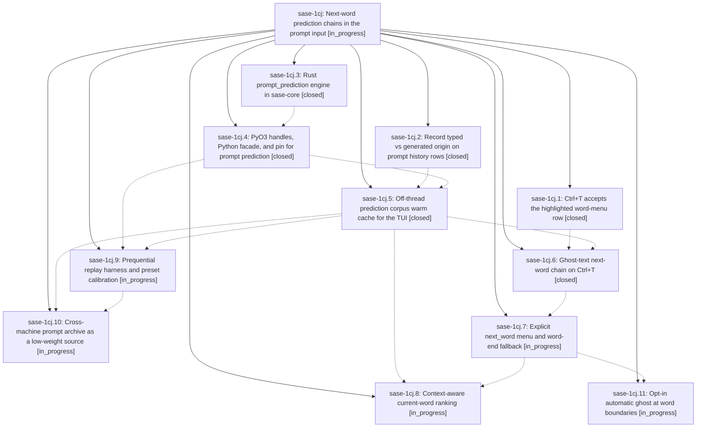

# Bead: sase-1cj — Next-word prediction chains in the prompt input

[Bead Pages](../README.md) / sase-1cj

**Status:** ◐ in_progress · **Type:** ▸ plan · **Tier:** epic
**Owner:** `bryanbugyi34@gmail.com` · **Created by:** `bbugyi200.apollo.2x` · **Assignee:** `sase-1cj.land`
**Created:** 2026-09-29 07:14:24 EDT
**Plan:** [202609/prompt\_next\_word\_prediction.md](https://github.com/sase-org/sase--plans/blob/main/202609/prompt_next_word_prediction.md)

<!-- sase:links:start -->

## Links

| Relation | Artifact | Why |
| --- | --- | --- |
| implemented-by | [plan:202609/prompt_next_word_prediction.md][1] | derived from the plan's `bead_id:` frontmatter field |

_Plus 1 automatic references — see [Referenced By](#referenced-by)._

[1]: https://github.com/sase-org/sase--plans/blob/main/202609/prompt_next_word_prediction.md

<!-- sase:links:end -->

## Description

In the prompt input, pressing Ctrl+T repeatedly first completes the current word, then previews and accepts confident guesses for the next words. The guesses come from the user's own typed prompt history (weighted toward the same project, with the cross-machine prompt archive as a low-weight source) and appear as dim inline ghost text before anything is inserted. Predictions come from the Rust core in well under a millisecond and never block typing.

## Phases

| Bead | Title | Status | Size | Created | Agents | Commits |
|---|---|---|---|---|---:|---:|
| [sase-1cj.1](sase-1cj.1.md) | Ctrl+T accepts the highlighted word-menu row | ✓ closed | small | 2026-09-29 | 1 | 1 |
| [sase-1cj.10](sase-1cj.10.md) | Cross-machine prompt archive as a low-weight source | ◐ in_progress | medium | 2026-09-29 | 1 | 0 |
| [sase-1cj.11](sase-1cj.11.md) | Opt-in automatic ghost at word boundaries | ◐ in_progress | small | 2026-09-29 | 1 | 0 |
| [sase-1cj.2](sase-1cj.2.md) | Record typed vs generated origin on prompt history rows | ✓ closed | medium | 2026-09-29 | 1 | 1 |
| [sase-1cj.3](sase-1cj.3.md) | Rust prompt\_prediction engine in sase-core | ✓ closed | medium | 2026-09-29 | 1 | 1 |
| [sase-1cj.4](sase-1cj.4.md) | PyO3 handles, Python facade, and pin for prompt prediction | ✓ closed | small | 2026-09-29 | 1 | 2 |
| [sase-1cj.5](sase-1cj.5.md) | Off-thread prediction corpus warm cache for the TUI | ✓ closed | medium | 2026-09-29 | 1 | 1 |
| [sase-1cj.6](sase-1cj.6.md) | Ghost-text next-word chain on Ctrl+T | ✓ closed | medium | 2026-09-29 | 1 | 1 |
| [sase-1cj.7](sase-1cj.7.md) | Explicit next\_word menu and word-end fallback | ◐ in_progress | medium | 2026-09-29 | 1 | 0 |
| [sase-1cj.8](sase-1cj.8.md) | Context-aware current-word ranking | ◐ in_progress | medium | 2026-09-29 | 1 | 0 |
| [sase-1cj.9](sase-1cj.9.md) | Prequential replay harness and preset calibration | ◐ in_progress | medium | 2026-09-29 | 1 | 0 |

## Lineage

## Agents

| Agent | Bead | Commits |
|---|---|---:|
| [bbugyi200.athena.sase-1cj.1](https://github.com/sase-org/sase--agents/blob/main/agents/bbugyi200.athena.sase-1cj.1/README.md) | [sase-1cj.1](sase-1cj.1.md) | 1 |
| [bbugyi200.athena.sase-1cj.10](https://github.com/sase-org/sase--agents/blob/main/agents/bbugyi200.athena.sase-1cj.10/README.md) | [sase-1cj.10](sase-1cj.10.md) | 0 |
| [bbugyi200.athena.sase-1cj.11](https://github.com/sase-org/sase--agents/blob/main/agents/bbugyi200.athena.sase-1cj.11/README.md) | [sase-1cj.11](sase-1cj.11.md) | 0 |
| [bbugyi200.athena.sase-1cj.2](https://github.com/sase-org/sase--agents/blob/main/agents/bbugyi200.athena.sase-1cj.2/README.md) | [sase-1cj.2](sase-1cj.2.md) | 1 |
| [bbugyi200.athena.sase-1cj.3](https://github.com/sase-org/sase--agents/blob/main/agents/bbugyi200.athena.sase-1cj.3/README.md) | [sase-1cj.3](sase-1cj.3.md) | 1 |
| [bbugyi200.athena.sase-1cj.4](https://github.com/sase-org/sase--agents/blob/main/sessions/bbugyi200.athena.sase-1cj.4.md) | [sase-1cj.4](sase-1cj.4.md) | 2 |
| [bbugyi200.athena.sase-1cj.5](https://github.com/sase-org/sase--agents/blob/main/agents/bbugyi200.athena.sase-1cj.5/README.md) | [sase-1cj.5](sase-1cj.5.md) | 1 |
| [bbugyi200.athena.sase-1cj.6](https://github.com/sase-org/sase--agents/blob/main/sessions/bbugyi200.athena.sase-1cj.6.md) | [sase-1cj.6](sase-1cj.6.md) | 1 |
| [bbugyi200.athena.sase-1cj.7](https://github.com/sase-org/sase--agents/blob/main/agents/bbugyi200.athena.sase-1cj.7/README.md) | [sase-1cj.7](sase-1cj.7.md) | 0 |
| [bbugyi200.athena.sase-1cj.8](https://github.com/sase-org/sase--agents/blob/main/agents/bbugyi200.athena.sase-1cj.8/README.md) | [sase-1cj.8](sase-1cj.8.md) | 0 |
| [bbugyi200.athena.sase-1cj.9](https://github.com/sase-org/sase--agents/blob/main/sessions/bbugyi200.athena.sase-1cj.9.md) | [sase-1cj.9](sase-1cj.9.md) | 0 |
| [bbugyi200.athena.sase-1cj.land](https://github.com/sase-org/sase--agents/blob/main/agents/bbugyi200.athena.sase-1cj.land/README.md) | [sase-1cj](README.md) | 0 |

## Commits

| Repo | Commit | Subject | Bead | Committed |
|---|---|---|---|---|
| sase | [`eaa4aa4`](https://github.com/sase-org/sase/commit/eaa4aa4aa72d67f27156e22cd7939422e87f4afc) | feat(prompt-history): record typed vs generated origin on prompt rows | [sase-1cj.2](sase-1cj.2.md) | 2026-09-29 07:44:59 EDT |
| sase | [`6f3ecab`](https://github.com/sase-org/sase/commit/6f3ecabd1f3cea4e272cad725d8b8fc5d7d3697e) | feat(ace): accept highlighted word-menu row on second Ctrl+T | [sase-1cj.1](sase-1cj.1.md) | 2026-09-29 07:45:02 EDT |
| sase-core | [`sase-core@f88fb25`](https://github.com/sase-org/sase-core/commit/f88fb255e1c17679f14abdf81dafba809c4db6a8) | feat(prompt-prediction): add Rust prompt\_prediction engine with tokenizer, n-gram corpus and backoff prediction | [sase-1cj.3](sase-1cj.3.md) | 2026-09-29 09:17:10 EDT |
| sase | [`b1a371c`](https://github.com/sase-org/sase/commit/b1a371c9ac9d23d94acaabc5325ba8439cbc7a51) | feat(core-binding): add PromptPredictionCorpus/Model facade, wire mirror and validator | [sase-1cj.4](sase-1cj.4.md) | 2026-09-29 10:18:37 EDT |
| sase-core | [`sase-core@12e012d`](https://github.com/sase-org/sase-core/commit/12e012d5fa3eae2949e0c27906602a9858c07033) | feat(core-binding): add prompt\_prediction binding module with tests | [sase-1cj.4](sase-1cj.4.md) | 2026-09-29 10:22:32 EDT |
| sase | [`8f3b5bf`](https://github.com/sase-org/sase/commit/8f3b5bf6560162d54e7ccbc173eabac1665c6713) | feat(prediction-cache): off-thread prediction corpus warm cache for the TUI | [sase-1cj.5](sase-1cj.5.md) | 2026-09-29 11:46:55 EDT |
| sase | [`935243f`](https://github.com/sase-org/sase/commit/935243ffe914831edcef7d6415a5fd43cdc50bcd) | feat(ace): next-word prompt completion for sase-1cj.6 | [sase-1cj.6](sase-1cj.6.md) | 2026-09-29 12:41:44 EDT |

<!-- sase:referenced-by:start -->

## Referenced By

| Relation | Artifact | Why | Uses |
| --- | --- | --- | ---: |
| read-by | [agent:sase-1cj.2][1] | Need epic context for phase | 1 |

[1]: https://github.com/sase-org/sase--agents/blob/main/agents/bbugyi200.athena.sase-1cj.2/README.md

<!-- sase:referenced-by:end -->
