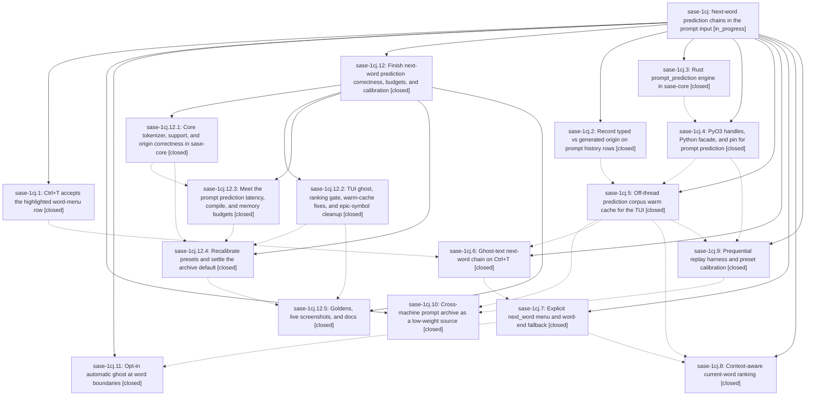

# Bead: sase-1cj — Next-word prediction chains in the prompt input

[Bead Pages](../README.md) / sase-1cj

**Status:** ◐ in_progress · **Type:** ▸ plan · **Tier:** epic
**Owner:** `bryanbugyi34@gmail.com` · **Created by:** `bbugyi200.apollo.2x` · **Assignee:** `sase-1cj.land`
**Created:** 2026-09-29 07:14:24 EDT
**Plan:** [202609/prompt\_next\_word\_prediction.md](https://github.com/sase-org/sase--plans/blob/main/202609/prompt_next_word_prediction.md)

<!-- sase:links:start -->

## Links

| Relation | Artifact | Why |
| --- | --- | --- |
| implemented-by | [plan:202609/prompt_next_word_prediction.md][1] | derived from the plan's `bead_id:` frontmatter field |

_Plus 6 automatic references — see [Referenced By](#referenced-by)._

[1]: https://github.com/sase-org/sase--plans/blob/main/202609/prompt_next_word_prediction.md

<!-- sase:links:end -->

## Description

In the prompt input, pressing Ctrl+T repeatedly first completes the current word, then previews and accepts confident guesses for the next words. The guesses come from the user's own typed prompt history (weighted toward the same project, with the cross-machine prompt archive as a low-weight source) and appear as dim inline ghost text before anything is inserted. Predictions come from the Rust core in well under a millisecond and never block typing.

## Notes

[2026-09-29T22:23:43Z · sase-1cj.land] LAND TRIAGE of PROPOSED FOLLOW-UPs: (1) lint(feature flags) rule 8 on flag bead sase-1be (proposed by .1/.2/.4/.5) — DECLINED, no longer reproduces: tools/check_feature_flags exits 0 on HEAD 4fce27e507. (2) move sase-core-revision.txt past the prompt_prediction binding (.4) and past the replay commit (.9) — DECLINED, done: pin is 1e51ff3 (339a67306b), which contains f88fb25/12e012d/1ad57ea. (3) test_load_agents_from_disk_uses_artifact_index_for_initial_tier, test_viewport_window_keeps_tier1_caps, test_bounded_agents_viewport_expands_near_prefix_end (.5) — DECLINED, fixed by 8c38eb6a9a; 3 passed on HEAD. (4) patch/stitch terminology audit on sase-core fixture at_bearing_notes.jsonl (.5/.6/.7/.8/.9/.10/.11) — not caused by this epic; /sase_new_task found it already recorded as DISCOVERED ISSUE on active causal epic sase-1ck (fixture from sase-1ck.1 / sase-core 39324ac); added a corroboration note there, no new task. Also closed ready CI task sase-1cm (origin-kwarg launch mocks, caused by .2) as fixed by 8c38eb6a9a after re-running its family (277 passed).

[2026-09-29T22:25:43Z · sase-1cj.land] LAND VERIFICATION (2026-09-29, HEAD 4fce27e507, sase-core pin 1e51ff3 contains all epic core commits): phases .1 and .2 fully match the plan, and the write-site/launch-site origin inventory is complete. Remaining epic-caused work, all reproduced: (a) HIGH: stale ghost — _validate_next_word_ghost drops _next_word_ghost but never clears Textual suggestion, so Left then Right turns 'Can you help me' into 'Can you help m implemente'; (b) 3 test_prompt_next_word tests fail on HEAD because the .9 balanced recalibration (0.75/0.20/4) shortens the fixture ghost; (c) core does not block structural tails (path, #tag, code span, Jinja, %{..} alternation, ':') and falls back to the earlier words, e.g. 'please look at src/foo.rs' gives ghost 'the parser and fix'; (d) project-partition distinct is added onto global support (double count) in predict.rs and replay.rs; (e) cautious preset behaves identically to balanced; (f) origin markers %swarm(/%lead( do not exist in sase; (g) real-history predict p95 ~2.5ms (budget 0.5ms), compile ~190ms/1k (budget 50), corpus 27.8MB (budget 5MB); (h) context ranking ignores word_ranking: smart; (i) the archive rebuilds on every warm when it yields no rows; (j) missing context-ranking and auto-mode goldens, the history+archive replay default decision, the RSS delta, and the live screenshot flow; (k) 12 --epic-symbol sase-1cj entries remain. Integration: sase-1co's shared alternation scanner (sase-core 1e51ff3) should feed the tokenizer's excluded regions. 8c38eb6a9a already repaired the origin-kwarg test fakes. The 79e7107da7 file-completion split kept every epic hook. Planning a child epic for the remaining work.

[2026-09-30T19:39:28Z · sase-1cj.12.land] DISCOVERED ISSUE (sase-1cj.12.land, 2026-09-30, master 69c4057735 + this landing's commit, sase-core pin c3042fd): the parent-plan §5.4 prediction budgets are still unmet losslessly. Proposed by sase-1cj.12.3 notes #1-#3 and sase-1cj.12.4 note #2; these are the item (g) budgets from this epic's land note #2. Real history via tools/prompt_prediction_replay --bench (3,264 rows used): default menu request (limit 5, max_words 4, draft on) p50 ~0.9 ms / p95 ~1.9-2.2 ms (was 3.0/8.7 ms before core-perf); the TUI ghost-only paths now request zero menu rows (identical gate and ghost) at p95 ~0.6-0.75 ms against the 0.5 ms budget; rank_prefix p95 ~0.3 ms; compile ~273 ms per 1k rows (budget 50); approx_bytes ~54 MB (budget 5); RSS ~180 MB history + ~130 MB archive retained (budget 60). Remaining latency cost is the per-request draft: DraftCounts::from_sequences re-counts the whole draft into per-order n-gram tables and candidate_keys adds every draft word as a scoring candidate; with no draft the zero-row request measures p95 ~0.44 ms. Open options: (1) a result-identical draft-count redesign in sase-core for latency; (2) a frozen flat corpus layout for RSS/approx_bytes; (3) lossy pruning, which is a product decision; (4) a revised compile budget, since tokenization alone costs ~28 ms per 1k rows. docs/rust_backend.md 'Prediction cost' and 'Prediction RSS' record the numbers.

[2026-09-30T19:58:30Z · sase-1cj.12.land] LAND RESUMPTION BLOCKED (sase-1cj.12.land, 2026-09-30): child epic sase-1cj.12 is now closed. Its land note #2 items (a)-(f) and (h)-(k) are verified done on master: stale ghost, the 3 red tests, structural/alternation tails, once-per-row support, a cautious preset distinct from balanced, the real origin inventory, the smart-only ranking gate, the archive warm loop, the goldens and archive default and RSS measurement, and epic-symbols. sase bead epic-symbols sase-1cj is empty. sase-1cj is NOT closed because item (g) remains: the plan's goal ('well under a millisecond') and its §5.4/§9 budgets (predict p95 ≤ 0.5 ms local, compile ≤ 50 ms per 1k, corpus ≤ 5 MB, RSS ≤ 60 MB) are unmet losslessly. Numbers and options are in this bead's DISCOVERED ISSUE note: ghost-path p95 ~0.6-0.75 ms, menu request ~1.9-2.2 ms, RSS ~310 MB. Closing needs an owner decision. Either (A) approve follow-up perf work (a result-identical draft-count redesign in sase-core for latency, plus a frozen flat corpus layout for RSS/bytes), or (B) accept revised budgets at the measured numbers and close this epic with that recorded. The plan file stays status: wip.

## Phases

| Bead | Title | Status | Size | Created | Agents | Commits |
|---|---|---|---|---|---:|---:|
| [sase-1cj.1](sase-1cj.1.md) | Ctrl+T accepts the highlighted word-menu row | ✓ closed | small | 2026-09-29 | 1 | 1 |
| [sase-1cj.10](sase-1cj.10.md) | Cross-machine prompt archive as a low-weight source | ✓ closed | medium | 2026-09-29 | 1 | 1 |
| [sase-1cj.11](sase-1cj.11.md) | Opt-in automatic ghost at word boundaries | ✓ closed | small | 2026-09-29 | 1 | 1 |
| [sase-1cj.2](sase-1cj.2.md) | Record typed vs generated origin on prompt history rows | ✓ closed | medium | 2026-09-29 | 1 | 1 |
| [sase-1cj.3](sase-1cj.3.md) | Rust prompt\_prediction engine in sase-core | ✓ closed | medium | 2026-09-29 | 1 | 1 |
| [sase-1cj.4](sase-1cj.4.md) | PyO3 handles, Python facade, and pin for prompt prediction | ✓ closed | small | 2026-09-29 | 1 | 2 |
| [sase-1cj.5](sase-1cj.5.md) | Off-thread prediction corpus warm cache for the TUI | ✓ closed | medium | 2026-09-29 | 1 | 1 |
| [sase-1cj.6](sase-1cj.6.md) | Ghost-text next-word chain on Ctrl+T | ✓ closed | medium | 2026-09-29 | 1 | 1 |
| [sase-1cj.7](sase-1cj.7.md) | Explicit next\_word menu and word-end fallback | ✓ closed | medium | 2026-09-29 | 1 | 1 |
| [sase-1cj.8](sase-1cj.8.md) | Context-aware current-word ranking | ✓ closed | medium | 2026-09-29 | 1 | 1 |
| [sase-1cj.9](sase-1cj.9.md) | Prequential replay harness and preset calibration | ✓ closed | medium | 2026-09-29 | 1 | 2 |

## Lineage

## Agents

| Agent | Bead | Commits |
|---|---|---:|
| [bbugyi200.athena.sase-1cj.1](https://github.com/sase-org/sase--agents/blob/main/agents/bbugyi200.athena.sase-1cj.1/README.md) | [sase-1cj.1](sase-1cj.1.md) | 1 |
| [bbugyi200.athena.sase-1cj.10](https://github.com/sase-org/sase--agents/blob/main/sessions/bbugyi200.athena.sase-1cj.10.md) | [sase-1cj.10](sase-1cj.10.md) | 1 |
| [bbugyi200.athena.sase-1cj.11](https://github.com/sase-org/sase--agents/blob/main/agents/bbugyi200.athena.sase-1cj.11/README.md) | [sase-1cj.11](sase-1cj.11.md) | 1 |
| [bbugyi200.athena.sase-1cj.12.1](https://github.com/sase-org/sase--agents/blob/main/agents/bbugyi200.athena.sase-1cj.12.1/README.md) | [sase-1cj.12.1](sase-1cj.12.1.md) | 1 |
| [bbugyi200.athena.sase-1cj.12.2](https://github.com/sase-org/sase--agents/blob/main/agents/bbugyi200.athena.sase-1cj.12.2/README.md) | [sase-1cj.12.2](sase-1cj.12.2.md) | 1 |
| [bbugyi200.athena.sase-1cj.12.3](https://github.com/sase-org/sase--agents/blob/main/sessions/bbugyi200.athena.sase-1cj.12.3.md) | [sase-1cj.12.3](sase-1cj.12.3.md) | 1 |
| [bbugyi200.athena.sase-1cj.12.4](https://github.com/sase-org/sase--agents/blob/main/agents/bbugyi200.athena.sase-1cj.12.4/README.md) | [sase-1cj.12.4](sase-1cj.12.4.md) | 2 |
| [bbugyi200.athena.sase-1cj.12.5](https://github.com/sase-org/sase--agents/blob/main/agents/bbugyi200.athena.sase-1cj.12.5/README.md) | [sase-1cj.12.5](sase-1cj.12.5.md) | 1 |
| [bbugyi200.athena.sase-1cj.12.land](https://github.com/sase-org/sase--agents/blob/main/agents/bbugyi200.athena.sase-1cj.12.land/README.md) | [sase-1cj.12](sase-1cj.12.md) | 1 |
| [bbugyi200.athena.sase-1cj.2](https://github.com/sase-org/sase--agents/blob/main/agents/bbugyi200.athena.sase-1cj.2/README.md) | [sase-1cj.2](sase-1cj.2.md) | 1 |
| [bbugyi200.athena.sase-1cj.3](https://github.com/sase-org/sase--agents/blob/main/agents/bbugyi200.athena.sase-1cj.3/README.md) | [sase-1cj.3](sase-1cj.3.md) | 1 |
| [bbugyi200.athena.sase-1cj.4](https://github.com/sase-org/sase--agents/blob/main/sessions/bbugyi200.athena.sase-1cj.4.md) | [sase-1cj.4](sase-1cj.4.md) | 2 |
| [bbugyi200.athena.sase-1cj.5](https://github.com/sase-org/sase--agents/blob/main/agents/bbugyi200.athena.sase-1cj.5/README.md) | [sase-1cj.5](sase-1cj.5.md) | 1 |
| [bbugyi200.athena.sase-1cj.6](https://github.com/sase-org/sase--agents/blob/main/sessions/bbugyi200.athena.sase-1cj.6.md) | [sase-1cj.6](sase-1cj.6.md) | 1 |
| [bbugyi200.athena.sase-1cj.7](https://github.com/sase-org/sase--agents/blob/main/agents/bbugyi200.athena.sase-1cj.7/README.md) | [sase-1cj.7](sase-1cj.7.md) | 1 |
| [bbugyi200.athena.sase-1cj.8](https://github.com/sase-org/sase--agents/blob/main/sessions/bbugyi200.athena.sase-1cj.8.md) | [sase-1cj.8](sase-1cj.8.md) | 1 |
| [bbugyi200.athena.sase-1cj.9](https://github.com/sase-org/sase--agents/blob/main/sessions/bbugyi200.athena.sase-1cj.9.md) | [sase-1cj.9](sase-1cj.9.md) | 2 |
| [bbugyi200.athena.sase-1cj.land](https://github.com/sase-org/sase--agents/blob/main/sessions/bbugyi200.athena.sase-1cj.land.md) | [sase-1cj](README.md) | 0 |

## Commits

| Repo | Commit | Subject | Bead | Committed |
|---|---|---|---|---|
| sase | [`eaa4aa4`](https://github.com/sase-org/sase/commit/eaa4aa4aa72d67f27156e22cd7939422e87f4afc) | feat(prompt-history): record typed vs generated origin on prompt rows | [sase-1cj.2](sase-1cj.2.md) | 2026-09-29 07:44:59 EDT |
| sase | [`6f3ecab`](https://github.com/sase-org/sase/commit/6f3ecabd1f3cea4e272cad725d8b8fc5d7d3697e) | feat(ace): accept highlighted word-menu row on second Ctrl+T | [sase-1cj.1](sase-1cj.1.md) | 2026-09-29 07:45:02 EDT |
| sase-core | [`sase-core@f88fb25`](https://github.com/sase-org/sase-core/commit/f88fb255e1c17679f14abdf81dafba809c4db6a8) | feat(prompt-prediction): add Rust prompt\_prediction engine with tokenizer, n-gram corpus and backoff prediction | [sase-1cj.3](sase-1cj.3.md) | 2026-09-29 09:17:10 EDT |
| sase | [`b1a371c`](https://github.com/sase-org/sase/commit/b1a371c9ac9d23d94acaabc5325ba8439cbc7a51) | feat(core-binding): add PromptPredictionCorpus/Model facade, wire mirror and validator | [sase-1cj.4](sase-1cj.4.md) | 2026-09-29 10:18:37 EDT |
| sase-core | [`sase-core@12e012d`](https://github.com/sase-org/sase-core/commit/12e012d5fa3eae2949e0c27906602a9858c07033) | feat(core-binding): add prompt\_prediction binding module with tests | [sase-1cj.4](sase-1cj.4.md) | 2026-09-29 10:22:32 EDT |
| sase | [`8f3b5bf`](https://github.com/sase-org/sase/commit/8f3b5bf6560162d54e7ccbc173eabac1665c6713) | feat(prediction-cache): off-thread prediction corpus warm cache for the TUI | [sase-1cj.5](sase-1cj.5.md) | 2026-09-29 11:46:55 EDT |
| sase | [`935243f`](https://github.com/sase-org/sase/commit/935243ffe914831edcef7d6415a5fd43cdc50bcd) | feat(ace): next-word prompt completion for sase-1cj.6 | [sase-1cj.6](sase-1cj.6.md) | 2026-09-29 12:41:44 EDT |
| sase | [`da74c11`](https://github.com/sase-org/sase/commit/da74c110de7e0df889458ec482a8b4052301ee6e) | feat(ace): explicit next-word menu and word-end fallback for sase-1cj.7 | [sase-1cj.7](sase-1cj.7.md) | 2026-09-29 13:48:14 EDT |
| sase | [`06c77f3`](https://github.com/sase-org/sase/commit/06c77f321ff320a0aa37422126d0ff63ca649a2a) | feat(ace): opt-in automatic next-word ghost at word boundaries for sase-1cj.11 | [sase-1cj.11](sase-1cj.11.md) | 2026-09-29 14:19:51 EDT |
| sase | [`13b6330`](https://github.com/sase-org/sase/commit/13b633023d272b75917a219737e9821accd7596e) | feat(prompt-prediction): context-aware current-word ranking for sase-1cj.8 | [sase-1cj.8](sase-1cj.8.md) | 2026-09-29 14:34:39 EDT |
| sase | [`9d60b97`](https://github.com/sase-org/sase/commit/9d60b975138e5b08df752442c45b0ba72749b83a) | feat(prompt-prediction): calibrate replay harness with per-point novel coverage | [sase-1cj.9](sase-1cj.9.md) | 2026-09-29 14:48:41 EDT |
| sase-core | [`sase-core@1ad57ea`](https://github.com/sase-org/sase-core/commit/1ad57ea426fe400da427042294d815259744453a) | feat(prompt-prediction): add per-point novel coverage and precision to sweep wire | [sase-1cj.9](sase-1cj.9.md) | 2026-09-29 14:53:54 EDT |
| sase | [`5480df7`](https://github.com/sase-org/sase/commit/5480df7af80ebd35684416f54a408a79f2d4dbb2) | feat(sase-1cj.10): cross-machine prompt archive as low-weight opt-in source | [sase-1cj.10](sase-1cj.10.md) | 2026-09-29 17:52:30 EDT |
| sase | [`e0256a9`](https://github.com/sase-org/sase/commit/e0256a98025b1b8119590e8b2e6e41856272aa11) | fix(tui): prompt prediction ghost, ranking gate, cache and archive fixes | [sase-1cj.12.2](sase-1cj.12.2.md) | 2026-09-29 18:51:32 EDT |
| sase-core | [`sase-core@cfc6385`](https://github.com/sase-org/sase-core/commit/cfc6385b8a86e9e625c6e85fba37cb16fec86c8f) | fix(prompt\_prediction): salvage unlanded core-correctness patch onto origin/master | [sase-1cj.12.1](sase-1cj.12.1.md) | 2026-09-30 07:24:06 EDT |
| sase-core | [`sase-core@8c97d9b`](https://github.com/sase-org/sase-core/commit/8c97d9b242e2d54f1914fa20db4bde41d6b5c512) | feat(prompt-prediction): add sase\_core prompt prediction module | [sase-1cj.12.3](sase-1cj.12.3.md) | 2026-09-30 10:39:55 EDT |
| sase-core | [`sase-core@c3042fd`](https://github.com/sase-org/sase-core/commit/c3042fdded0d32ccd8d19ac1df550da7a869bf40) | feat(prompt-prediction): recalibrate predict thresholds and add replay sampling | [sase-1cj.12.4](sase-1cj.12.4.md) | 2026-09-30 13:55:00 EDT |
| sase | [`782bffa`](https://github.com/sase-org/sase/commit/782bffaf725b913f40acbe113ed12e188351aa77) | feat(prompt-prediction): recalibrate presets, add archive score sampling and replay sources | [sase-1cj.12.4](sase-1cj.12.4.md) | 2026-09-30 14:08:59 EDT |
| sase | [`69c4057`](https://github.com/sase-org/sase/commit/69c4057735bbe1e5edaa942ecabd0c6149f31b4c) | feat(ace-tui): add context-ranking and auto-mode next-word goldens, verify goldens, promote next-word docs | [sase-1cj.12.5](sase-1cj.12.5.md) | 2026-09-30 14:42:33 EDT |
| sase | [`5385a8c`](https://github.com/sase-org/sase/commit/5385a8c8a77fee2b0ec83e87efe247d05efa0c5a) | feat(prompt-prediction): land sase-1cj.12 with --bench, zero-row ghost requests, and cost docs | [sase-1cj.12](sase-1cj.12.md) | 2026-09-30 15:59:59 EDT |

<!-- sase:referenced-by:start -->

## Referenced By

| Relation | Artifact | Why | Uses |
| --- | --- | --- | ---: |
| read-by | [agent:research.2y.cld][1] | research prompt-history origin design context for filtering swarm/routine prompts | 1 |
| read-by | [agent:research.2y.gem][2] | Research prompt history context and design rationale | 1 |
| read-by | [agent:sase-1cj.2][3] | Need epic context for phase | 1 |
| read-by | [agent:sase-1cj.7][4] | Verify parent epic is still open before re-keying symbols | 1 |
| read-by | [agent:sase-1cj.8--1][5] | Need the epic scope to check causal link for terminology failure | 1 |
| read-by | [agent:sase-1cj.9--1][6] | Checking bead status to resolve epic-symbol exemptions for replay-harness close | 1 |

[1]: https://github.com/sase-org/sase--agents/blob/main/agents/bbugyi200.athena.research.2y.cld/README.md
[2]: https://github.com/sase-org/sase--agents/blob/main/agents/bbugyi200.athena.research.2y.gem/README.md
[3]: https://github.com/sase-org/sase--agents/blob/main/agents/bbugyi200.athena.sase-1cj.2/README.md
[4]: https://github.com/sase-org/sase--agents/blob/main/agents/bbugyi200.athena.sase-1cj.7/README.md
[5]: https://github.com/sase-org/sase--agents/blob/main/sessions/bbugyi200.athena.sase-1cj.8.md
[6]: https://github.com/sase-org/sase--agents/blob/main/sessions/bbugyi200.athena.sase-1cj.9.md

<!-- sase:referenced-by:end -->
