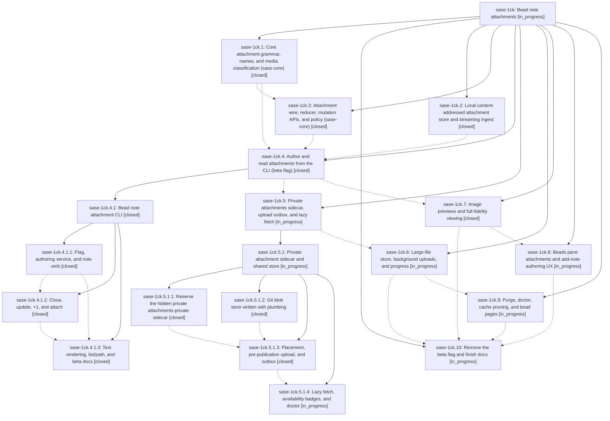

# Bead: sase-1ck — Bead note attachments

[Bead Pages](../README.md) / sase-1ck

**Status:** ◐ in_progress · **Type:** ▸ plan · **Tier:** epic
**Owner:** `bryanbugyi34@gmail.com` · **Created by:** [bbugyi200.athena.0tv](https://github.com/sase-org/sase--agents/blob/main/sessions/bbugyi200.athena.0tv.md) · **Assignee:** `sase-1ck.land`
**Created:** 2026-09-29 08:13:35 EDT
**Plan:** [202609/bead\_note\_attachments.md](https://github.com/sase-org/sase--plans/blob/main/202609/bead_note_attachments.md)

<!-- sase:links:start -->

## Links

| Relation | Artifact | Why |
| --- | --- | --- |
| implemented-by | [plan:202609/bead_note_attachments.md][1] | derived from the plan's `bead_id:` frontmatter field |

_Plus 8 automatic references — see [Referenced By](#referenced-by)._

[1]: https://github.com/sase-org/sase--plans/blob/main/202609/bead_note_attachments.md

<!-- sase:links:end -->

## Description

Any file — screenshot, log, trace, archive, or multi-GiB binary — can be attached to a bead note with an inline `@<path>` reference. The bead keeps an immutable snapshot of the bytes that is available on every machine and outlives the source file. Humans see beautiful chips, badges, and optional inline image previews. Agents get plain, extension-preserving file paths.

## Notes

[2026-09-29T19:08:36Z · sase-1ck.4.1.land] DISCOVERED ISSUE: Child epic sase-1ck.4.1 phase notes 1/2/3 independently report clean-tree patch/stitch terminology audit failures. Reproduced on c2aec595c8: .venv/bin/python tools/audit_patch_stitch_terminology reports 14 unclassified ChangeSpec tokens in sase-core crates/sase_core/tests/fixtures/note_attachment/at_bearing_notes.jsonl. That fixture entered with core attachment phase commit 39324ac; classify it as historical fixture data in the audit or otherwise repair the baseline. This is causally owned by the still-active parent attachment epic, not a new task bead. The CLI history fallback also has no per-event attachment mime/size when current manifests no longer carry a name, as note_cli.md permits; assess core history fidelity in later attachment viewing work.

[2026-09-29T22:23:05Z · sase-1cj.land] DISCOVERED ISSUE (corroboration): the same patch/stitch terminology audit failure was independently proposed by sase-1cj phases .5/.6/.7/.8/.9/.10/.11 and reproduced by the sase-1cj land agent on 2026-09-29 with sase-core at 1e51ff3 (tools/audit_patch_stitch_terminology --repo-root . --allow-missing-linked-repos exits 1; 14 unclassified ChangeSpec/changespec/changespecs hits, all in crates/sase_core/tests/fixtures/note_attachment/at_bearing_notes.jsonl from sase-core 39324ac / sase-1ck.1). It still blocks just check for every agent.

[2026-09-29T22:35:50Z · sase-1co.land] DISCOVERED ISSUE (corroboration): sase-1co phases .3 and .4 independently proposed the same patch/stitch terminology audit failure; the sase-1co land agent reproduced it on 2026-09-29 (sase at f02c3273e4, sase-core 1e51ff3): tools/audit_patch_stitch_terminology --repo-root . --allow-missing-linked-repos exits 1 with 14 unclassified ChangeSpec/changespec(s) hits, all in crates/sase_core/tests/fixtures/note_attachment/at_bearing_notes.jsonl (from sase-core 39324ac / sase-1ck.1). Still blocks just check for every agent.

[2026-09-29T22:43:27Z · sase-1cp.land] DISCOVERED ISSUE: phases sase-1cp.2, sase-1cp.3, and sase-1cp.4 each proposed the same pre-existing patch/stitch terminology failure (14 unclassified ChangeSpec tokens in sase-core crates/sase_core/tests/fixtures/note_attachment/at_bearing_notes.jsonl; just _lint-patch-stitch-terminology exits 1 on a clean base). It is not caused by duration-class routing. Already recorded on this epic; sase-1cp filed no new task bead.

[2026-09-29T22:47:18Z · sase-1cp.land] DISCOVERED ISSUE: just symvision on current master fails with two private-import findings from this epic's attachment code, not from sase-1cp (that epic's whitelist has no --epic-symbol entries). src/sase/bead/attachment_resolve.py imports _roster_for_issue from src/sase/bead/cli_attachment.py, and src/sase/bead/show_images.py imports _kitty_graphics_support from src/sase/doctor/checks_deep_terminal.py. Symvision: "Private functions/classes should not be imported." No existing task bead matches those symbols.

## Phases

| Bead | Title | Status | Size | Created | Agents | Commits |
|---|---|---|---|---|---:|---:|
| [sase-1ck.1](sase-1ck.1.md) | Core attachment grammar, names, and media classification (sase-core) | ✓ closed | large | 2026-09-29 | 1 | 1 |
| [sase-1ck.10](sase-1ck.10.md) | Remove the beta flag and finish docs | ◐ in_progress | medium | 2026-09-29 | 1 | 0 |
| [sase-1ck.2](sase-1ck.2.md) | Local content-addressed attachment store and streaming ingest | ✓ closed | medium | 2026-09-29 | 1 | 1 |
| [sase-1ck.3](sase-1ck.3.md) | Attachment wire, reducer, mutation APIs, and policy (sase-core) | ✓ closed | medium | 2026-09-29 | 1 | 2 |
| [sase-1ck.4](sase-1ck.4.md) | Author and read attachments from the CLI (beta flag) | ✓ closed | large | 2026-09-29 | 1 | 0 |
| [sase-1ck.5](sase-1ck.5.md) | Private attachments sidecar, upload outbox, and lazy fetch | ◐ in_progress | large | 2026-09-29 | 1 | 0 |
| [sase-1ck.6](sase-1ck.6.md) | Large-file store, background uploads, and progress | ◐ in_progress | medium | 2026-09-29 | 1 | 0 |
| [sase-1ck.7](sase-1ck.7.md) | Image previews and full-fidelity viewing | ✓ closed | large | 2026-09-29 | 1 | 1 |
| [sase-1ck.8](sase-1ck.8.md) | Beads pane attachments and add-note authoring UX | ◐ in_progress | medium | 2026-09-29 | 1 | 0 |
| [sase-1ck.9](sase-1ck.9.md) | Purge, doctor, cache pruning, and bead pages | ◐ in_progress | medium | 2026-09-29 | 1 | 0 |

## Lineage

## Agents

| Agent | Bead | Commits |
|---|---|---:|
| [bbugyi200.athena.sase-1ck.1](https://github.com/sase-org/sase--agents/blob/main/sessions/bbugyi200.athena.sase-1ck.1.md) | [sase-1ck.1](sase-1ck.1.md) | 1 |
| [bbugyi200.athena.sase-1ck.10](https://github.com/sase-org/sase--agents/blob/main/agents/bbugyi200.athena.sase-1ck.10/README.md) | [sase-1ck.10](sase-1ck.10.md) | 0 |
| [bbugyi200.athena.sase-1ck.2](https://github.com/sase-org/sase--agents/blob/main/agents/bbugyi200.athena.sase-1ck.2/README.md) | [sase-1ck.2](sase-1ck.2.md) | 1 |
| [bbugyi200.athena.sase-1ck.3](https://github.com/sase-org/sase--agents/blob/main/agents/bbugyi200.athena.sase-1ck.3/README.md) | [sase-1ck.3](sase-1ck.3.md) | 1 |
| [bbugyi200.athena.sase-1ck.4](https://github.com/sase-org/sase--agents/blob/main/sessions/bbugyi200.athena.sase-1ck.4.md) | [sase-1ck.4](sase-1ck.4.md) | 0 |
| [bbugyi200.athena.sase-1ck.4.1.1](https://github.com/sase-org/sase--agents/blob/main/agents/bbugyi200.athena.sase-1ck.4.1.1/README.md) | [sase-1ck.4.1.1](sase-1ck.4.1.1.md) | 1 |
| [bbugyi200.athena.sase-1ck.4.1.2](https://github.com/sase-org/sase--agents/blob/main/agents/bbugyi200.athena.sase-1ck.4.1.2/README.md) | [sase-1ck.4.1.2](sase-1ck.4.1.2.md) | 1 |
| [bbugyi200.athena.sase-1ck.4.1.3](https://github.com/sase-org/sase--agents/blob/main/agents/bbugyi200.athena.sase-1ck.4.1.3/README.md) | [sase-1ck.4.1.3](sase-1ck.4.1.3.md) | 1 |
| [bbugyi200.athena.sase-1ck.4.1.land](https://github.com/sase-org/sase--agents/blob/main/sessions/bbugyi200.athena.sase-1ck.4.1.land.md) | [sase-1ck.4.1](sase-1ck.4.1.md) | 2 |
| [bbugyi200.athena.sase-1ck.5](https://github.com/sase-org/sase--agents/blob/main/sessions/bbugyi200.athena.sase-1ck.5.md) | [sase-1ck.5](sase-1ck.5.md) | 0 |
| [bbugyi200.athena.sase-1ck.5.1.1](https://github.com/sase-org/sase--agents/blob/main/sessions/bbugyi200.athena.sase-1ck.5.1.1.md) | [sase-1ck.5.1.1](sase-1ck.5.1.1.md) | 1 |
| [bbugyi200.athena.sase-1ck.5.1.2](https://github.com/sase-org/sase--agents/blob/main/sessions/bbugyi200.athena.sase-1ck.5.1.2.md) | [sase-1ck.5.1.2](sase-1ck.5.1.2.md) | 1 |
| [bbugyi200.athena.sase-1ck.5.1.3](https://github.com/sase-org/sase--agents/blob/main/agents/bbugyi200.athena.sase-1ck.5.1.3/README.md) | [sase-1ck.5.1.3](sase-1ck.5.1.3.md) | 1 |
| [bbugyi200.athena.sase-1ck.5.1.4](https://github.com/sase-org/sase--agents/blob/main/agents/bbugyi200.athena.sase-1ck.5.1.4/README.md) | [sase-1ck.5.1.4](sase-1ck.5.1.4.md) | 0 |
| [bbugyi200.athena.sase-1ck.5.1.land](https://github.com/sase-org/sase--agents/blob/main/agents/bbugyi200.athena.sase-1ck.5.1.land/README.md) | [sase-1ck.5.1](sase-1ck.5.1.md) | 0 |
| [bbugyi200.athena.sase-1ck.6](https://github.com/sase-org/sase--agents/blob/main/agents/bbugyi200.athena.sase-1ck.6/README.md) | [sase-1ck.6](sase-1ck.6.md) | 0 |
| [bbugyi200.athena.sase-1ck.7](https://github.com/sase-org/sase--agents/blob/main/sessions/bbugyi200.athena.sase-1ck.7.md) | [sase-1ck.7](sase-1ck.7.md) | 1 |
| [bbugyi200.athena.sase-1ck.8](https://github.com/sase-org/sase--agents/blob/main/sessions/bbugyi200.athena.sase-1ck.8.md) | [sase-1ck.8](sase-1ck.8.md) | 0 |
| [bbugyi200.athena.sase-1ck.9](https://github.com/sase-org/sase--agents/blob/main/agents/bbugyi200.athena.sase-1ck.9/README.md) | [sase-1ck.9](sase-1ck.9.md) | 0 |
| [bbugyi200.athena.sase-1ck.land](https://github.com/sase-org/sase--agents/blob/main/agents/bbugyi200.athena.sase-1ck.land/README.md) | [sase-1ck](README.md) | 0 |

## Commits

| Repo | Commit | Subject | Bead | Committed |
|---|---|---|---|---|
| sase | [`a3b1088`](https://github.com/sase-org/sase/commit/a3b1088d5e1fb25f071790f4b84a7a2c7613ecbb) | feat(bead): add content-addressed attachment store | [sase-1ck.2](sase-1ck.2.md) | 2026-09-29 09:13:37 EDT |
| sase-core | [`sase-core@39324ac`](https://github.com/sase-org/sase-core/commit/39324ac73f6ca608f93d7f11cfab1f27c1c9ef4a) | feat(note-attachment): add core attachment grammar, names, and media classification | [sase-1ck.1](sase-1ck.1.md) | 2026-09-29 10:10:02 EDT |
| sase-core | [`sase-core@43f744b`](https://github.com/sase-org/sase-core/commit/43f744be33e516aad80059b33e64056c7d156741) | feat(note-attachment): add attachment wire, reducer, mutation APIs, and policy | [sase-1ck.3](sase-1ck.3.md) | 2026-09-29 10:59:26 EDT |
| sase | [`b63e793`](https://github.com/sase-org/sase/commit/b63e79319966538fd8bb497ec08ac75cc7ba8df3) | chore(core-pin): ratchet sase-core-revision.txt to 43f744b for bead note attachments core\_wire | [sase-1ck.3](sase-1ck.3.md) | 2026-09-29 11:35:25 EDT |
| sase | [`7226499`](https://github.com/sase-org/sase/commit/7226499078638432f3c868dc53772fae77f31b45) | feat(beads): note authoring for bead note attachments beta | [sase-1ck.4.1.1](sase-1ck.4.1.1.md) | 2026-09-29 13:24:09 EDT |
| sase | [`9cc4570`](https://github.com/sase-org/sase/commit/9cc4570cdd5b0823359523ae8bea814002505dfa) | feat(bead): add attach verbs with sensitive gating | [sase-1ck.4.1.2](sase-1ck.4.1.2.md) | 2026-09-29 14:16:02 EDT |
| sase | [`c2aec59`](https://github.com/sase-org/sase/commit/c2aec595c83802163e3c6c504f99d2bdbf8985f8) | feat(bead): render attachment text surface with list/path commands and beta docs | [sase-1ck.4.1.3](sase-1ck.4.1.3.md) | 2026-09-29 14:55:10 EDT |
| sase | [`6834fa1`](https://github.com/sase-org/sase/commit/6834fa1128b60acd23e607694bd60df0867701a0) | feat(bead): persist task +1 note attachments across read surfaces | [sase-1ck.4.1](sase-1ck.4.1.md) | 2026-09-29 16:54:45 EDT |
| sase-core | [`sase-core@0541387`](https://github.com/sase-org/sase-core/commit/0541387eee01040f95aa59333491ea1484e25a25) | feat(bead): task +1 evidence owns its attachment manifest | [sase-1ck.4.1](sase-1ck.4.1.md) | 2026-09-29 16:58:48 EDT |
| sase | [`aa61902`](https://github.com/sase-org/sase/commit/aa61902a9efc64ccbc9149dbdb17ca5185231d5c) | feat(bead): add GitAttachmentStore blob store over bare partial clone | [sase-1ck.5.1.2](sase-1ck.5.1.2.md) | 2026-09-29 18:08:05 EDT |
| sase | [`e300173`](https://github.com/sase-org/sase/commit/e300173fafb14947b8e39944626b7021b1124588) | feat(sidecar): reserve hidden attachments-private sidecar role | [sase-1ck.5.1.1](sase-1ck.5.1.1.md) | 2026-09-29 18:11:40 EDT |
| sase | [`56d5cd2`](https://github.com/sase-org/sase/commit/56d5cd277e6571ff8cabe0c05ee85e614ffdb762) | feat(bead): view note attachments from bead show with image previews | [sase-1ck.7](sase-1ck.7.md) | 2026-09-29 18:17:19 EDT |
| sase | [`c8796af`](https://github.com/sase-org/sase/commit/c8796af46d5e1d95bfd3aaad337602cfa4fd44f4) | feat(bead): placement, pre-publication upload, and attachment outbox | [sase-1ck.5.1.3](sase-1ck.5.1.3.md) | 2026-09-29 18:54:21 EDT |

<!-- sase:referenced-by:start -->

## Referenced By

| Relation | Artifact | Why | Uses |
| --- | --- | --- | ---: |
| read-by | [agent:30][1] | Research where new attachments will be stored and whether they sync to other machines/users | 1 |
| read-by | [agent:research.n.cdx][2] | Need the epic scope, phases, notes, dependencies, and references before researching the follow-on attachment-access design | 1 |
| read-by | [agent:research.n.cld][3] | Context for research on making non-sensitive bead attachments public by default | 1 |
| read-by | [agent:research.n.final][4] | Context on the bead note attachments epic before consolidating public-attachment research | 1 |
| read-by | [agent:research.n.gem][5] | Reviewing context for bead attachment storage and access research | 1 |
| read-by | [agent:research.n.grk][6] | Need epic scope, design, and current attachment access model before researching public default access | 1 |
| read-by | [agent:research.n.mus][7] | Research context for public vs private bead attachment storage design | 1 |
| read-by | [agent:sase-1ck.1--2][8] | implement approved note attachment grammar plan | 1 |

[1]: https://github.com/sase-org/sase--agents/blob/main/agents/bbugyi200.athena.30/README.md
[2]: https://github.com/sase-org/sase--agents/blob/main/agents/bbugyi200.athena.research.n.cdx/README.md
[3]: https://github.com/sase-org/sase--agents/blob/main/agents/bbugyi200.athena.research.n.cld/README.md
[4]: https://github.com/sase-org/sase--agents/blob/main/agents/bbugyi200.athena.research.n.final/README.md
[5]: https://github.com/sase-org/sase--agents/blob/main/agents/bbugyi200.athena.research.n.gem/README.md
[6]: https://github.com/sase-org/sase--agents/blob/main/agents/bbugyi200.athena.research.n.grk/README.md
[7]: https://github.com/sase-org/sase--agents/blob/main/agents/bbugyi200.athena.research.n.mus/README.md
[8]: https://github.com/sase-org/sase--agents/blob/main/sessions/bbugyi200.athena.sase-1ck.1.md

<!-- sase:referenced-by:end -->
