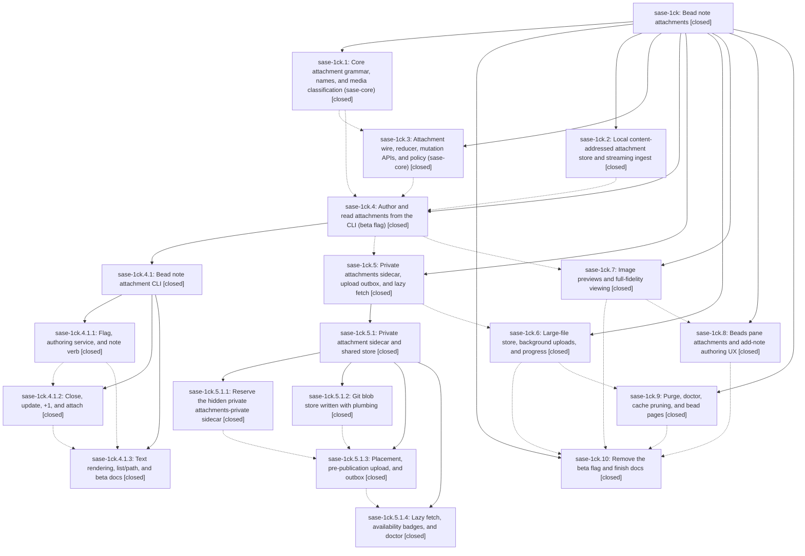

# Bead: sase-1ck — Bead note attachments

[Bead Pages](../README.md) / sase-1ck

**Status:** ✓ closed · **Resolution:** done · **Type:** ▸ plan · **Tier:** epic · **↺ Reopened:** ↺1
**Owner:** `bryanbugyi34@gmail.com` · **Created by:** [bbugyi200.athena.0tv](https://github.com/sase-org/sase--agents/blob/main/sessions/bbugyi200.athena.0tv.md) · **Assignee:** `sase-1ck.land`
**Created:** 2026-09-29 08:13:35 EDT · **Closed:** 2026-09-30 08:35:10 EDT
**Plan:** [202609/bead\_note\_attachments.md](https://github.com/sase-org/sase--plans/blob/main/202609/bead_note_attachments.md)

## Previously Closed

> ↺ Closed 2026-09-30T05:29:32Z · done
>
> (none)
>
> Reopened 2026-09-30T11:05:02Z by `sase bead open`

<!-- sase:links:start -->

## Links

| Relation | Artifact | Why |
| --- | --- | --- |
| implemented-by | [plan:202609/bead_note_attachments.md][1] | derived from the plan's `bead_id:` frontmatter field |
| related | [bead:sase-1cy][2] | Follow-up proposed during the bead note attachments epic; its plan and phases define the attachment grammar, stores, and surfaces |
| related | [bead:sase-1cz][3] | Follow-up proposed during the bead note attachments epic; its plan and phases define the attachment grammar, stores, and surfaces |
| related | [bead:sase-1d0][4] | Follow-up proposed during the bead note attachments epic; its plan and phases define the attachment grammar, stores, and surfaces |
| related | [bead:sase-1da][5] | Defect from the bead note attachments epic; found during its landing |
| related | [bead:sase-1db][6] | Hardening gap from the bead note attachments epic; found during its landing |

_Plus 12 automatic references — see [Referenced By](#referenced-by)._

[1]: https://github.com/sase-org/sase--plans/blob/main/202609/bead_note_attachments.md
[2]: https://github.com/sase-org/sase--beads/blob/main/pages/sase-1cy/README.md
[3]: https://github.com/sase-org/sase--beads/blob/main/pages/sase-1cz/README.md
[4]: https://github.com/sase-org/sase--beads/blob/main/pages/sase-1d0/README.md
[5]: https://github.com/sase-org/sase--beads/blob/main/pages/sase-1da/README.md
[6]: https://github.com/sase-org/sase--beads/blob/main/pages/sase-1db/README.md

<!-- sase:links:end -->

## Description

Any file — screenshot, log, trace, archive, or multi-GiB binary — can be attached to a bead note with an inline `@<path>` reference. The bead keeps an immutable snapshot of the bytes that is available on every machine and outlives the source file. Humans see beautiful chips, badges, and optional inline image previews. Agents get plain, extension-preserving file paths.

## Notes

[2026-09-29T19:08:36Z · sase-1ck.4.1.land] DISCOVERED ISSUE: Child epic sase-1ck.4.1 phase notes 1/2/3 independently report clean-tree patch/stitch terminology audit failures. Reproduced on c2aec595c8: .venv/bin/python tools/audit_patch_stitch_terminology reports 14 unclassified ChangeSpec tokens in sase-core crates/sase_core/tests/fixtures/note_attachment/at_bearing_notes.jsonl. That fixture entered with core attachment phase commit 39324ac; classify it as historical fixture data in the audit or otherwise repair the baseline. This is causally owned by the still-active parent attachment epic, not a new task bead. The CLI history fallback also has no per-event attachment mime/size when current manifests no longer carry a name, as note_cli.md permits; assess core history fidelity in later attachment viewing work.

[2026-09-29T22:23:05Z · sase-1cj.land] DISCOVERED ISSUE (corroboration): the same patch/stitch terminology audit failure was independently proposed by sase-1cj phases .5/.6/.7/.8/.9/.10/.11 and reproduced by the sase-1cj land agent on 2026-09-29 with sase-core at 1e51ff3 (tools/audit_patch_stitch_terminology --repo-root . --allow-missing-linked-repos exits 1; 14 unclassified ChangeSpec/changespec/changespecs hits, all in crates/sase_core/tests/fixtures/note_attachment/at_bearing_notes.jsonl from sase-core 39324ac / sase-1ck.1). It still blocks just check for every agent.

[2026-09-29T22:35:50Z · sase-1co.land] DISCOVERED ISSUE (corroboration): sase-1co phases .3 and .4 independently proposed the same patch/stitch terminology audit failure; the sase-1co land agent reproduced it on 2026-09-29 (sase at f02c3273e4, sase-core 1e51ff3): tools/audit_patch_stitch_terminology --repo-root . --allow-missing-linked-repos exits 1 with 14 unclassified ChangeSpec/changespec(s) hits, all in crates/sase_core/tests/fixtures/note_attachment/at_bearing_notes.jsonl (from sase-core 39324ac / sase-1ck.1). Still blocks just check for every agent.

[2026-09-29T22:43:27Z · sase-1cp.land] DISCOVERED ISSUE: phases sase-1cp.2, sase-1cp.3, and sase-1cp.4 each proposed the same pre-existing patch/stitch terminology failure (14 unclassified ChangeSpec tokens in sase-core crates/sase_core/tests/fixtures/note_attachment/at_bearing_notes.jsonl; just _lint-patch-stitch-terminology exits 1 on a clean base). It is not caused by duration-class routing. Already recorded on this epic; sase-1cp filed no new task bead.

[2026-09-29T22:47:18Z · sase-1cp.land] DISCOVERED ISSUE: just symvision on current master fails with two private-import findings from this epic's attachment code, not from sase-1cp (that epic's whitelist has no --epic-symbol entries). src/sase/bead/attachment_resolve.py imports _roster_for_issue from src/sase/bead/cli_attachment.py, and src/sase/bead/show_images.py imports _kitty_graphics_support from src/sase/doctor/checks_deep_terminal.py. Symvision: "Private functions/classes should not be imported." No existing task bead matches those symbols.

[2026-09-30T00:22:52Z · sase-1ck.5.1.land] DISCOVERED ISSUE (corroboration from the sase-1ck.5.1 lander): `just _lint-patch-stitch-terminology` still exits 1 with the same 14 unclassified ChangeSpec tokens, all in sase-core crates/sase_core/tests/fixtures/note_attachment/at_bearing_notes.jsonl. Already tracked as ready task sase-1cv; this lander recorded a +1. Not remaining sase-1ck.5.1 work.

DISCOVERED ISSUE (corroboration): sase-1ck.5.1.3's symvision follow-up is the private-import pair already recorded on this epic (show_images.py imports _kitty_graphics_support from checks_deep_terminal.py; attachment_resolve.py imports _roster_for_issue from cli_attachment.py). Both imports are still present and come from sase-1ck.7, not from the private-store epic. No new task.

[2026-09-30T02:04:28Z · sase-1cu.land] DISCOVERED ISSUE (corroboration from sase-1cu land): phases sase-1cu.1/.2/.3 independently proposed the same two clean-base failures already tracked here. At sase HEAD 3e03e0add9, ToolRun 02ae8f4b88958c1ac4073ea4cda26f7c stopped on the 14 at_bearing_notes.jsonl terminology defects; task sase-1cv received +1. A separate just symvision run still reports _kitty_graphics_support (show_images.py) and _roster_for_issue (attachment_resolve.py) private imports, matching this epic's note #5. These arise from attachment work, not the location-picker epic; no new task bead filed for the private-import pair because this active epic owns it.

[2026-09-30T03:56:25Z · sase-1ck.land] LAND TRIAGE (sase-1ck.land, 2026-09-29, sase master 3da6e3ebb8, sase-core a354a8a). I read every phase and nested-epic child (4.1.x, 5.1.x) and all of their notes. Outcome for every PROPOSED FOLLOW-UP and DISCOVERED ISSUE:

REMAINING EPIC WORK (caused by this epic; a lander tale will fix these and then close the epic):
- Patch/stitch terminology audit. Raised by epic notes #1-#4 and #6, 1ck.4.1.1-3, 1ck.5.1.1/.2/.4, 1ck.6, 1ck.8, 1ck.9 #1, and 1ck.10 #12. Reproduced: exit 1 with 14 defects, all in the sase-core corpus fixture from sase-1ck.1. The tale classifies the fixture and closes the duplicate task sase-1cv.
- Symvision private import `_kitty_graphics_support`. Raised by epic notes #5-#7, 1ck.5.1.3, 1ck.6 #1, 1ck.9 #2, and 1ck.10 #14. Reproduced. `_roster_for_issue` has already been resolved as the public lifecycle `roster_for_issue`.
- `test_every_bead_free_text_option_is_classified` (1ck.10 #13). Reproduced: ('attachment', 'purge', 'reason') is unclassified.
- Styled `sase bead show` crash (1ck.10 #2/#3/#4). Reproduced: attachment target spans are computed on the raw SGR body.
- Same-text `@attachment` reuse rejected (1ck.10 #1). Confirmed in sase-core `validate_note_attachment_manifest`: it compares the token multiset against manifest names.
- `sase validate` / `init repo --check` fails without the optional attachments-private sidecar (1ck.9 #3). Reproduced.
- Found during landing: `sase bead attachment open` and `materialize_attachment_view` never fetch, although the plan says explicit open always fetches. The docs/cli.md open/path rows are also stale (1ck.9 #4: the path row wording is already fixed, but the table columns are not).

NEW TASKS FILED (via /sase_new_task, distinct from this epic's shipped scope):
- sase-1cy memory: sase_beads.md attachments (1ck.10 #5).
- sase-1cz descriptions/create (1ck.10 #6).
- sase-1d0 prompt expansion and cross-bead reuse (1ck.10 #7).
- sase-1d1 fold artifact create --bead (1ck.10 #8).
- sase-1d2 gate/Telegram rendering (1ck.10 #9).
- sase-1d3 sase-nvim highlighting (1ck.10 #10).
- sase-1d4 per-event history manifests (epic note #1 and the note_cli plan).

DECLINED:
- iTerm2/sixel protocols (1ck.10 #11): conditional on a user need that does not exist yet, so it would only be a wish-list item.
- 1ck.1 #2 pin bump: done in b63e793199 and 339a67306b.
- 1ck.1--1 #3 flag bead sase-1be: that bead is closed.
- 1ck.3 #1 and the 4.1.x launch-family origin failures: tracked in sase-1cm, now closed.
- 4.1.2 fast-path failures: tracked by ready task sase-1cn.
- 4.1.2 +1 attachments: fixed in 6834fa1128.
- 4.1.x stale sase-1cj.7/.8 symvision entries: now gone; just symvision reports only `_kitty_graphics_support`.

[2026-09-30T05:29:32Z · sase-1ck.land--1] Epic landed via tale 202609/finish_bead_note_attachments.md. All 7 remaining defects fixed and proven: (1) terminology audit classifies the sase-core at_bearing_notes.jsonl corpus fixture as immutable history in patch_stitch_audit.py (test_patch_stitch_terminology_audit.py; audit exits 0; duplicate task sase-1cv closed); (2) doctor kitty helper exposed as public kitty_graphics_support, just symvision exits 0; (3) ('attachment','purge','reason') added to _DELIBERATELY_LITERAL_FREE_TEXT (test_every_bead_free_text_option_is_classified passes); (4) sase-core manifest validation dedups token names, just install rebuilt sase_core_rs (CLI reuse tests in test_cli_note_attachments.py); (5) attachment open and materialize_attachment_view force-fetch from the shared store (two-home tests in test_attachment_fetch.py; docs/beads.md and docs/cli.md updated); (6) init repo --check warns instead of creating the optional attachments-private clone (repo-init sidecar tests; sase validate passes without the clone); (7) styled show-batch chip spans computed on pager plain text via body_plain_text (new tests in test_show_images.py). Closeout verification this turn: just fix clean; focused suites green (tests/test_bead incl. attachment_*, cli_attach_verbs, cli_note_attachments, show_images, git_attachment_store, cli_at_path_values, attachment_large_files, attachment_lifecycle; ace/tui beads_attachment_views + bead_note_modal; terminology audit; repo-init sidecar tests; tool routing; llm_provider sync ceiling; pager document); sase tool run check passes every gate through 'committed plans' incl. symvision, mypy, and SASE validation. The final 'test (scoped)' stage escalated to the full 4689-file suite because the coverage baseline is 3682 commits stale (environmental, unrelated to this diff) and exceeds the foreground budget; the diff-scoped areas were instead verified directly: full tests/test_bead/ (2577 passed) plus pager/modals/doctor/routing/ceiling/repo-init chunks, all green. sase bead epic-symbols sase-1ck reports no entries; the 45 unused-public findings surfaced during closeout were resolved per Symvision policy (44 in-file-only helpers made private incl. test import updates, dead get_show_images_default plus its test deleted, dead _terminal_width deleted). Follow-up triage already recorded on this epic: tasks sase-1cy (beads.md attachments memory), sase-1cz (descriptions/create), sase-1d0 (prompt expansion/cross-bead reuse), sase-1d1 (artifact create --bead), sase-1d2 (gate/Telegram rendering), sase-1d3 (nvim highlighting), sase-1d4 (per-event history manifests). Declined: iTerm2/sixel (no user need), 1ck.1 pin bump (done), flag bead sase-1be (closed), 1ck.3/4.1.x origins (sase-1cm, closed), 4.1.2 fast-path (sase-1cn), 4.1.2 +1 attachments (fixe

… and 6722 more characters

## Attachments

- 🔒 sase-1ck-core.patch · text/plain · 2.86523 KiB (private attachment)
- 🔒 sase-1ck-sase.patch · text/plain · 109.418 KiB (private attachment)

## Phases

| Bead | Title | Status | Size | Created | Agents | Commits |
|---|---|---|---|---|---:|---:|
| [sase-1ck.1](sase-1ck.1.md) | Core attachment grammar, names, and media classification (sase-core) | ✓ closed | large | 2026-09-29 | 1 | 1 |
| [sase-1ck.10](sase-1ck.10.md) | Remove the beta flag and finish docs | ✓ closed | medium | 2026-09-29 | 1 | 1 |
| [sase-1ck.2](sase-1ck.2.md) | Local content-addressed attachment store and streaming ingest | ✓ closed | medium | 2026-09-29 | 1 | 1 |
| [sase-1ck.3](sase-1ck.3.md) | Attachment wire, reducer, mutation APIs, and policy (sase-core) | ✓ closed | medium | 2026-09-29 | 1 | 2 |
| [sase-1ck.4](sase-1ck.4.md) | Author and read attachments from the CLI (beta flag) | ✓ closed | large | 2026-09-29 | 1 | 0 |
| [sase-1ck.5](sase-1ck.5.md) | Private attachments sidecar, upload outbox, and lazy fetch | ✓ closed | large | 2026-09-29 | 1 | 0 |
| [sase-1ck.6](sase-1ck.6.md) | Large-file store, background uploads, and progress | ✓ closed | medium | 2026-09-29 | 1 | 1 |
| [sase-1ck.7](sase-1ck.7.md) | Image previews and full-fidelity viewing | ✓ closed | large | 2026-09-29 | 1 | 1 |
| [sase-1ck.8](sase-1ck.8.md) | Beads pane attachments and add-note authoring UX | ✓ closed | medium | 2026-09-29 | 1 | 1 |
| [sase-1ck.9](sase-1ck.9.md) | Purge, doctor, cache pruning, and bead pages | ✓ closed | medium | 2026-09-29 | 1 | 1 |

## Lineage

## Agents

| Agent | Bead | Commits |
|---|---|---:|
| [bbugyi200.athena.sase-1ck.1](https://github.com/sase-org/sase--agents/blob/main/sessions/bbugyi200.athena.sase-1ck.1.md) | [sase-1ck.1](sase-1ck.1.md) | 1 |
| [bbugyi200.athena.sase-1ck.10](https://github.com/sase-org/sase--agents/blob/main/agents/bbugyi200.athena.sase-1ck.10/README.md) | [sase-1ck.10](sase-1ck.10.md) | 1 |
| [bbugyi200.athena.sase-1ck.2](https://github.com/sase-org/sase--agents/blob/main/agents/bbugyi200.athena.sase-1ck.2/README.md) | [sase-1ck.2](sase-1ck.2.md) | 1 |
| [bbugyi200.athena.sase-1ck.3](https://github.com/sase-org/sase--agents/blob/main/agents/bbugyi200.athena.sase-1ck.3/README.md) | [sase-1ck.3](sase-1ck.3.md) | 1 |
| [bbugyi200.athena.sase-1ck.4](https://github.com/sase-org/sase--agents/blob/main/sessions/bbugyi200.athena.sase-1ck.4.md) | [sase-1ck.4](sase-1ck.4.md) | 0 |
| [bbugyi200.athena.sase-1ck.4.1.1](https://github.com/sase-org/sase--agents/blob/main/agents/bbugyi200.athena.sase-1ck.4.1.1/README.md) | [sase-1ck.4.1.1](sase-1ck.4.1.1.md) | 1 |
| [bbugyi200.athena.sase-1ck.4.1.2](https://github.com/sase-org/sase--agents/blob/main/agents/bbugyi200.athena.sase-1ck.4.1.2/README.md) | [sase-1ck.4.1.2](sase-1ck.4.1.2.md) | 1 |
| [bbugyi200.athena.sase-1ck.4.1.3](https://github.com/sase-org/sase--agents/blob/main/agents/bbugyi200.athena.sase-1ck.4.1.3/README.md) | [sase-1ck.4.1.3](sase-1ck.4.1.3.md) | 1 |
| [bbugyi200.athena.sase-1ck.4.1.land](https://github.com/sase-org/sase--agents/blob/main/sessions/bbugyi200.athena.sase-1ck.4.1.land.md) | [sase-1ck.4.1](sase-1ck.4.1.md) | 2 |
| [bbugyi200.athena.sase-1ck.5](https://github.com/sase-org/sase--agents/blob/main/sessions/bbugyi200.athena.sase-1ck.5.md) | [sase-1ck.5](sase-1ck.5.md) | 0 |
| [bbugyi200.athena.sase-1ck.5.1.1](https://github.com/sase-org/sase--agents/blob/main/sessions/bbugyi200.athena.sase-1ck.5.1.1.md) | [sase-1ck.5.1.1](sase-1ck.5.1.1.md) | 1 |
| [bbugyi200.athena.sase-1ck.5.1.2](https://github.com/sase-org/sase--agents/blob/main/sessions/bbugyi200.athena.sase-1ck.5.1.2.md) | [sase-1ck.5.1.2](sase-1ck.5.1.2.md) | 1 |
| [bbugyi200.athena.sase-1ck.5.1.3](https://github.com/sase-org/sase--agents/blob/main/agents/bbugyi200.athena.sase-1ck.5.1.3/README.md) | [sase-1ck.5.1.3](sase-1ck.5.1.3.md) | 1 |
| [bbugyi200.athena.sase-1ck.5.1.4](https://github.com/sase-org/sase--agents/blob/main/sessions/bbugyi200.athena.sase-1ck.5.1.4.md) | [sase-1ck.5.1.4](sase-1ck.5.1.4.md) | 1 |
| [bbugyi200.athena.sase-1ck.5.1.land](https://github.com/sase-org/sase--agents/blob/main/sessions/bbugyi200.athena.sase-1ck.5.1.land.md) | [sase-1ck.5.1](sase-1ck.5.1.md) | 2 |
| [bbugyi200.athena.sase-1ck.6](https://github.com/sase-org/sase--agents/blob/main/sessions/bbugyi200.athena.sase-1ck.6.md) | [sase-1ck.6](sase-1ck.6.md) | 1 |
| [bbugyi200.athena.sase-1ck.7](https://github.com/sase-org/sase--agents/blob/main/sessions/bbugyi200.athena.sase-1ck.7.md) | [sase-1ck.7](sase-1ck.7.md) | 1 |
| [bbugyi200.athena.sase-1ck.8](https://github.com/sase-org/sase--agents/blob/main/sessions/bbugyi200.athena.sase-1ck.8.md) | [sase-1ck.8](sase-1ck.8.md) | 1 |
| [bbugyi200.athena.sase-1ck.9](https://github.com/sase-org/sase--agents/blob/main/agents/bbugyi200.athena.sase-1ck.9/README.md) | [sase-1ck.9](sase-1ck.9.md) | 1 |
| [bbugyi200.athena.sase-1ck.land](https://github.com/sase-org/sase--agents/blob/main/agents/bbugyi200.athena.sase-1ck.land/README.md) | [sase-1ck](README.md) | 1 |

## Commits

| Repo | Commit | Subject | Bead | Committed |
|---|---|---|---|---|
| sase | [`a3b1088`](https://github.com/sase-org/sase/commit/a3b1088d5e1fb25f071790f4b84a7a2c7613ecbb) | feat(bead): add content-addressed attachment store | [sase-1ck.2](sase-1ck.2.md) | 2026-09-29 09:13:37 EDT |
| sase-core | [`sase-core@39324ac`](https://github.com/sase-org/sase-core/commit/39324ac73f6ca608f93d7f11cfab1f27c1c9ef4a) | feat(note-attachment): add core attachment grammar, names, and media classification | [sase-1ck.1](sase-1ck.1.md) | 2026-09-29 10:10:02 EDT |
| sase-core | [`sase-core@43f744b`](https://github.com/sase-org/sase-core/commit/43f744be33e516aad80059b33e64056c7d156741) | feat(note-attachment): add attachment wire, reducer, mutation APIs, and policy | [sase-1ck.3](sase-1ck.3.md) | 2026-09-29 10:59:26 EDT |
| sase | [`b63e793`](https://github.com/sase-org/sase/commit/b63e79319966538fd8bb497ec08ac75cc7ba8df3) | chore(core-pin): ratchet sase-core-revision.txt to 43f744b for bead note attachments core\_wire | [sase-1ck.3](sase-1ck.3.md) | 2026-09-29 11:35:25 EDT |
| sase | [`7226499`](https://github.com/sase-org/sase/commit/7226499078638432f3c868dc53772fae77f31b45) | feat(beads): note authoring for bead note attachments beta | [sase-1ck.4.1.1](sase-1ck.4.1.1.md) | 2026-09-29 13:24:09 EDT |
| sase | [`9cc4570`](https://github.com/sase-org/sase/commit/9cc4570cdd5b0823359523ae8bea814002505dfa) | feat(bead): add attach verbs with sensitive gating | [sase-1ck.4.1.2](sase-1ck.4.1.2.md) | 2026-09-29 14:16:02 EDT |
| sase | [`c2aec59`](https://github.com/sase-org/sase/commit/c2aec595c83802163e3c6c504f99d2bdbf8985f8) | feat(bead): render attachment text surface with list/path commands and beta docs | [sase-1ck.4.1.3](sase-1ck.4.1.3.md) | 2026-09-29 14:55:10 EDT |
| sase | [`6834fa1`](https://github.com/sase-org/sase/commit/6834fa1128b60acd23e607694bd60df0867701a0) | feat(bead): persist task +1 note attachments across read surfaces | [sase-1ck.4.1](sase-1ck.4.1.md) | 2026-09-29 16:54:45 EDT |
| sase-core | [`sase-core@0541387`](https://github.com/sase-org/sase-core/commit/0541387eee01040f95aa59333491ea1484e25a25) | feat(bead): task +1 evidence owns its attachment manifest | [sase-1ck.4.1](sase-1ck.4.1.md) | 2026-09-29 16:58:48 EDT |
| sase | [`aa61902`](https://github.com/sase-org/sase/commit/aa61902a9efc64ccbc9149dbdb17ca5185231d5c) | feat(bead): add GitAttachmentStore blob store over bare partial clone | [sase-1ck.5.1.2](sase-1ck.5.1.2.md) | 2026-09-29 18:08:05 EDT |
| sase | [`e300173`](https://github.com/sase-org/sase/commit/e300173fafb14947b8e39944626b7021b1124588) | feat(sidecar): reserve hidden attachments-private sidecar role | [sase-1ck.5.1.1](sase-1ck.5.1.1.md) | 2026-09-29 18:11:40 EDT |
| sase | [`56d5cd2`](https://github.com/sase-org/sase/commit/56d5cd277e6571ff8cabe0c05ee85e614ffdb762) | feat(bead): view note attachments from bead show with image previews | [sase-1ck.7](sase-1ck.7.md) | 2026-09-29 18:17:19 EDT |
| sase | [`c8796af`](https://github.com/sase-org/sase/commit/c8796af46d5e1d95bfd3aaad337602cfa4fd44f4) | feat(bead): placement, pre-publication upload, and attachment outbox | [sase-1ck.5.1.3](sase-1ck.5.1.3.md) | 2026-09-29 18:54:21 EDT |
| sase | [`978f6eb`](https://github.com/sase-org/sase/commit/978f6ebdb6b0a3c42e5aaefa7be8841add484192) | feat(bead): lazy attachment fetch with availability badges and doctor check | [sase-1ck.5.1.4](sase-1ck.5.1.4.md) | 2026-09-29 19:57:14 EDT |
| sase | [`6335123`](https://github.com/sase-org/sase/commit/633512313fd41022c63562f1189ed2342c2f314e) | feat(tui): beads pane attachments and add-note authoring UX | [sase-1ck.8](sase-1ck.8.md) | 2026-09-29 20:23:51 EDT |
| sase | [`5a4b979`](https://github.com/sase-org/sase/commit/5a4b979ce89a5c315c8e71520d7306b8a4a8227d) | feat(bead-attachments): lazy attachment-store discovery on show and read | [sase-1ck.5.1](sase-1ck.5.1.md) | 2026-09-29 20:36:35 EDT |
| sase--plans | [`sase--plans@c50baf6`](https://github.com/sase-org/sase--plans/commit/c50baf643cdfa830afc01f46f1cbfb0098dfc249) | docs(plans): mark private\_attachment\_store plan done | [sase-1ck.5.1](sase-1ck.5.1.md) | 2026-09-29 20:40:24 EDT |
| sase | [`777ea2f`](https://github.com/sase-org/sase/commit/777ea2f5c3fd5db08c7f9f978e6290c0cc57a438) | feat(attachments): add large-file rclone store with background uploads and progress UI | [sase-1ck.6](sase-1ck.6.md) | 2026-09-29 21:08:07 EDT |
| sase | [`ee1620e`](https://github.com/sase-org/sase/commit/ee1620e1b919fb73d350b02767ecf81ab0577afc) | feat(bead): implement attachment lifecycle (purge, doctor, prune, pages) | [sase-1ck.9](sase-1ck.9.md) | 2026-09-29 22:10:40 EDT |
| sase | [`3da6e3e`](https://github.com/sase-org/sase/commit/3da6e3ebb8b7dcba1f0d583300ad420d5dbc3058) | feat(beads): remove bead\_note\_attachments beta flag, attachments GA | [sase-1ck.10](sase-1ck.10.md) | 2026-09-29 23:29:58 EDT |
| sase-core | [`sase-core@3bb901b`](https://github.com/sase-org/sase-core/commit/3bb901b045b242915c8369d70ea9ed0aa4b31b66) | fix(core-attachments): accept repeated same-text attachment tokens | [sase-1ck](README.md) | 2026-09-30 08:37:33 EDT |

<!-- sase:referenced-by:start -->

## Referenced By

| Relation | Artifact | Why | Uses |
| --- | --- | --- | ---: |
| read-by | [agent:0ub--1][1] | Verify attachment span fix renders colored bead detail | 1 |
| read-by | [agent:30][2] | Research where new attachments will be stored and whether they sync to other machines/users | 1 |
| read-by | [agent:research.n.cdx][3] | Need the epic scope, phases, notes, dependencies, and references before researching the follow-on attachment-access design | 1 |
| read-by | [agent:research.n.cld][4] | Context for research on making non-sensitive bead attachments public by default | 1 |
| read-by | [agent:research.n.final][5] | Context on the bead note attachments epic before consolidating public-attachment research | 1 |
| read-by | [agent:research.n.gem][6] | Reviewing context for bead attachment storage and access research | 1 |
| read-by | [agent:research.n.grk][7] | Need epic scope, design, and current attachment access model before researching public default access | 1 |
| read-by | [agent:research.n.mus][8] | Research context for public vs private bead attachment storage design | 1 |
| read-by | [agent:sase-1ck.1--2][9] | implement approved note attachment grammar plan | 1 |
| read-by | [agent:sase-1ck.10][10] | Need epic status and children for ga phase | 1 |
| read-by | [agent:sase-1ck.8--1][11] | check epic context for follow-up triage | 1 |
| read-by | [agent:sase-1d6.land][12] | Need salvage notes, reopen notes, and current status of the five recovered beads | 1 |

[1]: https://github.com/sase-org/sase--agents/blob/main/sessions/bbugyi200.athena.0ub.md
[2]: https://github.com/sase-org/sase--agents/blob/main/agents/bbugyi200.athena.30/README.md
[3]: https://github.com/sase-org/sase--agents/blob/main/agents/bbugyi200.athena.research.n.cdx/README.md
[4]: https://github.com/sase-org/sase--agents/blob/main/agents/bbugyi200.athena.research.n.cld/README.md
[5]: https://github.com/sase-org/sase--agents/blob/main/agents/bbugyi200.athena.research.n.final/README.md
[6]: https://github.com/sase-org/sase--agents/blob/main/agents/bbugyi200.athena.research.n.gem/README.md
[7]: https://github.com/sase-org/sase--agents/blob/main/agents/bbugyi200.athena.research.n.grk/README.md
[8]: https://github.com/sase-org/sase--agents/blob/main/agents/bbugyi200.athena.research.n.mus/README.md
[9]: https://github.com/sase-org/sase--agents/blob/main/sessions/bbugyi200.athena.sase-1ck.1.md
[10]: https://github.com/sase-org/sase--agents/blob/main/agents/bbugyi200.athena.sase-1ck.10/README.md
[11]: https://github.com/sase-org/sase--agents/blob/main/sessions/bbugyi200.athena.sase-1ck.8.md
[12]: https://github.com/sase-org/sase--agents/blob/main/agents/bbugyi200.athena.sase-1d6.land/README.md

<!-- sase:referenced-by:end -->
