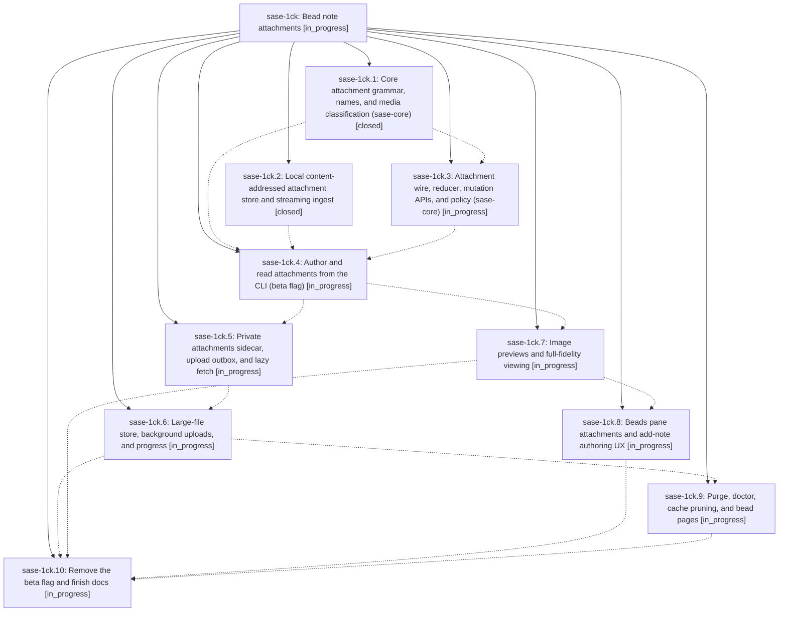

# Bead: sase-1ck — Bead note attachments

[Bead Pages](../README.md) / sase-1ck

**Status:** ◐ in_progress · **Type:** ▸ plan · **Tier:** epic
**Owner:** `bryanbugyi34@gmail.com` · **Created by:** [bbugyi200.athena.0tv](https://github.com/sase-org/sase--agents/blob/main/sessions/bbugyi200.athena.0tv.md) · **Assignee:** `sase-1ck.land`
**Created:** 2026-09-29 08:13:35 EDT
**Plan:** [202609/bead\_note\_attachments.md](https://github.com/sase-org/sase--plans/blob/main/202609/bead_note_attachments.md)

<!-- sase:links:start -->

## Links

| Relation | Artifact | Why |
| --- | --- | --- |
| implemented-by | [plan:202609/bead_note_attachments.md][1] | derived from the plan's `bead_id:` frontmatter field |

_Plus 7 automatic references — see [Referenced By](#referenced-by)._

[1]: https://github.com/sase-org/sase--plans/blob/main/202609/bead_note_attachments.md

<!-- sase:links:end -->

## Description

Any file — screenshot, log, trace, archive, or multi-GiB binary — can be attached to a bead note with an inline `@<path>` reference. The bead keeps an immutable snapshot of the bytes that is available on every machine and outlives the source file. Humans see beautiful chips, badges, and optional inline image previews. Agents get plain, extension-preserving file paths.

## Phases

| Bead | Title | Status | Size | Created | Agents | Commits |
|---|---|---|---|---|---:|---:|
| [sase-1ck.1](sase-1ck.1.md) | Core attachment grammar, names, and media classification (sase-core) | ✓ closed | large | 2026-09-29 | 1 | 1 |
| [sase-1ck.10](sase-1ck.10.md) | Remove the beta flag and finish docs | ◐ in_progress | medium | 2026-09-29 | 1 | 0 |
| [sase-1ck.2](sase-1ck.2.md) | Local content-addressed attachment store and streaming ingest | ✓ closed | medium | 2026-09-29 | 1 | 0 |
| [sase-1ck.3](sase-1ck.3.md) | Attachment wire, reducer, mutation APIs, and policy (sase-core) | ◐ in_progress | medium | 2026-09-29 | 1 | 0 |
| [sase-1ck.4](sase-1ck.4.md) | Author and read attachments from the CLI (beta flag) | ◐ in_progress | large | 2026-09-29 | 1 | 0 |
| [sase-1ck.5](sase-1ck.5.md) | Private attachments sidecar, upload outbox, and lazy fetch | ◐ in_progress | large | 2026-09-29 | 1 | 0 |
| [sase-1ck.6](sase-1ck.6.md) | Large-file store, background uploads, and progress | ◐ in_progress | medium | 2026-09-29 | 1 | 0 |
| [sase-1ck.7](sase-1ck.7.md) | Image previews and full-fidelity viewing | ◐ in_progress | large | 2026-09-29 | 1 | 0 |
| [sase-1ck.8](sase-1ck.8.md) | Beads pane attachments and add-note authoring UX | ◐ in_progress | medium | 2026-09-29 | 1 | 0 |
| [sase-1ck.9](sase-1ck.9.md) | Purge, doctor, cache pruning, and bead pages | ◐ in_progress | medium | 2026-09-29 | 1 | 0 |

## Lineage

## Agents

| Agent | Bead | Commits |
|---|---|---:|
| [bbugyi200.athena.sase-1ck.1](https://github.com/sase-org/sase--agents/blob/main/sessions/bbugyi200.athena.sase-1ck.1.md) | [sase-1ck.1](sase-1ck.1.md) | 1 |
| [bbugyi200.athena.sase-1ck.10](https://github.com/sase-org/sase--agents/blob/main/agents/bbugyi200.athena.sase-1ck.10/README.md) | [sase-1ck.10](sase-1ck.10.md) | 0 |
| [bbugyi200.athena.sase-1ck.2](https://github.com/sase-org/sase--agents/blob/main/agents/bbugyi200.athena.sase-1ck.2/README.md) | [sase-1ck.2](sase-1ck.2.md) | 0 |
| [bbugyi200.athena.sase-1ck.3](https://github.com/sase-org/sase--agents/blob/main/agents/bbugyi200.athena.sase-1ck.3/README.md) | [sase-1ck.3](sase-1ck.3.md) | 0 |
| [bbugyi200.athena.sase-1ck.4](https://github.com/sase-org/sase--agents/blob/main/agents/bbugyi200.athena.sase-1ck.4/README.md) | [sase-1ck.4](sase-1ck.4.md) | 0 |
| [bbugyi200.athena.sase-1ck.5](https://github.com/sase-org/sase--agents/blob/main/agents/bbugyi200.athena.sase-1ck.5/README.md) | [sase-1ck.5](sase-1ck.5.md) | 0 |
| [bbugyi200.athena.sase-1ck.6](https://github.com/sase-org/sase--agents/blob/main/agents/bbugyi200.athena.sase-1ck.6/README.md) | [sase-1ck.6](sase-1ck.6.md) | 0 |
| [bbugyi200.athena.sase-1ck.7](https://github.com/sase-org/sase--agents/blob/main/agents/bbugyi200.athena.sase-1ck.7/README.md) | [sase-1ck.7](sase-1ck.7.md) | 0 |
| [bbugyi200.athena.sase-1ck.8](https://github.com/sase-org/sase--agents/blob/main/agents/bbugyi200.athena.sase-1ck.8/README.md) | [sase-1ck.8](sase-1ck.8.md) | 0 |
| [bbugyi200.athena.sase-1ck.9](https://github.com/sase-org/sase--agents/blob/main/agents/bbugyi200.athena.sase-1ck.9/README.md) | [sase-1ck.9](sase-1ck.9.md) | 0 |
| [bbugyi200.athena.sase-1ck.land](https://github.com/sase-org/sase--agents/blob/main/agents/bbugyi200.athena.sase-1ck.land/README.md) | [sase-1ck](README.md) | 0 |

## Commits

| Repo | Commit | Subject | Bead | Committed |
|---|---|---|---|---|
| sase-core | [`sase-core@39324ac`](https://github.com/sase-org/sase-core/commit/39324ac73f6ca608f93d7f11cfab1f27c1c9ef4a) | feat(note-attachment): add core attachment grammar, names, and media classification | [sase-1ck.1](sase-1ck.1.md) | 2026-09-29 10:10:02 EDT |

<!-- sase:referenced-by:start -->

## Referenced By

| Relation | Artifact | Why | Uses |
| --- | --- | --- | ---: |
| read-by | [agent:30][1] | Research where new attachments will be stored and whether they sync to other machines/users | 1 |
| read-by | [agent:research.n.cdx][2] | Need the epic scope, phases, notes, dependencies, and references before researching the follow-on attachment-access design | 1 |
| read-by | [agent:research.n.cld][3] | Context for research on making non-sensitive bead attachments public by default | 1 |
| read-by | [agent:research.n.final][4] | Context on the bead note attachments epic before consolidating public-attachment research | 1 |
| read-by | [agent:research.n.gem][5] | Reviewing context for bead attachment storage and access research | 1 |
| read-by | [agent:research.n.grk][6] | Need epic scope, design, and current attachment access model before researching public default access | 1 |
| read-by | [agent:research.n.mus][7] | Research context for public vs private bead attachment storage design | 1 |

[1]: https://github.com/sase-org/sase--agents/blob/main/agents/bbugyi200.athena.30/README.md
[2]: https://github.com/sase-org/sase--agents/blob/main/agents/bbugyi200.athena.research.n.cdx/README.md
[3]: https://github.com/sase-org/sase--agents/blob/main/agents/bbugyi200.athena.research.n.cld/README.md
[4]: https://github.com/sase-org/sase--agents/blob/main/agents/bbugyi200.athena.research.n.final/README.md
[5]: https://github.com/sase-org/sase--agents/blob/main/agents/bbugyi200.athena.research.n.gem/README.md
[6]: https://github.com/sase-org/sase--agents/blob/main/agents/bbugyi200.athena.research.n.grk/README.md
[7]: https://github.com/sase-org/sase--agents/blob/main/agents/bbugyi200.athena.research.n.mus/README.md

<!-- sase:referenced-by:end -->
