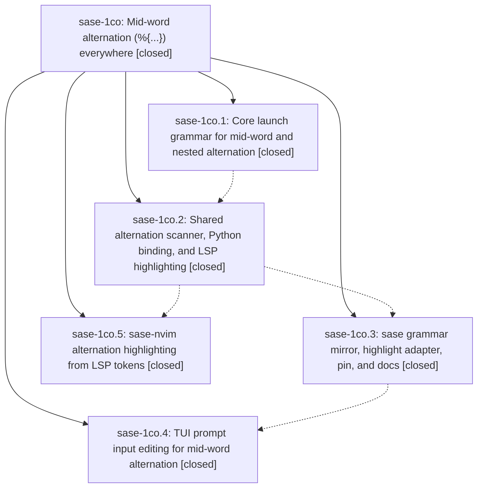

# Bead: sase-1co — Mid-word alternation (%{...}) everywhere

[Bead Pages](../README.md) / sase-1co

**Status:** ✓ closed · **Resolution:** done · **Type:** ▸ plan · **Tier:** epic · **↺ Reopened:** ↺1
**Owner:** `bryanbugyi34@gmail.com` · **Created by:** [bbugyi200.athena.0u1](https://github.com/sase-org/sase--agents/blob/main/sessions/bbugyi200.athena.0u1.md) · **Assignee:** `sase-1co.land`
**Created:** 2026-09-29 16:22:01 EDT · **Closed:** 2026-09-30 08:48:51 EDT
**Plan:** [202609/midword\_alternation.md](https://github.com/sase-org/sase--plans/blob/main/202609/midword_alternation.md)

## Previously Closed

> ↺ Closed 2026-09-30T00:03:16Z · done
>
> (none)
>
> Reopened 2026-09-30T11:04:52Z by `sase bead open`

<!-- sase:links:start -->

## Links

| Relation | Artifact | Why |
| --- | --- | --- |
| implemented-by | [plan:202609/midword_alternation.md][1] | derived from the plan's `bead_id:` frontmatter field |

_Plus 3 automatic references — see [Referenced By](#referenced-by)._

[1]: https://github.com/sase-org/sase--plans/blob/main/202609/midword_alternation.md

<!-- sase:links:end -->

## Description

`%{a | b}` fans out, highlights, and edits the same way wherever it appears: at a word boundary, in the middle of a word (`foo%{bar | baz}qux`), right after punctuation, or nested inside another branch. One Rust-owned scanner feeds launch, the TUI prompt input, and the xprompt LSP, and nothing is added to the per-keystroke cost of typing.

## Notes

[2026-09-29T22:37:35Z · sase-1co.land] LAND TRIAGE (sase-1co.land, 2026-09-29): (1) sase-1co.3 PROPOSED FOLLOW-UP 'core alternation_scan misses openers right after {' is CAUSED BY THIS EPIC (0266fe4a12 moved TUI highlighting onto the core scanner, whose editor Jinja-tag exclusion swallows {%{a | b} / {%(a,b) / {%alt(a,b) to end of text; the old Python tokenize highlighted them and launch still fans them out). Also found %{%(a,b) | c}: launch expands the nested paren alt but scan_alternations misses it because the alt_directive_re paren branch consumes its prefix char. Kept as epic work -> lander-authored tale that also closes this epic. (2) sase-1co.3 + sase-1co.4 PROPOSED FOLLOW-UP 'just check patch/stitch terminology audit fails on 14 lines in sase-core fixtures/note_attachment/at_bearing_notes.jsonl': not caused by this epic; causally owned by active epic sase-1ck (fixture from sase-core 39324ac / sase-1ck.1), already recorded there twice -> added a corroboration DISCOVERED ISSUE note on sase-1ck, no new task. (3) sase-1co.5 PROPOSED FOLLOW-UP 'sase lsp self-recurses when SASE_XPROMPT_LSP_CMD=sase lsp': not caused by this epic; reproduced (timeout 8 -> exit 124, ~6 re-execs) with root cause in src/sase/integrations/xprompt_lsp.py (override exec'd with env unchanged); no duplicate found -> created task sase-1ct (bug, small, ready).

[2026-09-30T00:03:16Z · sase-1co.land--1] Landed. Verified phases .1-.5 against sase-core 1160ea4 + 1e51ff3, sase 0266fe4a12 + f02c3273e4, sase-nvim 332b7ab: mid-word/adjacent/colon/nested %{ fan-out with no nested panic, glued-directive spacing, model-shortcut spacing, shared alternation_scan wire + code-point binding, unclosed-alternation diagnostic, LSP alternation/separator semantic tokens, _ALT_DIRECTIVE_RE brace-anywhere mirror, memoized alt_inspect adapter + project-tag groups, TUI mid-word padding/separators/innermost span/Jinja auto-pair guard, nvim LSP-token overlay, docs; 345 focused sase tests green at f02c3273e4. Integration: commits since the epic started (bead attachments, tool-run, finalizer revision_pin, prompt archive, core pin ratchet 339a67306b) needed no alternation changes. Remaining epic work (scanner missed openers after a literal { and paren openers right after another opener) fixed in sase-core this turn on top of 1e51ff3 (exclusion.rs Jinja carve-out, directive_scan.rs per-% boundary scan, alternation/exclusion/fanout tests) + sase mirrors on top of 859140f0 (jinja_inspect carve-out, lookbehind _ALT_DIRECTIVE_RE, xprompt/jinja/has-helper tests, docs sentence); sase-core check passed (run 83587e3d), sase check green except only the pre-existing sase-1ck terminology-fixture failure (14 lines in sase-core at_bearing_notes.jsonl, run 4aa460bc). just symvision: no sase-1co epic-symbol entries; 2 pre-existing private-import errors in untouched files (doctor/checks_deep_terminal.py, bead/cli_attachment.py), not this epic's. Follow-ups: sase-1co.3/.4 terminology audit -> corroborated on active epic sase-1ck (owner); sase-1co.5 sase lsp self-exec loop -> new task sase-1ct.

[2026-09-30T10:29:38Z · sase-1d6.2] UNLANDED PRIOR ATTEMPT: land agent sase-1co.land--1's note #2 describes verified land work that NEVER LANDED. The host commit finalizer failed on the sase-core stitch with missing_bead_action (the pinned-sibling commit regression; fix is epic sase-1d6 phase sase-1d6.1). No commit from this run exists in sase or sase-core origin/master, and the epic plan-done mark for plan:202609/midword_alternation.md never landed either. Salvage held workspace sase_12 (claim ace(run)-260929_195614) read-only; nothing there was staged, committed, moved, or cleaned.

Attached patches (each verified with git apply --check against a pristine checkout of its base SHA):
@attachment:sase-1co-sase.patch
@attachment:sase-1co-core.patch
- sase: base SHA 859140f025decf1e11051412b9a8f6fac53f1252, 6 files, 7697 bytes. Intended message: feat(xprompt): alternation parity after literal { and adjacent paren openers
- sase-core: base SHA 1e51ff3ce9c53ee1a4bc9f52c3642ac4eea8f423, 4 files, 9767 bytes. Intended message: feat(alternation): scan openers after literal { and adjacent paren openers
- lander tale describing this remaining work: plan:202609/midword_alternation_scanner_parity.md

Instructions to the relaunched land agent: apply both patches onto current origin/master with git apply --3way, resolve any conflicts (master has moved), then RE-RUN verification (sase-core check; sase check modulo the known pre-existing sase-1ck terminology-fixture failure) instead of trusting the old note, and land the epic plan-done mark with the work.

[2026-09-30T11:05:53Z · sase-1d6.3] REOPENED: bead closed before its verified work landed (pinned-sibling commit regression). Fix is live on host (63bde575f0, sase 0.17.1+1852.g63bde57). Relaunched agent must apply the UNLANDED PRIOR ATTEMPT patches with git apply --3way, resolve conflicts against current master, and re-verify.

[2026-09-30T12:48:51Z · sase-1co.land] Landed (relaunched sase-1co.land, 2026-09-30, sase base 63bde575f0, sase-core base a354a8a). Re-verified phases .1-.5 against sase-core 1160ea4 + 1e51ff3, sase 0266fe4a12 + f02c3273e4, sase-nvim 332b7ab (spot-checked scan_alternations, alternation_scan binding, unclosed_alternation diagnostic, LSP alternation/separator modifiers, memoized alt_inspect adapter, TUI _alt_syntax_editing, nvim LspTokenUpdate overlay; all child notes addressed). Remaining epic work (scanner missed openers after a literal { and paren openers right after another opener) from note #3's UNLANDED PRIOR ATTEMPT patches: both applied cleanly with git apply --3way onto current master (sase-core: exclusion.rs Jinja carve-out, directive_scan.rs per-% boundary scan replacing alt_directive_re, alternation/exclusion/fanout tests; sase: jinja_inspect carve-out, lookbehind _ALT_DIRECTIVE_RE, alt_inspect/jinja/has-helper tests, docs/xprompt.md sentence). Re-verified from scratch: rebuilt binding now scans {%{a | b} as one brace record and %{%(a,b) | c} as depth 0 + depth 1; sase-core sase tool run check succeeded (810e3ed7a06840d1700cde854494214b, 8m20s); sase just fmt clean; sase tool run -k check ce2eccbf364e4cdf82d996c600ce7f70: fmt/ruff/mypy/flags/pyscripts/waits/changelog green, full escalated lane 50585 passed / 18 failed, none in xprompt/alternation; 331 focused alternation tests green. The 18 failures are not this epic's: 8 agy_usage_probe tests pass in isolation with this diff (load flakes); the other 10 fail identically on a clean tree (git stash) and in Master Gate run 36714816529. Terminology audit, symvision _kitty_graphics_support, bead free-text option, repo_init_plan and docs terminology are fixed by the relaunched sase-1ck landing (sase-1ck note #13). Contract manifest staleness came from 5480df7af8 (sase-1cj.10) and is recorded as a DISCOVERED ISSUE on active epic sase-1cj.12. App import budget (3490 < 3485) got a +1 on sase-13p. Audit site quarantine_local_object, repositories schema wording and completion snapshot drift (from the sase-1ck attachments commits) were filed as new ci task sase-1de. Integration: sase commits since the epic started (attachments GA/lifecycle/rclone store, tool-run ceilings, mini-xprompt/snippet pickers, agent-tab naming, finalizer pinned-sibling fixes, through d6f2b237a6) and sase-core a354a8a..3bb901b touch no alternation code and needed no changes; sase-nvim has no drift past 332b7ab. Follow-ups: sase-1co.3/.4 terminology audit fixed by sase-1ck's owning landing (not new work); sase-1co.5 sase lsp self-exec loop is task sase-1ct (still ready). sase bead epic-symbols sase-1co: none.

## Attachments

- 🔒 sase-1co-core.patch · text/plain · 9.53809 KiB (private attachment)
- 🔒 sase-1co-sase.patch · text/plain · 7.5166 KiB (private attachment)

## Phases

| Bead | Title | Status | Size | Created | Agents | Commits |
|---|---|---|---|---|---:|---:|
| [sase-1co.1](sase-1co.1.md) | Core launch grammar for mid-word and nested alternation | ✓ closed | medium | 2026-09-29 | 1 | 1 |
| [sase-1co.2](sase-1co.2.md) | Shared alternation scanner, Python binding, and LSP highlighting | ✓ closed | medium | 2026-09-29 | 1 | 1 |
| [sase-1co.3](sase-1co.3.md) | sase grammar mirror, highlight adapter, pin, and docs | ✓ closed | medium | 2026-09-29 | 1 | 1 |
| [sase-1co.4](sase-1co.4.md) | TUI prompt input editing for mid-word alternation | ✓ closed | medium | 2026-09-29 | 1 | 1 |
| [sase-1co.5](sase-1co.5.md) | sase-nvim alternation highlighting from LSP tokens | ✓ closed | medium | 2026-09-29 | 1 | 1 |

## Lineage

## Agents

| Agent | Bead | Commits |
|---|---|---:|
| [bbugyi200.athena.sase-1co.1](https://github.com/sase-org/sase--agents/blob/main/agents/bbugyi200.athena.sase-1co.1/README.md) | [sase-1co.1](sase-1co.1.md) | 1 |
| [bbugyi200.athena.sase-1co.2](https://github.com/sase-org/sase--agents/blob/main/agents/bbugyi200.athena.sase-1co.2/README.md) | [sase-1co.2](sase-1co.2.md) | 1 |
| [bbugyi200.athena.sase-1co.3](https://github.com/sase-org/sase--agents/blob/main/agents/bbugyi200.athena.sase-1co.3/README.md) | [sase-1co.3](sase-1co.3.md) | 1 |
| [bbugyi200.athena.sase-1co.4](https://github.com/sase-org/sase--agents/blob/main/sessions/bbugyi200.athena.sase-1co.4.md) | [sase-1co.4](sase-1co.4.md) | 1 |
| [bbugyi200.athena.sase-1co.5](https://github.com/sase-org/sase--agents/blob/main/agents/bbugyi200.athena.sase-1co.5/README.md) | [sase-1co.5](sase-1co.5.md) | 1 |
| [bbugyi200.athena.sase-1co.land](https://github.com/sase-org/sase--agents/blob/main/agents/bbugyi200.athena.sase-1co.land/README.md) | [sase-1co](README.md) | 2 |

## Commits

| Repo | Commit | Subject | Bead | Committed |
|---|---|---|---|---|
| sase-core | [`sase-core@1160ea4`](https://github.com/sase-org/sase-core/commit/1160ea41c14fef59c872aee2be3375e872c97642) | feat(launch): support mid-word and nested %{...} alternation | [sase-1co.1](sase-1co.1.md) | 2026-09-29 16:48:27 EDT |
| sase-core | [`sase-core@1e51ff3`](https://github.com/sase-org/sase-core/commit/1e51ff3ce9c53ee1a4bc9f52c3642ac4eea8f423) | feat(alternation): shared scanner, binding, diagnostic, and LSP tokens | [sase-1co.2](sase-1co.2.md) | 2026-09-29 17:17:17 EDT |
| sase-nvim | [`sase-nvim@332b7ab`](https://github.com/sase-org/sase-nvim/commit/332b7ab669e0e4dd918e5d0e5a0a1c7add75e09d) | feat(nvim): source alt-brace highlighting from LSP semantic tokens | [sase-1co.5](sase-1co.5.md) | 2026-09-29 17:40:29 EDT |
| sase | [`0266fe4`](https://github.com/sase-org/sase/commit/0266fe4a1227c2a96293828b520b5cd0f1d54a15) | feat(xprompt): mid-word alternation grammar mirror, highlight adapter, and docs | [sase-1co.3](sase-1co.3.md) | 2026-09-29 17:59:08 EDT |
| sase | [`f02c327`](https://github.com/sase-org/sase/commit/f02c3273e455d36cfa2ef1ff182019d554497a4f) | feat(tui): mid-word alternation editing for alt spans | [sase-1co.4](sase-1co.4.md) | 2026-09-29 18:22:23 EDT |
| sase-core | [`sase-core@6dc38b4`](https://github.com/sase-org/sase-core/commit/6dc38b492d0bf0fc28e211bd700859fb9fc04af4) | feat(alternation): scan openers after literal { and adjacent paren openers | [sase-1co](README.md) | 2026-09-30 08:51:19 EDT |
| sase | [`ff39548`](https://github.com/sase-org/sase/commit/ff395485902326c11465ffeacee9e791a96aa74f) | feat(xprompt): alternation parity after literal { and adjacent paren openers | [sase-1co](README.md) | 2026-09-30 09:13:39 EDT |

<!-- sase:referenced-by:start -->

## Referenced By

| Relation | Artifact | Why | Uses |
| --- | --- | --- | ---: |
| read-by | [agent:0ub--1][1] | Verify attachment span fix renders colored bead detail | 1 |
| read-by | [agent:sase-1co.land][2] | Need the parent link | 2 |
| read-by | [agent:sase-1d6.land][3] | Need salvage notes, reopen notes, and current status of the five recovered beads | 1 |

[1]: https://github.com/sase-org/sase--agents/blob/main/sessions/bbugyi200.athena.0ub.md
[2]: https://github.com/sase-org/sase--agents/blob/main/agents/bbugyi200.athena.sase-1co.land/README.md
[3]: https://github.com/sase-org/sase--agents/blob/main/agents/bbugyi200.athena.sase-1d6.land/README.md

<!-- sase:referenced-by:end -->
