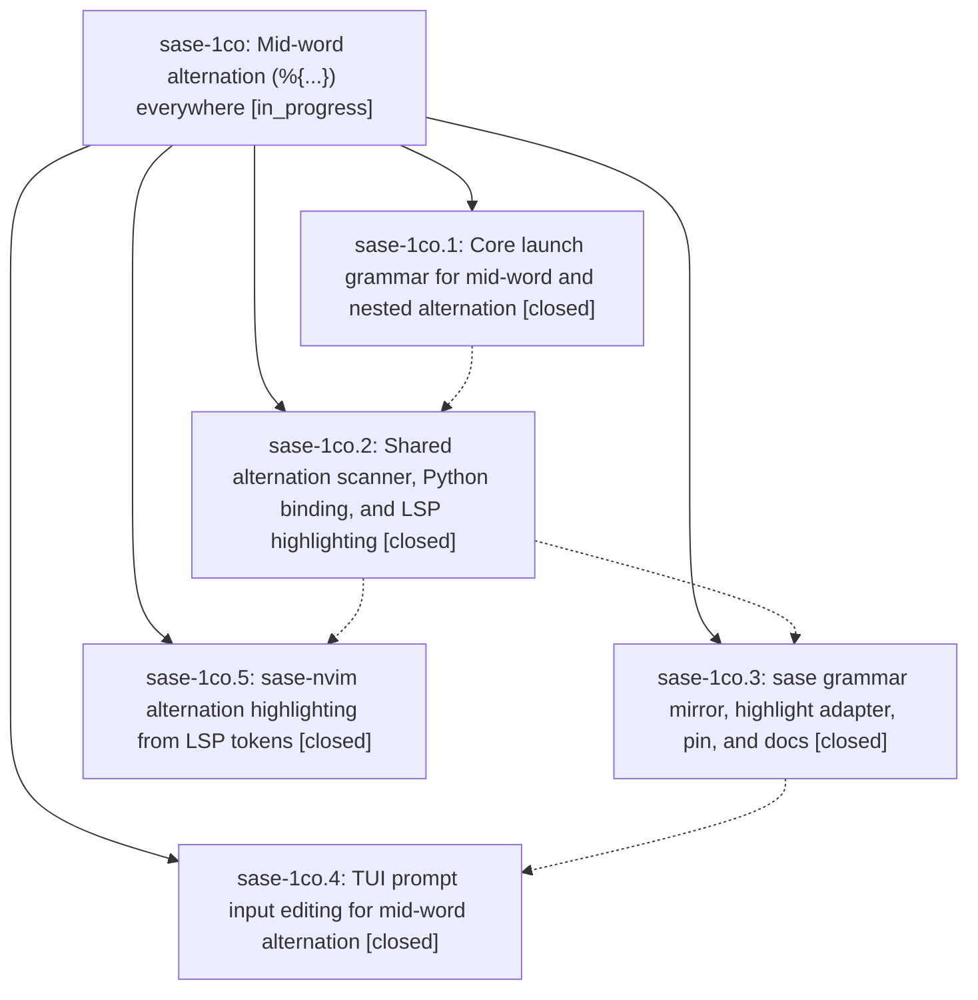

# Bead: sase-1co — Mid-word alternation (%{...}) everywhere

[Bead Pages](../README.md) / sase-1co

**Status:** ◐ in_progress · **Type:** ▸ plan · **Tier:** epic
**Owner:** `bryanbugyi34@gmail.com` · **Created by:** [bbugyi200.athena.0u1](https://github.com/sase-org/sase--agents/blob/main/sessions/bbugyi200.athena.0u1.md) · **Assignee:** `sase-1co.land`
**Created:** 2026-09-29 16:22:01 EDT
**Plan:** [202609/midword\_alternation.md](https://github.com/sase-org/sase--plans/blob/main/202609/midword_alternation.md)

## Description

`%{a | b}` fans out, highlights, and edits the same way wherever it appears: at a word boundary, in the middle of a word (`foo%{bar | baz}qux`), right after punctuation, or nested inside another branch. One Rust-owned scanner feeds launch, the TUI prompt input, and the xprompt LSP, and nothing is added to the per-keystroke cost of typing.

## Phases

| Bead | Title | Status | Size | Created | Agents | Commits |
|---|---|---|---|---|---:|---:|
| [sase-1co.1](sase-1co.1.md) | Core launch grammar for mid-word and nested alternation | ✓ closed | medium | 2026-09-29 | 1 | 1 |
| [sase-1co.2](sase-1co.2.md) | Shared alternation scanner, Python binding, and LSP highlighting | ✓ closed | medium | 2026-09-29 | 1 | 1 |
| [sase-1co.3](sase-1co.3.md) | sase grammar mirror, highlight adapter, pin, and docs | ✓ closed | medium | 2026-09-29 | 1 | 1 |
| [sase-1co.4](sase-1co.4.md) | TUI prompt input editing for mid-word alternation | ✓ closed | medium | 2026-09-29 | 1 | 1 |
| [sase-1co.5](sase-1co.5.md) | sase-nvim alternation highlighting from LSP tokens | ✓ closed | medium | 2026-09-29 | 1 | 0 |

## Lineage

## Agents

| Agent | Bead | Commits |
|---|---|---:|
| [bbugyi200.athena.sase-1co.1](https://github.com/sase-org/sase--agents/blob/main/agents/bbugyi200.athena.sase-1co.1/README.md) | [sase-1co.1](sase-1co.1.md) | 1 |
| [bbugyi200.athena.sase-1co.2](https://github.com/sase-org/sase--agents/blob/main/agents/bbugyi200.athena.sase-1co.2/README.md) | [sase-1co.2](sase-1co.2.md) | 1 |
| [bbugyi200.athena.sase-1co.3](https://github.com/sase-org/sase--agents/blob/main/agents/bbugyi200.athena.sase-1co.3/README.md) | [sase-1co.3](sase-1co.3.md) | 1 |
| [bbugyi200.athena.sase-1co.4](https://github.com/sase-org/sase--agents/blob/main/sessions/bbugyi200.athena.sase-1co.4.md) | [sase-1co.4](sase-1co.4.md) | 1 |
| [bbugyi200.athena.sase-1co.5](https://github.com/sase-org/sase--agents/blob/main/agents/bbugyi200.athena.sase-1co.5/README.md) | [sase-1co.5](sase-1co.5.md) | 0 |
| [bbugyi200.athena.sase-1co.land](https://github.com/sase-org/sase--agents/blob/main/agents/bbugyi200.athena.sase-1co.land/README.md) | [sase-1co](README.md) | 0 |

## Commits

| Repo | Commit | Subject | Bead | Committed |
|---|---|---|---|---|
| sase-core | [`sase-core@1160ea4`](https://github.com/sase-org/sase-core/commit/1160ea41c14fef59c872aee2be3375e872c97642) | feat(launch): support mid-word and nested %{...} alternation | [sase-1co.1](sase-1co.1.md) | 2026-09-29 16:48:27 EDT |
| sase-core | [`sase-core@1e51ff3`](https://github.com/sase-org/sase-core/commit/1e51ff3ce9c53ee1a4bc9f52c3642ac4eea8f423) | feat(alternation): shared scanner, binding, diagnostic, and LSP tokens | [sase-1co.2](sase-1co.2.md) | 2026-09-29 17:17:17 EDT |
| sase | [`0266fe4`](https://github.com/sase-org/sase/commit/0266fe4a1227c2a96293828b520b5cd0f1d54a15) | feat(xprompt): mid-word alternation grammar mirror, highlight adapter, and docs | [sase-1co.3](sase-1co.3.md) | 2026-09-29 17:59:08 EDT |
| sase | [`f02c327`](https://github.com/sase-org/sase/commit/f02c3273e455d36cfa2ef1ff182019d554497a4f) | feat(tui): mid-word alternation editing for alt spans | [sase-1co.4](sase-1co.4.md) | 2026-09-29 18:22:23 EDT |
