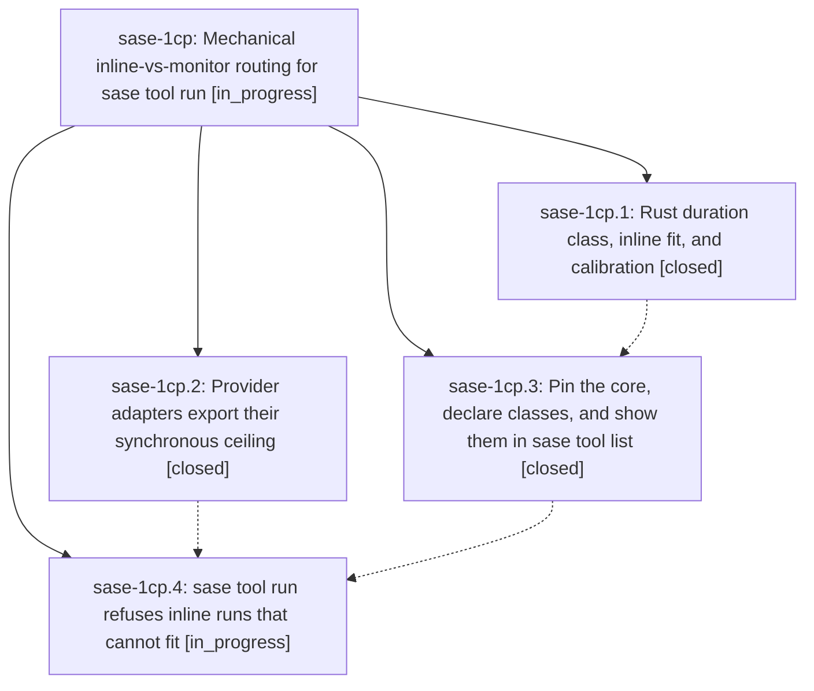

# Bead: sase-1cp — Mechanical inline-vs-monitor routing for sase tool run

[Bead Pages](../README.md) / sase-1cp

**Status:** ◐ in_progress · **Type:** ▸ plan · **Tier:** epic
**Owner:** `bryanbugyi34@gmail.com` · **Created by:** [bbugyi200.athena.0u2](https://github.com/sase-org/sase--agents/blob/main/sessions/bbugyi200.athena.0u2.md) · **Assignee:** `sase-1cp.land`
**Created:** 2026-09-29 16:47:57 EDT
**Plan:** [202609/tool\_inline\_routing.md](https://github.com/sase-org/sase--plans/blob/main/202609/tool_inline_routing.md)

## Description

Every provider adapter that has a hard synchronous-command ceiling exports it as SASE_PROVIDER_SYNC_CEILING_SECONDS. Every tool catalog entry has a Rust-validated duration class (short, long, or unbounded). Before starting anything, sase tool run refuses an agent's inline run of a tool whose class floor meets that ceiling, and prints the exact monitor command to use instead. `check` keeps running inline, no existing definition digest moves, and sase-17e is closed.

## Phases

| Bead | Title | Status | Size | Created | Agents | Commits |
|---|---|---|---|---|---:|---:|
| [sase-1cp.1](sase-1cp.1.md) | Rust duration class, inline fit, and calibration | ✓ closed | medium | 2026-09-29 | 1 | 1 |
| [sase-1cp.2](sase-1cp.2.md) | Provider adapters export their synchronous ceiling | ✓ closed | small | 2026-09-29 | 1 | 1 |
| [sase-1cp.3](sase-1cp.3.md) | Pin the core, declare classes, and show them in sase tool list | ✓ closed | medium | 2026-09-29 | 1 | 1 |
| [sase-1cp.4](sase-1cp.4.md) | sase tool run refuses inline runs that cannot fit | ◐ in_progress | medium | 2026-09-29 | 1 | 0 |

## Lineage

## Agents

| Agent | Bead | Commits |
|---|---|---:|
| [bbugyi200.athena.sase-1cp.1](https://github.com/sase-org/sase--agents/blob/main/agents/bbugyi200.athena.sase-1cp.1/README.md) | [sase-1cp.1](sase-1cp.1.md) | 1 |
| [bbugyi200.athena.sase-1cp.2](https://github.com/sase-org/sase--agents/blob/main/sessions/bbugyi200.athena.sase-1cp.2.md) | [sase-1cp.2](sase-1cp.2.md) | 1 |
| [bbugyi200.athena.sase-1cp.3](https://github.com/sase-org/sase--agents/blob/main/agents/bbugyi200.athena.sase-1cp.3/README.md) | [sase-1cp.3](sase-1cp.3.md) | 1 |
| [bbugyi200.athena.sase-1cp.4](https://github.com/sase-org/sase--agents/blob/main/agents/bbugyi200.athena.sase-1cp.4/README.md) | [sase-1cp.4](sase-1cp.4.md) | 0 |
| [bbugyi200.athena.sase-1cp.land](https://github.com/sase-org/sase--agents/blob/main/agents/bbugyi200.athena.sase-1cp.land/README.md) | [sase-1cp](README.md) | 0 |

## Commits

| Repo | Commit | Subject | Bead | Committed |
|---|---|---|---|---|
| sase-core | [`sase-core@17b072b`](https://github.com/sase-org/sase-core/commit/17b072b34f69fee4b97ea8a90157f51fc3d3e15c) | feat(tool-run): add duration classes and inline-fit policy | [sase-1cp.1](sase-1cp.1.md) | 2026-09-29 17:08:19 EDT |
| sase | [`7ccdd71`](https://github.com/sase-org/sase/commit/7ccdd713a2a19e815a4861c145eed0fa7fabbdb9) | feat(tool-run): pin duration-class core, declare catalog classes, show CLASS in tool list | [sase-1cp.3](sase-1cp.3.md) | 2026-09-29 17:42:25 EDT |
| sase | [`4fce27e`](https://github.com/sase-org/sase/commit/4fce27e5072c91fc9b2e32e6896a0e4e8f852f33) | feat(providers): export synchronous ceiling and scrub at boundaries | [sase-1cp.2](sase-1cp.2.md) | 2026-09-29 18:01:23 EDT |
