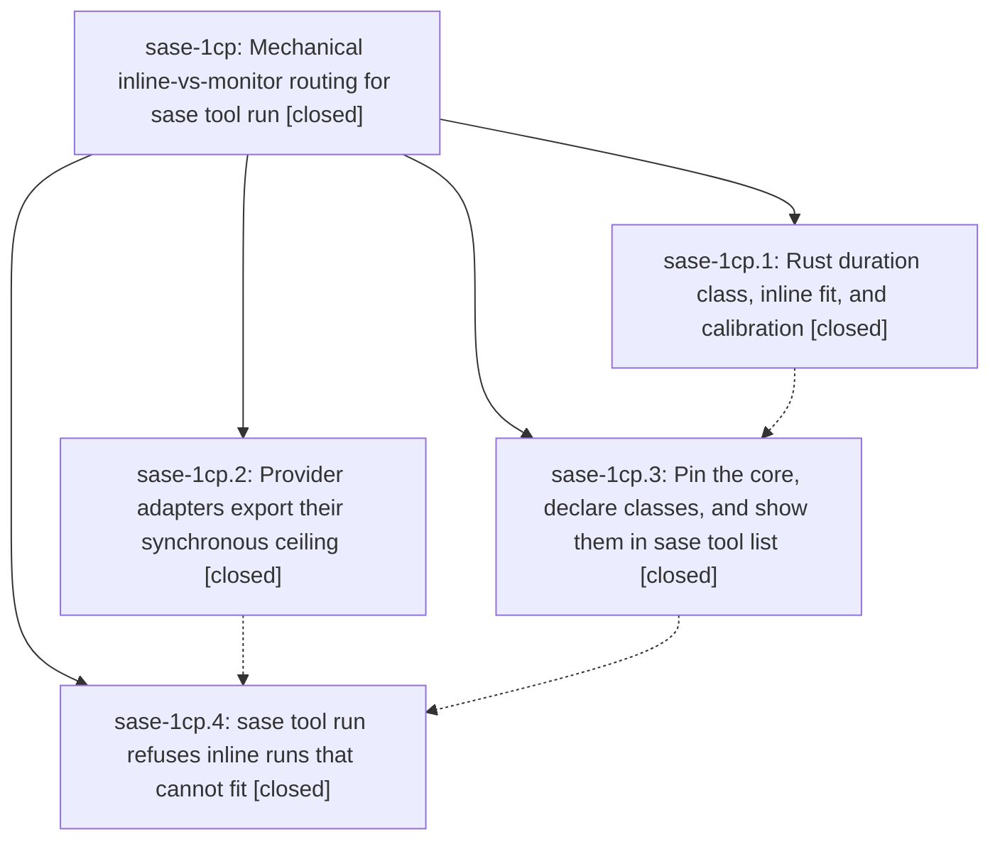

# Bead: sase-1cp — Mechanical inline-vs-monitor routing for sase tool run

[Bead Pages](../README.md) / sase-1cp

**Status:** ✓ closed · **Resolution:** done · **Type:** ▸ plan · **Tier:** epic
**Owner:** `bryanbugyi34@gmail.com` · **Created by:** [bbugyi200.athena.0u2](https://github.com/sase-org/sase--agents/blob/main/sessions/bbugyi200.athena.0u2.md) · **Assignee:** `sase-1cp.land`
**Created:** 2026-09-29 16:47:57 EDT · **Closed:** 2026-09-29 18:44:10 EDT
**Plan:** [202609/tool\_inline\_routing.md](https://github.com/sase-org/sase--plans/blob/main/202609/tool_inline_routing.md)

## Description

Every provider adapter that has a hard synchronous-command ceiling exports it as SASE_PROVIDER_SYNC_CEILING_SECONDS. Every tool catalog entry has a Rust-validated duration class (short, long, or unbounded). Before starting anything, sase tool run refuses an agent's inline run of a tool whose class floor meets that ceiling, and prints the exact monitor command to use instead. `check` keeps running inline, no existing definition digest moves, and sase-17e is closed.

## Notes

[2026-09-29T22:44:10Z · sase-1cp.land] Verified all four phases against their notes and the landed commits (sase-1cp.1 core 17b072b, sase-1cp.3 7ccdd713a2, sase-1cp.2 4fce27e507, sase-1cp.4 b07172cc1d). Rust owns floors and fit (long floor 600s, floor==ceiling refused, unbounded never fits). Python exports SASE_PROVIDER_SYNC_CEILING_SECONDS around invoke_agent, scrubs that exact key, and execute_tool_run refuses before reconcile/reservation/spawn. Focused tests: 60 passed (routing, sync ceiling, tool list, catalog). sase tool list schema_version 1; classes and digests match the phase note (check short f0b2638a, check-full long 62188d32, install/test/test-visual short). Live smoke: ceiling 600 refused slow with no marker and no run; ceiling 1800 ran it (f480aa864669fd4a42695e98cfc1d271). Lander shell ceiling is unset. Deployed the landed sase_monitor sentence via sase skill init --force and chezmoi apply.

Integration since the epic started needed no feature edits. Pin ratchet 339a67306b moved sase-core-revision.txt to 1e51ff3c, which contains 17b072b plus the alternation commit. c257a3f220 only added repos.linked.revision_pin. No later commit changed the tools catalog, and no new provider declares a hard synchronous ceiling.

Follow-ups: terminology lint (sase-1cp.2 note 1, sase-1cp.3 note 3, sase-1cp.4 note 1) is the pre-existing sase-core fixture failure already on epic sase-1ck; corroborated there, no task created. test-visual duration class (sase-1cp.3 note 2) stays undeclared: one signaled run with no duration, so no 600s floor; not filed because task(feature) is not agent-creatable. Admin Center Catalog CLASS column was a plan candidate and is still absent from _catalog_row; same feature-type refusal, left as this note. Soft ceilings were not filed separately; they are recorded on sase-17g with the ceiling contract. sase-17e closed. No --epic-symbol entries.

[2026-09-29T22:47:43Z · sase-1cp.land] just symvision after close exited 1 on two private imports that are not sase-1cp whitelist entries: attachment_resolve.py imports _roster_for_issue, and show_images.py imports _kitty_graphics_support. No --epic-symbol entries were keyed to sase-1cp. Recorded on sase-1ck.

## Phases

| Bead | Title | Status | Size | Created | Agents | Commits |
|---|---|---|---|---|---:|---:|
| [sase-1cp.1](sase-1cp.1.md) | Rust duration class, inline fit, and calibration | ✓ closed | medium | 2026-09-29 | 1 | 1 |
| [sase-1cp.2](sase-1cp.2.md) | Provider adapters export their synchronous ceiling | ✓ closed | small | 2026-09-29 | 1 | 1 |
| [sase-1cp.3](sase-1cp.3.md) | Pin the core, declare classes, and show them in sase tool list | ✓ closed | medium | 2026-09-29 | 1 | 1 |
| [sase-1cp.4](sase-1cp.4.md) | sase tool run refuses inline runs that cannot fit | ✓ closed | medium | 2026-09-29 | 1 | 1 |

## Lineage

## Agents

| Agent | Bead | Commits |
|---|---|---:|
| [bbugyi200.athena.sase-1cp.1](https://github.com/sase-org/sase--agents/blob/main/agents/bbugyi200.athena.sase-1cp.1/README.md) | [sase-1cp.1](sase-1cp.1.md) | 1 |
| [bbugyi200.athena.sase-1cp.2](https://github.com/sase-org/sase--agents/blob/main/sessions/bbugyi200.athena.sase-1cp.2.md) | [sase-1cp.2](sase-1cp.2.md) | 1 |
| [bbugyi200.athena.sase-1cp.3](https://github.com/sase-org/sase--agents/blob/main/agents/bbugyi200.athena.sase-1cp.3/README.md) | [sase-1cp.3](sase-1cp.3.md) | 1 |
| [bbugyi200.athena.sase-1cp.4](https://github.com/sase-org/sase--agents/blob/main/agents/bbugyi200.athena.sase-1cp.4/README.md) | [sase-1cp.4](sase-1cp.4.md) | 1 |
| [bbugyi200.athena.sase-1cp.land](https://github.com/sase-org/sase--agents/blob/main/agents/bbugyi200.athena.sase-1cp.land/README.md) | [sase-1cp](README.md) | 1 |

## Commits

| Repo | Commit | Subject | Bead | Committed |
|---|---|---|---|---|
| sase-core | [`sase-core@17b072b`](https://github.com/sase-org/sase-core/commit/17b072b34f69fee4b97ea8a90157f51fc3d3e15c) | feat(tool-run): add duration classes and inline-fit policy | [sase-1cp.1](sase-1cp.1.md) | 2026-09-29 17:08:19 EDT |
| sase | [`7ccdd71`](https://github.com/sase-org/sase/commit/7ccdd713a2a19e815a4861c145eed0fa7fabbdb9) | feat(tool-run): pin duration-class core, declare catalog classes, show CLASS in tool list | [sase-1cp.3](sase-1cp.3.md) | 2026-09-29 17:42:25 EDT |
| sase | [`4fce27e`](https://github.com/sase-org/sase/commit/4fce27e5072c91fc9b2e32e6896a0e4e8f852f33) | feat(providers): export synchronous ceiling and scrub at boundaries | [sase-1cp.2](sase-1cp.2.md) | 2026-09-29 18:01:23 EDT |
| sase | [`b07172c`](https://github.com/sase-org/sase/commit/b07172cc1d8b73105a4f4ae140471e538e2e5a24) | feat(tool-run): refuse inline runs that cannot fit the provider ceiling | [sase-1cp.4](sase-1cp.4.md) | 2026-09-29 18:20:28 EDT |
| sase--plans | [`sase--plans@26b998e`](https://github.com/sase-org/sase--plans/commit/26b998e3b7385d502fc5eac26784645dec5be66a) | docs(plans): mark tool inline routing done for sase-1cp landing | [sase-1cp](README.md) | 2026-09-29 18:49:16 EDT |
