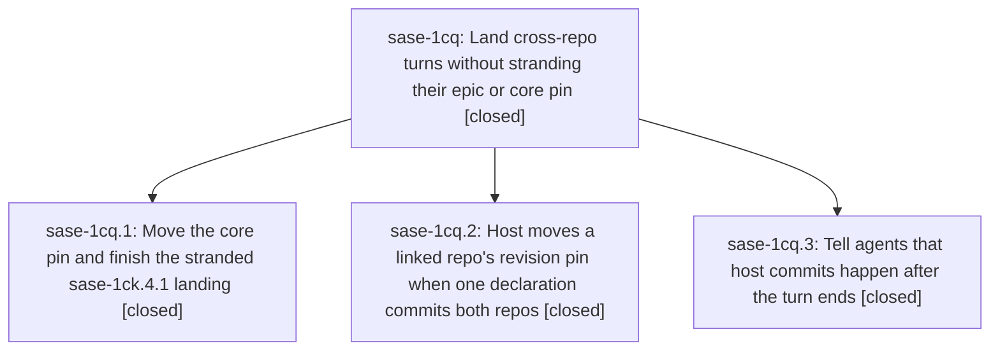

# Bead: sase-1cq — Land cross-repo turns without stranding their epic or core pin

[Bead Pages](../README.md) / sase-1cq

**Status:** ✓ closed · **Resolution:** done · **Type:** ▸ plan · **Tier:** epic
**Owner:** `bryanbugyi34@gmail.com` · **Created by:** [bbugyi200.athena.0u6](https://github.com/sase-org/sase--agents/blob/main/sessions/bbugyi200.athena.0u6.md) · **Assignee:** `sase-1cq.land`
**Created:** 2026-09-29 17:21:18 EDT · **Closed:** 2026-09-29 18:28:10 EDT
**Plan:** [202609/cross\_repo\_landing.md](https://github.com/sase-org/sase--plans/blob/main/202609/cross_repo_landing.md)

## Description

A single agent turn that changes both sase and sase-core lands one green commit per repo with sase-core-revision.txt already pointing at the new core commit, agents know host commits happen after their turn so they close finished work instead of deferring it, and the stranded sase-1ck.4.1 landing is finished.

## Notes

[2026-09-29T22:06:53Z · sase-1cq.land] LAND TRIAGE before completion tale: Child proposals sase-1cq.1 notes 1-2 and sase-1cq.2 note 1 are one unused bead-attachment-symbol issue; declined a new task because later commit 8c38eb6a9a privatized the in-file helpers and handlers and deleted note_label_attachment_suffix, and the old public symbols are absent on current master. Child proposals sase-1cq.1 note 3 and sase-1cq.3 note 1 are one patch/stitch terminology fixture issue; current audit reproduces 14 unclassified tokens in sase-core crates/sase_core/tests/fixtures/note_attachment/at_bearing_notes.jsonl. This is already recorded as DISCOVERED ISSUE on active parent attachment epic sase-1ck note 1 (the fixture came from its phase), so no duplicate task. Epic-owned remaining work found in pin_follow: a symlinked revision_pin parent can resolve outside the primary checkout; also note_cli.md still has status wip, and the installed generated sase_final skill lacks the landed after-turn sentence. No --epic-symbol entries for sase-1cq.

[2026-09-29T22:28:10Z · sase-1cq.land] Finish tale verified: all three phases closed (stranded_landing pin 43f744be->1e51ff3c contains 0541387+1ad57ea, pin_follow revision_pin ordering+write, after_turn_messaging submit note+skill); feature commits c257a3f220/2fe7c6500f/339a67306b plus later 8c38eb6a9a/0266fe4a12/4fce27e507/aa61902a9e reviewed, no later consumer needs pin/after-turn integration; focused 42 tests pass (test_commit_revision_pin 40 incl symlink-escape+Windows-drive, test_final_submit_after_turn_note); just fix clean; sase tool run check red only on pre-existing 14-token terminology fixture already on sase-1ck note 1; symvision only AltGroup/tool_run_duration_fit/validate_sync_ceiling_seconds from later commits; epic-symbols empty; follow-ups: child unused-symbol proposal resolved by 8c38eb6a9a privatization, terminology already tracked, remaining symlink guard/note_cli done/skill redeploy done (sase_final sentence live in chezmoi+Codex, sase_pipe retired to sase_handoff, committed 7a8aaf6a pushed+applied)

## Phases

| Bead | Title | Status | Size | Created | Agents | Commits |
|---|---|---|---|---|---:|---:|
| [sase-1cq.1](sase-1cq.1.md) | Move the core pin and finish the stranded sase-1ck.4.1 landing | ✓ closed | small | 2026-09-29 | 1 | 1 |
| [sase-1cq.2](sase-1cq.2.md) | Host moves a linked repo's revision pin when one declaration commits both repos | ✓ closed | medium | 2026-09-29 | 1 | 1 |
| [sase-1cq.3](sase-1cq.3.md) | Tell agents that host commits happen after the turn ends | ✓ closed | small | 2026-09-29 | 1 | 1 |

## Lineage

## Agents

| Agent | Bead | Commits |
|---|---|---:|
| [bbugyi200.athena.sase-1cq.1](https://github.com/sase-org/sase--agents/blob/main/agents/bbugyi200.athena.sase-1cq.1/README.md) | [sase-1cq.1](sase-1cq.1.md) | 1 |
| [bbugyi200.athena.sase-1cq.2](https://github.com/sase-org/sase--agents/blob/main/agents/bbugyi200.athena.sase-1cq.2/README.md) | [sase-1cq.2](sase-1cq.2.md) | 1 |
| [bbugyi200.athena.sase-1cq.3](https://github.com/sase-org/sase--agents/blob/main/agents/bbugyi200.athena.sase-1cq.3/README.md) | [sase-1cq.3](sase-1cq.3.md) | 1 |
| [bbugyi200.athena.sase-1cq.land](https://github.com/sase-org/sase--agents/blob/main/sessions/bbugyi200.athena.sase-1cq.land.md) | [sase-1cq](README.md) | 1 |

## Commits

| Repo | Commit | Subject | Bead | Committed |
|---|---|---|---|---|
| sase | [`c257a3f`](https://github.com/sase-org/sase/commit/c257a3f22035e68e431826fc939af2895e3ff328) | feat(finalizer): add revision\_pin for linked repos with commit ordering and pin update | [sase-1cq.2](sase-1cq.2.md) | 2026-09-29 17:48:14 EDT |
| sase | [`2fe7c65`](https://github.com/sase-org/sase/commit/2fe7c6500fca50ba8036794d595a0e4c7b1912ff) | feat(final): tell agents host commits happen after the turn ends | [sase-1cq.3](sase-1cq.3.md) | 2026-09-29 17:53:00 EDT |
| sase | [`339a673`](https://github.com/sase-org/sase/commit/339a67306b5797921d9f31b73a0bd4505efbee0f) | chore(core-pin): ratchet sase-core-revision.txt to 1e51ff3c for +1 attachments and prompt-prediction replay | [sase-1cq.1](sase-1cq.1.md) | 2026-09-29 17:54:15 EDT |
| sase | [`859140f`](https://github.com/sase-org/sase/commit/859140f025decf1e11051412b9a8f6fac53f1252) | feat(finalizer): secure revision\_pin against symlink escapes with doctor check and tests | [sase-1cq](README.md) | 2026-09-29 18:33:04 EDT |
