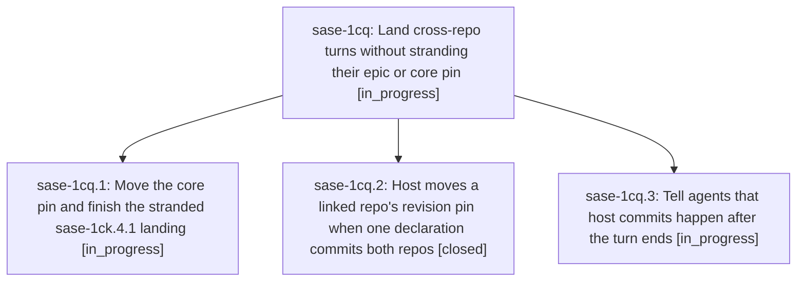

# Bead: sase-1cq — Land cross-repo turns without stranding their epic or core pin

[Bead Pages](../README.md) / sase-1cq

**Status:** ◐ in_progress · **Type:** ▸ plan · **Tier:** epic
**Owner:** `bryanbugyi34@gmail.com` · **Created by:** [bbugyi200.athena.0u6](https://github.com/sase-org/sase--agents/blob/main/sessions/bbugyi200.athena.0u6.md) · **Assignee:** `sase-1cq.land`
**Created:** 2026-09-29 17:21:18 EDT
**Plan:** [202609/cross\_repo\_landing.md](https://github.com/sase-org/sase--plans/blob/main/202609/cross_repo_landing.md)

## Description

A single agent turn that changes both sase and sase-core lands one green commit per repo with sase-core-revision.txt already pointing at the new core commit, agents know host commits happen after their turn so they close finished work instead of deferring it, and the stranded sase-1ck.4.1 landing is finished.

## Phases

| Bead | Title | Status | Size | Created | Agents | Commits |
|---|---|---|---|---|---:|---:|
| [sase-1cq.1](sase-1cq.1.md) | Move the core pin and finish the stranded sase-1ck.4.1 landing | ◐ in_progress | small | 2026-09-29 | 1 | 0 |
| [sase-1cq.2](sase-1cq.2.md) | Host moves a linked repo's revision pin when one declaration commits both repos | ✓ closed | medium | 2026-09-29 | 1 | 1 |
| [sase-1cq.3](sase-1cq.3.md) | Tell agents that host commits happen after the turn ends | ◐ in_progress | small | 2026-09-29 | 1 | 0 |

## Lineage

## Agents

| Agent | Bead | Commits |
|---|---|---:|
| [bbugyi200.athena.sase-1cq.1](https://github.com/sase-org/sase--agents/blob/main/agents/bbugyi200.athena.sase-1cq.1/README.md) | [sase-1cq.1](sase-1cq.1.md) | 0 |
| [bbugyi200.athena.sase-1cq.2](https://github.com/sase-org/sase--agents/blob/main/agents/bbugyi200.athena.sase-1cq.2/README.md) | [sase-1cq.2](sase-1cq.2.md) | 1 |
| [bbugyi200.athena.sase-1cq.3](https://github.com/sase-org/sase--agents/blob/main/agents/bbugyi200.athena.sase-1cq.3/README.md) | [sase-1cq.3](sase-1cq.3.md) | 0 |
| [bbugyi200.athena.sase-1cq.land](https://github.com/sase-org/sase--agents/blob/main/agents/bbugyi200.athena.sase-1cq.land/README.md) | [sase-1cq](README.md) | 0 |

## Commits

| Repo | Commit | Subject | Bead | Committed |
|---|---|---|---|---|
| sase | [`c257a3f`](https://github.com/sase-org/sase/commit/c257a3f22035e68e431826fc939af2895e3ff328) | feat(finalizer): add revision\_pin for linked repos with commit ordering and pin update | [sase-1cq.2](sase-1cq.2.md) | 2026-09-29 17:48:14 EDT |
