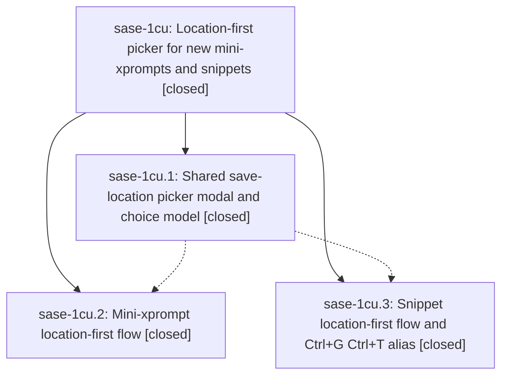

# Bead: sase-1cu — Location-first picker for new mini-xprompts and snippets

[Bead Pages](../README.md) / sase-1cu

**Status:** ✓ closed · **Resolution:** done · **Type:** ▸ plan · **Tier:** epic
**Owner:** `bryanbugyi34@gmail.com` · **Created by:** [bbugyi200.athena.0u8](https://github.com/sase-org/sase--agents/blob/main/sessions/bbugyi200.athena.0u8.md) · **Assignee:** `sase-1cu.land`
**Created:** 2026-09-29 18:58:45 EDT · **Closed:** 2026-09-29 22:21:25 EDT
**Plan:** [202609/save\_location\_picker.md](https://github.com/sase-org/sase--plans/blob/main/202609/save_location_picker.md)

## Description

Opening a mini-xprompt (Ctrl+G Ctrl+X, Ctrl+G x, gx) or snippet (Ctrl+G Ctrl+T, Ctrl+G t, gt) target pane first shows a fast location picker. One keypress chooses the file or directory that will store it, and Enter accepts a default whose reason is shown. The name step then shows the chosen location and can go back to change it. Keys typed while the picker is still loading are kept and applied, never dropped or sent to the prompt pane.

## Notes

[2026-09-30T02:05:36Z · sase-1cu.land] LAND FOLLOW-UP TRIAGE: The five PROPOSED FOLLOW-UP entries on phases .1/.2/.3 describe two distinct failures, both reproduced at HEAD 3e03e0add9 and both unrelated to the location-picker implementation. (1) Terminology audit: 14 unclassified historical tokens in sase-core at_bearing_notes.jsonl; same-root ready task sase-1cv received an independent +1 from this land agent, and active causal epic sase-1ck received corroboration. No new task because sase-1cv is a semantic duplicate. (2) Symvision: private cross-file imports _kitty_graphics_support and _roster_for_issue; already recorded as sase-1ck note #5, from attachment work; corroboration appended there. No new task because sase-1ck owns the still-open work. Neither should block this epic's close. LAND REMAINING WORK: snippet flow checks origin after initial loads but before its off-thread choice builder; if origin disappears while that builder runs, it can leave an orphaned picker, contrary to this epic plan's failure contract. Plan a focused fix and regression test, then close this epic.

[2026-09-30T02:21:25Z · sase-1cu.land] Verified picker flows: gt/Ctrl+G Ctrl+T open picker synchronously before loaders; configured-default beats last-used; fast typeahead becomes trigger; Shift+Tab round trip preserves trigger and re-highlights; rename defaults to current location; Esc restores origin. New regressions: origin loss during off-thread choice build closes picker with exactly one warning and no name step; Shift+Tab reload failure shows recoverable load error with notification instead of endless loading; Shift+Tab origin loss closes picker with exactly one warning. Integration: 33 focused mini/snippet flow tests pass; sase-1cu epic-symbols clean. Follow-ups: terminology 14-fixture failure owned by sase-1cv/sase-1ck, Symvision private-import pair owned by sase-1ck note 5; neither blocks this epic. Limits: just check fails only on the known terminology gate; just check-full not run per plan; no PNG golden update (behavior fix).

## Phases

| Bead | Title | Status | Size | Created | Agents | Commits |
|---|---|---|---|---|---:|---:|
| [sase-1cu.1](sase-1cu.1.md) | Shared save-location picker modal and choice model | ✓ closed | medium | 2026-09-29 | 1 | 1 |
| [sase-1cu.2](sase-1cu.2.md) | Mini-xprompt location-first flow | ✓ closed | medium | 2026-09-29 | 1 | 1 |
| [sase-1cu.3](sase-1cu.3.md) | Snippet location-first flow and Ctrl+G Ctrl+T alias | ✓ closed | medium | 2026-09-29 | 1 | 1 |

## Lineage

## Agents

| Agent | Bead | Commits |
|---|---|---:|
| [bbugyi200.athena.sase-1cu.1](https://github.com/sase-org/sase--agents/blob/main/agents/bbugyi200.athena.sase-1cu.1/README.md) | [sase-1cu.1](sase-1cu.1.md) | 1 |
| [bbugyi200.athena.sase-1cu.2](https://github.com/sase-org/sase--agents/blob/main/sessions/bbugyi200.athena.sase-1cu.2.md) | [sase-1cu.2](sase-1cu.2.md) | 1 |
| [bbugyi200.athena.sase-1cu.3](https://github.com/sase-org/sase--agents/blob/main/agents/bbugyi200.athena.sase-1cu.3/README.md) | [sase-1cu.3](sase-1cu.3.md) | 1 |
| [bbugyi200.athena.sase-1cu.land](https://github.com/sase-org/sase--agents/blob/main/sessions/bbugyi200.athena.sase-1cu.land.md) | [sase-1cu](README.md) | 2 |

## Commits

| Repo | Commit | Subject | Bead | Committed |
|---|---|---|---|---|
| sase | [`1a4bbd3`](https://github.com/sase-org/sase/commit/1a4bbd3e7633959573b2bf616f7a0fbc23e3b22e) | feat(ace): add save location picker modal and choice builders | [sase-1cu.1](sase-1cu.1.md) | 2026-09-29 20:06:05 EDT |
| sase | [`c44ec32`](https://github.com/sase-org/sase/commit/c44ec32abe440ad11632ead7179c0f1f0c394e7b) | feat(ace): snippet location-first save flow with picker and rename defaults | [sase-1cu.3](sase-1cu.3.md) | 2026-09-29 20:54:09 EDT |
| sase | [`3e03e0a`](https://github.com/sase-org/sase/commit/3e03e0add93766f27b9acea722c98b6ad9e3e183) | feat(mini-xprompt): route mini-xprompt flow through location-first picker | [sase-1cu.2](sase-1cu.2.md) | 2026-09-29 21:48:46 EDT |
| sase | [`4b89ab8`](https://github.com/sase-org/sase/commit/4b89ab8108dedb4db432343761d2147784866867) | fix(ace): close snippet picker on origin loss and surface reload errors | [sase-1cu](README.md) | 2026-09-29 22:24:35 EDT |
| sase--plans | [`sase--plans@09fe966`](https://github.com/sase-org/sase--plans/commit/09fe9662cd677bb6518ad4910df9f857ba070d09) | docs(plans): mark save\_location\_picker plan done for sase-1cu | [sase-1cu](README.md) | 2026-09-29 22:27:48 EDT |

<!-- sase:referenced-by:start -->

## Referenced By

| Relation | Artifact | Why | Uses |
| --- | --- | --- | ---: |
| read-by | [agent:sase-1cu.3][1] | Need epic children status for snippet-flow phase | 1 |

[1]: https://github.com/sase-org/sase--agents/blob/main/agents/bbugyi200.athena.sase-1cu.3/README.md

<!-- sase:referenced-by:end -->
