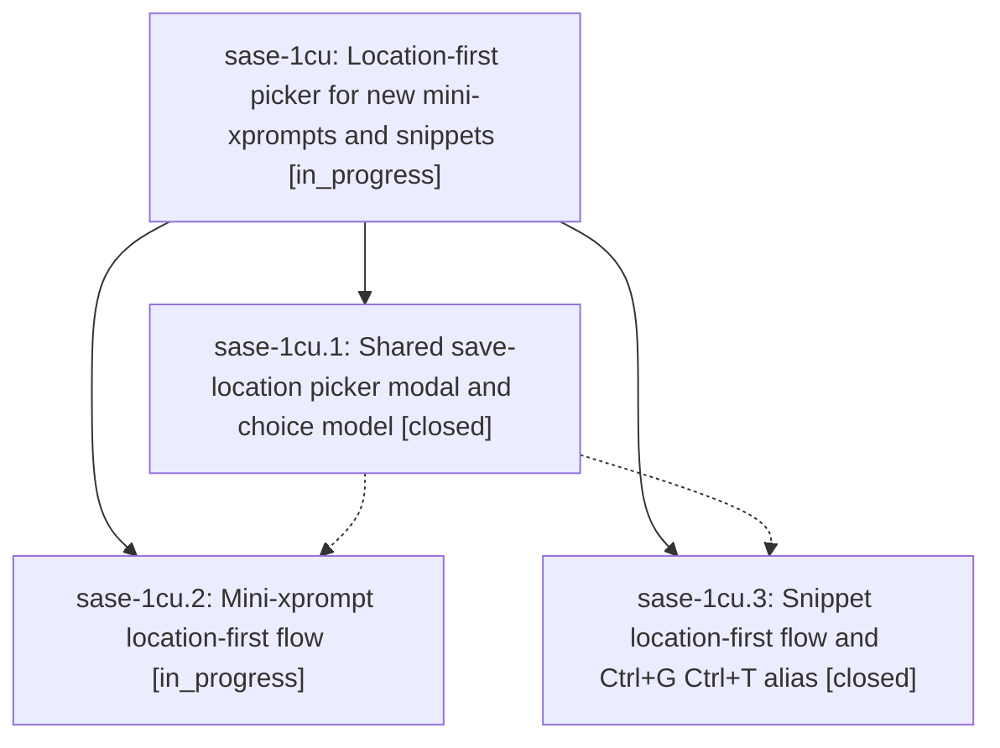

# Bead: sase-1cu — Location-first picker for new mini-xprompts and snippets

[Bead Pages](../README.md) / sase-1cu

**Status:** ◐ in_progress · **Type:** ▸ plan · **Tier:** epic
**Owner:** `bryanbugyi34@gmail.com` · **Created by:** [bbugyi200.athena.0u8](https://github.com/sase-org/sase--agents/blob/main/sessions/bbugyi200.athena.0u8.md) · **Assignee:** `sase-1cu.land`
**Created:** 2026-09-29 18:58:45 EDT
**Plan:** [202609/save\_location\_picker.md](https://github.com/sase-org/sase--plans/blob/main/202609/save_location_picker.md)

## Description

Opening a mini-xprompt (Ctrl+G Ctrl+X, Ctrl+G x, gx) or snippet (Ctrl+G Ctrl+T, Ctrl+G t, gt) target pane first shows a fast location picker. One keypress chooses the file or directory that will store it, and Enter accepts a default whose reason is shown. The name step then shows the chosen location and can go back to change it. Keys typed while the picker is still loading are kept and applied, never dropped or sent to the prompt pane.

## Phases

| Bead | Title | Status | Size | Created | Agents | Commits |
|---|---|---|---|---|---:|---:|
| [sase-1cu.1](sase-1cu.1.md) | Shared save-location picker modal and choice model | ✓ closed | medium | 2026-09-29 | 1 | 1 |
| [sase-1cu.2](sase-1cu.2.md) | Mini-xprompt location-first flow | ◐ in_progress | medium | 2026-09-29 | 1 | 0 |
| [sase-1cu.3](sase-1cu.3.md) | Snippet location-first flow and Ctrl+G Ctrl+T alias | ✓ closed | medium | 2026-09-29 | 1 | 1 |

## Lineage

## Agents

| Agent | Bead | Commits |
|---|---|---:|
| [bbugyi200.athena.sase-1cu.1](https://github.com/sase-org/sase--agents/blob/main/agents/bbugyi200.athena.sase-1cu.1/README.md) | [sase-1cu.1](sase-1cu.1.md) | 1 |
| [bbugyi200.athena.sase-1cu.2](https://github.com/sase-org/sase--agents/blob/main/agents/bbugyi200.athena.sase-1cu.2/README.md) | [sase-1cu.2](sase-1cu.2.md) | 0 |
| [bbugyi200.athena.sase-1cu.3](https://github.com/sase-org/sase--agents/blob/main/agents/bbugyi200.athena.sase-1cu.3/README.md) | [sase-1cu.3](sase-1cu.3.md) | 1 |
| [bbugyi200.athena.sase-1cu.land](https://github.com/sase-org/sase--agents/blob/main/agents/bbugyi200.athena.sase-1cu.land/README.md) | [sase-1cu](README.md) | 0 |

## Commits

| Repo | Commit | Subject | Bead | Committed |
|---|---|---|---|---|
| sase | [`1a4bbd3`](https://github.com/sase-org/sase/commit/1a4bbd3e7633959573b2bf616f7a0fbc23e3b22e) | feat(ace): add save location picker modal and choice builders | [sase-1cu.1](sase-1cu.1.md) | 2026-09-29 20:06:05 EDT |
| sase | [`c44ec32`](https://github.com/sase-org/sase/commit/c44ec32abe440ad11632ead7179c0f1f0c394e7b) | feat(ace): snippet location-first save flow with picker and rename defaults | [sase-1cu.3](sase-1cu.3.md) | 2026-09-29 20:54:09 EDT |
