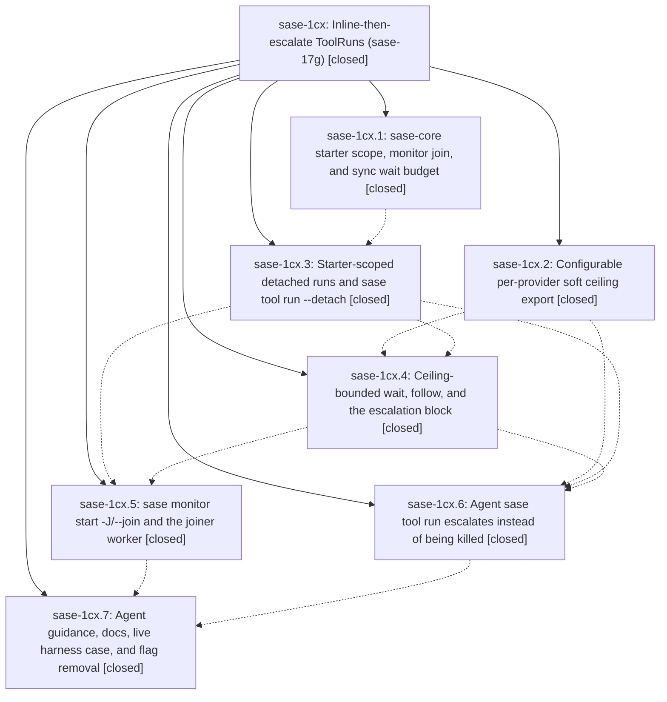

# Bead: sase-1cx — Inline-then-escalate ToolRuns (sase-17g)

[Bead Pages](../README.md) / sase-1cx

**Status:** ✓ closed · **Resolution:** done · **Type:** ▸ plan · **Tier:** epic
**Owner:** `bryanbugyi34@gmail.com` · **Created by:** [bbugyi200.athena.0u3](https://github.com/sase-org/sase--agents/blob/main/sessions/bbugyi200.athena.0u3.md) · **Assignee:** `sase-1cx.land`
**Created:** 2026-09-29 20:32:12 EDT · **Closed:** 2026-09-30 15:55:36 EDT
**Plan:** [202609/tool\_run\_escalation.md](https://github.com/sase-org/sase--plans/blob/main/202609/tool_run_escalation.md)

<!-- sase:links:start -->

## Links

| Relation | Artifact | Why |
| --- | --- | --- |
| implemented-by | [plan:202609/tool_run_escalation.md][1] | derived from the plan's `bead_id:` frontmatter field |

_Plus 2 automatic references — see [Referenced By](#referenced-by)._

[1]: https://github.com/sase-org/sase--plans/blob/main/202609/tool_run_escalation.md

<!-- sase:links:end -->

## Description

An agent's `sase tool run` never loses a run to its provider's synchronous ceiling: every run starts inline from the agent's point of view, and a run still going near the ceiling moves into a monitor under the same ToolRun id without being cancelled or rerun, via `sase tool run --detach`, ceiling-bounded `sase tool wait`, and `sase monitor start -J/--join`.

## Notes

[2026-09-30T15:51:35Z · sase-1d8.land] DISCOVERED ISSUE during sase-1d8 landing integration review: clean HEAD 018061f6f2 (feat(tool), sase-1cx.3) makes direct Symvision fail on seven unused public symbols from this active epic: HandoffSubmitResult, StarterResolution, escalation_enabled, owner_ref, tool_run_join, tool_run_release_join, tool_run_sync_wait_budget. These are all introduced in 018061f6f2 in src/sase/tool or src/sase/core/tool_run.py. Resolve or re-key to a still-open 1cx bead before its land; no prompt-history source is involved.

[2026-09-30T19:37:05Z · sase-1cj.12.land] DISCOVERED ISSUE (sase-1cj.12.land, 2026-09-30, master 69c4057735): tests/completion/test_kind_coverage.py::test_every_value_slot_is_kinded_choiced_or_hinted fails deterministically with 'uncaptioned completion value slots: monitor/start:join'. The -J/--join value slot added by e032ec4d4a (sase-1cx.5, sase monitor start -J/--join) has no ValueKind in src/sase/completion/kinds.py NAME_TABLE/PATH_OVERRIDES, no argparse choices=, and no kinds.py value_hint. sase tool run check (run 3ba48ed465a1b2eaa2d2b52c141da8d8) reports it NEW with no owner. Fix: give the join slot a ToolRun-id kind or a free-form value_hint in kinds.py.

[2026-09-30T19:37:42Z · sase-1cj.12.land] DISCOVERED ISSUE (sase-1cj.12.land, 2026-09-30, master 69c4057735): lint (feature flags) fails rule 7 — closed flag bead 'sase-1dc' still has a surviving 'tool_run_escalation' definition (FeatureFlag.tool_run_escalation read in src/sase/tool/detach.py:43, help text in src/sase/main/parser_tool.py and src/sase/main/monitor/start.py). No commit tagged sase-1cx.7 (flag removal) is on master yet, so the flag bead closed ahead of its code. Reproduces on a clean tree via tools/check_feature_flags.

[2026-09-30T19:55:36Z · sase-1cx.land] LANDED (sase-1cx.land, 2026-09-30, base master 6f25752814).

VERIFY: Read all 7 phases and every phase note, plus the epic commits: sase-core cee9f49 (an ancestor of sase pin c3042fd), then sase 8804865f84, 018061f6f2, ba63b3d37c, e032ec4d4a, c68da8c475, f3899b4171. Every plan step is present in source:
- starter/join/release_join/sync_wait_budget bindings; the budget reproduces 600->510 hard, 14400->14100, 60->30, soft-only, smaller-wins, tie->hard, zero->error;
- soft_ceiling config, export, and scrub;
- starter.py, the adopt watchdog, detach_cleanup in invoke_agent, notify exclusion, and show detached/joined lines;
- follow_run, the routing sync_wait_budget, and escalation_block;
- monitor -J/--join, join_worker, proc_adapter skip, and control_stop routing;
- inline_escalation, hooked in executor_entry;
- zero tool_run_escalation references left; Muse directive, sase_monitor/sase_final sources, docs, and the dod-17 live harness case in place.
Environment-parity note (1cx.6 #1) and --live report (1cx.7 #1) confirmed.

INTEGRATE: Reviewed the 59 commits since 8804865f84. The only overlap is 6f25752814 (executor split), which kept the try_inline_escalation hook in executor_entry.py. Nothing else duplicates or conflicts.

FIXED IN LANDING (epic-caused):
(1) tests/completion/test_kind_coverage failed on the monitor/start:join slot added by 1cx.5 (1cx.7 note #2). Kinded it TOOL_RUN in completion/kinds.py and regenerated cli_spec.json.
(2) 1cx.6 note #1: a detached or joined run of check-full lost golden-update permission because the proc scrub drops SASE_AGENT. default_is_ci now treats SASE_PROC_ID like SASE_MONITOR_ID; tests added; docs/development.md updated.
(3) docs/tool.md: the agent hand-off sentence now mentions -d.
Epic-symbol entries: none. The 7 symvision symbols from epic note #1 / 1cx.4 #1 / 1cx.5 #2 are clean.

EVIDENCE:
- 'sase tool run -k check' (run fa11917812e9358a83872c8206796908): all gates pass, including scoped tests (400 files), except lint (feature flags) rule 7 for sase-1dg/public_bead_attachments and 2 KNOWN symvision private imports. Both are owned by epic sase-1d5, and the flag leftover is removed upstream by 7885562f54.
- 135 focused tests pass (completion kind/snapshot, fix_tui_screenshots, inline_escalation, detach, monitor_join, join, bounded_wait).
- Landing live smoke: exit 124 at the 5s soft budget with the full block; one run id through re-waits to wait exit 0 and a single row; starter death settles signaled/stop_requested 'starter agent smoke-agent ended without joining' in 6s. The plan recipe's single 'wait returns 0' needs re-waits, since the soft budget bounds wait too.
- Lander ceilings: hard 14400, soft unset.
- Skills: 'sase skill init --check' shows no drift; deployed SKILL.md files already carry -J.
- sase-17g closed.

FOLLOW-UPS:
- Created: sase-1di (-f with -J, from 1cx.5 #1), sase-1dj (TUI detached/joined surfaces, plan), sase-1dk (memory: lint_and_test.md + glossary:tool-run, plan), sase-1dl (Codex/Grok default soft ceilings, plan).
- +1 sase-14o (bead-candidates store-leak test, from 1cx.3 #1 and 1cx.7 #2).
- DISCOVERED ISSUE on sase-yy.8.6: plan-propose cutover RuntimeError (1cx.1 #4).
- Corroborated on sase-1d5: flag rule 7 and symvision private imports (1cx.7 #3, #4).

DECLINED:
- 1cx.2 #1: terminology lint is already tracked and closed as sase-1cv, and it passes now.
- 1cx.3 #1 (_setup-required-plugins): transient, passed standalone, not reproduced.
- 1cx.5 #2(1) (validate_sase_core_rs probe): no longer reproduces; _setup passed.
- 1cx.5 #2(3) (stale contexts baseline): documented selector behavior; refresh with 'just refresh-contexts-baseline'.
- Epic symvision notes: resolved.
- 1cx.6 #1 and 1cx.7 #2a: fixed above.

## Phases

| Bead | Title | Status | Size | Created | Agents | Commits |
|---|---|---|---|---|---:|---:|
| [sase-1cx.1](sase-1cx.1.md) | sase-core starter scope, monitor join, and sync wait budget | ✓ closed | large | 2026-09-29 | 1 | 1 |
| [sase-1cx.2](sase-1cx.2.md) | Configurable per-provider soft ceiling export | ✓ closed | medium | 2026-09-29 | 1 | 1 |
| [sase-1cx.3](sase-1cx.3.md) | Starter-scoped detached runs and sase tool run --detach | ✓ closed | large | 2026-09-29 | 1 | 1 |
| [sase-1cx.4](sase-1cx.4.md) | Ceiling-bounded wait, follow, and the escalation block | ✓ closed | medium | 2026-09-29 | 1 | 1 |
| [sase-1cx.5](sase-1cx.5.md) | sase monitor start -J/--join and the joiner worker | ✓ closed | large | 2026-09-29 | 1 | 1 |
| [sase-1cx.6](sase-1cx.6.md) | Agent sase tool run escalates instead of being killed | ✓ closed | large | 2026-09-29 | 1 | 1 |
| [sase-1cx.7](sase-1cx.7.md) | Agent guidance, docs, live harness case, and flag removal | ✓ closed | medium | 2026-09-29 | 1 | 1 |

## Lineage

## Agents

| Agent | Bead | Commits |
|---|---|---:|
| [bbugyi200.athena.sase-1cx.1](https://github.com/sase-org/sase--agents/blob/main/sessions/bbugyi200.athena.sase-1cx.1.md) | [sase-1cx.1](sase-1cx.1.md) | 1 |
| [bbugyi200.athena.sase-1cx.2](https://github.com/sase-org/sase--agents/blob/main/agents/bbugyi200.athena.sase-1cx.2/README.md) | [sase-1cx.2](sase-1cx.2.md) | 1 |
| [bbugyi200.athena.sase-1cx.3](https://github.com/sase-org/sase--agents/blob/main/sessions/bbugyi200.athena.sase-1cx.3.md) | [sase-1cx.3](sase-1cx.3.md) | 1 |
| [bbugyi200.athena.sase-1cx.4](https://github.com/sase-org/sase--agents/blob/main/agents/bbugyi200.athena.sase-1cx.4/README.md) | [sase-1cx.4](sase-1cx.4.md) | 1 |
| [bbugyi200.athena.sase-1cx.5](https://github.com/sase-org/sase--agents/blob/main/sessions/bbugyi200.athena.sase-1cx.5.md) | [sase-1cx.5](sase-1cx.5.md) | 1 |
| [bbugyi200.athena.sase-1cx.6](https://github.com/sase-org/sase--agents/blob/main/sessions/bbugyi200.athena.sase-1cx.6.md) | [sase-1cx.6](sase-1cx.6.md) | 1 |
| [bbugyi200.athena.sase-1cx.7](https://github.com/sase-org/sase--agents/blob/main/agents/bbugyi200.athena.sase-1cx.7/README.md) | [sase-1cx.7](sase-1cx.7.md) | 1 |
| [bbugyi200.athena.sase-1cx.land](https://github.com/sase-org/sase--agents/blob/main/agents/bbugyi200.athena.sase-1cx.land/README.md) | [sase-1cx](README.md) | 1 |

## Commits

| Repo | Commit | Subject | Bead | Committed |
|---|---|---|---|---|
| sase | [`8804865`](https://github.com/sase-org/sase/commit/8804865f84a795d798067fb1eb97c93f5b6cdd18) | feat(tool-runs): add soft-ceiling config with provider sync env export | [sase-1cx.2](sase-1cx.2.md) | 2026-09-29 20:48:25 EDT |
| sase-core | [`sase-core@cee9f49`](https://github.com/sase-org/sase-core/commit/cee9f49aa53ae21958280141d21014f7d44a67fe) | feat(tool-run): add detached starter scope, monitor join, and sync wait budget | [sase-1cx.1](sase-1cx.1.md) | 2026-09-30 07:56:11 EDT |
| sase | [`018061f`](https://github.com/sase-org/sase/commit/018061f6f28a05fb35386d63e9a050fe57251f09) | feat(tool): implement starter scoped tool runs with detach and handoff | [sase-1cx.3](sase-1cx.3.md) | 2026-09-30 11:42:24 EDT |
| sase | [`ba63b3d`](https://github.com/sase-org/sase/commit/ba63b3d37cd861218346819fee99ded36a73af7c) | feat(tool): add bounded wait with escalation budget for show and wait | [sase-1cx.4](sase-1cx.4.md) | 2026-09-30 12:20:49 EDT |
| sase | [`c68da8c`](https://github.com/sase-org/sase/commit/c68da8c475e6fb00403827e0a4926970bc0a1918) | feat(tool): add inline escalation to detached handoff run | [sase-1cx.6](sase-1cx.6.md) | 2026-09-30 13:28:02 EDT |
| sase | [`e032ec4`](https://github.com/sase-org/sase/commit/e032ec4d4ac33578f25caf8005140393fab0261e) | feat(tool): join detached ToolRuns with monitors (sase-1cx.5) | [sase-1cx.5](sase-1cx.5.md) | 2026-09-30 14:11:13 EDT |
| sase | [`f3899b4`](https://github.com/sase-org/sase/commit/f3899b4171773a901037992a3788c1a9490e75a5) | feat(tool): remove tool\_run\_escalation flag and land inline-then-escalate guidance (sase-1cx.7) | [sase-1cx.7](sase-1cx.7.md) | 2026-09-30 15:14:18 EDT |
| sase | [`e0e846c`](https://github.com/sase-org/sase/commit/e0e846c9d6546da5850aace71b05c32d42828fc6) | fix(tool): finish inline-then-escalate landing integration (sase-1cx) | [sase-1cx](README.md) | 2026-09-30 15:58:03 EDT |

<!-- sase:referenced-by:start -->

## Referenced By

| Relation | Artifact | Why | Uses |
| --- | --- | --- | ---: |
| read-by | [agent:sase-1cx.1--1][1] | parent epic for phase implementation | 1 |
| read-by | [agent:sase-1cx.7][2] | epic context for phase 7 | 1 |

[1]: https://github.com/sase-org/sase--agents/blob/main/sessions/bbugyi200.athena.sase-1cx.1.md
[2]: https://github.com/sase-org/sase--agents/blob/main/agents/bbugyi200.athena.sase-1cx.7/README.md

<!-- sase:referenced-by:end -->
