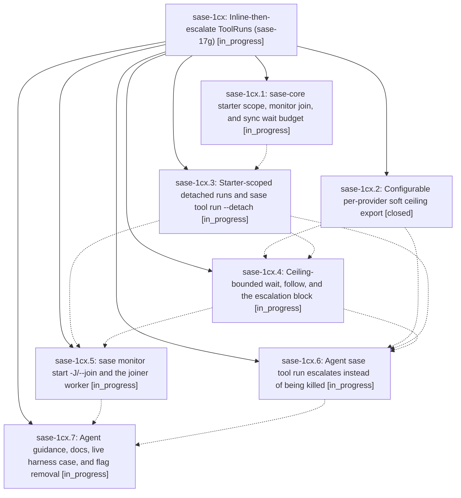

# Bead: sase-1cx — Inline-then-escalate ToolRuns (sase-17g)

[Bead Pages](../README.md) / sase-1cx

**Status:** ◐ in_progress · **Type:** ▸ plan · **Tier:** epic
**Owner:** `bryanbugyi34@gmail.com` · **Created by:** [bbugyi200.athena.0u3](https://github.com/sase-org/sase--agents/blob/main/sessions/bbugyi200.athena.0u3.md) · **Assignee:** `sase-1cx.land`
**Created:** 2026-09-29 20:32:12 EDT
**Plan:** [202609/tool\_run\_escalation.md](https://github.com/sase-org/sase--plans/blob/main/202609/tool_run_escalation.md)

## Description

An agent's `sase tool run` never loses a run to its provider's synchronous ceiling: every run starts inline from the agent's point of view, and a run still going near the ceiling moves into a monitor under the same ToolRun id without being cancelled or rerun, via `sase tool run --detach`, ceiling-bounded `sase tool wait`, and `sase monitor start -J/--join`.

## Phases

| Bead | Title | Status | Size | Created | Agents | Commits |
|---|---|---|---|---|---:|---:|
| [sase-1cx.1](sase-1cx.1.md) | sase-core starter scope, monitor join, and sync wait budget | ◐ in_progress | large | 2026-09-29 | 1 | 0 |
| [sase-1cx.2](sase-1cx.2.md) | Configurable per-provider soft ceiling export | ✓ closed | medium | 2026-09-29 | 1 | 1 |
| [sase-1cx.3](sase-1cx.3.md) | Starter-scoped detached runs and sase tool run --detach | ◐ in_progress | large | 2026-09-29 | 1 | 0 |
| [sase-1cx.4](sase-1cx.4.md) | Ceiling-bounded wait, follow, and the escalation block | ◐ in_progress | medium | 2026-09-29 | 1 | 0 |
| [sase-1cx.5](sase-1cx.5.md) | sase monitor start -J/--join and the joiner worker | ◐ in_progress | large | 2026-09-29 | 1 | 0 |
| [sase-1cx.6](sase-1cx.6.md) | Agent sase tool run escalates instead of being killed | ◐ in_progress | large | 2026-09-29 | 1 | 0 |
| [sase-1cx.7](sase-1cx.7.md) | Agent guidance, docs, live harness case, and flag removal | ◐ in_progress | medium | 2026-09-29 | 1 | 0 |

## Lineage

## Agents

| Agent | Bead | Commits |
|---|---|---:|
| [bbugyi200.athena.sase-1cx.1](https://github.com/sase-org/sase--agents/blob/main/sessions/bbugyi200.athena.sase-1cx.1.md) | [sase-1cx.1](sase-1cx.1.md) | 0 |
| [bbugyi200.athena.sase-1cx.2](https://github.com/sase-org/sase--agents/blob/main/agents/bbugyi200.athena.sase-1cx.2/README.md) | [sase-1cx.2](sase-1cx.2.md) | 1 |
| [bbugyi200.athena.sase-1cx.3](https://github.com/sase-org/sase--agents/blob/main/agents/bbugyi200.athena.sase-1cx.3/README.md) | [sase-1cx.3](sase-1cx.3.md) | 0 |
| [bbugyi200.athena.sase-1cx.4](https://github.com/sase-org/sase--agents/blob/main/agents/bbugyi200.athena.sase-1cx.4/README.md) | [sase-1cx.4](sase-1cx.4.md) | 0 |
| [bbugyi200.athena.sase-1cx.5](https://github.com/sase-org/sase--agents/blob/main/agents/bbugyi200.athena.sase-1cx.5/README.md) | [sase-1cx.5](sase-1cx.5.md) | 0 |
| [bbugyi200.athena.sase-1cx.6](https://github.com/sase-org/sase--agents/blob/main/agents/bbugyi200.athena.sase-1cx.6/README.md) | [sase-1cx.6](sase-1cx.6.md) | 0 |
| [bbugyi200.athena.sase-1cx.7](https://github.com/sase-org/sase--agents/blob/main/agents/bbugyi200.athena.sase-1cx.7/README.md) | [sase-1cx.7](sase-1cx.7.md) | 0 |
| [bbugyi200.athena.sase-1cx.land](https://github.com/sase-org/sase--agents/blob/main/agents/bbugyi200.athena.sase-1cx.land/README.md) | [sase-1cx](README.md) | 0 |

## Commits

| Repo | Commit | Subject | Bead | Committed |
|---|---|---|---|---|
| sase | [`8804865`](https://github.com/sase-org/sase/commit/8804865f84a795d798067fb1eb97c93f5b6cdd18) | feat(tool-runs): add soft-ceiling config with provider sync env export | [sase-1cx.2](sase-1cx.2.md) | 2026-09-29 20:48:25 EDT |
