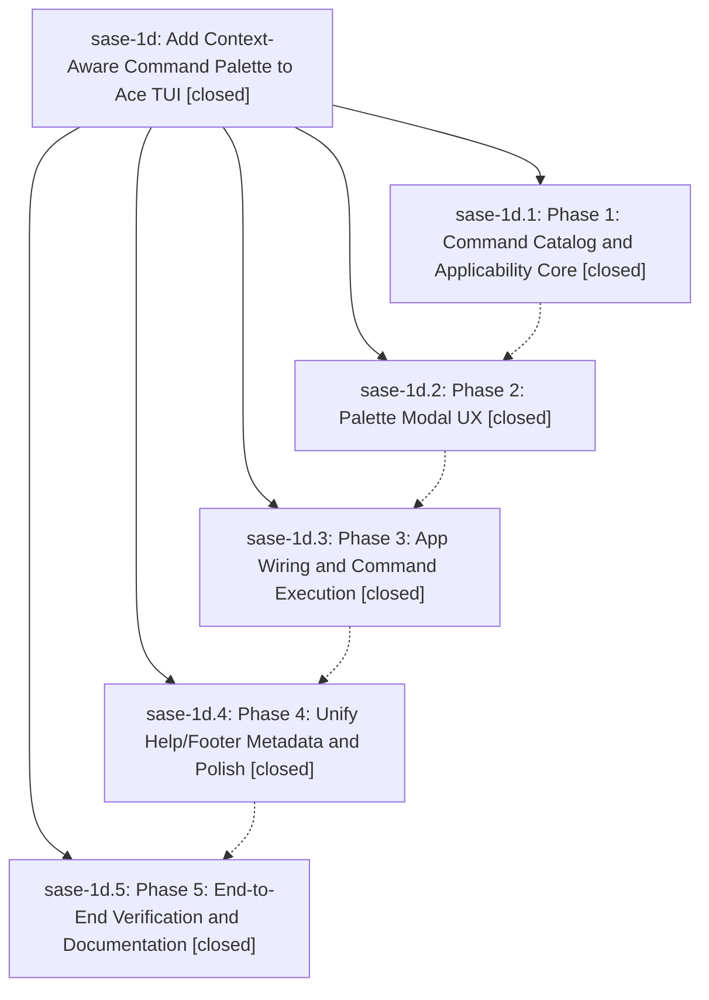

# Bead: sase-1d — Add Context-Aware Command Palette to Ace TUI

[Bead Pages](../README.md) / sase-1d

**Status:** ✓ closed · **Resolution:** (unrecorded) · **Type:** plan · **Tier:** epic
**Owner:** `bryanbugyi34@gmail.com`
**Created:** 2026-04-29 21:42:11 UTC · **Closed:** 2026-04-29 23:07:14 UTC
**Plan:** [202604/tui\_command\_palette.md](https://github.com/sase-org/sase--plans/blob/main/202604/tui_command_palette.md)

## Phases

| Bead | Title | Status | Size | Agents | Commits |
|---|---|---|---|---:|---:|
| [sase-1d.1](sase-1d.1.md) | Phase 1: Command Catalog and Applicability Core | ✓ closed | small | 0 | 1 |
| [sase-1d.2](sase-1d.2.md) | Phase 2: Palette Modal UX | ✓ closed | small | 0 | 1 |
| [sase-1d.3](sase-1d.3.md) | Phase 3: App Wiring and Command Execution | ✓ closed | small | 0 | 1 |
| [sase-1d.4](sase-1d.4.md) | Phase 4: Unify Help/Footer Metadata and Polish | ✓ closed | small | 0 | 1 |
| [sase-1d.5](sase-1d.5.md) | Phase 5: End-to-End Verification and Documentation | ✓ closed | small | 0 | 1 |

## Lineage

## Commits

| Commit | Subject | Bead | Committed (UTC) |
|---|---|---|---|
| [`fcdfa8c`](https://github.com/sase-org/sase/commit/fcdfa8c9e03b787f67725f7d33b64e0050c9d383) | feat: add command catalog and applicability core for ace TUI command palette (sase-1d.1) | [sase-1d.1](sase-1d.1.md) | 2026-04-29 21:58:37 |
| [`10db82d`](https://github.com/sase-org/sase/commit/10db82d165fb3087ff24514021db40491de9f122) | feat(ace): add context-aware command palette modal (sase-1d.2) | [sase-1d.2](sase-1d.2.md) | 2026-04-29 22:19:59 |
| [`d8653cb`](https://github.com/sase-org/sase/commit/d8653cb91b0e0707365fb8b9c50ffd5486617afa) | feat: Phase 3 — wire ACE command palette with context-aware execution (sase-1d.3) | [sase-1d.3](sase-1d.3.md) | 2026-04-29 22:42:16 |
| [`6cb0edf`](https://github.com/sase-org/sase/commit/6cb0edfa28d4e937b871615a94b786635a989916) | feat(ace): unify command catalog metadata and add guards (sase-1d.4) | [sase-1d.4](sase-1d.4.md) | 2026-04-29 22:50:27 |
| [`90c0a4d`](https://github.com/sase-org/sase/commit/90c0a4d242d853d62099edd78ecb46ddba6c7a46) | chore(ace): document command palette and add E2E coverage (sase-1d.5) | [sase-1d.5](sase-1d.5.md) | 2026-04-29 23:03:01 |
