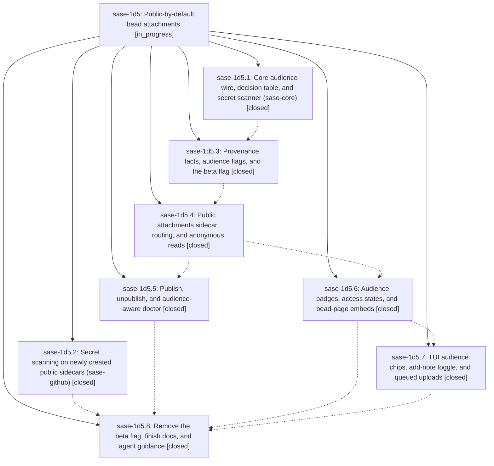

# Bead: sase-1d5 — Public-by-default bead attachments

[Bead Pages](../README.md) / sase-1d5

**Status:** ◐ in_progress · **Type:** ▸ plan · **Tier:** epic
**Owner:** `bryanbugyi34@gmail.com` · **Created by:** [bbugyi200.athena.0tz](https://github.com/sase-org/sase--agents/blob/main/sessions/bbugyi200.athena.0tz.md) · **Assignee:** `sase-1d5.land`
**Created:** 2026-09-30 01:57:07 EDT
**Plan:** [202609/public\_bead\_attachments.md](https://github.com/sase-org/sase--plans/blob/main/202609/public_bead_attachments.md)

<!-- sase:links:start -->

## Links

| Relation | Artifact | Why |
| --- | --- | --- |
| implemented-by | [plan:202609/public_bead_attachments.md][1] | derived from the plan's `bead_id:` frontmatter field |
| related | [bead:sase-1de][2] | Active public-by-default attachments epic rewriting the same attachment code; coordinate edits to lifecycle.py and schema wording |

_Plus 3 automatic references — see [Referenced By](#referenced-by)._

[1]: https://github.com/sase-org/sase--plans/blob/main/202609/public_bead_attachments.md
[2]: https://github.com/sase-org/sase--beads/blob/main/pages/sase-1de/README.md

<!-- sase:links:end -->

## Description

A bead note attachment is as visible as its bead unless SASE or its author marks it private. On a public project, non-sensitive attachments publish to a dedicated public `<project>--attachments` sidecar that anyone who can read the beads can fetch without credentials. SASE classifies every file mechanically and resolves uncertainty to private. Agents can only narrow an attachment's audience; only humans widen it. Large files never go public, and `sase--beads` never holds bytes.

## Notes

[2026-09-30T19:05:19Z · sase-1cj.12.land] DISCOVERED ISSUE (sase-1cj.12.land, 2026-09-30, clean master 69c4057735): just _lint-symvision fails with 'Private functions/classes should not be imported': _scanner_rules_version (src/sase/bead/attachments/audience.py, reached cross-file as _audience._scanner_rules_version() from src/sase/bead/attachment_doctor.py:59) and _store_growth_lines (src/sase/bead/attachment_doctor.py, imported by src/sase/doctor/checks_attachment_store.py:307). Both symbols arrive via this epic's phases (c330cd870a sase-1d5.3; e1f10caaf0 sase-1d5.5). Every just check since then reports the symvision stage red; first proposed by sase-1cj.12.5 note #1 (also seen by sase-1df.7 and sase-1d8.2). Fix: make each helper public with its real non-test consumer or route the cross-file call through a public wrapper.

## Phases

| Bead | Title | Status | Size | Created | Agents | Commits |
|---|---|---|---|---|---:|---:|
| [sase-1d5.1](sase-1d5.1.md) | Core audience wire, decision table, and secret scanner (sase-core) | ✓ closed | large | 2026-09-30 | 1 | 1 |
| [sase-1d5.2](sase-1d5.2.md) | Secret scanning on newly created public sidecars (sase-github) | ✓ closed | small | 2026-09-30 | 1 | 0 |
| [sase-1d5.3](sase-1d5.3.md) | Provenance facts, audience flags, and the beta flag | ✓ closed | large | 2026-09-30 | 1 | 1 |
| [sase-1d5.4](sase-1d5.4.md) | Public attachments sidecar, routing, and anonymous reads | ✓ closed | large | 2026-09-30 | 1 | 1 |
| [sase-1d5.5](sase-1d5.5.md) | Publish, unpublish, and audience-aware doctor | ✓ closed | medium | 2026-09-30 | 1 | 1 |
| [sase-1d5.6](sase-1d5.6.md) | Audience badges, access states, and bead-page embeds | ✓ closed | medium | 2026-09-30 | 1 | 1 |
| [sase-1d5.7](sase-1d5.7.md) | TUI audience chips, add-note toggle, and queued uploads | ✓ closed | medium | 2026-09-30 | 1 | 1 |
| [sase-1d5.8](sase-1d5.8.md) | Remove the beta flag, finish docs, and agent guidance | ✓ closed | medium | 2026-09-30 | 1 | 1 |

## Lineage

## Dependencies

- **Blocks:** [sase-1da](../sase-1da/README.md) ◇ · ⧖ 2026-09-30
- **Blocks:** [sase-1db](../sase-1db/README.md) ◇ · ⧖ 2026-09-30

## Agents

| Agent | Bead | Commits |
|---|---|---:|
| [bbugyi200.athena.sase-1d5.1](https://github.com/sase-org/sase--agents/blob/main/sessions/bbugyi200.athena.sase-1d5.1.md) | [sase-1d5.1](sase-1d5.1.md) | 1 |
| [bbugyi200.athena.sase-1d5.2](https://github.com/sase-org/sase--agents/blob/main/agents/bbugyi200.athena.sase-1d5.2/README.md) | [sase-1d5.2](sase-1d5.2.md) | 0 |
| [bbugyi200.athena.sase-1d5.3](https://github.com/sase-org/sase--agents/blob/main/sessions/bbugyi200.athena.sase-1d5.3.md) | [sase-1d5.3](sase-1d5.3.md) | 1 |
| [bbugyi200.athena.sase-1d5.4](https://github.com/sase-org/sase--agents/blob/main/sessions/bbugyi200.athena.sase-1d5.4.md) | [sase-1d5.4](sase-1d5.4.md) | 1 |
| [bbugyi200.athena.sase-1d5.5](https://github.com/sase-org/sase--agents/blob/main/sessions/bbugyi200.athena.sase-1d5.5.md) | [sase-1d5.5](sase-1d5.5.md) | 1 |
| [bbugyi200.athena.sase-1d5.6](https://github.com/sase-org/sase--agents/blob/main/agents/bbugyi200.athena.sase-1d5.6/README.md) | [sase-1d5.6](sase-1d5.6.md) | 1 |
| [bbugyi200.athena.sase-1d5.7](https://github.com/sase-org/sase--agents/blob/main/sessions/bbugyi200.athena.sase-1d5.7.md) | [sase-1d5.7](sase-1d5.7.md) | 1 |
| [bbugyi200.athena.sase-1d5.8](https://github.com/sase-org/sase--agents/blob/main/sessions/bbugyi200.athena.sase-1d5.8.md) | [sase-1d5.8](sase-1d5.8.md) | 1 |
| [bbugyi200.athena.sase-1d5.land](https://github.com/sase-org/sase--agents/blob/main/agents/bbugyi200.athena.sase-1d5.land/README.md) | [sase-1d5](README.md) | 0 |

## Commits

| Repo | Commit | Subject | Bead | Committed |
|---|---|---|---|---|
| sase-core | [`sase-core@7806f58`](https://github.com/sase-org/sase-core/commit/7806f587b0971816fe2623db835dde4582925063) | feat(attachments): core attachment audience policy and scanner | [sase-1d5.1](sase-1d5.1.md) | 2026-09-30 08:51:54 EDT |
| sase | [`c330cd8`](https://github.com/sase-org/sase/commit/c330cd870ad582c10f3ec4a108c09874aa98377e) | feat(bead-attachments): audience decisions for attachment authoring (sase-1d5.3) | [sase-1d5.3](sase-1d5.3.md) | 2026-09-30 11:34:28 EDT |
| sase | [`80f64cc`](https://github.com/sase-org/sase/commit/80f64cc20b598f10f8c8df01dc8a224eead45210) | feat(bead-attachments): public attachments sidecar, routing, and anonymous reads (sase-1d5.4) | [sase-1d5.4](sase-1d5.4.md) | 2026-09-30 12:44:24 EDT |
| sase | [`451b161`](https://github.com/sase-org/sase/commit/451b1619ea62fb6cb889223a9ad71e65e0457928) | feat(bead-attachments): audience badges, access states, and bead-page embeds (sase-1d5.6) | [sase-1d5.6](sase-1d5.6.md) | 2026-09-30 13:30:25 EDT |
| sase | [`e1f10ca`](https://github.com/sase-org/sase/commit/e1f10caaf0bc5d58801a9056816f5772677c96bf) | feat(bead-attachments): add publish/unpublish lifecycle and audience-aware doctor | [sase-1d5.5](sase-1d5.5.md) | 2026-09-30 13:31:21 EDT |
| sase | [`909f61f`](https://github.com/sase-org/sase/commit/909f61ffecff7a600b60e8746cc28553e41d6e49) | feat(tui): audience chips, add-note toggle, and queued uploads (sase-1d5.7) | [sase-1d5.7](sase-1d5.7.md) | 2026-09-30 14:36:18 EDT |
| sase | [`7885562`](https://github.com/sase-org/sase/commit/7885562f5474bd75b4cef0c6a014a09d1f7a44a2) | feat(beads): graduate public bead attachments to GA, remove beta flag (sase-1d5.8) | [sase-1d5.8](sase-1d5.8.md) | 2026-09-30 15:39:42 EDT |

<!-- sase:referenced-by:start -->

## Referenced By

| Relation | Artifact | Why | Uses |
| --- | --- | --- | ---: |
| read-by | [agent:research.2y.gem][1] | Inspect launch origin of sase-1d5 shown in screenshot | 1 |
| read-by | [agent:sase-1ck.land][2] | Check whether the public-attachments epic owns sidecar-disabled discovery and existing-remote visibility follow-ups from sase-1ck landing | 1 |
| read-by | [agent:sase-1d5.7--1][3] | Check epic scope for audit ownership | 1 |

[1]: https://github.com/sase-org/sase--agents/blob/main/agents/bbugyi200.athena.research.2y.gem/README.md
[2]: https://github.com/sase-org/sase--agents/blob/main/agents/bbugyi200.athena.sase-1ck.land/README.md
[3]: https://github.com/sase-org/sase--agents/blob/main/sessions/bbugyi200.athena.sase-1d5.7.md

<!-- sase:referenced-by:end -->
