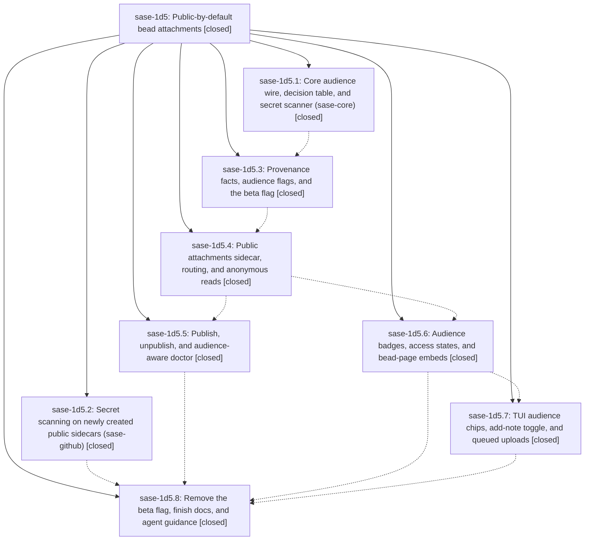

# Bead: sase-1d5 — Public-by-default bead attachments

[Bead Pages](../README.md) / sase-1d5

**Status:** ✓ closed · **Resolution:** done · **Type:** ▸ plan · **Tier:** epic
**Owner:** `bryanbugyi34@gmail.com` · **Created by:** [bbugyi200.athena.0tz](https://github.com/sase-org/sase--agents/blob/main/sessions/bbugyi200.athena.0tz.md) · **Assignee:** `sase-1d5.land`
**Created:** 2026-09-30 01:57:07 EDT · **Closed:** 2026-09-30 16:51:21 EDT
**Plan:** [202609/public\_bead\_attachments.md](https://github.com/sase-org/sase--plans/blob/main/202609/public_bead_attachments.md)

<!-- sase:links:start -->

## Links

| Relation | Artifact | Why |
| --- | --- | --- |
| implemented-by | [plan:202609/public_bead_attachments.md][1] | derived from the plan's `bead_id:` frontmatter field |
| related | [bead:sase-1de][2] | Active public-by-default attachments epic rewriting the same attachment code; coordinate edits to lifecycle.py and schema wording |
| related | [bead:sase-1do][3] | Epic whose settled design decision 10 deferred this redaction; ga phase sase-1d5.8 proposed it |
| related | [bead:sase-1dp][4] | Epic that built the core scanner, GH013 handling, and sdd_secret_scanning for the attachments sidecar only; ga phase sase-1d5.8 proposed this |

_Plus 7 automatic references — see [Referenced By](#referenced-by)._

[1]: https://github.com/sase-org/sase--plans/blob/main/202609/public_bead_attachments.md
[2]: https://github.com/sase-org/sase--beads/blob/main/pages/sase-1de/README.md
[3]: https://github.com/sase-org/sase--beads/blob/main/pages/sase-1do/README.md
[4]: https://github.com/sase-org/sase--beads/blob/main/pages/sase-1dp/README.md

<!-- sase:links:end -->

## Description

A bead note attachment is as visible as its bead unless SASE or its author marks it private. On a public project, non-sensitive attachments publish to a dedicated public `<project>--attachments` sidecar that anyone who can read the beads can fetch without credentials. SASE classifies every file mechanically and resolves uncertainty to private. Agents can only narrow an attachment's audience; only humans widen it. Large files never go public, and `sase--beads` never holds bytes.

## Notes

[2026-09-30T19:05:19Z · sase-1cj.12.land] DISCOVERED ISSUE (sase-1cj.12.land, 2026-09-30, clean master 69c4057735): just _lint-symvision fails with 'Private functions/classes should not be imported': _scanner_rules_version (src/sase/bead/attachments/audience.py, reached cross-file as _audience._scanner_rules_version() from src/sase/bead/attachment_doctor.py:59) and _store_growth_lines (src/sase/bead/attachment_doctor.py, imported by src/sase/doctor/checks_attachment_store.py:307). Both symbols arrive via this epic's phases (c330cd870a sase-1d5.3; e1f10caaf0 sase-1d5.5). Every just check since then reports the symvision stage red; first proposed by sase-1cj.12.5 note #1 (also seen by sase-1df.7 and sase-1d8.2). Fix: make each helper public with its real non-test consumer or route the cross-file call through a public wrapper.

[2026-09-30T19:37:54Z · sase-1cj.12.land] DISCOVERED ISSUE (sase-1cj.12.land, 2026-09-30, master 69c4057735): lint (feature flags) fails rule 7 — closed flag bead 'sase-1dg' still has a surviving 'public_bead_attachments' definition (src/sase/bead/attachments/audience.py:25 reads FeatureFlag.public_bead_attachments). In-progress phase sase-1d5.8 owns the removal; recorded so its landing confirms tools/check_feature_flags exits 0.

[2026-09-30T19:47:03Z · sase-1cx.land] Corroboration from sase-1cx.land (2026-09-30, master 6f25752814): 'sase tool run -k check' run fa11917812e9358a83872c8206796908 still fails only lint (feature flags) rule 7 (closed flag bead sase-1dg keeps FeatureFlag.public_bead_attachments in src/sase/feature_flags/registry.py) and lint (symvision) private imports _scanner_rules_version (bead/attachments/audience.py) and _store_growth_lines (bead/attachment_doctor.py); every other gate and the scoped tests pass. Both were proposed as follow-ups by sase-1cx.7 (notes #3, #4); routed here because this epic owns both (already recorded as notes #1/#2 by sase-1cj.12.land), not to a new task.

[2026-09-30T20:51:21Z · sase-1d5.land] LANDED (sase-1d5.land, 2026-09-30, base master 7885562f54).

VERIFY: Read all 8 phases and every phase and epic note, plus the epic commits: sase-core 7806f58 (an ancestor of the sase pin c3042fd), sase-github 7288df7, and sase c330cd870a, 80f64cc20b, e1f10caaf0, 451b1619ea, 909f61ffec, 7885562f54. Spot-checked source against the plan:
- the six core bindings are wired (decision, scanner, rules version, canonical extension, public relpath, digest-from-relpath);
- sdd_secret_scanning is passed only for the attachments role, and sase-github PATCHes only newly created public repos;
- -K/-W/-y are on all five note-bearing verbs, the fast path falls through, and public_max_bytes is in config, schema, and getters;
- the ATTACHMENTS_SIDECAR_ROLE role is reserved and hidden;
- fetch splits a miss from a digest mismatch, and _ensure_discovered copies stores;
- GH013 blocks and narrows;
- publish/unpublish work, and the gate-option allowance (SASE_GATE_COMMAND is exported by notification_gates/command_runner);
- the rescan, growth, push-access, and private-readable doctor findings are present;
- badges, no_access/origin_only/blocked states, and page embeds are present;
- the TUI chips, the ctrl+t beads_toggle_note_audience key, and queued uploads are present;
- the flag is fully removed (zero public_bead_attachments refs; tools/check_feature_flags exits 0), and agent guidance is in onboard, the attach/note help, and the sase_new_task skill source;
- the ga phase recorded its 4 follow-ups.

FIXED IN LANDING (epic-caused):
(1) Symvision private imports (epic note #1): made scanner_rules_version and store_growth_lines public; each has a real cross-file caller.
(2) Fixing that unmasked 5 unused-public epic helpers used only in their own files. Privatized them: _audience_badge, _find_stale_scanner_hits, _is_gate_option_command, _plan_note_attachment_upload, _queue_note_attachment_upload.
(3) The ga help-epilog changes re-drifted the CLI completion snapshot (description digests of +1/attach/close/note/update); regenerated it with just sync-completion-spec.
(4) GA made the audience decision unconditional, which broke 5 tests. All pass at 7885562f54~1 and fail at 7885562f54: test_repo_init_plan::test_configured_sidecar_specs_suppress_disabled_agents (now expects the injected attachments role), and test_doctor_ok_warn_and_skip, test_concurrent_attaches_converge, test_corrupt_remote_blob_reports_corrupt, and test_oversize_fails_without_local_only (a clean workspace file now resolves public; these private-store tests now pass -K).
Epic-symbol entries: none.

INTEGRATE: Reviewed the commits since the epic started (a85d56869d authoring split, 2034795652 upload split, 28ae626363/81c2e9c76f/28efa6f84c sase-1ck fixes and docs, f3899b4171 tool flag removal, and others). Nothing duplicates or conflicts. Blocked beads: sase-1da is already fixed by 80f64cc20b; added a private-role disabled test and closed it. sase-1db is only partly covered (doctor private-readable finding); noted what remains. It is unblocked now.

EVIDENCE: sase tool run -k check b349b7e5da1bc499139356e3f8ea7bed: every stage passes, including scoped tests (401 files), except lint (symvision). Its 20 items are all non-epic unused publics that this epic's private-import error had masked: 14 Jinja items (sase-1df), 3 unread items (sase-1d7), and 3 tool items (closed sase-1cx, now filed as sase-1dn). An earlier full-suite escalation (run 10ad13d1995cb9191a95794c3ae6a615) also showed 11 other failures and 1 collection error. All reproduce identically on the clean base via git stash and are unrelated to the epic: sase-1de items 1-2, sase-1dh header-panel import, sase-13p import budget (already 3490 > 3485 before the epic), the sase-1cx kind-coverage join slot, and the launch/rail/plugin_latest nodes.

FOLLOW-UPS:
- sase-1d5.8 #1 redaction: created sase-1do.
- sase-1d5.8 #2 scanner reuse plus push protection: created sase-1dp.
- sase-1d5.8 #3 beads memory pointer: +1 on sase-1cy (same sase_beads.md attachments update).
- sase-1d5.8 #4 fleet streaming blob endpoint: declined. It is conditional on origin-only usage that has no evidence yet; revisit when it does.
- sase-1d5.8 #5 tool_run_escalation rule 7: declined, already fixed by f3899b4171.
- sase-1d5.7 #2 audit site: +1 on sase-1de.
- validate_sase_core_rs prompt-prediction probe (sase-1d5.3 #2, sase-1d5.4 #2, sase-1d5.5 #1, sase-1d5.6 #1): declined, already fixed by the c3042fd pin plus 782bffaf72/8f189c405f; _setup passes.
- sase-1d5.2 #1 sase-github standalone dependency resolution: declined. It was a one-off sandbox index observation; sase-github pins only sase>=0.17.0, and sase's check installs it editable from the linked checkout without error.
- Epic note #2 (flag rule 7): resolved by 7885562f54.
- DISCOVERED ISSUE notes recorded on sase-1df and sase-1d7 for their unmasked symbols.

## Phases

| Bead | Title | Status | Size | Created | Agents | Commits |
|---|---|---|---|---|---:|---:|
| [sase-1d5.1](sase-1d5.1.md) | Core audience wire, decision table, and secret scanner (sase-core) | ✓ closed | large | 2026-09-30 | 1 | 1 |
| [sase-1d5.2](sase-1d5.2.md) | Secret scanning on newly created public sidecars (sase-github) | ✓ closed | small | 2026-09-30 | 1 | 1 |
| [sase-1d5.3](sase-1d5.3.md) | Provenance facts, audience flags, and the beta flag | ✓ closed | large | 2026-09-30 | 1 | 1 |
| [sase-1d5.4](sase-1d5.4.md) | Public attachments sidecar, routing, and anonymous reads | ✓ closed | large | 2026-09-30 | 1 | 1 |
| [sase-1d5.5](sase-1d5.5.md) | Publish, unpublish, and audience-aware doctor | ✓ closed | medium | 2026-09-30 | 1 | 1 |
| [sase-1d5.6](sase-1d5.6.md) | Audience badges, access states, and bead-page embeds | ✓ closed | medium | 2026-09-30 | 1 | 1 |
| [sase-1d5.7](sase-1d5.7.md) | TUI audience chips, add-note toggle, and queued uploads | ✓ closed | medium | 2026-09-30 | 1 | 1 |
| [sase-1d5.8](sase-1d5.8.md) | Remove the beta flag, finish docs, and agent guidance | ✓ closed | medium | 2026-09-30 | 1 | 1 |

## Lineage

## Dependencies

- **Blocks:** [sase-1da](../sase-1da/README.md) ✓ · ⧖ 2026-09-30
- **Blocks:** [sase-1db](../sase-1db/README.md) ◇ · ⧖ 2026-09-30

## Agents

| Agent | Bead | Commits |
|---|---|---:|
| [bbugyi200.athena.sase-1d5.1](https://github.com/sase-org/sase--agents/blob/main/sessions/bbugyi200.athena.sase-1d5.1.md) | [sase-1d5.1](sase-1d5.1.md) | 1 |
| [bbugyi200.athena.sase-1d5.2](https://github.com/sase-org/sase--agents/blob/main/agents/bbugyi200.athena.sase-1d5.2/README.md) | [sase-1d5.2](sase-1d5.2.md) | 1 |
| [bbugyi200.athena.sase-1d5.3](https://github.com/sase-org/sase--agents/blob/main/sessions/bbugyi200.athena.sase-1d5.3.md) | [sase-1d5.3](sase-1d5.3.md) | 1 |
| [bbugyi200.athena.sase-1d5.4](https://github.com/sase-org/sase--agents/blob/main/sessions/bbugyi200.athena.sase-1d5.4.md) | [sase-1d5.4](sase-1d5.4.md) | 1 |
| [bbugyi200.athena.sase-1d5.5](https://github.com/sase-org/sase--agents/blob/main/sessions/bbugyi200.athena.sase-1d5.5.md) | [sase-1d5.5](sase-1d5.5.md) | 1 |
| [bbugyi200.athena.sase-1d5.6](https://github.com/sase-org/sase--agents/blob/main/agents/bbugyi200.athena.sase-1d5.6/README.md) | [sase-1d5.6](sase-1d5.6.md) | 1 |
| [bbugyi200.athena.sase-1d5.7](https://github.com/sase-org/sase--agents/blob/main/sessions/bbugyi200.athena.sase-1d5.7.md) | [sase-1d5.7](sase-1d5.7.md) | 1 |
| [bbugyi200.athena.sase-1d5.8](https://github.com/sase-org/sase--agents/blob/main/sessions/bbugyi200.athena.sase-1d5.8.md) | [sase-1d5.8](sase-1d5.8.md) | 1 |
| [bbugyi200.athena.sase-1d5.land](https://github.com/sase-org/sase--agents/blob/main/agents/bbugyi200.athena.sase-1d5.land/README.md) | [sase-1d5](README.md) | 2 |

## Commits

| Repo | Commit | Subject | Bead | Committed |
|---|---|---|---|---|
| sase-github | [`sase-github@7288df7`](https://github.com/sase-org/sase-github/commit/7288df7c0e401839ce2f96a684839c131b0d454a) | feat(sdd): enable secret scanning on newly created public sidecars | [sase-1d5.2](sase-1d5.2.md) | 2026-09-30 02:06:53 EDT |
| sase-core | [`sase-core@7806f58`](https://github.com/sase-org/sase-core/commit/7806f587b0971816fe2623db835dde4582925063) | feat(attachments): core attachment audience policy and scanner | [sase-1d5.1](sase-1d5.1.md) | 2026-09-30 08:51:54 EDT |
| sase | [`c330cd8`](https://github.com/sase-org/sase/commit/c330cd870ad582c10f3ec4a108c09874aa98377e) | feat(bead-attachments): audience decisions for attachment authoring (sase-1d5.3) | [sase-1d5.3](sase-1d5.3.md) | 2026-09-30 11:34:28 EDT |
| sase | [`80f64cc`](https://github.com/sase-org/sase/commit/80f64cc20b598f10f8c8df01dc8a224eead45210) | feat(bead-attachments): public attachments sidecar, routing, and anonymous reads (sase-1d5.4) | [sase-1d5.4](sase-1d5.4.md) | 2026-09-30 12:44:24 EDT |
| sase | [`451b161`](https://github.com/sase-org/sase/commit/451b1619ea62fb6cb889223a9ad71e65e0457928) | feat(bead-attachments): audience badges, access states, and bead-page embeds (sase-1d5.6) | [sase-1d5.6](sase-1d5.6.md) | 2026-09-30 13:30:25 EDT |
| sase | [`e1f10ca`](https://github.com/sase-org/sase/commit/e1f10caaf0bc5d58801a9056816f5772677c96bf) | feat(bead-attachments): add publish/unpublish lifecycle and audience-aware doctor | [sase-1d5.5](sase-1d5.5.md) | 2026-09-30 13:31:21 EDT |
| sase | [`909f61f`](https://github.com/sase-org/sase/commit/909f61ffecff7a600b60e8746cc28553e41d6e49) | feat(tui): audience chips, add-note toggle, and queued uploads (sase-1d5.7) | [sase-1d5.7](sase-1d5.7.md) | 2026-09-30 14:36:18 EDT |
| sase | [`7885562`](https://github.com/sase-org/sase/commit/7885562f5474bd75b4cef0c6a014a09d1f7a44a2) | feat(beads): graduate public bead attachments to GA, remove beta flag (sase-1d5.8) | [sase-1d5.8](sase-1d5.8.md) | 2026-09-30 15:39:42 EDT |
| sase | [`60b2d3d`](https://github.com/sase-org/sase/commit/60b2d3dfdb504c3f18ee9cd452b94a6b105e8d17) | fix(bead-attachments): land public-by-default attachments epic (sase-1d5) | [sase-1d5](README.md) | 2026-09-30 17:24:18 EDT |
| sase--plans | [`sase--plans@247cb28`](https://github.com/sase-org/sase--plans/commit/247cb285bcb1507f5bdddd2fcced1368b2783c37) | chore(plans): mark public\_bead\_attachments plan done (sase-1d5) | [sase-1d5](README.md) | 2026-09-30 17:28:58 EDT |

<!-- sase:referenced-by:start -->

## Referenced By

| Relation | Artifact | Why | Uses |
| --- | --- | --- | ---: |
| read-by | [agent:research.2y.gem][1] | Inspect launch origin of sase-1d5 shown in screenshot | 1 |
| read-by | [agent:sase-1cj.12.land][2] | Check whether the bead-attachments epic that introduced the private-import symvision hits is still active | 2 |
| read-by | [agent:sase-1ck.land][3] | Check whether the public-attachments epic owns sidecar-disabled discovery and existing-remote visibility follow-ups from sase-1ck landing | 1 |
| read-by | [agent:sase-1cx.land][4] | Landing sase-1cx: check whether sase-1d5 already records the public_bead_attachments flag leftover and attachment symvision private imports | 1 |
| read-by | [agent:sase-1d5.7--1][5] | Check epic scope for audit ownership | 1 |
| read-by | [agent:sase-1d5.land][6] | Need the parent link | 3 |
| read-by | [agent:sase-1df.land--1][7] | triage flag failure owner | 2 |

[1]: https://github.com/sase-org/sase--agents/blob/main/agents/bbugyi200.athena.research.2y.gem/README.md
[2]: https://github.com/sase-org/sase--agents/blob/main/agents/bbugyi200.athena.sase-1cj.12.land/README.md
[3]: https://github.com/sase-org/sase--agents/blob/main/agents/bbugyi200.athena.sase-1ck.land/README.md
[4]: https://github.com/sase-org/sase--agents/blob/main/agents/bbugyi200.athena.sase-1cx.land/README.md
[5]: https://github.com/sase-org/sase--agents/blob/main/sessions/bbugyi200.athena.sase-1d5.7.md
[6]: https://github.com/sase-org/sase--agents/blob/main/agents/bbugyi200.athena.sase-1d5.land/README.md
[7]: https://github.com/sase-org/sase--agents/blob/main/sessions/bbugyi200.athena.sase-1df.land.md

<!-- sase:referenced-by:end -->
