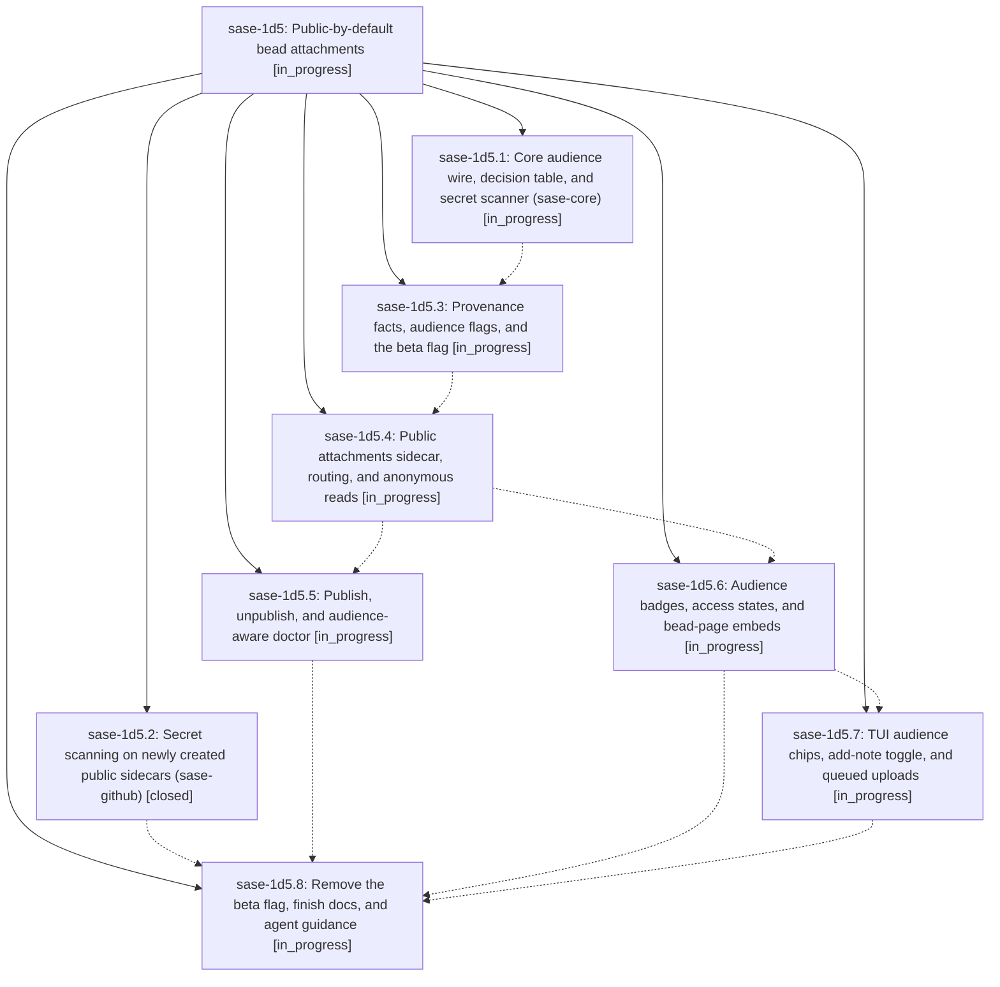

# Bead: sase-1d5 — Public-by-default bead attachments

[Bead Pages](../README.md) / sase-1d5

**Status:** ◐ in_progress · **Type:** ▸ plan · **Tier:** epic
**Owner:** `bryanbugyi34@gmail.com` · **Created by:** [bbugyi200.athena.0tz](https://github.com/sase-org/sase--agents/blob/main/sessions/bbugyi200.athena.0tz.md) · **Assignee:** `sase-1d5.land`
**Created:** 2026-09-30 01:57:07 EDT
**Plan:** [202609/public\_bead\_attachments.md](https://github.com/sase-org/sase--plans/blob/main/202609/public_bead_attachments.md)

## Description

A bead note attachment is as visible as its bead unless SASE or its author marks it private. On a public project, non-sensitive attachments publish to a dedicated public `<project>--attachments` sidecar that anyone who can read the beads can fetch without credentials. SASE classifies every file mechanically and resolves uncertainty to private. Agents can only narrow an attachment's audience; only humans widen it. Large files never go public, and `sase--beads` never holds bytes.

## Phases

| Bead | Title | Status | Size | Created | Agents | Commits |
|---|---|---|---|---|---:|---:|
| [sase-1d5.1](sase-1d5.1.md) | Core audience wire, decision table, and secret scanner (sase-core) | ◐ in_progress | large | 2026-09-30 | 1 | 0 |
| [sase-1d5.2](sase-1d5.2.md) | Secret scanning on newly created public sidecars (sase-github) | ✓ closed | small | 2026-09-30 | 1 | 1 |
| [sase-1d5.3](sase-1d5.3.md) | Provenance facts, audience flags, and the beta flag | ◐ in_progress | large | 2026-09-30 | 1 | 0 |
| [sase-1d5.4](sase-1d5.4.md) | Public attachments sidecar, routing, and anonymous reads | ◐ in_progress | large | 2026-09-30 | 1 | 0 |
| [sase-1d5.5](sase-1d5.5.md) | Publish, unpublish, and audience-aware doctor | ◐ in_progress | medium | 2026-09-30 | 1 | 0 |
| [sase-1d5.6](sase-1d5.6.md) | Audience badges, access states, and bead-page embeds | ◐ in_progress | medium | 2026-09-30 | 1 | 0 |
| [sase-1d5.7](sase-1d5.7.md) | TUI audience chips, add-note toggle, and queued uploads | ◐ in_progress | medium | 2026-09-30 | 1 | 0 |
| [sase-1d5.8](sase-1d5.8.md) | Remove the beta flag, finish docs, and agent guidance | ◐ in_progress | medium | 2026-09-30 | 1 | 0 |

## Lineage

## Agents

| Agent | Bead | Commits |
|---|---|---:|
| [bbugyi200.athena.sase-1d5.1](https://github.com/sase-org/sase--agents/blob/main/agents/bbugyi200.athena.sase-1d5.1/README.md) | [sase-1d5.1](sase-1d5.1.md) | 0 |
| [bbugyi200.athena.sase-1d5.2](https://github.com/sase-org/sase--agents/blob/main/agents/bbugyi200.athena.sase-1d5.2/README.md) | [sase-1d5.2](sase-1d5.2.md) | 1 |
| [bbugyi200.athena.sase-1d5.3](https://github.com/sase-org/sase--agents/blob/main/agents/bbugyi200.athena.sase-1d5.3/README.md) | [sase-1d5.3](sase-1d5.3.md) | 0 |
| [bbugyi200.athena.sase-1d5.4](https://github.com/sase-org/sase--agents/blob/main/agents/bbugyi200.athena.sase-1d5.4/README.md) | [sase-1d5.4](sase-1d5.4.md) | 0 |
| [bbugyi200.athena.sase-1d5.5](https://github.com/sase-org/sase--agents/blob/main/agents/bbugyi200.athena.sase-1d5.5/README.md) | [sase-1d5.5](sase-1d5.5.md) | 0 |
| [bbugyi200.athena.sase-1d5.6](https://github.com/sase-org/sase--agents/blob/main/agents/bbugyi200.athena.sase-1d5.6/README.md) | [sase-1d5.6](sase-1d5.6.md) | 0 |
| [bbugyi200.athena.sase-1d5.7](https://github.com/sase-org/sase--agents/blob/main/agents/bbugyi200.athena.sase-1d5.7/README.md) | [sase-1d5.7](sase-1d5.7.md) | 0 |
| [bbugyi200.athena.sase-1d5.8](https://github.com/sase-org/sase--agents/blob/main/agents/bbugyi200.athena.sase-1d5.8/README.md) | [sase-1d5.8](sase-1d5.8.md) | 0 |
| [bbugyi200.athena.sase-1d5.land](https://github.com/sase-org/sase--agents/blob/main/agents/bbugyi200.athena.sase-1d5.land/README.md) | [sase-1d5](README.md) | 0 |

## Commits

| Repo | Commit | Subject | Bead | Committed |
|---|---|---|---|---|
| sase-github | [`sase-github@7288df7`](https://github.com/sase-org/sase-github/commit/7288df7c0e401839ce2f96a684839c131b0d454a) | feat(sdd): enable secret scanning on newly created public sidecars | [sase-1d5.2](sase-1d5.2.md) | 2026-09-30 02:06:53 EDT |
