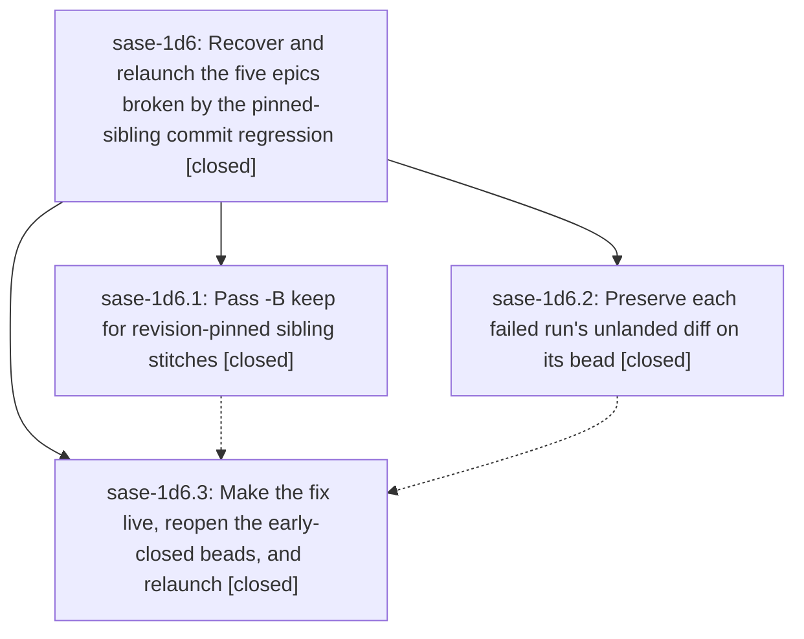

# Bead: sase-1d6 — Recover and relaunch the five epics broken by the pinned-sibling commit regression

[Bead Pages](../README.md) / sase-1d6

**Status:** ✓ closed · **Resolution:** done · **Type:** ▸ plan · **Tier:** epic
**Owner:** `bryanbugyi34@gmail.com` · **Created by:** [bbugyi200.athena.0ua](https://github.com/sase-org/sase--agents/blob/main/sessions/bbugyi200.athena.0ua.md) · **Assignee:** `sase-1d6.land`
**Created:** 2026-09-30 06:21:08 EDT · **Closed:** 2026-09-30 07:49:59 EDT
**Plan:** [202609/relaunch\_failed\_epics.md](https://github.com/sase-org/sase--plans/blob/main/202609/relaunch_failed_epics.md)

## Description

Epics sase-1d5, sase-1cx, sase-1cj.12, sase-1co, and sase-1ck are running again from a correct bead state. The host finalizer can commit sase-core changes for bead-assigned agents again. No verified-but-unlanded work from last night's failed runs is lost.

## Notes

[2026-09-30T11:49:59Z · sase-1d6.land] Verified the three phases against the beads, the source, and origin/master.

sase-1d6.1: 63bde575f0 is on origin/master and in the host install (sase 0.17.1+1854.g3e6646f8c, workspace 0 contains the commit). pinned_sibling_bead_action downgrades a revision-pinned sibling's declared action to keep, leaves None when the decision has no action, and leaves the primary close untouched. Dispatch fingerprints and stitches the downgraded value; unpushed resume and checkpoint recovery apply the same helper; conflict repair and post-repair follow-up receive that already-downgraded action. The revision-pin split is 44 passed (tests/test_commit_revision_pin*.py). Production proof: after relaunch, sase-core cfc6385b8a landed for sase-1cj.12.1 (SASE_BEAD=sase-1cj.12.1), which the missing-action and primary-only-close policies would have rejected.

sase-1d6.2: UNLANDED PRIOR ATTEMPT notes plus all seven patches are on sase-1d5.1, sase-1cx.1, sase-1cj.12.1, sase-1co, and sase-1ck. Attachment views under ~/.sase/attachments match the recorded sha256 prefixes, and the same patches remain at ~/.local/state/sase/salvage-sase-1d6.

sase-1d6.3: each of those five beads has a REOPENED note citing 63bde575f0. Replacement agents are live: sase-1ck.land RUNNING (ws 16), sase-1co.land RUNNING (ws 12), sase-1cj.12.1 RUNNING (ws 14) with its core commit already on origin/master, sase-1cx.1--plan and sase-1cx.1--code RUNNING, and sase-1d5.1 WAITING on bead sase-1ck. The old ace(run) claims from the failed runs are gone.

Integration: the only commits after 63bde575f0 are 81c2e9c76f (attachment span coordinates) and 3e6646f8cc (VCS artifact resolution). Neither touches the finalizer pin path or duplicates pinned_sibling_bead_action, so no code change was required. sase-core-revision.txt remains a354a8a because a sibling-only stitch skips the pin write (main-deferred-or-not-dirty); that skip is the existing pin rule and is asserted by test_dispatch_pinned_sibling_only_carries_keep_and_skips_pin.

Follow-up: sase-1d6.1's PROPOSED FOLLOW-UP is the pre-existing patch/stitch terminology audit (14 unclassified ChangeSpec tokens in sase-core at_bearing_notes.jsonl). Reproduced here on 3e6646f8cc / cfc6385b8a: the audit exits 1 and patch_stitch_audit.py still does not classify that fixture. Not caused by this epic. No new task: it is task sase-1cv (＋1 recorded; the premature done close did not contain the classifying commit, so the bead is ready again) and active epic sase-1ck, which already has the unlanded salvage patch and a DISCOVERED ISSUE note from this landing. sase-1d6.2 and sase-1d6.3 proposed no follow-ups.

epic-symbols sase-1d6: no entries. No parent bead.

## Phases

| Bead | Title | Status | Size | Created | Agents | Commits |
|---|---|---|---|---|---:|---:|
| [sase-1d6.1](sase-1d6.1.md) | Pass -B keep for revision-pinned sibling stitches | ✓ closed | small | 2026-09-30 | 1 | 1 |
| [sase-1d6.2](sase-1d6.2.md) | Preserve each failed run's unlanded diff on its bead | ✓ closed | medium | 2026-09-30 | 1 | 0 |
| [sase-1d6.3](sase-1d6.3.md) | Make the fix live, reopen the early-closed beads, and relaunch | ✓ closed | small | 2026-09-30 | 1 | 0 |

## Lineage

## Agents

| Agent | Bead | Commits |
|---|---|---:|
| [bbugyi200.athena.sase-1d6.1](https://github.com/sase-org/sase--agents/blob/main/sessions/bbugyi200.athena.sase-1d6.1.md) | [sase-1d6.1](sase-1d6.1.md) | 1 |
| [bbugyi200.athena.sase-1d6.2](https://github.com/sase-org/sase--agents/blob/main/agents/bbugyi200.athena.sase-1d6.2/README.md) | [sase-1d6.2](sase-1d6.2.md) | 0 |
| [bbugyi200.athena.sase-1d6.3](https://github.com/sase-org/sase--agents/blob/main/agents/bbugyi200.athena.sase-1d6.3/README.md) | [sase-1d6.3](sase-1d6.3.md) | 0 |
| [bbugyi200.athena.sase-1d6.land](https://github.com/sase-org/sase--agents/blob/main/agents/bbugyi200.athena.sase-1d6.land/README.md) | [sase-1d6](README.md) | 1 |

## Commits

| Repo | Commit | Subject | Bead | Committed |
|---|---|---|---|---|
| sase | [`63bde57`](https://github.com/sase-org/sase/commit/63bde575f07969a2a3e138516e52a91f0100a22c) | fix(finalizer): pass -B keep for revision-pinned sibling stitches | [sase-1d6.1](sase-1d6.1.md) | 2026-09-30 06:45:47 EDT |
| sase--plans | [`sase--plans@1560f9a`](https://github.com/sase-org/sase--plans/commit/1560f9a7b73d30e7e29f24ecb50647d5566d80cd) | docs(plans): mark relaunch\_failed\_epics done for sase-1d6 | [sase-1d6](README.md) | 2026-09-30 07:57:05 EDT |
