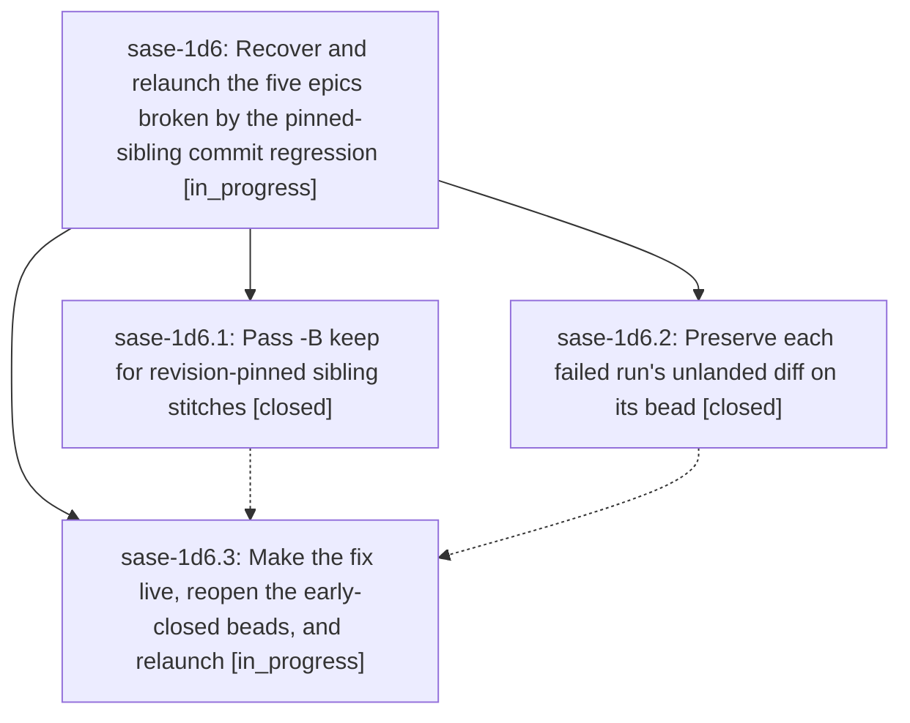

# Bead: sase-1d6 — Recover and relaunch the five epics broken by the pinned-sibling commit regression

[Bead Pages](../README.md) / sase-1d6

**Status:** ◐ in_progress · **Type:** ▸ plan · **Tier:** epic
**Owner:** `bryanbugyi34@gmail.com` · **Created by:** [bbugyi200.athena.0ua](https://github.com/sase-org/sase--agents/blob/main/sessions/bbugyi200.athena.0ua.md) · **Assignee:** `sase-1d6.land`
**Created:** 2026-09-30 06:21:08 EDT
**Plan:** [202609/relaunch\_failed\_epics.md](https://github.com/sase-org/sase--plans/blob/main/202609/relaunch_failed_epics.md)

## Description

Epics sase-1d5, sase-1cx, sase-1cj.12, sase-1co, and sase-1ck are running again from a correct bead state. The host finalizer can commit sase-core changes for bead-assigned agents again. No verified-but-unlanded work from last night's failed runs is lost.

## Phases

| Bead | Title | Status | Size | Created | Agents | Commits |
|---|---|---|---|---|---:|---:|
| [sase-1d6.1](sase-1d6.1.md) | Pass -B keep for revision-pinned sibling stitches | ✓ closed | small | 2026-09-30 | 1 | 1 |
| [sase-1d6.2](sase-1d6.2.md) | Preserve each failed run's unlanded diff on its bead | ✓ closed | medium | 2026-09-30 | 1 | 0 |
| [sase-1d6.3](sase-1d6.3.md) | Make the fix live, reopen the early-closed beads, and relaunch | ◐ in_progress | small | 2026-09-30 | 1 | 0 |

## Lineage

## Agents

| Agent | Bead | Commits |
|---|---|---:|
| [bbugyi200.athena.sase-1d6.1](https://github.com/sase-org/sase--agents/blob/main/sessions/bbugyi200.athena.sase-1d6.1.md) | [sase-1d6.1](sase-1d6.1.md) | 1 |
| [bbugyi200.athena.sase-1d6.2](https://github.com/sase-org/sase--agents/blob/main/agents/bbugyi200.athena.sase-1d6.2/README.md) | [sase-1d6.2](sase-1d6.2.md) | 0 |
| [bbugyi200.athena.sase-1d6.3](https://github.com/sase-org/sase--agents/blob/main/agents/bbugyi200.athena.sase-1d6.3/README.md) | [sase-1d6.3](sase-1d6.3.md) | 0 |
| [bbugyi200.athena.sase-1d6.land](https://github.com/sase-org/sase--agents/blob/main/agents/bbugyi200.athena.sase-1d6.land/README.md) | [sase-1d6](README.md) | 0 |

## Commits

| Repo | Commit | Subject | Bead | Committed |
|---|---|---|---|---|
| sase | [`63bde57`](https://github.com/sase-org/sase/commit/63bde575f07969a2a3e138516e52a91f0100a22c) | fix(finalizer): pass -B keep for revision-pinned sibling stitches | [sase-1d6.1](sase-1d6.1.md) | 2026-09-30 06:45:47 EDT |
