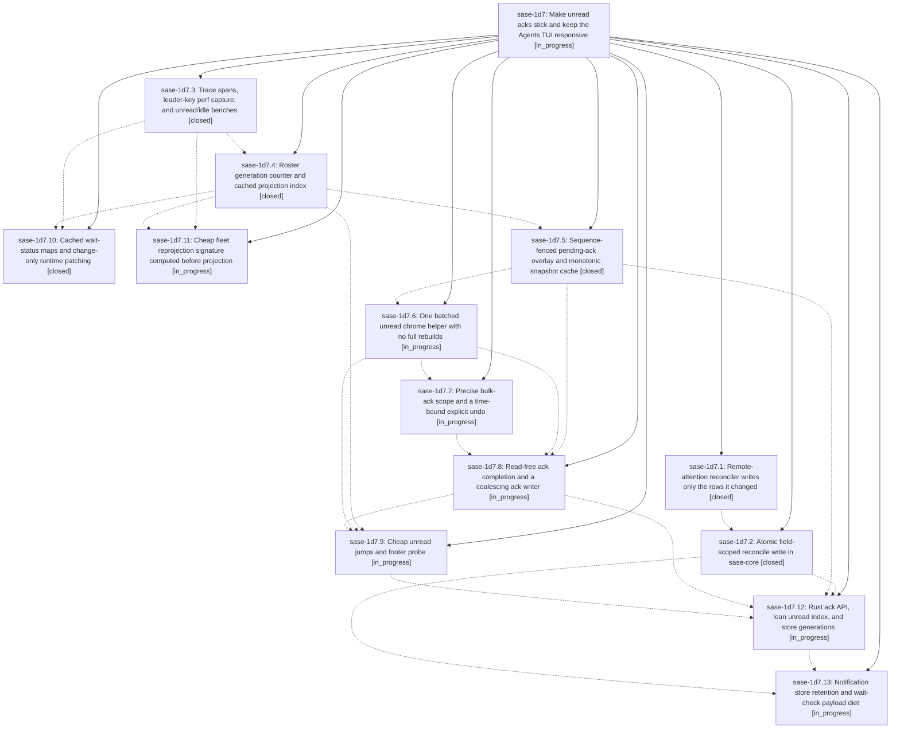

# Bead: sase-1d7 — Make unread acks stick and keep the Agents TUI responsive

[Bead Pages](../README.md) / sase-1d7

**Status:** ◐ in_progress · **Type:** ▸ plan · **Tier:** epic
**Owner:** `bryanbugyi34@gmail.com` · **Created by:** [bbugyi200.athena.0uc](https://github.com/sase-org/sase--agents/blob/main/sessions/bbugyi200.athena.0uc.md) · **Assignee:** `sase-1d7.land`
**Created:** 2026-09-30 07:18:05 EDT
**Plan:** [202609/unread\_ack\_reliability\_and\_tui\_responsiveness.md](https://github.com/sase-org/sase--plans/blob/main/202609/unread_ack_reliability_and_tui_responsiveness.md)

## Description

Unread acknowledgments (`,u`, `,j`/`,J`, row-select) are never reverted by another notification-store writer or by an older snapshot, and unread actions paint within budget: no UI-thread store reads, no full Agents rebuilds for unread-only changes, and no multi-second main-loop freezes from the 1 Hz runtime tick or fleet reprojection.

## Phases

| Bead | Title | Status | Size | Created | Agents | Commits |
|---|---|---|---|---|---:|---:|
| [sase-1d7.1](sase-1d7.1.md) | Remote-attention reconciler writes only the rows it changed | ✓ closed | small | 2026-09-30 | 1 | 1 |
| [sase-1d7.10](sase-1d7.10.md) | Cached wait-status maps and change-only runtime patching | ✓ closed | medium | 2026-09-30 | 1 | 1 |
| [sase-1d7.11](sase-1d7.11.md) | Cheap fleet reprojection signature computed before projection | ◐ in_progress | medium | 2026-09-30 | 1 | 0 |
| [sase-1d7.12](sase-1d7.12.md) | Rust ack API, lean unread index, and store generations | ◐ in_progress | large | 2026-09-30 | 1 | 0 |
| [sase-1d7.13](sase-1d7.13.md) | Notification store retention and wait-check payload diet | ◐ in_progress | large | 2026-09-30 | 1 | 0 |
| [sase-1d7.2](sase-1d7.2.md) | Atomic field-scoped reconcile write in sase-core | ✓ closed | medium | 2026-09-30 | 1 | 2 |
| [sase-1d7.3](sase-1d7.3.md) | Trace spans, leader-key perf capture, and unread/idle benches | ✓ closed | small | 2026-09-30 | 1 | 1 |
| [sase-1d7.4](sase-1d7.4.md) | Roster generation counter and cached projection index | ✓ closed | medium | 2026-09-30 | 1 | 1 |
| [sase-1d7.5](sase-1d7.5.md) | Sequence-fenced pending-ack overlay and monotonic snapshot cache | ✓ closed | medium | 2026-09-30 | 1 | 1 |
| [sase-1d7.6](sase-1d7.6.md) | One batched unread chrome helper with no full rebuilds | ◐ in_progress | medium | 2026-09-30 | 1 | 0 |
| [sase-1d7.7](sase-1d7.7.md) | Precise bulk-ack scope and a time-bound explicit undo | ◐ in_progress | small | 2026-09-30 | 1 | 0 |
| [sase-1d7.8](sase-1d7.8.md) | Read-free ack completion and a coalescing ack writer | ◐ in_progress | medium | 2026-09-30 | 1 | 0 |
| [sase-1d7.9](sase-1d7.9.md) | Cheap unread jumps and footer probe | ◐ in_progress | medium | 2026-09-30 | 1 | 0 |

## Lineage

## Agents

| Agent | Bead | Commits |
|---|---|---:|
| [bbugyi200.athena.sase-1d7.1](https://github.com/sase-org/sase--agents/blob/main/sessions/bbugyi200.athena.sase-1d7.1.md) | [sase-1d7.1](sase-1d7.1.md) | 1 |
| [bbugyi200.athena.sase-1d7.10](https://github.com/sase-org/sase--agents/blob/main/agents/bbugyi200.athena.sase-1d7.10/README.md) | [sase-1d7.10](sase-1d7.10.md) | 1 |
| [bbugyi200.athena.sase-1d7.11](https://github.com/sase-org/sase--agents/blob/main/sessions/bbugyi200.athena.sase-1d7.11.md) | [sase-1d7.11](sase-1d7.11.md) | 0 |
| [bbugyi200.athena.sase-1d7.12](https://github.com/sase-org/sase--agents/blob/main/agents/bbugyi200.athena.sase-1d7.12/README.md) | [sase-1d7.12](sase-1d7.12.md) | 0 |
| [bbugyi200.athena.sase-1d7.13](https://github.com/sase-org/sase--agents/blob/main/agents/bbugyi200.athena.sase-1d7.13/README.md) | [sase-1d7.13](sase-1d7.13.md) | 0 |
| [bbugyi200.athena.sase-1d7.2](https://github.com/sase-org/sase--agents/blob/main/sessions/bbugyi200.athena.sase-1d7.2.md) | [sase-1d7.2](sase-1d7.2.md) | 2 |
| [bbugyi200.athena.sase-1d7.3](https://github.com/sase-org/sase--agents/blob/main/agents/bbugyi200.athena.sase-1d7.3/README.md) | [sase-1d7.3](sase-1d7.3.md) | 1 |
| [bbugyi200.athena.sase-1d7.4](https://github.com/sase-org/sase--agents/blob/main/sessions/bbugyi200.athena.sase-1d7.4.md) | [sase-1d7.4](sase-1d7.4.md) | 1 |
| [bbugyi200.athena.sase-1d7.5](https://github.com/sase-org/sase--agents/blob/main/sessions/bbugyi200.athena.sase-1d7.5.md) | [sase-1d7.5](sase-1d7.5.md) | 1 |
| [bbugyi200.athena.sase-1d7.6](https://github.com/sase-org/sase--agents/blob/main/agents/bbugyi200.athena.sase-1d7.6/README.md) | [sase-1d7.6](sase-1d7.6.md) | 0 |
| [bbugyi200.athena.sase-1d7.7](https://github.com/sase-org/sase--agents/blob/main/agents/bbugyi200.athena.sase-1d7.7/README.md) | [sase-1d7.7](sase-1d7.7.md) | 0 |
| [bbugyi200.athena.sase-1d7.8](https://github.com/sase-org/sase--agents/blob/main/agents/bbugyi200.athena.sase-1d7.8/README.md) | [sase-1d7.8](sase-1d7.8.md) | 0 |
| [bbugyi200.athena.sase-1d7.9](https://github.com/sase-org/sase--agents/blob/main/agents/bbugyi200.athena.sase-1d7.9/README.md) | [sase-1d7.9](sase-1d7.9.md) | 0 |
| [bbugyi200.athena.sase-1d7.land](https://github.com/sase-org/sase--agents/blob/main/agents/bbugyi200.athena.sase-1d7.land/README.md) | [sase-1d7](README.md) | 0 |

## Commits

| Repo | Commit | Subject | Bead | Committed |
|---|---|---|---|---|
| sase | [`279bc27`](https://github.com/sase-org/sase/commit/279bc272d17165ec8f2e44c24760a49c5954c852) | fix(dispatch): preserve concurrent dismissals in remote attention inbox reconcile | [sase-1d7.1](sase-1d7.1.md) | 2026-09-30 08:17:41 EDT |
| sase | [`d6f2b23`](https://github.com/sase-org/sase/commit/d6f2b237a6a48b5290d7356dfeb0c63f62b14a58) | feat(tui): instrument unread paths with tui\_trace spans and key-to-paint benches | [sase-1d7.3](sase-1d7.3.md) | 2026-09-30 08:27:08 EDT |
| sase-core | [`sase-core@413511f`](https://github.com/sase-org/sase-core/commit/413511fcc93a7a17dfc38957dcde983bea6ca8df) | feat(notifications): lock-held field-scoped reconcile write plus empty raw\_suffix matcher parity | [sase-1d7.2](sase-1d7.2.md) | 2026-09-30 09:47:54 EDT |
| sase | [`4ae3b32`](https://github.com/sase-org/sase/commit/4ae3b32f5cb7e43240c68a9537010055f455bcde) | feat(notifications): field-scoped reconcile write in sase-core with attention reconciler switch | [sase-1d7.2](sase-1d7.2.md) | 2026-09-30 10:04:00 EDT |
| sase | [`8a00076`](https://github.com/sase-org/sase/commit/8a00076f1ffa374e9d604ea9f66a4b1881906843) | feat(agents): add roster generation counter and cached projection index | [sase-1d7.4](sase-1d7.4.md) | 2026-09-30 10:12:01 EDT |
| sase | [`11ba54b`](https://github.com/sase-org/sase/commit/11ba54b3816412c082c2ca9ba93ad672247782a0) | feat(agents): cache wait-status maps and change-only runtime patching | [sase-1d7.10](sase-1d7.10.md) | 2026-09-30 11:08:32 EDT |
| sase | [`63c7eb5`](https://github.com/sase-org/sase/commit/63c7eb57e2aef04349519c39e8d5db37a7468a02) | feat(agents): sequence-fenced pending-ack overlay and monotonic snapshot cache | [sase-1d7.5](sase-1d7.5.md) | 2026-09-30 11:12:34 EDT |
