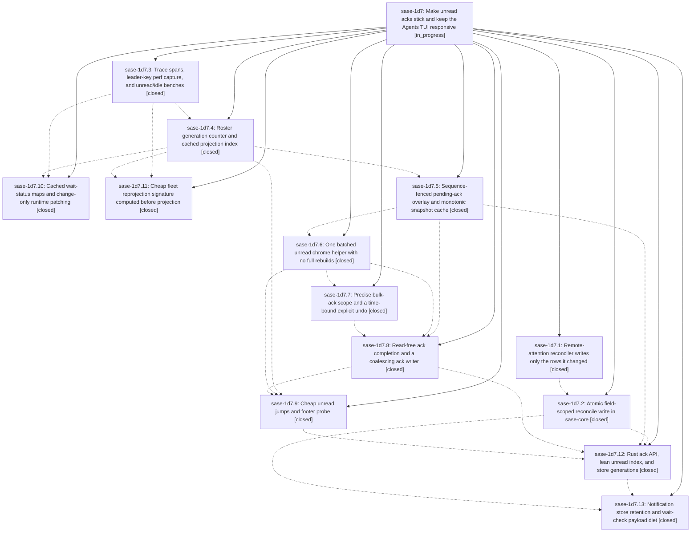

# Bead: sase-1d7 — Make unread acks stick and keep the Agents TUI responsive

[Bead Pages](../README.md) / sase-1d7

**Status:** ◐ in_progress · **Type:** ▸ plan · **Tier:** epic
**Owner:** `bryanbugyi34@gmail.com` · **Created by:** [bbugyi200.athena.0uc](https://github.com/sase-org/sase--agents/blob/main/sessions/bbugyi200.athena.0uc.md) · **Assignee:** `sase-1d7.land`
**Created:** 2026-09-30 07:18:05 EDT
**Plan:** [202609/unread\_ack\_reliability\_and\_tui\_responsiveness.md](https://github.com/sase-org/sase--plans/blob/main/202609/unread_ack_reliability_and_tui_responsiveness.md)

## Description

Unread acknowledgments (`,u`, `,j`/`,J`, row-select) are never reverted by another notification-store writer or by an older snapshot, and unread actions paint within budget: no UI-thread store reads, no full Agents rebuilds for unread-only changes, and no multi-second main-loop freezes from the 1 Hz runtime tick or fleet reprojection.

## Notes

[2026-09-30T20:30:34Z · sase-1d5.land] DISCOVERED ISSUE (sase-1d5.land, 2026-09-30, master 7885562f54 + sase-1d5 landing fix): just symvision reports 3 unused public symbols from 9f989395b5 (feat(agents): cheap unread jumps and footer probe, sase-1d7.9) in src/sase/ace/tui/actions/agents/_unread_set_generation.py: get_unread_set_generation, has_unread_probe_cache_key, note_unread_set_changed. They were hidden until now because symvision stops at its first error category and the sase-1d5 private-import error (fixed in the sase-1d5 landing) masked the unused-public stage. sase tool run check run 10ad13d1995cb9191a95794c3ae6a615 labels them NEW with no owner. Resolve (privatize, wire a real consumer, or re-key an --epic-symbol to a still-open 1d7 phase such as sase-1d7.12/13 if they are about to consume them) before this epic closes.

## Phases

| Bead | Title | Status | Size | Created | Agents | Commits |
|---|---|---|---|---|---:|---:|
| [sase-1d7.1](sase-1d7.1.md) | Remote-attention reconciler writes only the rows it changed | ✓ closed | small | 2026-09-30 | 1 | 1 |
| [sase-1d7.10](sase-1d7.10.md) | Cached wait-status maps and change-only runtime patching | ✓ closed | medium | 2026-09-30 | 1 | 1 |
| [sase-1d7.11](sase-1d7.11.md) | Cheap fleet reprojection signature computed before projection | ✓ closed | medium | 2026-09-30 | 1 | 1 |
| [sase-1d7.12](sase-1d7.12.md) | Rust ack API, lean unread index, and store generations | ✓ closed | large | 2026-09-30 | 1 | 2 |
| [sase-1d7.13](sase-1d7.13.md) | Notification store retention and wait-check payload diet | ✓ closed | large | 2026-09-30 | 1 | 1 |
| [sase-1d7.2](sase-1d7.2.md) | Atomic field-scoped reconcile write in sase-core | ✓ closed | medium | 2026-09-30 | 1 | 2 |
| [sase-1d7.3](sase-1d7.3.md) | Trace spans, leader-key perf capture, and unread/idle benches | ✓ closed | small | 2026-09-30 | 1 | 1 |
| [sase-1d7.4](sase-1d7.4.md) | Roster generation counter and cached projection index | ✓ closed | medium | 2026-09-30 | 1 | 1 |
| [sase-1d7.5](sase-1d7.5.md) | Sequence-fenced pending-ack overlay and monotonic snapshot cache | ✓ closed | medium | 2026-09-30 | 1 | 1 |
| [sase-1d7.6](sase-1d7.6.md) | One batched unread chrome helper with no full rebuilds | ✓ closed | medium | 2026-09-30 | 1 | 1 |
| [sase-1d7.7](sase-1d7.7.md) | Precise bulk-ack scope and a time-bound explicit undo | ✓ closed | small | 2026-09-30 | 1 | 1 |
| [sase-1d7.8](sase-1d7.8.md) | Read-free ack completion and a coalescing ack writer | ✓ closed | medium | 2026-09-30 | 1 | 1 |
| [sase-1d7.9](sase-1d7.9.md) | Cheap unread jumps and footer probe | ✓ closed | medium | 2026-09-30 | 1 | 1 |

## Lineage

## Agents

| Agent | Bead | Commits |
|---|---|---:|
| [bbugyi200.athena.sase-1d7.1](https://github.com/sase-org/sase--agents/blob/main/sessions/bbugyi200.athena.sase-1d7.1.md) | [sase-1d7.1](sase-1d7.1.md) | 1 |
| [bbugyi200.athena.sase-1d7.10](https://github.com/sase-org/sase--agents/blob/main/agents/bbugyi200.athena.sase-1d7.10/README.md) | [sase-1d7.10](sase-1d7.10.md) | 1 |
| [bbugyi200.athena.sase-1d7.11](https://github.com/sase-org/sase--agents/blob/main/sessions/bbugyi200.athena.sase-1d7.11.md) | [sase-1d7.11](sase-1d7.11.md) | 1 |
| [bbugyi200.athena.sase-1d7.12](https://github.com/sase-org/sase--agents/blob/main/sessions/bbugyi200.athena.sase-1d7.12.md) | [sase-1d7.12](sase-1d7.12.md) | 2 |
| [bbugyi200.athena.sase-1d7.13](https://github.com/sase-org/sase--agents/blob/main/sessions/bbugyi200.athena.sase-1d7.13.md) | [sase-1d7.13](sase-1d7.13.md) | 1 |
| [bbugyi200.athena.sase-1d7.2](https://github.com/sase-org/sase--agents/blob/main/sessions/bbugyi200.athena.sase-1d7.2.md) | [sase-1d7.2](sase-1d7.2.md) | 2 |
| [bbugyi200.athena.sase-1d7.3](https://github.com/sase-org/sase--agents/blob/main/agents/bbugyi200.athena.sase-1d7.3/README.md) | [sase-1d7.3](sase-1d7.3.md) | 1 |
| [bbugyi200.athena.sase-1d7.4](https://github.com/sase-org/sase--agents/blob/main/sessions/bbugyi200.athena.sase-1d7.4.md) | [sase-1d7.4](sase-1d7.4.md) | 1 |
| [bbugyi200.athena.sase-1d7.5](https://github.com/sase-org/sase--agents/blob/main/sessions/bbugyi200.athena.sase-1d7.5.md) | [sase-1d7.5](sase-1d7.5.md) | 1 |
| [bbugyi200.athena.sase-1d7.6](https://github.com/sase-org/sase--agents/blob/main/agents/bbugyi200.athena.sase-1d7.6/README.md) | [sase-1d7.6](sase-1d7.6.md) | 1 |
| [bbugyi200.athena.sase-1d7.7](https://github.com/sase-org/sase--agents/blob/main/agents/bbugyi200.athena.sase-1d7.7/README.md) | [sase-1d7.7](sase-1d7.7.md) | 1 |
| [bbugyi200.athena.sase-1d7.8](https://github.com/sase-org/sase--agents/blob/main/sessions/bbugyi200.athena.sase-1d7.8.md) | [sase-1d7.8](sase-1d7.8.md) | 1 |
| [bbugyi200.athena.sase-1d7.9](https://github.com/sase-org/sase--agents/blob/main/sessions/bbugyi200.athena.sase-1d7.9.md) | [sase-1d7.9](sase-1d7.9.md) | 1 |
| [bbugyi200.athena.sase-1d7.land](https://github.com/sase-org/sase--agents/blob/main/agents/bbugyi200.athena.sase-1d7.land/README.md) | [sase-1d7](README.md) | 0 |

## Commits

| Repo | Commit | Subject | Bead | Committed |
|---|---|---|---|---|
| sase | [`279bc27`](https://github.com/sase-org/sase/commit/279bc272d17165ec8f2e44c24760a49c5954c852) | fix(dispatch): preserve concurrent dismissals in remote attention inbox reconcile | [sase-1d7.1](sase-1d7.1.md) | 2026-09-30 08:17:41 EDT |
| sase | [`d6f2b23`](https://github.com/sase-org/sase/commit/d6f2b237a6a48b5290d7356dfeb0c63f62b14a58) | feat(tui): instrument unread paths with tui\_trace spans and key-to-paint benches | [sase-1d7.3](sase-1d7.3.md) | 2026-09-30 08:27:08 EDT |
| sase-core | [`sase-core@413511f`](https://github.com/sase-org/sase-core/commit/413511fcc93a7a17dfc38957dcde983bea6ca8df) | feat(notifications): lock-held field-scoped reconcile write plus empty raw\_suffix matcher parity | [sase-1d7.2](sase-1d7.2.md) | 2026-09-30 09:47:54 EDT |
| sase | [`4ae3b32`](https://github.com/sase-org/sase/commit/4ae3b32f5cb7e43240c68a9537010055f455bcde) | feat(notifications): field-scoped reconcile write in sase-core with attention reconciler switch | [sase-1d7.2](sase-1d7.2.md) | 2026-09-30 10:04:00 EDT |
| sase | [`8a00076`](https://github.com/sase-org/sase/commit/8a00076f1ffa374e9d604ea9f66a4b1881906843) | feat(agents): add roster generation counter and cached projection index | [sase-1d7.4](sase-1d7.4.md) | 2026-09-30 10:12:01 EDT |
| sase | [`11ba54b`](https://github.com/sase-org/sase/commit/11ba54b3816412c082c2ca9ba93ad672247782a0) | feat(agents): cache wait-status maps and change-only runtime patching | [sase-1d7.10](sase-1d7.10.md) | 2026-09-30 11:08:32 EDT |
| sase | [`63c7eb5`](https://github.com/sase-org/sase/commit/63c7eb57e2aef04349519c39e8d5db37a7468a02) | feat(agents): sequence-fenced pending-ack overlay and monotonic snapshot cache | [sase-1d7.5](sase-1d7.5.md) | 2026-09-30 11:12:34 EDT |
| sase | [`2fade65`](https://github.com/sase-org/sase/commit/2fade653babb1adf2deeb637c6b66cec392c4786) | feat(agents): cheap fleet reprojection signature checked before projection | [sase-1d7.11](sase-1d7.11.md) | 2026-09-30 11:49:38 EDT |
| sase | [`30a04f9`](https://github.com/sase-org/sase/commit/30a04f9a31beb60da60f808611f680f045e1733e) | feat(agents): one batched unread chrome helper with no full rebuilds | [sase-1d7.6](sase-1d7.6.md) | 2026-09-30 11:59:48 EDT |
| sase | [`af0ac9d`](https://github.com/sase-org/sase/commit/af0ac9d6acf9852276c6af6ccae220cb61ec10c6) | feat(agents): precise bulk-ack scope and time-bound explicit undo (sase-1d7.7) | [sase-1d7.7](sase-1d7.7.md) | 2026-09-30 12:40:22 EDT |
| sase | [`f57024d`](https://github.com/sase-org/sase/commit/f57024dbdc98e0c481e6eabda3d01e217e21d314) | feat(agents): unread ack pipeline with coalescing writer and cached-snapshot completion | [sase-1d7.8](sase-1d7.8.md) | 2026-09-30 13:35:00 EDT |
| sase | [`9f98939`](https://github.com/sase-org/sase/commit/9f989395b5f158a1a0b11dddfde36c3a7dedca58) | feat(agents): cheap unread jumps and footer probe (sase-1d7.9) | [sase-1d7.9](sase-1d7.9.md) | 2026-09-30 14:54:35 EDT |
| sase-core | [`sase-core@28befcb`](https://github.com/sase-org/sase-core/commit/28befcb9e411d2e5f8a8fd2405186cd3b393631d) | feat(notifications): store generations, ack API, and lean unread index | [sase-1d7.12](sase-1d7.12.md) | 2026-09-30 17:01:15 EDT |
| sase | [`4d2fa14`](https://github.com/sase-org/sase/commit/4d2fa14af32cde79226b678f673863a805a5687c) | feat(notifications): Rust ack API, lean unread index, and store generations | [sase-1d7.12](sase-1d7.12.md) | 2026-09-30 17:04:53 EDT |
| sase-core | [`sase-core@5a59e78`](https://github.com/sase-org/sase-core/commit/5a59e7859ed39d41f59f0ae1d5eb902c65f0b410) | feat(notifications): 3-day archival retention and wait\_checks 32-entry plus-one cap | [sase-1d7.13](sase-1d7.13.md) | 2026-09-30 18:38:36 EDT |

<!-- sase:referenced-by:start -->

## Referenced By

| Relation | Artifact | Why | Uses |
| --- | --- | --- | ---: |
| read-by | [agent:sase-1d5.land][1] | Check whether this epic owns unmasked symvision unused-public symbols found while landing sase-1d5 | 1 |

[1]: https://github.com/sase-org/sase--agents/blob/main/agents/bbugyi200.athena.sase-1d5.land/README.md

<!-- sase:referenced-by:end -->
