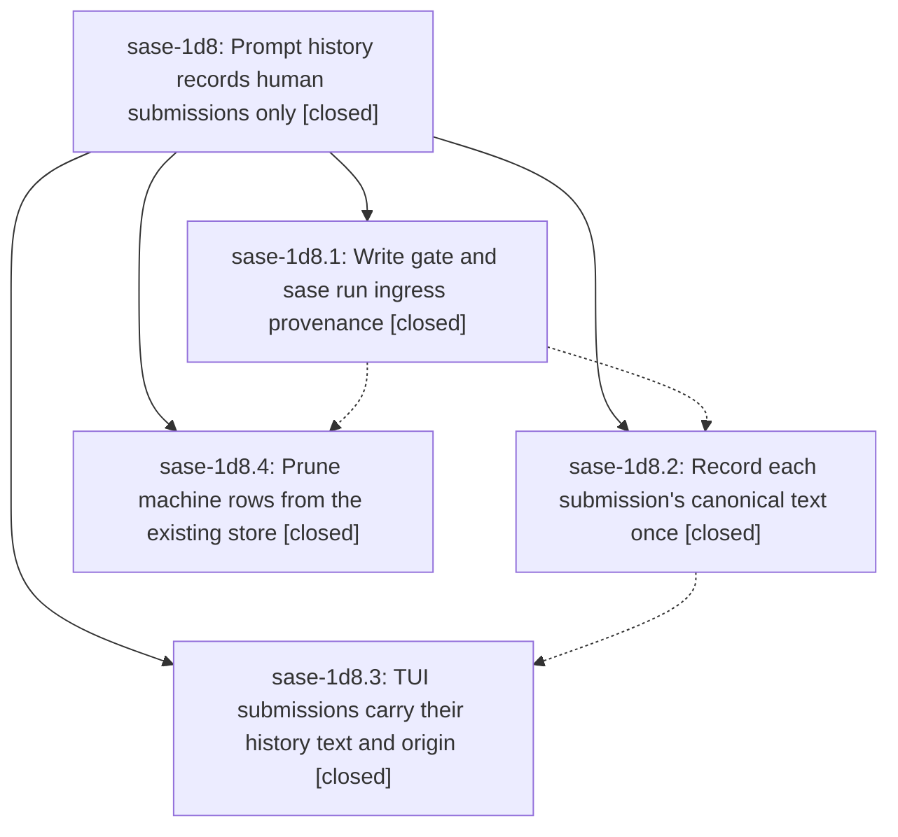

# Bead: sase-1d8 — Prompt history records human submissions only

[Bead Pages](../README.md) / sase-1d8

**Status:** ✓ closed · **Resolution:** done · **Type:** ▸ plan · **Tier:** epic
**Owner:** `bryanbugyi34@gmail.com` · **Created by:** [bbugyi200.athena.0ud](https://github.com/sase-org/sase--agents/blob/main/sessions/bbugyi200.athena.0ud.md) · **Assignee:** `sase-1d8.land`
**Created:** 2026-09-30 07:44:46 EDT · **Closed:** 2026-09-30 12:11:56 EDT
**Plan:** [202609/prompt\_history\_human\_only.md](https://github.com/sase-org/sase--plans/blob/main/202609/prompt_history_human_only.md)

## Description

Prompt history holds one row per human submission: the canonical text a person submitted through the TUI prompt bar, `sase run` / `sase prompt run`, or mobile/Telegram. It holds nothing a machine launched: swarm members, routine jobs, bead work, approvals, restarts, relaunched member agents, monitor and gate-command launches. The machine rows already in the store can be pruned safely.

## Notes

[2026-09-30T15:55:15Z · sase-1d8.land] LAND TRIAGE AND INTEGRATION (HEAD 018061f6f2): Reviewed all four closed child notes and the approved plan. PROPOSED FOLLOW-UP from .1 #1, .3 #1, and .4 #1 is one validator/core prediction-calibration mismatch, already recorded as DISCOVERED ISSUE note #2 on active causal epic sase-1cj.12; added corroboration there, no task. .4 #2 is the same live-host bead-store leak as ready CI task sase-14o; added +1 naming .4, no duplicate task. .2 #1 (private scripts/_run Symvision errors) is declined because it no longer reproduces on current HEAD: direct Symvision reports no scripts/_run errors. It currently reports seven symbols introduced by later tool-run commit 018061f6f2; routed these to active causal epic sase-1cx as a DISCOVERED ISSUE, unrelated to this epic. Integration gap found in that later tool-run commit: detached ToolRun proc supervision scrubs SASE_AGENT, but its child command has SASE_TOOL_RUN_ID; if the child runs sase run, _sase_run_ingress_origin sees no monitor/gate marker and classifies machine text as typed. Remaining epic work is a small tale to mark this ingress generated, verify, and close sase-1d8. All current epic-symbol entries are already absent.

[2026-09-30T16:11:38Z · sase-1d8.land] Closeout verification (202609/prompt_history_toolrun_closeout.md step 1-2): _sase_run_ingress_origin now classifies nonempty SASE_TOOL_RUN_ID as generated; local constant mirrors sase.tool.executor_process.TOOL_RUN_ID_ENV (verified equal at runtime). tests/main/test_sase_run_history_ingress.py: 19 passed (11 existing + 8 new assertions/tests: nonempty/empty marker ingress, nested-ToolRun no-row, blank-marker typed row, typed-payload no-upgrade of ToolRun). ruff and mypy clean on both changed files. just check via sase tool run did not complete: killed at the 9-minute transport limit while waiting on the shared sase-core build lock in rust-install setup (environmental, unrelated to this change); the sase-1cj.12 prediction-validator skew was not reached. HEAD concurrent commit 2fade653ba (fleet projection laziness) touches no prompt-history paths.

[2026-09-30T16:11:56Z · sase-1d8.land] Verified generated write gate, canonical-text launch paths, TUI provenance, safe prune and current ToolRun ingress integration; all phase notes and follow-ups triaged; no unresolved epic symbols

## Phases

| Bead | Title | Status | Size | Created | Agents | Commits |
|---|---|---|---|---|---:|---:|
| [sase-1d8.1](sase-1d8.1.md) | Write gate and sase run ingress provenance | ✓ closed | medium | 2026-09-30 | 1 | 1 |
| [sase-1d8.2](sase-1d8.2.md) | Record each submission's canonical text once | ✓ closed | medium | 2026-09-30 | 1 | 1 |
| [sase-1d8.3](sase-1d8.3.md) | TUI submissions carry their history text and origin | ✓ closed | medium | 2026-09-30 | 1 | 1 |
| [sase-1d8.4](sase-1d8.4.md) | Prune machine rows from the existing store | ✓ closed | medium | 2026-09-30 | 1 | 2 |

## Lineage

## Agents

| Agent | Bead | Commits |
|---|---|---:|
| [bbugyi200.athena.sase-1d8.1](https://github.com/sase-org/sase--agents/blob/main/sessions/bbugyi200.athena.sase-1d8.1.md) | [sase-1d8.1](sase-1d8.1.md) | 1 |
| [bbugyi200.athena.sase-1d8.2](https://github.com/sase-org/sase--agents/blob/main/agents/bbugyi200.athena.sase-1d8.2/README.md) | [sase-1d8.2](sase-1d8.2.md) | 1 |
| [bbugyi200.athena.sase-1d8.3](https://github.com/sase-org/sase--agents/blob/main/sessions/bbugyi200.athena.sase-1d8.3.md) | [sase-1d8.3](sase-1d8.3.md) | 1 |
| [bbugyi200.athena.sase-1d8.4](https://github.com/sase-org/sase--agents/blob/main/agents/bbugyi200.athena.sase-1d8.4/README.md) | [sase-1d8.4](sase-1d8.4.md) | 2 |
| [bbugyi200.athena.sase-1d8.land](https://github.com/sase-org/sase--agents/blob/main/sessions/bbugyi200.athena.sase-1d8.land.md) | [sase-1d8](README.md) | 1 |

## Commits

| Repo | Commit | Subject | Bead | Committed |
|---|---|---|---|---|
| sase | [`ad7f3a1`](https://github.com/sase-org/sase/commit/ad7f3a19a352577ac1614609edf3b57eb9da4dec) | feat(history): gate generated-origin writes and record sase run ingress provenance | [sase-1d8.1](sase-1d8.1.md) | 2026-09-30 09:26:32 EDT |
| sase | [`ce0f618`](https://github.com/sase-org/sase/commit/ce0f61846ca3489bec69d4d40fe4b65a7ea0e048) | feat(history): record each submission's canonical text once | [sase-1d8.2](sase-1d8.2.md) | 2026-09-30 10:04:56 EDT |
| sase-core | [`sase-core@0ad6e44`](https://github.com/sase-org/sase-core/commit/0ad6e44174c60d8f698bd5861bb10dff4e6bacd0) | feat(prompt-prediction): flag chop and job tribe origins as generated | [sase-1d8.4](sase-1d8.4.md) | 2026-09-30 11:08:12 EDT |
| sase | [`a8bf3e4`](https://github.com/sase-org/sase/commit/a8bf3e41a8ecc98bf4cf5833d2a0c68384bf134d) | feat(history): TUI submissions carry history text and origin | [sase-1d8.3](sase-1d8.3.md) | 2026-09-30 11:35:35 EDT |
| sase | [`2d8cd15`](https://github.com/sase-org/sase/commit/2d8cd15f7f2f9c47f6fc5ca44a05c3f781d5d376) | feat(prompt): prune generated and legacy prompt history with backups | [sase-1d8.4](sase-1d8.4.md) | 2026-09-30 11:35:37 EDT |
| sase | [`fda5304`](https://github.com/sase-org/sase/commit/fda5304904c1891b5fc78183f78243e183a2167e) | feat(history): classify nested ToolRun sase run ingress as generated | [sase-1d8](README.md) | 2026-09-30 12:16:16 EDT |

<!-- sase:referenced-by:start -->

## Referenced By

| Relation | Artifact | Why | Uses |
| --- | --- | --- | ---: |
| read-by | [agent:sase-1d8.2][1] | Need epic context for canonical-text phase | 1 |
| read-by | [agent:sase-1d8.4][2] | Need parent epic context for prune phase | 1 |

[1]: https://github.com/sase-org/sase--agents/blob/main/agents/bbugyi200.athena.sase-1d8.2/README.md
[2]: https://github.com/sase-org/sase--agents/blob/main/agents/bbugyi200.athena.sase-1d8.4/README.md

<!-- sase:referenced-by:end -->
