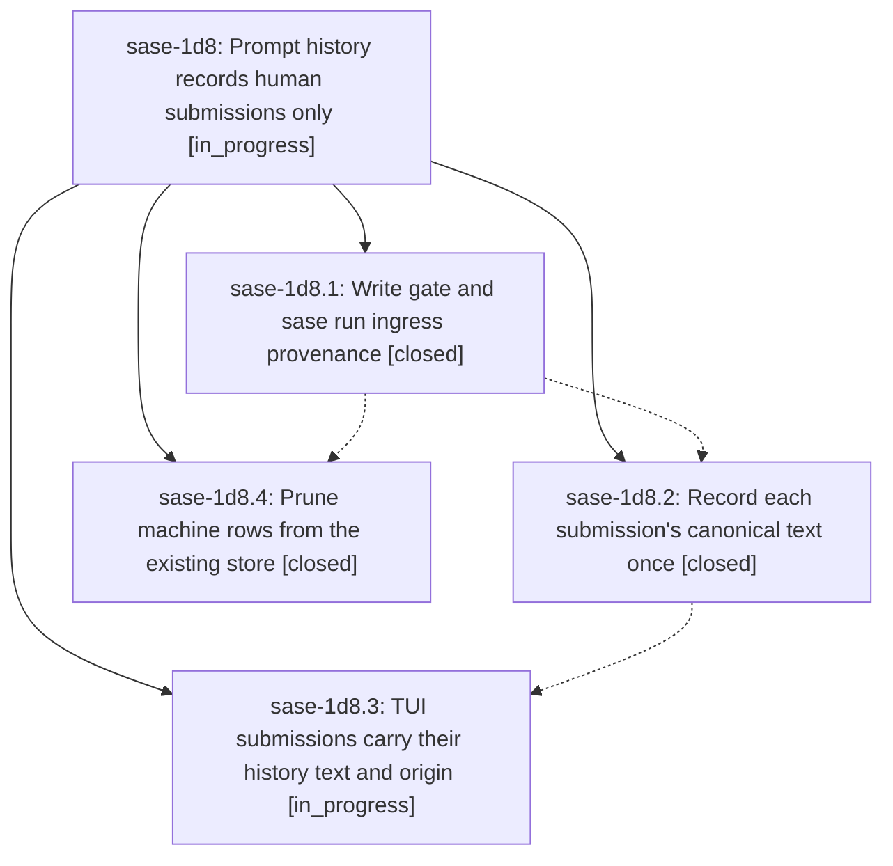

# Bead: sase-1d8 — Prompt history records human submissions only

[Bead Pages](../README.md) / sase-1d8

**Status:** ◐ in_progress · **Type:** ▸ plan · **Tier:** epic
**Owner:** `bryanbugyi34@gmail.com` · **Created by:** [bbugyi200.athena.0ud](https://github.com/sase-org/sase--agents/blob/main/sessions/bbugyi200.athena.0ud.md) · **Assignee:** `sase-1d8.land`
**Created:** 2026-09-30 07:44:46 EDT
**Plan:** [202609/prompt\_history\_human\_only.md](https://github.com/sase-org/sase--plans/blob/main/202609/prompt_history_human_only.md)

## Description

Prompt history holds one row per human submission: the canonical text a person submitted through the TUI prompt bar, `sase run` / `sase prompt run`, or mobile/Telegram. It holds nothing a machine launched: swarm members, routine jobs, bead work, approvals, restarts, relaunched member agents, monitor and gate-command launches. The machine rows already in the store can be pruned safely.

## Phases

| Bead | Title | Status | Size | Created | Agents | Commits |
|---|---|---|---|---|---:|---:|
| [sase-1d8.1](sase-1d8.1.md) | Write gate and sase run ingress provenance | ✓ closed | medium | 2026-09-30 | 1 | 1 |
| [sase-1d8.2](sase-1d8.2.md) | Record each submission's canonical text once | ✓ closed | medium | 2026-09-30 | 1 | 0 |
| [sase-1d8.3](sase-1d8.3.md) | TUI submissions carry their history text and origin | ◐ in_progress | medium | 2026-09-30 | 1 | 0 |
| [sase-1d8.4](sase-1d8.4.md) | Prune machine rows from the existing store | ✓ closed | medium | 2026-09-30 | 1 | 1 |

## Lineage

## Agents

| Agent | Bead | Commits |
|---|---|---:|
| [bbugyi200.athena.sase-1d8.1](https://github.com/sase-org/sase--agents/blob/main/sessions/bbugyi200.athena.sase-1d8.1.md) | [sase-1d8.1](sase-1d8.1.md) | 1 |
| [bbugyi200.athena.sase-1d8.2](https://github.com/sase-org/sase--agents/blob/main/agents/bbugyi200.athena.sase-1d8.2/README.md) | [sase-1d8.2](sase-1d8.2.md) | 0 |
| [bbugyi200.athena.sase-1d8.3](https://github.com/sase-org/sase--agents/blob/main/sessions/bbugyi200.athena.sase-1d8.3.md) | [sase-1d8.3](sase-1d8.3.md) | 0 |
| [bbugyi200.athena.sase-1d8.4](https://github.com/sase-org/sase--agents/blob/main/agents/bbugyi200.athena.sase-1d8.4/README.md) | [sase-1d8.4](sase-1d8.4.md) | 1 |
| [bbugyi200.athena.sase-1d8.land](https://github.com/sase-org/sase--agents/blob/main/agents/bbugyi200.athena.sase-1d8.land/README.md) | [sase-1d8](README.md) | 0 |

## Commits

| Repo | Commit | Subject | Bead | Committed |
|---|---|---|---|---|
| sase | [`ad7f3a1`](https://github.com/sase-org/sase/commit/ad7f3a19a352577ac1614609edf3b57eb9da4dec) | feat(history): gate generated-origin writes and record sase run ingress provenance | [sase-1d8.1](sase-1d8.1.md) | 2026-09-30 09:26:32 EDT |
| sase-core | [`sase-core@0ad6e44`](https://github.com/sase-org/sase-core/commit/0ad6e44174c60d8f698bd5861bb10dff4e6bacd0) | feat(prompt-prediction): flag chop and job tribe origins as generated | [sase-1d8.4](sase-1d8.4.md) | 2026-09-30 11:08:12 EDT |

<!-- sase:referenced-by:start -->

## Referenced By

| Relation | Artifact | Why | Uses |
| --- | --- | --- | ---: |
| read-by | [agent:sase-1d8.2][1] | Need epic context for canonical-text phase | 1 |

[1]: https://github.com/sase-org/sase--agents/blob/main/agents/bbugyi200.athena.sase-1d8.2/README.md

<!-- sase:referenced-by:end -->
