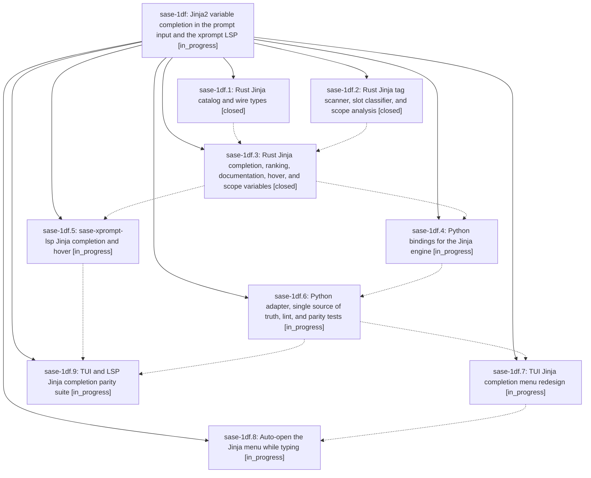

# Bead: sase-1df — Jinja2 variable completion in the prompt input and the xprompt LSP

[Bead Pages](../README.md) / sase-1df

**Status:** ◐ in_progress · **Type:** ▸ plan · **Tier:** epic
**Owner:** `bryanbugyi34@gmail.com` · **Created by:** [bbugyi200.apollo.3g](https://github.com/sase-org/sase--agents/blob/main/sessions/bbugyi200.apollo.3g.md) · **Assignee:** `sase-1df.land`
**Created:** 2026-09-30 08:47:13 EDT
**Plan:** [202609/jinja\_variable\_completion.md](https://github.com/sase-org/sase--plans/blob/main/202609/jinja_variable_completion.md)

<!-- sase:links:start -->

## Links

| Relation | Artifact | Why |
| --- | --- | --- |
| implemented-by | [plan:202609/jinja_variable_completion.md][1] | derived from the plan's `bead_id:` frontmatter field |

[1]: https://github.com/sase-org/sase--plans/blob/main/202609/jinja_variable_completion.md

<!-- sase:links:end -->

## Description

Typing `{{` in sase's TUI prompt input, or in any editor that uses `sase-xprompt-lsp`, immediately shows every Jinja2 variable that is valid at that spot. The list covers the current xprompt's or prompt stack's declared `input:` properties, template locals, the variables sase injects into every agent prompt, and Jinja's own globals. Each entry shows its type, source, default, and a description, and the entries are ranked the same way everywhere. Filters after `|`, tests after `is`, members after `wait.`/`loop.`, and statements after `{%` complete the same way. One Rust engine is the source of truth for the completion menu, editor hover, and the TUI's unknown-variable lint.

## Phases

| Bead | Title | Status | Size | Created | Agents | Commits |
|---|---|---|---|---|---:|---:|
| [sase-1df.1](sase-1df.1.md) | Rust Jinja catalog and wire types | ✓ closed | small | 2026-09-30 | 1 | 1 |
| [sase-1df.2](sase-1df.2.md) | Rust Jinja tag scanner, slot classifier, and scope analysis | ✓ closed | medium | 2026-09-30 | 1 | 1 |
| [sase-1df.3](sase-1df.3.md) | Rust Jinja completion, ranking, documentation, hover, and scope variables | ✓ closed | medium | 2026-09-30 | 1 | 1 |
| [sase-1df.4](sase-1df.4.md) | Python bindings for the Jinja engine | ◐ in_progress | small | 2026-09-30 | 1 | 0 |
| [sase-1df.5](sase-1df.5.md) | sase-xprompt-lsp Jinja completion and hover | ◐ in_progress | medium | 2026-09-30 | 1 | 0 |
| [sase-1df.6](sase-1df.6.md) | Python adapter, single source of truth, lint, and parity tests | ◐ in_progress | medium | 2026-09-30 | 1 | 0 |
| [sase-1df.7](sase-1df.7.md) | TUI Jinja completion menu redesign | ◐ in_progress | medium | 2026-09-30 | 1 | 0 |
| [sase-1df.8](sase-1df.8.md) | Auto-open the Jinja menu while typing | ◐ in_progress | small | 2026-09-30 | 1 | 0 |
| [sase-1df.9](sase-1df.9.md) | TUI and LSP Jinja completion parity suite | ◐ in_progress | small | 2026-09-30 | 1 | 0 |

## Lineage

## Agents

| Agent | Bead | Commits |
|---|---|---:|
| [bbugyi200.apollo.sase-1df.1](https://github.com/sase-org/sase--agents/blob/main/agents/bbugyi200.apollo.sase-1df.1/README.md) | [sase-1df.1](sase-1df.1.md) | 1 |
| [bbugyi200.apollo.sase-1df.2](https://github.com/sase-org/sase--agents/blob/main/agents/bbugyi200.apollo.sase-1df.2/README.md) | [sase-1df.2](sase-1df.2.md) | 1 |
| [bbugyi200.apollo.sase-1df.3](https://github.com/sase-org/sase--agents/blob/main/agents/bbugyi200.apollo.sase-1df.3/README.md) | [sase-1df.3](sase-1df.3.md) | 1 |
| [bbugyi200.apollo.sase-1df.4](https://github.com/sase-org/sase--agents/blob/main/agents/bbugyi200.apollo.sase-1df.4/README.md) | [sase-1df.4](sase-1df.4.md) | 0 |
| [bbugyi200.apollo.sase-1df.5](https://github.com/sase-org/sase--agents/blob/main/agents/bbugyi200.apollo.sase-1df.5/README.md) | [sase-1df.5](sase-1df.5.md) | 0 |
| [bbugyi200.apollo.sase-1df.6](https://github.com/sase-org/sase--agents/blob/main/agents/bbugyi200.apollo.sase-1df.6/README.md) | [sase-1df.6](sase-1df.6.md) | 0 |
| [bbugyi200.apollo.sase-1df.7](https://github.com/sase-org/sase--agents/blob/main/agents/bbugyi200.apollo.sase-1df.7/README.md) | [sase-1df.7](sase-1df.7.md) | 0 |
| [bbugyi200.apollo.sase-1df.8](https://github.com/sase-org/sase--agents/blob/main/agents/bbugyi200.apollo.sase-1df.8/README.md) | [sase-1df.8](sase-1df.8.md) | 0 |
| [bbugyi200.apollo.sase-1df.9](https://github.com/sase-org/sase--agents/blob/main/agents/bbugyi200.apollo.sase-1df.9/README.md) | [sase-1df.9](sase-1df.9.md) | 0 |
| [bbugyi200.apollo.sase-1df.land](https://github.com/sase-org/sase--agents/blob/main/agents/bbugyi200.apollo.sase-1df.land/README.md) | [sase-1df](README.md) | 0 |

## Commits

| Repo | Commit | Subject | Bead | Committed |
|---|---|---|---|---|
| sase-core | [`sase-core@8f06984`](https://github.com/sase-org/sase-core/commit/8f0698476b50b3b6f571ab9e8537a79152118e7a) | feat(editor): add Rust Jinja catalog and wire types | [sase-1df.1](sase-1df.1.md) | 2026-09-30 09:18:04 EDT |
| sase-core | [`sase-core@a969aad`](https://github.com/sase-org/sase-core/commit/a969aad267b237a332110f96b380b56d997bb7f7) | feat(editor): add Jinja tag scanning, completion context, and document scope | [sase-1df.2](sase-1df.2.md) | 2026-09-30 10:02:38 EDT |
| sase-core | [`sase-core@edef846`](https://github.com/sase-org/sase-core/commit/edef8462771ec10d3769b384057b56fc0eb3ef5f) | feat(editor): add jinja assist completion, scope vars, docs and hover | [sase-1df.3](sase-1df.3.md) | 2026-09-30 10:56:04 EDT |
