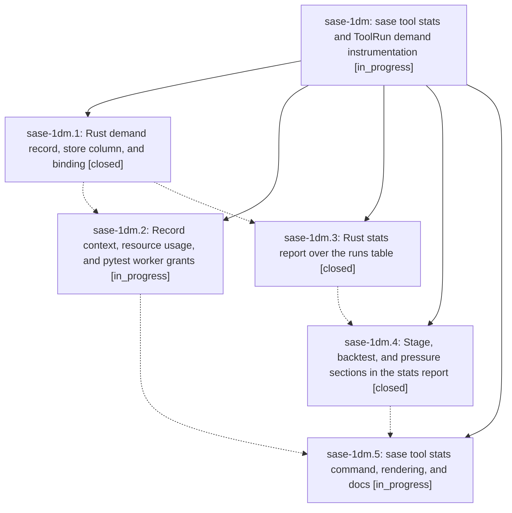

# Bead: sase-1dm — sase tool stats and ToolRun demand instrumentation

[Bead Pages](../README.md) / sase-1dm

**Status:** ◐ in_progress · **Type:** ▸ plan · **Tier:** epic
**Owner:** `bryanbugyi34@gmail.com` · **Created by:** [bbugyi200.athena.0u4](https://github.com/sase-org/sase--agents/blob/main/sessions/bbugyi200.athena.0u4.md) · **Assignee:** `sase-1dm.land`
**Created:** 2026-09-30 16:20:04 EDT
**Plan:** [202609/tool\_stats\_demand.md](https://github.com/sase-org/sase--plans/blob/main/202609/tool_stats_demand.md)

## Description

`sase tool stats` turns the ToolRun ledger into routine, read-only readouts (per tool, stage, route, and provider: p50/p90, outcome and censoring mix, ceiling kills and wasted hours, repeats and duplicates, a daily trend, a chronological backtest, and host pressure), and every new run records the demand evidence a future admission design needs: provider and ceiling context, process-tree CPU and memory, and pytest worker grants with token-wait time.

## Phases

| Bead | Title | Status | Size | Created | Agents | Commits |
|---|---|---|---|---|---:|---:|
| [sase-1dm.1](sase-1dm.1.md) | Rust demand record, store column, and binding | ✓ closed | small | 2026-09-30 | 1 | 1 |
| [sase-1dm.2](sase-1dm.2.md) | Record context, resource usage, and pytest worker grants | ◐ in_progress | medium | 2026-09-30 | 1 | 0 |
| [sase-1dm.3](sase-1dm.3.md) | Rust stats report over the runs table | ✓ closed | medium | 2026-09-30 | 1 | 1 |
| [sase-1dm.4](sase-1dm.4.md) | Stage, backtest, and pressure sections in the stats report | ✓ closed | medium | 2026-09-30 | 1 | 1 |
| [sase-1dm.5](sase-1dm.5.md) | sase tool stats command, rendering, and docs | ◐ in_progress | medium | 2026-09-30 | 1 | 0 |

## Lineage

## Agents

| Agent | Bead | Commits |
|---|---|---:|
| [bbugyi200.athena.sase-1dm.1](https://github.com/sase-org/sase--agents/blob/main/agents/bbugyi200.athena.sase-1dm.1/README.md) | [sase-1dm.1](sase-1dm.1.md) | 1 |
| [bbugyi200.athena.sase-1dm.2](https://github.com/sase-org/sase--agents/blob/main/sessions/bbugyi200.athena.sase-1dm.2.md) | [sase-1dm.2](sase-1dm.2.md) | 0 |
| [bbugyi200.athena.sase-1dm.3](https://github.com/sase-org/sase--agents/blob/main/agents/bbugyi200.athena.sase-1dm.3/README.md) | [sase-1dm.3](sase-1dm.3.md) | 1 |
| [bbugyi200.athena.sase-1dm.4](https://github.com/sase-org/sase--agents/blob/main/agents/bbugyi200.athena.sase-1dm.4/README.md) | [sase-1dm.4](sase-1dm.4.md) | 1 |
| [bbugyi200.athena.sase-1dm.5](https://github.com/sase-org/sase--agents/blob/main/agents/bbugyi200.athena.sase-1dm.5/README.md) | [sase-1dm.5](sase-1dm.5.md) | 0 |
| [bbugyi200.athena.sase-1dm.land](https://github.com/sase-org/sase--agents/blob/main/agents/bbugyi200.athena.sase-1dm.land/README.md) | [sase-1dm](README.md) | 0 |

## Commits

| Repo | Commit | Subject | Bead | Committed |
|---|---|---|---|---|
| sase-core | [`sase-core@7a9ffad`](https://github.com/sase-org/sase-core/commit/7a9ffadcf6fcbd813b905082c82fb47c77425e50) | feat(tool-run): record per-run demand context, usage, and worker grants | [sase-1dm.1](sase-1dm.1.md) | 2026-09-30 16:50:33 EDT |
| sase-core | [`sase-core@6e23783`](https://github.com/sase-org/sase-core/commit/6e23783d04da778b3be1d5ae6fc3b3e81cf1c830) | feat(tool-run): implement core-stats report for sase-1dm.3 | [sase-1dm.3](sase-1dm.3.md) | 2026-09-30 17:31:36 EDT |
| sase-core | [`sase-core@b381879`](https://github.com/sase-org/sase-core/commit/b381879ebb19d255b8519e7a89ad983b799040d0) | feat(tool-run): add stage, backtest, and pressure sections to stats report | [sase-1dm.4](sase-1dm.4.md) | 2026-09-30 18:09:47 EDT |
