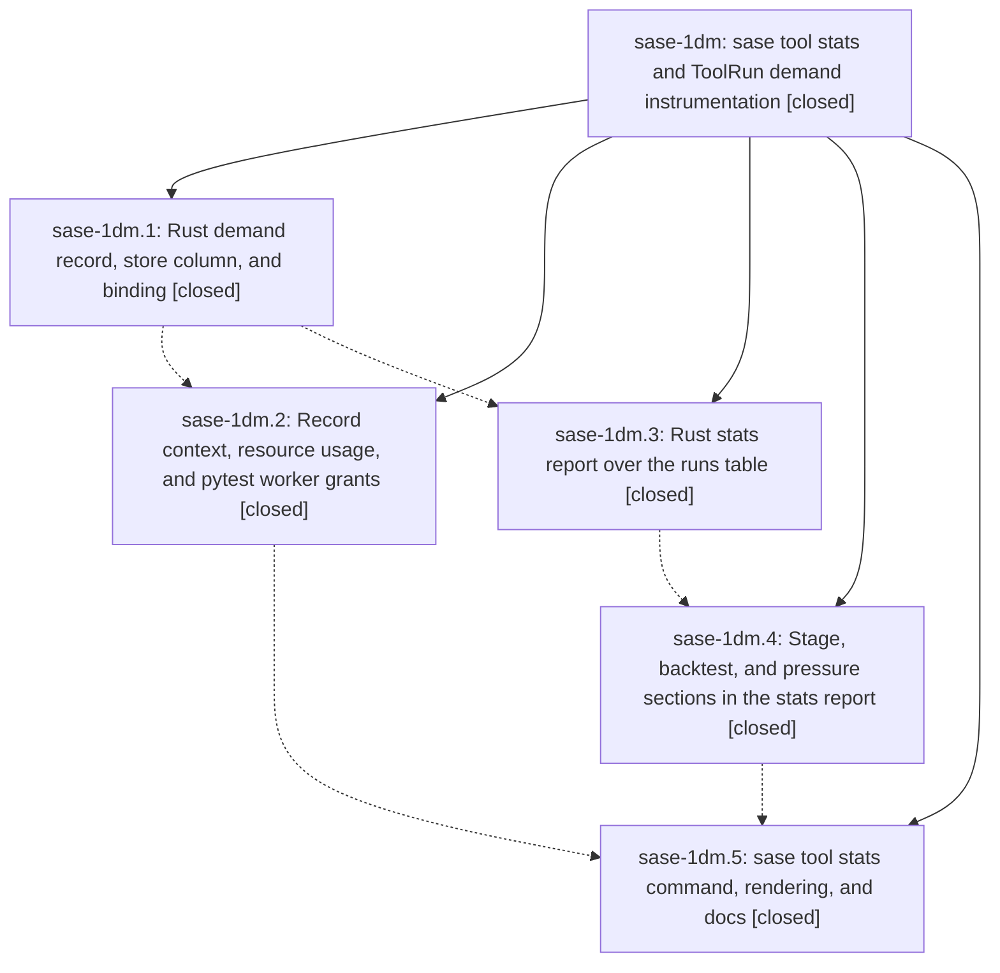

# Bead: sase-1dm — sase tool stats and ToolRun demand instrumentation

[Bead Pages](../README.md) / sase-1dm

**Status:** ✓ closed · **Resolution:** done · **Type:** ▸ plan · **Tier:** epic
**Owner:** `bryanbugyi34@gmail.com` · **Created by:** [bbugyi200.athena.0u4](https://github.com/sase-org/sase--agents/blob/main/sessions/bbugyi200.athena.0u4.md) · **Assignee:** `sase-1dm.land`
**Created:** 2026-09-30 16:20:04 EDT · **Closed:** 2026-09-30 23:22:30 EDT
**Plan:** [202609/tool\_stats\_demand.md](https://github.com/sase-org/sase--plans/blob/main/202609/tool_stats_demand.md)

## Description

`sase tool stats` turns the ToolRun ledger into routine, read-only readouts (per tool, stage, route, and provider: p50/p90, outcome and censoring mix, ceiling kills and wasted hours, repeats and duplicates, a daily trend, a chronological backtest, and host pressure), and every new run records the demand evidence a future admission design needs: provider and ceiling context, process-tree CPU and memory, and pytest worker grants with token-wait time.

## Notes

[2026-10-01T00:31:50Z · sase-1dm.land] LANDING VERIFICATION (sase-1dm.land, 2026-09-30): all 5 phases closed; commits sase-core 7a9ffad (core-demand), 6e23783 (core-stats), b381879 (core-stats-detail), all on sase-core origin/master; sase 1728715220 (record-demand) and be6daf95d1 (stats-cli); sase-core-revision.txt pin 5a59e78 contains all three core commits. Source audit against plan:202609/tool_stats_demand.md confirms demand wires/column/merge-on-write store/bindings, every stats constant and definition (routes, kill rules, waste, providers, trend, repeats, demand aggregates, stages, backtests, pressure), Python capture (wait4 reaper, /proc tree RSS, SASE_TOOL_RUN_DEMAND channel, run_pytest grants, show lines, SASE_TOOL_RUN_PROVIDER overlay in the post-split monitor start_launch.py), CLI, and docs. Remaining epic work (gaps vs the contract, plus real bugs): one out-of-range grant int (e.g. granted -1 or >u32) fails the whole tool_run_record_demand request and loses the run's usage; foreground build_demand_context in executor_entry.py is not fail-open; stats tables print names as unescaped Rich markup; core keeps unparseable sample payloads instead of skipping them with a count diagnostic; no 10k-run/60k-sample perf bench; the bare cohort admits runs without duration_ms; replayed=false whenever a call has diagnostics; run_pytest records pool-capacity UsageErrors as token-wait timeouts; stats_report.py is 485 lines (the plan's split threshold is about 400); some docs and tests are thin. All of it goes to a remaining-work tale. Integration: the commits since the epic started (monitor start.py split 2f0e898d46, test_monitor_join split 741ac69eaa, notifications, ace-tui, attachments, xprompt) contain nothing that should use or duplicates stats/demand; the demand overlay already lives in start_launch.py. No other stats tooling duplicates it. sase bead epic-symbols sase-1dm: none.

[2026-10-01T00:32:03Z · sase-1dm.land] LIVE SMOKE (stats part, sase-1dm.land): workspace-venv 'sase tool stats -t check -d 7' wall 1.23s. Signal lines: backtest whole run 74% of 879 inside p10-p90, median width 31.6x, target not met (research baseline 75% / 18.6x: coverage holds, width is wider); waste: killed at ceiling 185 (27.7h; 66 rerun within 30m), timeout 13 (12.6h), stopped 2 (1.0h), lost 10 (2.9h), other signals 10 (6.4h); routes: monitor-owned 288, under 2m 41 (14%), under 5m 103; repeats 158 exact (38.8h; 85 after a censored run), 2 concurrent duplicates (0.7h), 21 unkeyed; demand 0 runs with usage. Reactive-routing acceptance: zero check ceiling kills since sase-1cx/sase-17g landed (2026-09-30 15:58 EDT; the only signaled check run since was a stop_requested detached run). The 185 kills all predate it. The monitor-owned under-2m share is 14% over 7d and 17% (7/41) over 1d, against the <5% target, so that leg is NOT yet met (too early to judge; user's call). Demand is absent live because agents' deployed 'sase' is the editable install from the primary checkout, which has not pulled 1728715220/be6daf95d1 yet (sase.tool.demand is not importable there). That is a deployment gap, not a code bug. The demand half of the smoke (sase tool show <id> -j with run.demand) is left to the remaining-work tale, run through the workspace venv.

[2026-10-01T00:32:25Z · sase-1dm.land] FOLLOW-UP TRIAGE (sase-1dm.land via /sase_new_task): (1) sase-1dm.2 'TUI header panel ImportError test_hint_document_forces_expansion' -> +1 sase-1dh (still reproduces on be6daf95d1). (2) sase-1dm.2 'flaky launch fanout contradiction' -> +1 sase-1du (the sibling node co-fails with sase-1du's wipe_failure test in all 6 check runs today; same launch-seam cluster). (3) sase-1dm.3 'sudo_runner ETXTBSY under parallel sase-core check' -> +1 sase-15h. (4) sase-1dm.2 'completion snapshot digest drift in bead help' -> declined: tests/completion/test_snapshot.py passes on be6daf95d1, already resolved. (5) sase-1dm.2 'attachment corrupt-blob git rev-parse refs/heads/main' -> declined: the attachment corrupt/fetch/lifecycle/public-store tests (35) pass on be6daf95d1, resolved by the sase-1d5 landing. (6) sase-1dm.5 'symvision NEW get_unread_set_generation' -> no new bead: already recorded as epic work on in-progress epic sase-1d7 (note #1, resolved in its remaining-work tale); the tool symbols HandoffSubmitResult/StarterResolution/owner_ref are tracked by sase-1dn. Plan Landing candidates: (7) recording the held E6/E7/E8 reconsider conditions -> declined: docs/tool.md 'Stats' now maps each held condition to the stats field that measures it; a decision record would be the user's call, not discovered work. (8) Admin Center/TUI stats surface -> declined: an explicit plan non-goal with no demand signal yet (wish list). (9) demand recovery for lost runs -> declined: a by-design documented gap (contract: 'do not reconstruct it'); lost runs are 10 of 1,101 check runs in 7d. Memory: lint_and_test.md and glossary:tool-run are not stale about stats (neither lists ToolRun subcommands or fields exhaustively); no memory task. Audit nits declined: wire-shape drift (tool backtest/pressure non-Option, stage backtests in a separate stage_backtests list that the CLI joins by description) is functional and consumed, so churning the JSON now has no payoff; the diagnostics-overflow marker replacing the 16th entry and the grant-cap break skipping later drop diagnostics fit 'at most 16 stored, overflow dropped with one diagnostic'; the truncation-diagnostic wording and the yellow-for-amber colour are cosmetic; the /proc per-entry (not per-tick) skip is better than the contract; the unescaped markup in the pre-existing sase tool renderers is not caused by this epic (catalog names have no brackets).

[2026-10-01T03:01:23Z · sase-1dm.land--1] demand smoke for tool_stats_demand landing LIVE SMOKE (demand part, sase-1dm.land follow-up): run f50567ab789a848bf545a5b7f7b38ed4 ('sase tool run check' via workspace venv, so workspace demand code recorded). sase tool show <id> -j run.demand: context.provider=muse, sync_ceiling_seconds=600; usage cpu_user_ms=7365066 cpu_system_ms=617102 max_process_rss_kib=3192924 peak_tree_rss_kib=16502192 tree_rss_samples=223 (>0); worker_grants=1 with source=pytest (path=lease, lane=fast, escalated_from=scoped, requested_floor=4 requested_ceiling=14 granted=14 budget=28 wait_ms=1). Demand half of the smoke is met; stats half was recorded earlier (bead note 2, 'sase tool stats -t check -d 7' wall 1.23s). The joined run is red only on non-tale KNOWNs (triage verdict no_new_failures: 22 KNOWN + 2 FLAKY); tale-caused reds found in its log (tool stats verb, suite-gate miniature ModuleNotFoundError, stats clock-guard hits, stats completion slots) were fixed in the working tree after the run and verified inline (see land-agent closeout note for the list). -r

[2026-10-01T03:21:05Z · sase-1dm.land--2] perf bench for tool_stats_demand landing PERF (sase-1dm land follow-up): release perf_stats_report printed 145.083637ms for 10k runs/60k samples (debug measured 504ms). Release run: just test --release -p sase_core --lib perf_stats_report -- --ignored --nocapture, exit 0, 1 passed, monitor c2shj1px2ss1. -r

[2026-10-01T03:22:30Z · sase-1dm.land--2] CLOSE-OUT (sase-1dm land follow-up, per tale Part D). Phase commits: sase-core 7a9ffad (core-demand), 6e23783 (core-stats), b381879 (core-stats-detail) all on origin/master and pinned; sase 1728715220 (record-demand), be6daf95d1 (stats-cli). Landing fixes below remain uncommitted in the working tree; commit is host-owned. Land-agent audit findings: see epic note 1 (source audit vs plan confirms demand wires/column/merge-on-write/bindings, every stats constant/definition, Python capture, CLI, docs; remaining gaps and real bugs enumerated there go to a remaining-work tale). Tale fixes in sase-core: ToolRunDemandWire family, demand_json column, merge-on-write record_demand + binding, ToolRunWire exposure, read-only stats report + stage/backtest/pressure extensions, 6 new core tests green. Tale fixes in sase: demand capture (wait4 reaper, /proc tree RSS, SASE_TOOL_RUN_DEMAND channel, run_pytest grants, show lines, provider overlay in start_launch.py), stats facade + tool stats subcommand + docs. Post-run-f50567ab landing fixes (verified inline): (1) tests/main/test_parser_tool.py expected verbs + help set gained stats; (2) tests/test_suite_gate_scoped_integration.py miniature repo now copies tests/_suite_gate_demand.py (fixes 5 scoped ModuleNotFoundError); (3) src/sase/tool/stats_report.py offset via sase.core.time get_timezone; (4) src/sase/tool/stats_report_render.py _format_since/_format_day via format_local; (5) src/sase/completion/kinds.py tool_stats_days int-hint + tool_stats_tool text-hint, cli_spec.json refreshed via just sync-completion-spec (2-line diff). Checks: sase-core gate green except 2 sase_gateway load-flakes passing alone (federation_worker ipc private-socket collision, sudo_runner post_spawn_publish_failure ParseInt empty; same family as flake sase-15e; files never touched by tale); sase check f50567ab789a848bf545a5b7f7b38ed4 verdict no_new_failures (22 KNOWN + 2 FLAKY). Smoke: stats half in note 2 (tool stats -t check -d 7, wall 1.23s); demand LIVE SMOKE in note 4 off run f50567ab (provider=muse, ceiling=600s, cpu_user=7365066ms, cpu_sys=617102ms, max_rss=3192924KiB, peak_tree=16502192KiB, 223 tree samples, 1 pytest worker grant). Perf: release perf_stats_report 145.083637ms for 10k runs/60k samples (debug 504ms), monitor c2shj1px2ss1, exit 0. Follow-up triage: recorded in epic note 3. Symvision: just symvision shows only the 7 KNOWN non-tale items (HandoffSubmitResult/StarterResolution/owner_ref sase-1dn; unread-set trio sase-1d7; fit_next_word_ghost); epic-symbols: none for sase-1dm.

## Phases

| Bead | Title | Status | Size | Created | Agents | Commits |
|---|---|---|---|---|---:|---:|
| [sase-1dm.1](sase-1dm.1.md) | Rust demand record, store column, and binding | ✓ closed | small | 2026-09-30 | 1 | 1 |
| [sase-1dm.2](sase-1dm.2.md) | Record context, resource usage, and pytest worker grants | ✓ closed | medium | 2026-09-30 | 1 | 1 |
| [sase-1dm.3](sase-1dm.3.md) | Rust stats report over the runs table | ✓ closed | medium | 2026-09-30 | 1 | 1 |
| [sase-1dm.4](sase-1dm.4.md) | Stage, backtest, and pressure sections in the stats report | ✓ closed | medium | 2026-09-30 | 1 | 1 |
| [sase-1dm.5](sase-1dm.5.md) | sase tool stats command, rendering, and docs | ✓ closed | medium | 2026-09-30 | 1 | 1 |

## Lineage

## Agents

| Agent | Bead | Commits |
|---|---|---:|
| [bbugyi200.athena.sase-1dm.1](https://github.com/sase-org/sase--agents/blob/main/agents/bbugyi200.athena.sase-1dm.1/README.md) | [sase-1dm.1](sase-1dm.1.md) | 1 |
| [bbugyi200.athena.sase-1dm.2](https://github.com/sase-org/sase--agents/blob/main/sessions/bbugyi200.athena.sase-1dm.2.md) | [sase-1dm.2](sase-1dm.2.md) | 1 |
| [bbugyi200.athena.sase-1dm.3](https://github.com/sase-org/sase--agents/blob/main/agents/bbugyi200.athena.sase-1dm.3/README.md) | [sase-1dm.3](sase-1dm.3.md) | 1 |
| [bbugyi200.athena.sase-1dm.4](https://github.com/sase-org/sase--agents/blob/main/agents/bbugyi200.athena.sase-1dm.4/README.md) | [sase-1dm.4](sase-1dm.4.md) | 1 |
| [bbugyi200.athena.sase-1dm.5](https://github.com/sase-org/sase--agents/blob/main/agents/bbugyi200.athena.sase-1dm.5/README.md) | [sase-1dm.5](sase-1dm.5.md) | 1 |
| [bbugyi200.athena.sase-1dm.land](https://github.com/sase-org/sase--agents/blob/main/sessions/bbugyi200.athena.sase-1dm.land.md) | [sase-1dm](README.md) | 2 |

## Commits

| Repo | Commit | Subject | Bead | Committed |
|---|---|---|---|---|
| sase-core | [`sase-core@7a9ffad`](https://github.com/sase-org/sase-core/commit/7a9ffadcf6fcbd813b905082c82fb47c77425e50) | feat(tool-run): record per-run demand context, usage, and worker grants | [sase-1dm.1](sase-1dm.1.md) | 2026-09-30 16:50:33 EDT |
| sase-core | [`sase-core@6e23783`](https://github.com/sase-org/sase-core/commit/6e23783d04da778b3be1d5ae6fc3b3e81cf1c830) | feat(tool-run): implement core-stats report for sase-1dm.3 | [sase-1dm.3](sase-1dm.3.md) | 2026-09-30 17:31:36 EDT |
| sase-core | [`sase-core@b381879`](https://github.com/sase-org/sase-core/commit/b381879ebb19d255b8519e7a89ad983b799040d0) | feat(tool-run): add stage, backtest, and pressure sections to stats report | [sase-1dm.4](sase-1dm.4.md) | 2026-09-30 18:09:47 EDT |
| sase | [`1728715`](https://github.com/sase-org/sase/commit/17287152200ca521b19accc0fb32813335b76c5c) | feat(tool): record demand context, resource usage, and pytest worker grants (sase-1dm.2) | [sase-1dm.2](sase-1dm.2.md) | 2026-09-30 19:35:24 EDT |
| sase | [`be6daf9`](https://github.com/sase-org/sase/commit/be6daf95d156f7df1a95d2ac3055ff400fd4cad2) | feat(tool): add sase tool stats report command | [sase-1dm.5](sase-1dm.5.md) | 2026-09-30 19:57:19 EDT |
| sase-core | [`sase-core@6121711`](https://github.com/sase-org/sase-core/commit/6121711cb03a120b15a3b9f13cf00c86f8ce2bb5) | feat(tool-run): land demand record and stats report | [sase-1dm](README.md) | 2026-09-30 23:24:20 EDT |
| sase | [`1d84044`](https://github.com/sase-org/sase/commit/1d84044ed6496b8ebde60dcdefe40dd8b7c89725) | feat(tool): land tool stats and ToolRun demand instrumentation | [sase-1dm](README.md) | 2026-09-30 23:28:27 EDT |

<!-- sase:referenced-by:start -->

## Referenced By

| Relation | Artifact | Why | Uses |
| --- | --- | --- | ---: |
| read-by | [agent:sase-1dm.4][1] | Need epic plan context for phase work | 1 |
| read-by | [agent:sase-1dm.land--2][2] | finish landing close-out | 1 |

[1]: https://github.com/sase-org/sase--agents/blob/main/agents/bbugyi200.athena.sase-1dm.4/README.md
[2]: https://github.com/sase-org/sase--agents/blob/main/sessions/bbugyi200.athena.sase-1dm.land.md

<!-- sase:referenced-by:end -->
