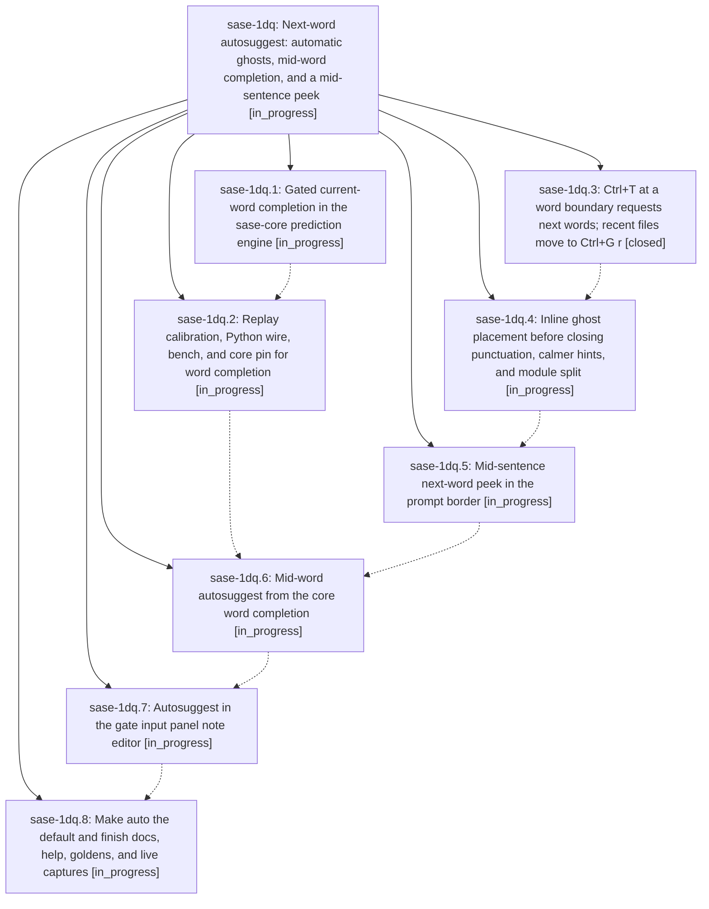

# Bead: sase-1dq — Next-word autosuggest: automatic ghosts, mid-word completion, and a mid-sentence peek

[Bead Pages](../README.md) / sase-1dq

**Status:** ◐ in_progress · **Type:** ▸ plan · **Tier:** epic
**Owner:** `bryanbugyi34@gmail.com` · **Created by:** [bbugyi200.athena.0u0](https://github.com/sase-org/sase--agents/blob/main/sessions/bbugyi200.athena.0u0.md) · **Assignee:** `sase-1dq.land`
**Created:** 2026-09-30 16:38:19 EDT
**Plan:** [202609/next\_word\_autosuggest.md](https://github.com/sase-org/sase--plans/blob/main/202609/next_word_autosuggest.md)

## Description

Confident next-word guesses appear automatically as you type in the prompt input, with no Ctrl+T needed to see them. They complete the word you are typing, and they appear at line ends, before closing punctuation, and as a calm bordered peek in the middle of a sentence. The prose text never jumps. Ctrl+T after a space asks for the next words, and the recent-files menu moves to Ctrl+G r. The plan and gate feedback note editor gets the same autosuggest.

## Phases

| Bead | Title | Status | Size | Created | Agents | Commits |
|---|---|---|---|---|---:|---:|
| [sase-1dq.1](sase-1dq.1.md) | Gated current-word completion in the sase-core prediction engine | ◐ in_progress | medium | 2026-09-30 | 1 | 0 |
| [sase-1dq.2](sase-1dq.2.md) | Replay calibration, Python wire, bench, and core pin for word completion | ◐ in_progress | medium | 2026-09-30 | 1 | 0 |
| [sase-1dq.3](sase-1dq.3.md) | Ctrl+T at a word boundary requests next words; recent files move to Ctrl+G r | ✓ closed | small | 2026-09-30 | 1 | 1 |
| [sase-1dq.4](sase-1dq.4.md) | Inline ghost placement before closing punctuation, calmer hints, and module split | ◐ in_progress | medium | 2026-09-30 | 1 | 0 |
| [sase-1dq.5](sase-1dq.5.md) | Mid-sentence next-word peek in the prompt border | ◐ in_progress | medium | 2026-09-30 | 1 | 0 |
| [sase-1dq.6](sase-1dq.6.md) | Mid-word autosuggest from the core word completion | ◐ in_progress | medium | 2026-09-30 | 1 | 0 |
| [sase-1dq.7](sase-1dq.7.md) | Autosuggest in the gate input panel note editor | ◐ in_progress | medium | 2026-09-30 | 1 | 0 |
| [sase-1dq.8](sase-1dq.8.md) | Make auto the default and finish docs, help, goldens, and live captures | ◐ in_progress | small | 2026-09-30 | 1 | 0 |

## Lineage

## Agents

| Agent | Bead | Commits |
|---|---|---:|
| [bbugyi200.athena.sase-1dq.1](https://github.com/sase-org/sase--agents/blob/main/sessions/bbugyi200.athena.sase-1dq.1.md) | [sase-1dq.1](sase-1dq.1.md) | 0 |
| [bbugyi200.athena.sase-1dq.2](https://github.com/sase-org/sase--agents/blob/main/agents/bbugyi200.athena.sase-1dq.2/README.md) | [sase-1dq.2](sase-1dq.2.md) | 0 |
| [bbugyi200.athena.sase-1dq.3](https://github.com/sase-org/sase--agents/blob/main/sessions/bbugyi200.athena.sase-1dq.3.md) | [sase-1dq.3](sase-1dq.3.md) | 1 |
| [bbugyi200.athena.sase-1dq.4](https://github.com/sase-org/sase--agents/blob/main/agents/bbugyi200.athena.sase-1dq.4/README.md) | [sase-1dq.4](sase-1dq.4.md) | 0 |
| [bbugyi200.athena.sase-1dq.5](https://github.com/sase-org/sase--agents/blob/main/agents/bbugyi200.athena.sase-1dq.5/README.md) | [sase-1dq.5](sase-1dq.5.md) | 0 |
| [bbugyi200.athena.sase-1dq.6](https://github.com/sase-org/sase--agents/blob/main/agents/bbugyi200.athena.sase-1dq.6/README.md) | [sase-1dq.6](sase-1dq.6.md) | 0 |
| [bbugyi200.athena.sase-1dq.7](https://github.com/sase-org/sase--agents/blob/main/agents/bbugyi200.athena.sase-1dq.7/README.md) | [sase-1dq.7](sase-1dq.7.md) | 0 |
| [bbugyi200.athena.sase-1dq.8](https://github.com/sase-org/sase--agents/blob/main/agents/bbugyi200.athena.sase-1dq.8/README.md) | [sase-1dq.8](sase-1dq.8.md) | 0 |
| [bbugyi200.athena.sase-1dq.land](https://github.com/sase-org/sase--agents/blob/main/agents/bbugyi200.athena.sase-1dq.land/README.md) | [sase-1dq](README.md) | 0 |

## Commits

| Repo | Commit | Subject | Bead | Committed |
|---|---|---|---|---|
| sase | [`4094a63`](https://github.com/sase-org/sase/commit/4094a6391a8c1645cdf3d4ba0233d57eae481d38) | feat(tui): boundary Ctrl+T requests next word, recent files move to Ctrl+G r (sase-1dq.3) | [sase-1dq.3](sase-1dq.3.md) | 2026-09-30 18:28:44 EDT |
