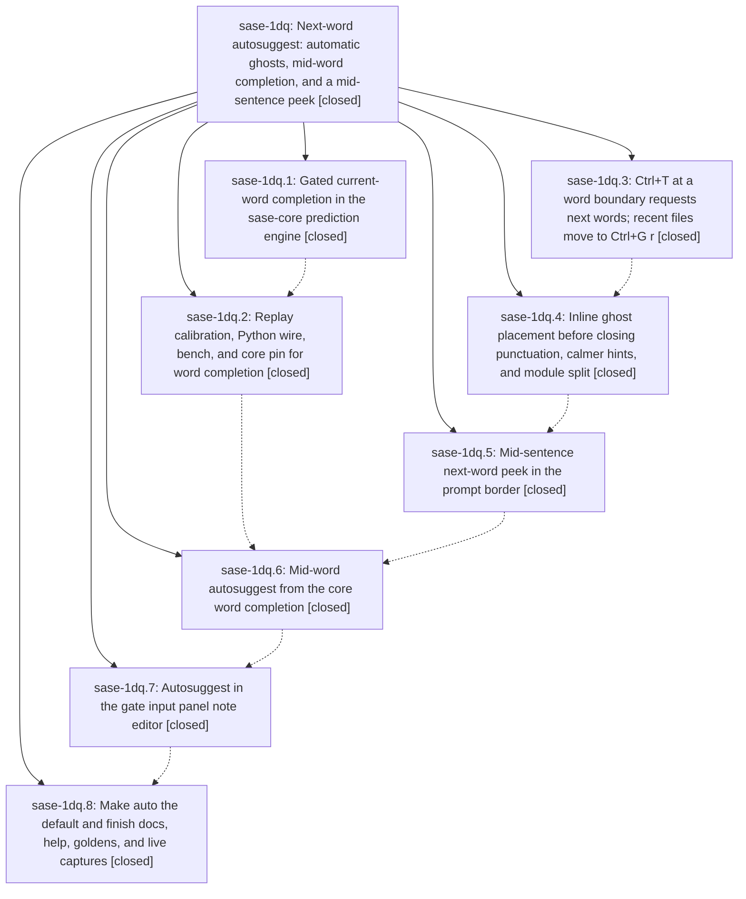

# Bead: sase-1dq — Next-word autosuggest: automatic ghosts, mid-word completion, and a mid-sentence peek

[Bead Pages](../README.md) / sase-1dq

**Status:** ✓ closed · **Resolution:** done · **Type:** ▸ plan · **Tier:** epic
**Owner:** `bryanbugyi34@gmail.com` · **Created by:** [bbugyi200.athena.0u0](https://github.com/sase-org/sase--agents/blob/main/sessions/bbugyi200.athena.0u0.md) · **Assignee:** `sase-1dq.land`
**Created:** 2026-09-30 16:38:19 EDT · **Closed:** 2026-10-01 07:28:01 EDT
**Plan:** [202609/next\_word\_autosuggest.md](https://github.com/sase-org/sase--plans/blob/main/202609/next_word_autosuggest.md)

## Description

Confident next-word guesses appear automatically as you type in the prompt input, with no Ctrl+T needed to see them. They complete the word you are typing, and they appear at line ends, before closing punctuation, and as a calm bordered peek in the middle of a sentence. The prose text never jumps. Ctrl+T after a space asks for the next words, and the recent-files menu moves to Ctrl+G r. The plan and gate feedback note editor gets the same autosuggest.

## Notes

[2026-10-01T11:28:01Z · sase-1dq.land] LANDED. Verified all 8 phases against code and commits (4094a6391a, 7b3d47c3ea, 7255e8cd06, d96d21203c split, 41b2bc5035, e2cec539ef, 3cc13e4ebf, 0abe894140; sase-core cd26011 + d7f802c, pin 62788b4 past both). Auto is the default in default_config.yml, schema, PromptCompletionSettings, _parse_next_word_mode, ghost-state fallback, and configuration.md; docs/ace.md Next-word narrative and help modal (Ctrl+T/Ctrl+L, Ctrl+G r) are current; Ctrl+G r survived the g-prefix module splits (8bbee1883b, 8fdead6466); the docs-refresh commits 6b600f54e2/7d2c8e0caa agree with final behavior. Visual goldens check clean (next_word, gate_input_panel, prompt_stack/editing/word_completion/history/inputs, mini_xprompt: 49 unchanged; rerun after fixes 16 unchanged). sase-core ignored release perf test, never run by sase-1dq.1, now run: prefix_p95_ms=0.663, predict_p95 1.392, archive_p95 1.738, compile per_1k 262.5, all at or better than the documented dev-profile baseline. facade tests 18 pass (incl. midword replay report).

Epic-caused fixes in this landing: (1) fit_next_word_ghost was left dead by sase-1dq.4 (its only caller moved to fit_next_word_ghost_with_tail), so it is deleted and its cases moved to fit_next_word_ghost_with_tail(tail=""). (2) The live screenshot walk (plan section 9) found that a ghost typed through by consumed keystrokes never showed its [^T] word [^L] all hint: the reveal beat kept the pre-keystroke snapshot. _maybe_auto_next_word_ghost now restarts the beat for a still-visible ghost (prompt and gate note). (3) In auto mode a typed space arms the chain, so a boundary Ctrl+T miss took ladder row 3 and lost the [^G r] recent files hint. The new _explicit_next_word_ctrl_t teaches it whenever no token is under the cursor. Each fix has a regression test that fails without it. 213 next-word/gate/completion tests pass. Live walk in auto mode (tmux text captures; PNG export blocked by the host's nonstop 250ms artifact-refresh timer): mid-word ghost "he" to "lp me", Ctrl+T, Ctrl+L, delayed hint, mid-sentence peek "⇢ help" plus redundancy trim, Ctrl+T spacing, ghost before ")", Right steps past ")", Backspace silence, "no next-word guess  [^G r] recent files", and Ctrl+G r menu all OK. The gate note is covered by its golden and pilot tests. sase tool run check (cdcd017e9d742389d28d342dc6bf0c0d): 6095 passed. Its only failures are master-side: stale sase-1dr.6 --epic-symbol entries (recorded on sase-1dr) and flakes sase-1ak and sase-1al, both +1'd and passing in isolation.

Follow-up triage: symvision HandoffSubmitResult/StarterResolution/owner_ref (sase-1dq.2--4, .6--1, .7) +1 sase-1dn; fit_next_word_ghost epic-caused, fixed here. get_unread_set_generation siblings (sase-1dq.4) declined: no longer flagged on master. test_replay_report_carries_midword_section (sase-1dq.6) declined: passes on master (stale wheel). config_schema_repositories (sase-1dq.2--5) and artifact-dir audit are sase-1de items, already +1'd by sase-1dq.3--1. agent_header_panel ImportError and contract_manifest +1 sase-1dh. partial_launch_cleanup and force_reuse x2 (history_text mocks) +1 sase-1cm. app_import_budget 3499>3485 +1 sase-13p (no next-word module in the app import closure). kind_coverage memory/history:at, completion snapshot drift (only sase/memory/history), memory_log blob_oid, parser_command_help memory history, and axe home-mode index update 4!=3 (297faf1d38) were recorded as a DISCOVERED ISSUE on active epic sase-1dr. No new task beads were needed.

[2026-10-01T11:30:20Z · sase-1dq.land] Post-close addendum (land agent): the live-walk PNG export failure is not caused by this epic. The prompt-input artifact-change defer (5ca849369c) re-arms a 0.25s one-shot timer forever while a prompt is open, and screenshot settling (951b7c9068) waits on it. Filed as task sase-1dw (bug, small). The walk was verified via tmux text captures instead.

## Phases

| Bead | Title | Status | Size | Created | Agents | Commits |
|---|---|---|---|---|---:|---:|
| [sase-1dq.1](sase-1dq.1.md) | Gated current-word completion in the sase-core prediction engine | ✓ closed | medium | 2026-09-30 | 1 | 1 |
| [sase-1dq.2](sase-1dq.2.md) | Replay calibration, Python wire, bench, and core pin for word completion | ✓ closed | medium | 2026-09-30 | 1 | 2 |
| [sase-1dq.3](sase-1dq.3.md) | Ctrl+T at a word boundary requests next words; recent files move to Ctrl+G r | ✓ closed | small | 2026-09-30 | 1 | 1 |
| [sase-1dq.4](sase-1dq.4.md) | Inline ghost placement before closing punctuation, calmer hints, and module split | ✓ closed | medium | 2026-09-30 | 1 | 1 |
| [sase-1dq.5](sase-1dq.5.md) | Mid-sentence next-word peek in the prompt border | ✓ closed | medium | 2026-09-30 | 1 | 1 |
| [sase-1dq.6](sase-1dq.6.md) | Mid-word autosuggest from the core word completion | ✓ closed | medium | 2026-09-30 | 1 | 1 |
| [sase-1dq.7](sase-1dq.7.md) | Autosuggest in the gate input panel note editor | ✓ closed | medium | 2026-09-30 | 1 | 1 |
| [sase-1dq.8](sase-1dq.8.md) | Make auto the default and finish docs, help, goldens, and live captures | ✓ closed | small | 2026-09-30 | 1 | 1 |

## Lineage

## Agents

| Agent | Bead | Commits |
|---|---|---:|
| [bbugyi200.athena.sase-1dq.1](https://github.com/sase-org/sase--agents/blob/main/agents/bbugyi200.athena.sase-1dq.1/README.md) | [sase-1dq.1](sase-1dq.1.md) | 1 |
| [bbugyi200.athena.sase-1dq.2](https://github.com/sase-org/sase--agents/blob/main/sessions/bbugyi200.athena.sase-1dq.2.md) | [sase-1dq.2](sase-1dq.2.md) | 2 |
| [bbugyi200.athena.sase-1dq.3](https://github.com/sase-org/sase--agents/blob/main/sessions/bbugyi200.athena.sase-1dq.3.md) | [sase-1dq.3](sase-1dq.3.md) | 1 |
| [bbugyi200.athena.sase-1dq.4](https://github.com/sase-org/sase--agents/blob/main/agents/bbugyi200.athena.sase-1dq.4/README.md) | [sase-1dq.4](sase-1dq.4.md) | 1 |
| [bbugyi200.athena.sase-1dq.5](https://github.com/sase-org/sase--agents/blob/main/agents/bbugyi200.athena.sase-1dq.5/README.md) | [sase-1dq.5](sase-1dq.5.md) | 1 |
| [bbugyi200.athena.sase-1dq.6](https://github.com/sase-org/sase--agents/blob/main/sessions/bbugyi200.athena.sase-1dq.6.md) | [sase-1dq.6](sase-1dq.6.md) | 1 |
| [bbugyi200.athena.sase-1dq.7](https://github.com/sase-org/sase--agents/blob/main/agents/bbugyi200.athena.sase-1dq.7/README.md) | [sase-1dq.7](sase-1dq.7.md) | 1 |
| [bbugyi200.athena.sase-1dq.8](https://github.com/sase-org/sase--agents/blob/main/sessions/bbugyi200.athena.sase-1dq.8.md) | [sase-1dq.8](sase-1dq.8.md) | 1 |
| [bbugyi200.athena.sase-1dq.land](https://github.com/sase-org/sase--agents/blob/main/agents/bbugyi200.athena.sase-1dq.land/README.md) | [sase-1dq](README.md) | 2 |

## Commits

| Repo | Commit | Subject | Bead | Committed |
|---|---|---|---|---|
| sase | [`4094a63`](https://github.com/sase-org/sase/commit/4094a6391a8c1645cdf3d4ba0233d57eae481d38) | feat(tui): boundary Ctrl+T requests next word, recent files move to Ctrl+G r (sase-1dq.3) | [sase-1dq.3](sase-1dq.3.md) | 2026-09-30 18:28:44 EDT |
| sase | [`7b3d47c`](https://github.com/sase-org/sase/commit/7b3d47c3ea9a0c43d8c179658fcd3b0179397951) | feat(ace-tui): next-word ghost placement, display mixin and prompt integration | [sase-1dq.4](sase-1dq.4.md) | 2026-09-30 19:37:33 EDT |
| sase | [`7255e8c`](https://github.com/sase-org/sase/commit/7255e8cd06e9e43f05bcec1d04ccfa49d78e6d49) | feat(ace-tui): mid-sentence next-word peek in the prompt border (sase-1dq.5) | [sase-1dq.5](sase-1dq.5.md) | 2026-09-30 21:21:55 EDT |
| sase-core | [`sase-core@cd26011`](https://github.com/sase-org/sase-core/commit/cd260110a21a217c19de585584e7f83260d2986d) | feat(prompt\_prediction): gated current-word completion | [sase-1dq.1](sase-1dq.1.md) | 2026-09-30 22:39:26 EDT |
| sase-core | [`sase-core@d7f802c`](https://github.com/sase-org/sase-core/commit/d7f802c5f4d6e37b97228e16fe17ce7ebe726d6e) | feat(prompt-prediction): mid-word replay metrics and eager min\_prefix\_chars 2 (sase-1dq.2) | [sase-1dq.2](sase-1dq.2.md) | 2026-10-01 01:26:18 EDT |
| sase | [`41b2bc5`](https://github.com/sase-org/sase/commit/41b2bc5035f91b98196b46be0b30781337afb8f4) | feat(prompt-prediction): calibrate current-word completion thresholds, wire, bench, and docs (sase-1dq.2) | [sase-1dq.2](sase-1dq.2.md) | 2026-10-01 02:14:14 EDT |
| sase | [`e2cec53`](https://github.com/sase-org/sase/commit/e2cec539ef49d0bf7edacd9e17f9f458880c4119) | feat(ace): add next-word midword ghost completion and peek display | [sase-1dq.6](sase-1dq.6.md) | 2026-10-01 04:11:29 EDT |
| sase | [`3cc13e4`](https://github.com/sase-org/sase/commit/3cc13e4ebf31f78b202bd449e59fe0b0d7f767e5) | feat(ace): add next-word autosuggest to gate note editor | [sase-1dq.7](sase-1dq.7.md) | 2026-10-01 04:46:14 EDT |
| sase | [`0abe894`](https://github.com/sase-org/sase/commit/0abe8941403e1c230e4bee2df19b22e22f2b399a) | feat(ace): complete bead sase-1dq.8 next-word and prompt completion work | [sase-1dq.8](sase-1dq.8.md) | 2026-10-01 06:00:14 EDT |
| sase | [`4f91c2d`](https://github.com/sase-org/sase/commit/4f91c2dfccd80b53008cba824da8bdf369368a6d) | fix(ace): land sase-1dq next-word autosuggest | [sase-1dq](README.md) | 2026-10-01 07:31:45 EDT |
| sase--plans | [`sase--plans@0c82803`](https://github.com/sase-org/sase--plans/commit/0c82803d105a4ff4bac286d8585a2cce6fa69b11) | chore(plans): mark next\_word\_autosuggest plan done (sase-1dq) | [sase-1dq](README.md) | 2026-10-01 07:35:38 EDT |

<!-- sase:referenced-by:start -->

## Referenced By

| Relation | Artifact | Why | Uses |
| --- | --- | --- | ---: |
| read-by | [agent:sase-1dq.land][1] | Need the epic scope, children, and linked plan file | 2 |

[1]: https://github.com/sase-org/sase--agents/blob/main/agents/bbugyi200.athena.sase-1dq.land/README.md

<!-- sase:referenced-by:end -->
