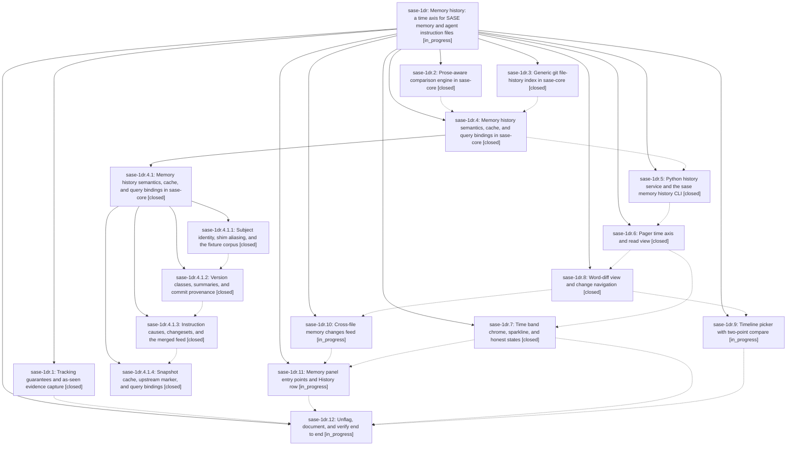

# Bead: sase-1dr — Memory history: a time axis for SASE memory and agent instruction files

[Bead Pages](../README.md) / sase-1dr

**Status:** ◐ in_progress · **Type:** ▸ plan · **Tier:** epic
**Owner:** `bryanbugyi34@gmail.com` · **Created by:** [bbugyi200.apollo.3o](https://github.com/sase-org/sase--agents/blob/main/sessions/bbugyi200.apollo.3o.md) · **Assignee:** `sase-1dr.land`
**Created:** 2026-09-30 19:09:13 EDT
**Plan:** [202609/memory\_history.md](https://github.com/sase-org/sase--plans/blob/main/202609/memory_history.md)

<!-- sase:links:start -->

## Links

| Relation | Artifact | Why |
| --- | --- | --- |
| implemented-by | [plan:202609/memory_history.md][1] | derived from the plan's `bead_id:` frontmatter field |

_Plus 4 automatic references — see [Referenced By](#referenced-by)._

[1]: https://github.com/sase-org/sase--plans/blob/main/202609/memory_history.md

<!-- sase:links:end -->

## Description

Every committed version of every SASE memory note, web, strand, and agent instruction file (AGENTS.md plus its provider shims, project and home) can be browsed quickly and understood at a glance. The pager is the single place where history is read, and it can be reached from the Memory panel, a cross-file changes feed, and `sase memory history` (which also has JSON output for agents). Git remains the only store. A disposable, incremental metadata index in sase-core provides the speed. Tracking gaps and dirty states are always visible, never hidden.

## Notes

[2026-10-01T10:24:25Z · sase-1dq.land] DISCOVERED ISSUE (from sase-1dq land verification on clean master 0abe894140; first proposed by sase-1dq.8--1): six check failures trace to this epic. (1) tests/completion/test_kind_coverage.py::test_every_value_slot_is_kinded_choiced_or_hinted: uncaptioned value slot memory/history:at. (2) tests/completion/test_snapshot.py (no_drift + structural_view): the only drifted node is the new sase/memory/history subcommand; regenerate cli_spec.json. (3) tests/main/test_memory_log.py::test_memory_log_json_id_outputs_raw_event: raw event now carries blob_oid and included_blob_oids (as-seen evidence capture). (4) tests/main/test_parser_command_help.py::test_memory_help_marks_primary_command_and_init_alias: memory help now lists history. (5) tests/test_axe_run_agent_runner_started_at.py::TestRunStartedAtRecording::test_home_mode_running_marker_cleanup_updates_artifact_index: setup index update called 4 times, expected 3, after 297faf1d38 (sase-1dr.1) added write_agent_meta in run_agent_runner_launch. (6) just symvision now errors because the Justfile --epic-symbol 'sase-1dr.6(is_hidden_by_default)' and 'sase-1dr.6(label_for)' entries are keyed to closed sase-1dr.6; re-key them to an open sase-1dr phase that consumes them, or resolve the symbols.

## Phases

| Bead | Title | Status | Size | Created | Agents | Commits |
|---|---|---|---|---|---:|---:|
| [sase-1dr.1](sase-1dr.1.md) | Tracking guarantees and as-seen evidence capture | ✓ closed | medium | 2026-09-30 | 1 | 1 |
| [sase-1dr.10](sase-1dr.10.md) | Cross-file memory changes feed | ◐ in_progress | medium | 2026-09-30 | 1 | 0 |
| [sase-1dr.11](sase-1dr.11.md) | Memory panel entry points and History row | ◐ in_progress | medium | 2026-09-30 | 1 | 0 |
| [sase-1dr.12](sase-1dr.12.md) | Unflag, document, and verify end to end | ◐ in_progress | small | 2026-09-30 | 1 | 0 |
| [sase-1dr.2](sase-1dr.2.md) | Prose-aware comparison engine in sase-core | ✓ closed | medium | 2026-09-30 | 1 | 1 |
| [sase-1dr.3](sase-1dr.3.md) | Generic git file-history index in sase-core | ✓ closed | medium | 2026-09-30 | 1 | 1 |
| [sase-1dr.4](sase-1dr.4.md) | Memory history semantics, cache, and query bindings in sase-core | ✓ closed | large | 2026-09-30 | 1 | 0 |
| [sase-1dr.5](sase-1dr.5.md) | Python history service and the sase memory history CLI | ✓ closed | medium | 2026-09-30 | 1 | 2 |
| [sase-1dr.6](sase-1dr.6.md) | Pager time axis and read view | ✓ closed | large | 2026-09-30 | 1 | 1 |
| [sase-1dr.7](sase-1dr.7.md) | Time band chrome, sparkline, and honest states | ✓ closed | medium | 2026-09-30 | 1 | 1 |
| [sase-1dr.8](sase-1dr.8.md) | Word-diff view and change navigation | ✓ closed | medium | 2026-09-30 | 1 | 1 |
| [sase-1dr.9](sase-1dr.9.md) | Timeline picker with two-point compare | ◐ in_progress | medium | 2026-09-30 | 1 | 0 |

## Lineage

## Agents

| Agent | Bead | Commits |
|---|---|---:|
| [bbugyi200.apollo.sase-1dr.1](https://github.com/sase-org/sase--agents/blob/main/sessions/bbugyi200.apollo.sase-1dr.1.md) | [sase-1dr.1](sase-1dr.1.md) | 1 |
| [bbugyi200.apollo.sase-1dr.10](https://github.com/sase-org/sase--agents/blob/main/sessions/bbugyi200.apollo.sase-1dr.10.md) | [sase-1dr.10](sase-1dr.10.md) | 0 |
| [bbugyi200.apollo.sase-1dr.11](https://github.com/sase-org/sase--agents/blob/main/agents/bbugyi200.apollo.sase-1dr.11/README.md) | [sase-1dr.11](sase-1dr.11.md) | 0 |
| [bbugyi200.apollo.sase-1dr.12](https://github.com/sase-org/sase--agents/blob/main/agents/bbugyi200.apollo.sase-1dr.12/README.md) | [sase-1dr.12](sase-1dr.12.md) | 0 |
| [bbugyi200.apollo.sase-1dr.2](https://github.com/sase-org/sase--agents/blob/main/agents/bbugyi200.apollo.sase-1dr.2/README.md) | [sase-1dr.2](sase-1dr.2.md) | 1 |
| [bbugyi200.apollo.sase-1dr.3](https://github.com/sase-org/sase--agents/blob/main/agents/bbugyi200.apollo.sase-1dr.3/README.md) | [sase-1dr.3](sase-1dr.3.md) | 1 |
| [bbugyi200.apollo.sase-1dr.4](https://github.com/sase-org/sase--agents/blob/main/sessions/bbugyi200.apollo.sase-1dr.4.md) | [sase-1dr.4](sase-1dr.4.md) | 0 |
| [bbugyi200.apollo.sase-1dr.4.1.1](https://github.com/sase-org/sase--agents/blob/main/agents/bbugyi200.apollo.sase-1dr.4.1.1/README.md) | [sase-1dr.4.1.1](sase-1dr.4.1.1.md) | 1 |
| [bbugyi200.apollo.sase-1dr.4.1.2](https://github.com/sase-org/sase--agents/blob/main/agents/bbugyi200.apollo.sase-1dr.4.1.2/README.md) | [sase-1dr.4.1.2](sase-1dr.4.1.2.md) | 1 |
| [bbugyi200.apollo.sase-1dr.4.1.3](https://github.com/sase-org/sase--agents/blob/main/agents/bbugyi200.apollo.sase-1dr.4.1.3/README.md) | [sase-1dr.4.1.3](sase-1dr.4.1.3.md) | 1 |
| [bbugyi200.apollo.sase-1dr.4.1.4](https://github.com/sase-org/sase--agents/blob/main/agents/bbugyi200.apollo.sase-1dr.4.1.4/README.md) | [sase-1dr.4.1.4](sase-1dr.4.1.4.md) | 1 |
| [bbugyi200.apollo.sase-1dr.4.1.land](https://github.com/sase-org/sase--agents/blob/main/agents/bbugyi200.apollo.sase-1dr.4.1.land/README.md) | [sase-1dr.4.1](sase-1dr.4.1.md) | 1 |
| [bbugyi200.apollo.sase-1dr.5](https://github.com/sase-org/sase--agents/blob/main/sessions/bbugyi200.apollo.sase-1dr.5.md) | [sase-1dr.5](sase-1dr.5.md) | 2 |
| [bbugyi200.apollo.sase-1dr.6](https://github.com/sase-org/sase--agents/blob/main/sessions/bbugyi200.apollo.sase-1dr.6.md) | [sase-1dr.6](sase-1dr.6.md) | 1 |
| [bbugyi200.apollo.sase-1dr.7](https://github.com/sase-org/sase--agents/blob/main/sessions/bbugyi200.apollo.sase-1dr.7.md) | [sase-1dr.7](sase-1dr.7.md) | 1 |
| [bbugyi200.apollo.sase-1dr.8](https://github.com/sase-org/sase--agents/blob/main/agents/bbugyi200.apollo.sase-1dr.8/README.md) | [sase-1dr.8](sase-1dr.8.md) | 1 |
| [bbugyi200.apollo.sase-1dr.9](https://github.com/sase-org/sase--agents/blob/main/agents/bbugyi200.apollo.sase-1dr.9/README.md) | [sase-1dr.9](sase-1dr.9.md) | 0 |
| [bbugyi200.apollo.sase-1dr.land](https://github.com/sase-org/sase--agents/blob/main/agents/bbugyi200.apollo.sase-1dr.land/README.md) | [sase-1dr](README.md) | 0 |

## Commits

| Repo | Commit | Subject | Bead | Committed |
|---|---|---|---|---|
| sase-core | [`sase-core@3b27df5`](https://github.com/sase-org/sase-core/commit/3b27df51a78b33be41429b0adb7ed869c05eb1fe) | feat(prose-diff): add pure sase-core prose\_diff module and Python binding | [sase-1dr.2](sase-1dr.2.md) | 2026-09-30 20:11:23 EDT |
| sase-core | [`sase-core@a031ee4`](https://github.com/sase-org/sase-core/commit/a031ee4fe9e887a4563f2a6748b4b277ce5a21ed) | feat(file-history): generic git file-history index in sase-core | [sase-1dr.3](sase-1dr.3.md) | 2026-09-30 20:20:42 EDT |
| sase-core | [`sase-core@26ffc55`](https://github.com/sase-org/sase-core/commit/26ffc55d33c3c25a8a0806834cc51e9e6349ed7e) | feat(memory-history): subject identity, shim aliasing, and fixture corpus | [sase-1dr.4.1.1](sase-1dr.4.1.1.md) | 2026-09-30 21:26:16 EDT |
| sase-core | [`sase-core@1c49a65`](https://github.com/sase-org/sase-core/commit/1c49a650c66f5ad05e3c860549abecffe1bc6789) | feat(memory-history): add subject classifier with priority list and summary | [sase-1dr.4.1.2](sase-1dr.4.1.2.md) | 2026-09-30 22:04:25 EDT |
| sase-core | [`sase-core@f15f538`](https://github.com/sase-org/sase-core/commit/f15f5385b1c14fcf165714d931be2b056db0c358) | feat(memory-history): attribute instruction causes and build merged feed | [sase-1dr.4.1.3](sase-1dr.4.1.3.md) | 2026-09-30 22:42:14 EDT |
| sase | [`297faf1`](https://github.com/sase-org/sase/commit/297faf1d381032a7bacbc2594ff2a793e05ba995) | feat(memory): tracking guarantees and as-seen evidence capture | [sase-1dr.1](sase-1dr.1.md) | 2026-09-30 22:44:48 EDT |
| sase-core | [`sase-core@11f29c3`](https://github.com/sase-org/sase-core/commit/11f29c3385acfd4d2e2f165192b796b8b954d731) | feat(memory-history): add cache-backed query layer with python bindings | [sase-1dr.4.1.4](sase-1dr.4.1.4.md) | 2026-09-30 23:38:21 EDT |
| sase--plans | [`sase--plans@7d55fe6`](https://github.com/sase-org/sase--plans/commit/7d55fe66d5b58923ddbcb3fb169c48bf2f8a3072) | docs(plan): mark the memory history core epic done | [sase-1dr.4.1](sase-1dr.4.1.md) | 2026-10-01 00:29:43 EDT |
| sase-core | [`sase-core@62788b4`](https://github.com/sase-org/sase-core/commit/62788b4004039c1e119e7dcee61b29309bfd2505) | feat(sase-1dr.5): file history runner support in sase-core | [sase-1dr.5](sase-1dr.5.md) | 2026-10-01 02:21:24 EDT |
| sase | [`ebf070e`](https://github.com/sase-org/sase/commit/ebf070e16ae0b24bf889d582c574d01752bb6d54) | fix(sase-1dr.5): resolve phase-owned symvision failures in memory history | [sase-1dr.5](sase-1dr.5.md) | 2026-10-01 02:52:07 EDT |
| sase | [`92c6337`](https://github.com/sase-org/sase/commit/92c6337de85b89f42b15a481a474f84091139aeb) | feat(sase-1dr.6): pager time axis and read view with memory provider, plus completion snapshot sync | [sase-1dr.6](sase-1dr.6.md) | 2026-10-01 06:46:04 EDT |
| sase | [`7884ffe`](https://github.com/sase-org/sase/commit/7884ffe854e52e7ff7d39d56eb3cfb8e82197dd3) | feat(sase-1dr.8): word-diff view and change navigation | [sase-1dr.8](sase-1dr.8.md) | 2026-10-01 08:18:03 EDT |
| sase | [`3819d25`](https://github.com/sase-org/sase/commit/3819d254b3fe669eb2afcf7b4f64d04d1e94a248) | feat(sase-1dr.7): pager time band with sparkline, honest states, and PNG goldens | [sase-1dr.7](sase-1dr.7.md) | 2026-10-01 09:02:52 EDT |

<!-- sase:referenced-by:start -->

## Referenced By

| Relation | Artifact | Why | Uses |
| --- | --- | --- | ---: |
| read-by | [agent:sase-1dq.land][1] | Check status of sase-1dr epic whose stale epic-symbol entries break symvision | 3 |
| read-by | [agent:sase-1dr.3][2] | Need epic children status for phase ordering | 1 |
| read-by | [agent:sase-1dr.4.1.land][3] | Need whether the containing epic is still open for its land agent | 1 |
| read-by | [agent:sase-1dr.8][4] | Need epic context for diff-view phase | 1 |

[1]: https://github.com/sase-org/sase--agents/blob/main/agents/bbugyi200.apollo.sase-1dq.land/README.md
[2]: https://github.com/sase-org/sase--agents/blob/main/agents/bbugyi200.apollo.sase-1dr.3/README.md
[3]: https://github.com/sase-org/sase--agents/blob/main/agents/bbugyi200.apollo.sase-1dr.4.1.land/README.md
[4]: https://github.com/sase-org/sase--agents/blob/main/agents/bbugyi200.apollo.sase-1dr.8/README.md

<!-- sase:referenced-by:end -->
