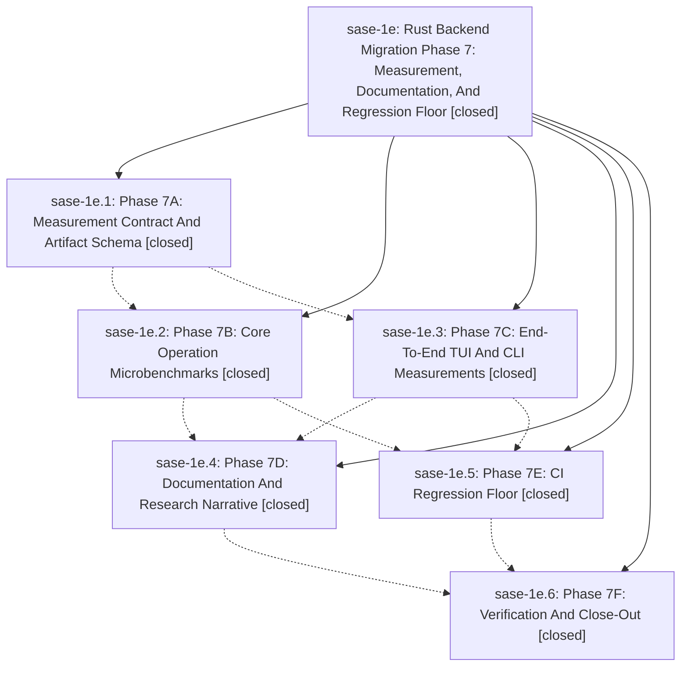

# Bead: sase-1e — Rust Backend Migration Phase 7: Measurement, Documentation, And Regression Floor

[Bead Pages](../README.md) / sase-1e

**Status:** ✓ closed · **Resolution:** (unrecorded) · **Type:** plan · **Tier:** epic
**Owner:** `bryanbugyi34@gmail.com`
**Created:** 2026-04-29 21:52:50 UTC · **Closed:** 2026-04-29 23:03:15 UTC
**Plan:** [202604/rust\_backend\_phase7.md](https://github.com/sase-org/sase--plans/blob/main/202604/rust_backend_phase7.md)

## Phases

| Bead | Title | Status | Size | Agents | Commits |
|---|---|---|---|---:|---:|
| [sase-1e.1](sase-1e.1.md) | Phase 7A: Measurement Contract And Artifact Schema | ✓ closed | small | 0 | 1 |
| [sase-1e.2](sase-1e.2.md) | Phase 7B: Core Operation Microbenchmarks | ✓ closed | small | 0 | 1 |
| [sase-1e.3](sase-1e.3.md) | Phase 7C: End-To-End TUI And CLI Measurements | ✓ closed | small | 0 | 1 |
| [sase-1e.4](sase-1e.4.md) | Phase 7D: Documentation And Research Narrative | ✓ closed | small | 0 | 1 |
| [sase-1e.5](sase-1e.5.md) | Phase 7E: CI Regression Floor | ✓ closed | small | 0 | 1 |
| [sase-1e.6](sase-1e.6.md) | Phase 7F: Verification And Close-Out | ✓ closed | small | 0 | 1 |

## Lineage

## Commits

| Commit | Subject | Bead | Committed (UTC) |
|---|---|---|---|
| [`e0f3b4a`](https://github.com/sase-org/sase/commit/e0f3b4a9f0f4d1ab81a560882ecbaa04bbcf6abe) | chore(perf): Phase 7A Rust-backend measurement contract (sase-1e.1) | [sase-1e.1](sase-1e.1.md) | 2026-04-29 22:08:35 |
| [`738020a`](https://github.com/sase-org/sase/commit/738020a7933faee1df9c227a8ec618231c0b94b9) | chore(perf): Phase 7B core operation microbenchmarks (sase-1e.2) | [sase-1e.2](sase-1e.2.md) | 2026-04-29 22:23:21 |
| [`48ea2ef`](https://github.com/sase-org/sase/commit/48ea2efa87f526932b1748e7b713d475a591f5b0) | chore(perf): Phase 7C end-to-end TUI/CLI measurements (sase-1e.3) | [sase-1e.3](sase-1e.3.md) | 2026-04-29 22:26:39 |
| [`25bfe04`](https://github.com/sase-org/sase/commit/25bfe042d5b2842d5b2097fa80a326f7ead38a49) | chore(perf): Phase 7D documentation and research narrative (sase-1e.4) | [sase-1e.4](sase-1e.4.md) | 2026-04-29 22:36:45 |
| [`19c139f`](https://github.com/sase-org/sase/commit/19c139f7082fe1a3b39e92ee155a87b899d8b9b4) | chore(perf): Phase 7E CI regression floor (sase-1e.5) | [sase-1e.5](sase-1e.5.md) | 2026-04-29 22:41:11 |
| [`e170d4a`](https://github.com/sase-org/sase/commit/e170d4a302bda2d079cdc630ee9882db91652aeb) | chore(perf): Phase 7F verification and close-out (sase-1e.6) | [sase-1e.6](sase-1e.6.md) | 2026-04-29 23:00:43 |
