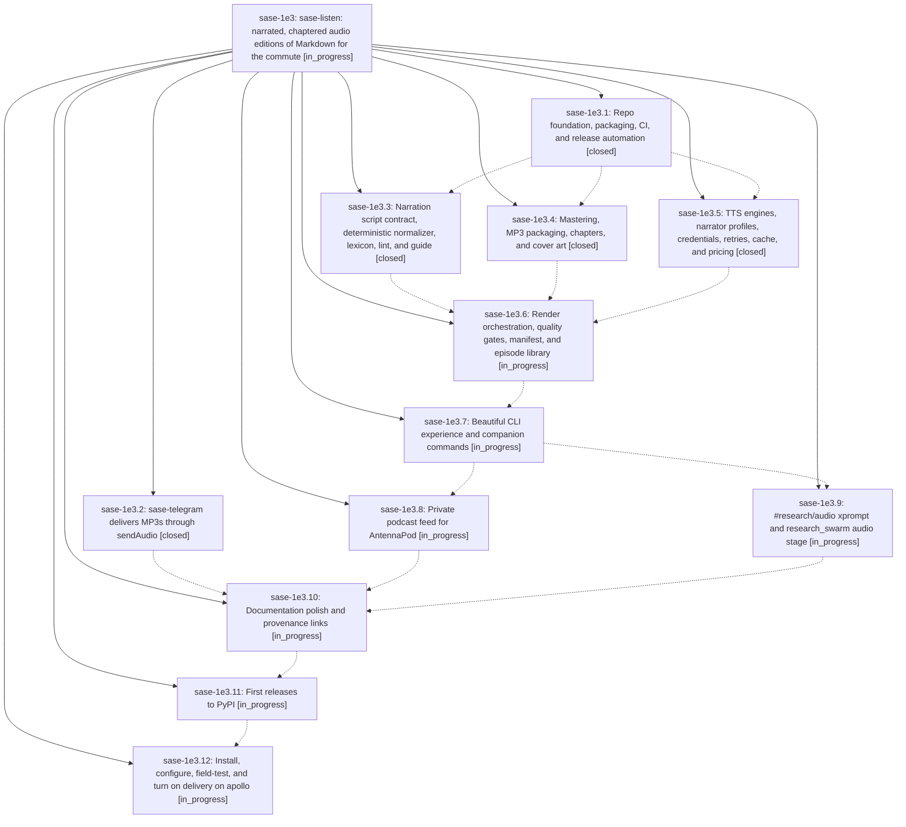

# Bead: sase-1e3 — sase-listen: narrated, chaptered audio editions of Markdown for the commute

[Bead Pages](../README.md) / sase-1e3

**Status:** ◐ in_progress · **Type:** ▸ plan · **Tier:** epic
**Owner:** `bryanbugyi34@gmail.com` · **Created by:** [bbugyi200.apollo.3z](https://github.com/sase-org/sase--agents/blob/main/sessions/bbugyi200.apollo.3z.md) · **Assignee:** `sase-1e3.land`
**Created:** 2026-10-01 14:42:37 EDT
**Plan:** [202610/sase\_listen.md](https://github.com/sase-org/sase--plans/blob/main/202610/sase_listen.md)

<!-- sase:links:start -->

## Links

| Relation | Artifact | Why |
| --- | --- | --- |
| implemented-by | [plan:202610/sase_listen.md][1] | derived from the plan's `bead_id:` frontmatter field |

_Plus 6 automatic references — see [Referenced By](#referenced-by)._

[1]: https://github.com/sase-org/sase--plans/blob/main/202610/sase_listen.md

<!-- sase:links:end -->

## Description

Any SASE research report, or any other Markdown file, becomes a chaptered, loudness-normalized MP3 audio edition from one CLI command or one Telegram message. The episode reaches the phone through Telegram's music player and a private podcast feed. The new public sase-org/sase-listen repo ships with a real description, excellent documentation linked back to the originating research and this plan, CI lint/type/test gates, and automated release-please plus PyPI trusted publishing.

## Phases

| Bead | Title | Status | Size | Created | Agents | Commits |
|---|---|---|---|---|---:|---:|
| [sase-1e3.1](sase-1e3.1.md) | Repo foundation, packaging, CI, and release automation | ✓ closed | medium | 2026-10-01 | 1 | 0 |
| [sase-1e3.10](sase-1e3.10.md) | Documentation polish and provenance links | ◐ in_progress | medium | 2026-10-01 | 1 | 0 |
| [sase-1e3.11](sase-1e3.11.md) | First releases to PyPI | ◐ in_progress | small | 2026-10-01 | 1 | 0 |
| [sase-1e3.12](sase-1e3.12.md) | Install, configure, field-test, and turn on delivery on apollo | ◐ in_progress | medium | 2026-10-01 | 1 | 0 |
| [sase-1e3.2](sase-1e3.2.md) | sase-telegram delivers MP3s through sendAudio | ✓ closed | small | 2026-10-01 | 1 | 0 |
| [sase-1e3.3](sase-1e3.3.md) | Narration script contract, deterministic normalizer, lexicon, lint, and guide | ✓ closed | medium | 2026-10-01 | 1 | 0 |
| [sase-1e3.4](sase-1e3.4.md) | Mastering, MP3 packaging, chapters, and cover art | ✓ closed | medium | 2026-10-01 | 1 | 0 |
| [sase-1e3.5](sase-1e3.5.md) | TTS engines, narrator profiles, credentials, retries, cache, and pricing | ✓ closed | medium | 2026-10-01 | 1 | 0 |
| [sase-1e3.6](sase-1e3.6.md) | Render orchestration, quality gates, manifest, and episode library | ◐ in_progress | medium | 2026-10-01 | 1 | 0 |
| [sase-1e3.7](sase-1e3.7.md) | Beautiful CLI experience and companion commands | ◐ in_progress | medium | 2026-10-01 | 1 | 0 |
| [sase-1e3.8](sase-1e3.8.md) | Private podcast feed for AntennaPod | ◐ in_progress | medium | 2026-10-01 | 1 | 0 |
| [sase-1e3.9](sase-1e3.9.md) | #research/audio xprompt and research\_swarm audio stage | ◐ in_progress | medium | 2026-10-01 | 1 | 0 |

## Lineage

## Agents

| Agent | Bead | Commits |
|---|---|---:|
| [bbugyi200.apollo.sase-1e3.1](https://github.com/sase-org/sase--agents/blob/main/agents/bbugyi200.apollo.sase-1e3.1/README.md) | [sase-1e3.1](sase-1e3.1.md) | 0 |
| [bbugyi200.apollo.sase-1e3.10](https://github.com/sase-org/sase--agents/blob/main/agents/bbugyi200.apollo.sase-1e3.10/README.md) | [sase-1e3.10](sase-1e3.10.md) | 0 |
| [bbugyi200.apollo.sase-1e3.11](https://github.com/sase-org/sase--agents/blob/main/agents/bbugyi200.apollo.sase-1e3.11/README.md) | [sase-1e3.11](sase-1e3.11.md) | 0 |
| [bbugyi200.apollo.sase-1e3.12](https://github.com/sase-org/sase--agents/blob/main/agents/bbugyi200.apollo.sase-1e3.12/README.md) | [sase-1e3.12](sase-1e3.12.md) | 0 |
| [bbugyi200.apollo.sase-1e3.2](https://github.com/sase-org/sase--agents/blob/main/agents/bbugyi200.apollo.sase-1e3.2/README.md) | [sase-1e3.2](sase-1e3.2.md) | 0 |
| [bbugyi200.apollo.sase-1e3.3](https://github.com/sase-org/sase--agents/blob/main/agents/bbugyi200.apollo.sase-1e3.3/README.md) | [sase-1e3.3](sase-1e3.3.md) | 0 |
| [bbugyi200.apollo.sase-1e3.4](https://github.com/sase-org/sase--agents/blob/main/agents/bbugyi200.apollo.sase-1e3.4/README.md) | [sase-1e3.4](sase-1e3.4.md) | 0 |
| [bbugyi200.apollo.sase-1e3.5](https://github.com/sase-org/sase--agents/blob/main/agents/bbugyi200.apollo.sase-1e3.5/README.md) | [sase-1e3.5](sase-1e3.5.md) | 0 |
| [bbugyi200.apollo.sase-1e3.6](https://github.com/sase-org/sase--agents/blob/main/agents/bbugyi200.apollo.sase-1e3.6/README.md) | [sase-1e3.6](sase-1e3.6.md) | 0 |
| [bbugyi200.apollo.sase-1e3.7](https://github.com/sase-org/sase--agents/blob/main/agents/bbugyi200.apollo.sase-1e3.7/README.md) | [sase-1e3.7](sase-1e3.7.md) | 0 |
| [bbugyi200.apollo.sase-1e3.8](https://github.com/sase-org/sase--agents/blob/main/agents/bbugyi200.apollo.sase-1e3.8/README.md) | [sase-1e3.8](sase-1e3.8.md) | 0 |
| [bbugyi200.apollo.sase-1e3.9](https://github.com/sase-org/sase--agents/blob/main/agents/bbugyi200.apollo.sase-1e3.9/README.md) | [sase-1e3.9](sase-1e3.9.md) | 0 |
| [bbugyi200.apollo.sase-1e3.land](https://github.com/sase-org/sase--agents/blob/main/agents/bbugyi200.apollo.sase-1e3.land/README.md) | [sase-1e3](README.md) | 0 |

<!-- sase:referenced-by:start -->

## Referenced By

| Relation | Artifact | Why | Uses |
| --- | --- | --- | ---: |
| read-by | [agent:research.38.cdx][1] | Determine the planned user-facing capabilities and scope of sase-listen | 1 |
| read-by | [agent:research.38.cld][2] | Research what the new sase-listen repo provides to users (research swarm task) | 1 |
| read-by | [agent:research.38.final][3] | Ground consolidated sase-listen report in epic scope and phase status | 1 |
| read-by | [agent:research.38.gem][4] | Research context for what sase-listen provides to users | 1 |
| read-by | [agent:research.38.grk][5] | Need the sase-listen epic context for user-facing research | 1 |
| read-by | [agent:research.38.mus][6] | research sase-listen user value for swarm report | 1 |

[1]: https://github.com/sase-org/sase--agents/blob/main/agents/bbugyi200.apollo.research.38.cdx/README.md
[2]: https://github.com/sase-org/sase--agents/blob/main/agents/bbugyi200.apollo.research.38.cld/README.md
[3]: https://github.com/sase-org/sase--agents/blob/main/agents/bbugyi200.apollo.research.38.final/README.md
[4]: https://github.com/sase-org/sase--agents/blob/main/agents/bbugyi200.apollo.research.38.gem/README.md
[5]: https://github.com/sase-org/sase--agents/blob/main/agents/bbugyi200.apollo.research.38.grk/README.md
[6]: https://github.com/sase-org/sase--agents/blob/main/agents/bbugyi200.apollo.research.38.mus/README.md

<!-- sase:referenced-by:end -->
