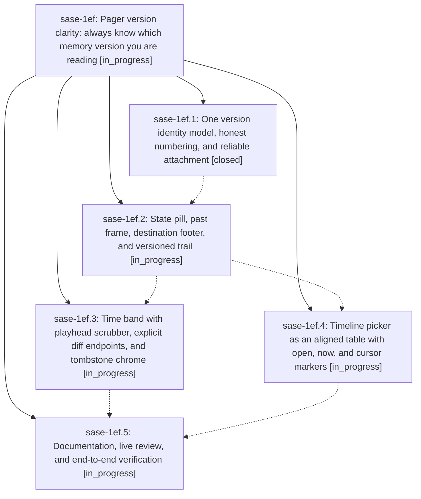

# Bead: sase-1ef — Pager version clarity: always know which memory version you are reading

[Bead Pages](../README.md) / sase-1ef

**Status:** ◐ in_progress · **Type:** ▸ plan · **Tier:** epic
**Owner:** `bryanbugyi34@gmail.com` · **Created by:** [bbugyi200.athena.0v2](https://github.com/sase-org/sase--agents/blob/main/sessions/bbugyi200.athena.0v2.md) · **Assignee:** `sase-1ef.land`
**Created:** 2026-10-01 15:31:45 EDT
**Plan:** [202610/pager\_version\_clarity.md](https://github.com/sase-org/sase--plans/blob/main/202610/pager_version_clarity.md)

## Description

Whenever the SASE pager shows a memory or instruction file, one glance tells you exactly which version you are reading: now, uncommitted, a past version (with its number, its date, and where it sits in the file's life), a deletion, or a comparison between two named versions. Every surface (subject line, time band, body frame, footer, timeline picker, trail) tells the same story from one model. History attaches to every memory section no matter how it was opened, and the design is legible in dark and light themes.

## Phases

| Bead | Title | Status | Size | Created | Agents | Commits |
|---|---|---|---|---|---:|---:|
| [sase-1ef.1](sase-1ef.1.md) | One version identity model, honest numbering, and reliable attachment | ✓ closed | medium | 2026-10-01 | 1 | 1 |
| [sase-1ef.2](sase-1ef.2.md) | State pill, past frame, destination footer, and versioned trail | ◐ in_progress | medium | 2026-10-01 | 1 | 0 |
| [sase-1ef.3](sase-1ef.3.md) | Time band with playhead scrubber, explicit diff endpoints, and tombstone chrome | ◐ in_progress | medium | 2026-10-01 | 1 | 0 |
| [sase-1ef.4](sase-1ef.4.md) | Timeline picker as an aligned table with open, now, and cursor markers | ◐ in_progress | medium | 2026-10-01 | 1 | 0 |
| [sase-1ef.5](sase-1ef.5.md) | Documentation, live review, and end-to-end verification | ◐ in_progress | small | 2026-10-01 | 1 | 0 |

## Lineage

## Agents

| Agent | Bead | Commits |
|---|---|---:|
| [bbugyi200.athena.sase-1ef.1](https://github.com/sase-org/sase--agents/blob/main/sessions/bbugyi200.athena.sase-1ef.1.md) | [sase-1ef.1](sase-1ef.1.md) | 1 |
| [bbugyi200.athena.sase-1ef.2](https://github.com/sase-org/sase--agents/blob/main/agents/bbugyi200.athena.sase-1ef.2/README.md) | [sase-1ef.2](sase-1ef.2.md) | 0 |
| [bbugyi200.athena.sase-1ef.3](https://github.com/sase-org/sase--agents/blob/main/agents/bbugyi200.athena.sase-1ef.3/README.md) | [sase-1ef.3](sase-1ef.3.md) | 0 |
| [bbugyi200.athena.sase-1ef.4](https://github.com/sase-org/sase--agents/blob/main/agents/bbugyi200.athena.sase-1ef.4/README.md) | [sase-1ef.4](sase-1ef.4.md) | 0 |
| [bbugyi200.athena.sase-1ef.5](https://github.com/sase-org/sase--agents/blob/main/agents/bbugyi200.athena.sase-1ef.5/README.md) | [sase-1ef.5](sase-1ef.5.md) | 0 |
| [bbugyi200.athena.sase-1ef.land](https://github.com/sase-org/sase--agents/blob/main/agents/bbugyi200.athena.sase-1ef.land/README.md) | [sase-1ef](README.md) | 0 |

## Commits

| Repo | Commit | Subject | Bead | Committed |
|---|---|---|---|---|
| sase | [`45ece4f`](https://github.com/sase-org/sase/commit/45ece4f1d001c0793f44ca6f71c4b303361ed108) | feat(pager): version identity model with honest numbering and reliable attachment | [sase-1ef.1](sase-1ef.1.md) | 2026-10-01 17:04:46 EDT |
