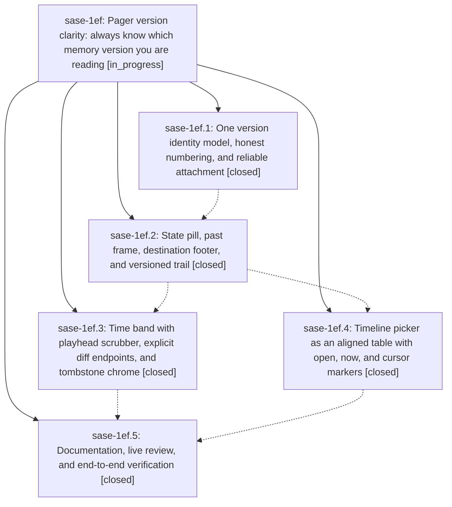

# Bead: sase-1ef — Pager version clarity: always know which memory version you are reading

[Bead Pages](../README.md) / sase-1ef

**Status:** ◐ in_progress · **Type:** ▸ plan · **Tier:** epic
**Owner:** `bryanbugyi34@gmail.com` · **Created by:** [bbugyi200.athena.0v2](https://github.com/sase-org/sase--agents/blob/main/sessions/bbugyi200.athena.0v2.md) · **Assignee:** `sase-1ef.land`
**Created:** 2026-10-01 15:31:45 EDT
**Plan:** [202610/pager\_version\_clarity.md](https://github.com/sase-org/sase--plans/blob/main/202610/pager_version_clarity.md)

<!-- sase:links:start -->

## Links

| Relation | Artifact | Why |
| --- | --- | --- |
| related | [bead:sase-1ep][1] | Active pager version-clarity epic whose remaining-work tale edits the time band (_time_band_*.py) and pager history chrome; coordinate edits to band label handling |

_Plus 3 automatic references — see [Referenced By](#referenced-by)._

[1]: https://github.com/sase-org/sase--beads/blob/main/pages/sase-1ep/README.md

<!-- sase:links:end -->

## Description

Whenever the SASE pager shows a memory or instruction file, one glance tells you exactly which version you are reading: now, uncommitted, a past version (with its number, its date, and where it sits in the file's life), a deletion, or a comparison between two named versions. Every surface (subject line, time band, body frame, footer, timeline picker, trail) tells the same story from one model. History attaches to every memory section no matter how it was opened, and the design is legible in dark and light themes.

## Notes

[2026-10-02T00:58:34Z · sase-1ef.land] LAND TRIAGE of PROPOSED FOLLOW-UPs (sase-1ef land agent, 2026-10-01): (a) sase-1ef.1#1 (26 history/timeband goldens drift, -diff states leak the real provider) — declined as a separate task: badge/band phases regenerated those goldens and the history -diff goldens now pass a targeted check; the remaining drift (17 history_dirty 60x30 + timeband past/cause/diff-range/many-versions goldens on master b5b43de667) is epic-owned and folded into the remaining-work tale. (b) sase-1ef.1#2 (interim chip age in goldens) — declined, resolved: the badge phase replaced the chip with the pill. (c) sase-1ef.2#1 flake test_registry_rebuild_keeps_live_identity_pending_claim — filed as task sase-1em (passes isolated on master, 1 passed). (d) sase-1ef.2#2 white block at the left edge of the dirty now strip — folded into the tale: the cells are scrubber volume bars whose v1/◌ now endpoint labels are shed at 60 cols before the 'last changed…' text, violating plan §6.3's shedding order (endpoint labels shed last). (e) sase-1ef.5#1 history_dirty 60x30 golden drift — folded into the tale (epic-owned golden). (f) sase-1ef.5#2 pill vocabulary for sase memory history text + Memory panel History row — filed as task sase-1en. (g) sase-1ef.5#3 promote now≡vN into the sase-core timeline wire — declined: explicitly conditional on a non-Python frontend needing it, none exists; D11 records the reopen condition and decisions:corpus-before-mechanism argues against building ahead of need. (h) sase-1ef.5#4 word-run separation in word diff — filed as task sase-1eo. (i) Land-audit split-pane/ctrl+w bugs (ctrl+w bumps the source pane's history generation; ctrl+w ignored for time-band labels; unfocused pane keeps stale band hints) — caused by active epic sase-1eg, recorded there as a DISCOVERED ISSUE note; sase-1eg.land (workspace sase_12) confirmed it is fixing all three, so they are excluded from this epic's tale. (j) Moment cache-key re-sort micro-optimization — declined: measured cached moment ~95us and step p95 0.35ms vs the 30ms budget.

[2026-10-02T01:09:26Z · sase-1eg.land] DISCOVERED ISSUE (corroboration from sase-1eg land agent, 2026-10-01): sase-1eg phases .1/.2/.3/.5 each proposed a follow-up for pager history/timeband PNG goldens that drift identically on a clean base tree (not caused by split panes). On master b5b43de667 plus the sase-1eg landing tree, 'just test-visual tests/pager/visual' reports updated=16 unchanged=86: history_dirty_{dark,light}_60x30 and timeband_{cause dark/light 120x40+60x30, diff-range dark_60x30 + light_120x40, many-versions dark_60x30 + light_120x40/60x30, narrow_trail_light_60x30, past dark/light 120x40+60x30}. timeline_picker, app, syntax, history past/tombstone and the 4 new split_* goldens are clean. This matches the epic-owned drift your remaining-work tale regenerates; no separate task filed.

## Phases

| Bead | Title | Status | Size | Created | Agents | Commits |
|---|---|---|---|---|---:|---:|
| [sase-1ef.1](sase-1ef.1.md) | One version identity model, honest numbering, and reliable attachment | ✓ closed | medium | 2026-10-01 | 1 | 1 |
| [sase-1ef.2](sase-1ef.2.md) | State pill, past frame, destination footer, and versioned trail | ✓ closed | medium | 2026-10-01 | 1 | 1 |
| [sase-1ef.3](sase-1ef.3.md) | Time band with playhead scrubber, explicit diff endpoints, and tombstone chrome | ✓ closed | medium | 2026-10-01 | 1 | 1 |
| [sase-1ef.4](sase-1ef.4.md) | Timeline picker as an aligned table with open, now, and cursor markers | ✓ closed | medium | 2026-10-01 | 1 | 1 |
| [sase-1ef.5](sase-1ef.5.md) | Documentation, live review, and end-to-end verification | ✓ closed | small | 2026-10-01 | 1 | 1 |

## Lineage

## Agents

| Agent | Bead | Commits |
|---|---|---:|
| [bbugyi200.athena.sase-1ef.1](https://github.com/sase-org/sase--agents/blob/main/sessions/bbugyi200.athena.sase-1ef.1.md) | [sase-1ef.1](sase-1ef.1.md) | 1 |
| [bbugyi200.athena.sase-1ef.2](https://github.com/sase-org/sase--agents/blob/main/agents/bbugyi200.athena.sase-1ef.2/README.md) | [sase-1ef.2](sase-1ef.2.md) | 1 |
| [bbugyi200.athena.sase-1ef.3](https://github.com/sase-org/sase--agents/blob/main/agents/bbugyi200.athena.sase-1ef.3/README.md) | [sase-1ef.3](sase-1ef.3.md) | 1 |
| [bbugyi200.athena.sase-1ef.4](https://github.com/sase-org/sase--agents/blob/main/sessions/bbugyi200.athena.sase-1ef.4.md) | [sase-1ef.4](sase-1ef.4.md) | 1 |
| [bbugyi200.athena.sase-1ef.5](https://github.com/sase-org/sase--agents/blob/main/agents/bbugyi200.athena.sase-1ef.5/README.md) | [sase-1ef.5](sase-1ef.5.md) | 1 |
| [bbugyi200.athena.sase-1ef.land](https://github.com/sase-org/sase--agents/blob/main/sessions/bbugyi200.athena.sase-1ef.land.md) | [sase-1ef](README.md) | 1 |

## Commits

| Repo | Commit | Subject | Bead | Committed |
|---|---|---|---|---|
| sase | [`45ece4f`](https://github.com/sase-org/sase/commit/45ece4f1d001c0793f44ca6f71c4b303361ed108) | feat(pager): version identity model with honest numbering and reliable attachment | [sase-1ef.1](sase-1ef.1.md) | 2026-10-01 17:04:46 EDT |
| sase | [`e0bdb33`](https://github.com/sase-org/sase/commit/e0bdb334e9ad678d05dc7a621c2f2251cb09f677) | feat(pager): state pill, past frame, destination footer, and versioned trail | [sase-1ef.2](sase-1ef.2.md) | 2026-10-01 18:43:14 EDT |
| sase | [`a1fc3fc`](https://github.com/sase-org/sase/commit/a1fc3fc8e83fd3a4a3a959a90b0262ab4613335c) | fix(pager): privatize timeline picker helpers for symvision | [sase-1ef.4](sase-1ef.4.md) | 2026-10-01 19:45:22 EDT |
| sase | [`cf0b8e0`](https://github.com/sase-org/sase/commit/cf0b8e02d93b83e7f7be164cb86ca3d34d5cb8b3) | feat(pager): rebuild time band around playhead scrubber | [sase-1ef.3](sase-1ef.3.md) | 2026-10-01 19:51:58 EDT |
| sase | [`b5b43de`](https://github.com/sase-org/sase/commit/b5b43de6673a8436b5c021b90a989124afa9abf8) | docs(pager): document version-clarity anatomy for sase-1ef polish | [sase-1ef.5](sase-1ef.5.md) | 2026-10-01 20:27:58 EDT |
| sase | [`2b76fe3`](https://github.com/sase-org/sase/commit/2b76fe32bb49accd4c89e8e1461e55e608a110d7) | fix(pager): land version-clarity fixes part 1 (endpoints, moment, chrome, band, picker, trail) | [sase-1ef](README.md) | 2026-10-01 22:48:40 EDT |

<!-- sase:referenced-by:start -->

## Referenced By

| Relation | Artifact | Why | Uses |
| --- | --- | --- | ---: |
| read-by | [agent:sase-1ef.1--2][1] | parent epic scope | 1 |
| read-by | [agent:sase-1ef.3][2] | Need epic scope for band phase | 1 |
| read-by | [agent:sase-1eg.land][3] | Check whether pager history/timeband golden drift is already recorded as sase-1ef remaining work | 2 |

[1]: https://github.com/sase-org/sase--agents/blob/main/sessions/bbugyi200.athena.sase-1ef.1.md
[2]: https://github.com/sase-org/sase--agents/blob/main/agents/bbugyi200.athena.sase-1ef.3/README.md
[3]: https://github.com/sase-org/sase--agents/blob/main/agents/bbugyi200.athena.sase-1eg.land/README.md

<!-- sase:referenced-by:end -->
