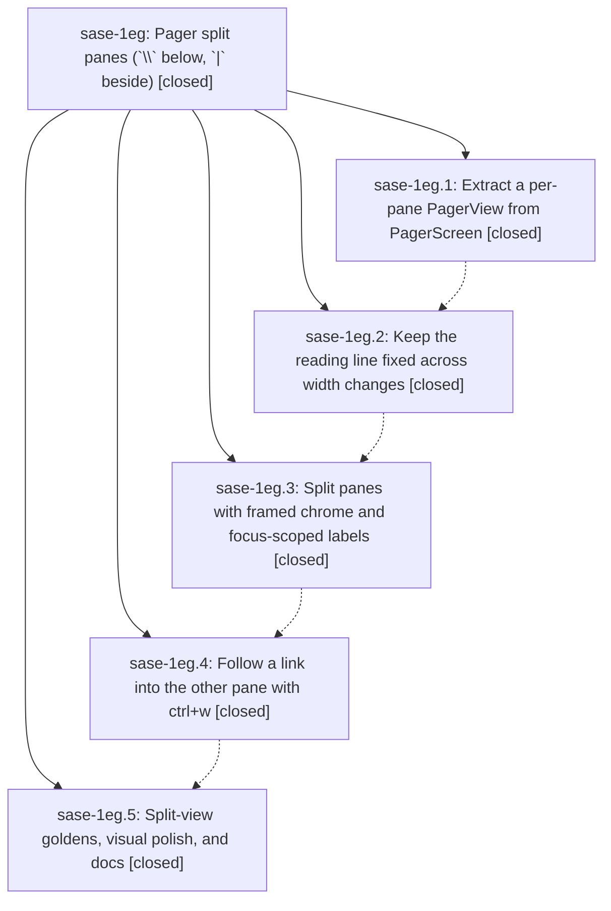

# Bead: sase-1eg — Pager split panes (\`\\\` below, \`\|\` beside)

[Bead Pages](../README.md) / sase-1eg

**Status:** ✓ closed · **Resolution:** done · **Type:** ▸ plan · **Tier:** epic
**Owner:** `bryanbugyi34@gmail.com` · **Created by:** [bbugyi200.athena.0v1](https://github.com/sase-org/sase--agents/blob/main/sessions/bbugyi200.athena.0v1.md) · **Assignee:** `sase-1eg.land`
**Created:** 2026-10-01 15:39:30 EDT · **Closed:** 2026-10-01 21:27:10 EDT
**Plan:** [202610/pager\_split\_panes.md](https://github.com/sase-org/sase--plans/blob/main/202610/pager_split_panes.md)

<!-- sase:links:start -->

## Links

| Relation | Artifact | Why |
| --- | --- | --- |
| related | [bead:sase-1ep][1] | Proposing epic: sase-1eg's landing taught the band label handler the ctrl+w other-pane arm; this task extends the same handler to the copy/edit arms |

_Plus 1 automatic references — see [Referenced By](#referenced-by)._

[1]: https://github.com/sase-org/sase--beads/blob/main/pages/sase-1ep/README.md

<!-- sase:links:end -->

## Description

The SASE pager can show two independent reading panes, split below with `\` or beside with `|`, using Agents-tab-style toggle/rotate/focus semantics, framed accent-colored panes, link labels painted only in the focused pane, ctrl+w to follow a link into the other pane, and a reading position that never jumps. Single-pane rendering stays pixel-identical to today.

## Notes

[2026-10-02T00:57:33Z · sase-1ef.land] DISCOVERED ISSUE (found by the sase-1ef land agent on master b5b43de667, 2026-10-01, via Textual Pilot repros with a fake history provider): three split-pane/ctrl+w interactions with the pager time band and history loading. (1) ctrl+w kills the SOURCE pane's history loading: _resolve_and_dispatch (src/sase/pager/_screen_actions.py ~371-373) always calls _bump_history_generation on the source view, which is right when that pane navigates away but wrong for other_pane=True where the source stays put; any in-flight discovery/step/compare prefetch in the source is dropped (_screen_history_discovery.py ~65-69,114) and nothing restarts it. Repro: 0.6s timeline load, press ctrl+w + a label right after opening; after 2s the source pane still has no SectionTimeState and its band shows 'indexing…' forever. Fix: only bump when the source view itself navigates, or restart discovery for the source after the bump. (2) ctrl+w is ignored for time-band labels: _handle_label_key in src/sase/pager/_screen_time_band.py (~159-185) matches band hints first and _activate_time_band_label/_activate_time_band_commit (~187-260) never read _pending_action, so ctrl+w then a band hint (e.g. '0' commit) navigates the focused pane in place instead of the other pane. (3) Unfocused pane keeps painting stale time-band hint letters: PagerView._build_label_layer (src/sase/pager/view.py ~413) returns early for unfocused panes, so _time_band_hints is never cleared and the band signature (_screen_time_band.py ~351) suppresses repaint; pane B shows '[0]ccccccc' while '0' follows pane A's body link. sase-1eg.5's note says it fixed stale BODY label badges on unfocus, but that commit is not on master yet, so re-check (3) against the band row after it lands. Also: no split/ctrl+w test registers a history provider (tests/pager/test_app_split.py, test_app_other_pane.py); test_split_seed_copies_history_and_syntax_state asserts only syntax and dangling-ref state. Separately, navigating to a new document never starts history discovery (pre-existing; sase-1ef's remaining-work plan fixes _navigate_to_document/_restore_view_state, which also covers ctrl+w into an existing other pane).

[2026-10-02T01:27:10Z · sase-1eg.land] LAND VERIFIED (sase-1eg.land, 2026-10-01). Step 1: read the epic, plan, all 5 phases and notes, and the 4 epic commits on master (9023bbbab7 view-extract, c17fc978d3 reading-anchor, dd32637d2c split-panes, 3812f6dc1b ctrl+w); PagerView/host protocol, ReadingAnchor + trail anchors, pure split model, framed chrome, focus-scoped labels, clone seed, footer/help rows, small-window guard and async-safe teardown match the plan. Found that phase .5's commit (44f8586fc9: 4 split PNG goldens, unfocused-badge recompose in view.py, docs/pager.md 'Split panes' section + Keys rows, docs/ace.md pointer) was never pushed — the workspace reset to origin/master discarded it — so it is re-landed here via cherry-pick. Plan step 11's ACE modal test (phase .3 PROPOSED FOLLOW-UP #2) was missing: added tests/ace/tui/actions/test_view_files_pager_split_keys.py (real ACE deck bindings; \, | and ctrl+f split/rotate/focus the pager modal while the Agents deck stays SINGLE). Step 2 integration with concurrent sase-1ef (version clarity) and the _screen_history / pager_provider splits: fixed the three epic-caused bugs recorded by sase-1ef.land as DISCOVERED ISSUE note #1 — (1) ctrl+w no longer bumps the SOURCE pane's history generation (_resolve_and_dispatch/_activate_time_band_commit skip it for other_pane; show_in_other_view bumps the pane that actually navigates); (2) ctrl+w now applies to time-band labels (band handler reads/resets the arm and routes other_pane through follow and commit paths); (3) unfocused panes clear time-band hint letters (_build_label_layer + _update_time_band suppression). Regression tests in tests/pager/test_app_other_pane_history.py (all 3 fail on the unfixed tree, pass now); test_split_seed_copies_history_and_syntax_state now asserts independent SectionTimeState/cache copies. docs/pager.md split section notes per-pane history and band letters. sase-1ef keeps #4-#7 (trail crumb pins, syntax rail, theme pill, _navigate_to_document discovery) in its own tale, agreed with sase-1ef.land. Epic symbol: privatized PagerViewHost -> _PagerViewHost (only in-file consumer), removed the Justfile --epic-symbol line, deleted the dead PagerView.handle_view_key. Verification: sase tool run check 2aeba2f86aa7837877242bb6185a5a1d succeeded (all lint incl. symvision, scoped tests); 40 split/other-pane/view tests pass; just test-visual tests/pager/visual: split/app/syntax/timeline/history-past goldens unchanged, 16 drifting history_dirty_60x30 + timeband goldens are pre-existing sase-1ef-owned drift. Follow-up triage: golden-drift proposals from .1#1/.2#1/.3#1/.5#1 declined as tasks — same drift is epic-owned by sase-1ef and folded into its tale (corroborating DISCOVERED ISSUE note added to sase-1ef); .3#2 ACE modal test done here; new pre-existing (sase-1dr.7) bug found while landing — y/E arms ignored on time-band labels — filed as task sase-1ep (small, ready).

## Phases

| Bead | Title | Status | Size | Created | Agents | Commits |
|---|---|---|---|---|---:|---:|
| [sase-1eg.1](sase-1eg.1.md) | Extract a per-pane PagerView from PagerScreen | ✓ closed | medium | 2026-10-01 | 1 | 1 |
| [sase-1eg.2](sase-1eg.2.md) | Keep the reading line fixed across width changes | ✓ closed | small | 2026-10-01 | 1 | 1 |
| [sase-1eg.3](sase-1eg.3.md) | Split panes with framed chrome and focus-scoped labels | ✓ closed | medium | 2026-10-01 | 1 | 1 |
| [sase-1eg.4](sase-1eg.4.md) | Follow a link into the other pane with ctrl+w | ✓ closed | small | 2026-10-01 | 1 | 1 |
| [sase-1eg.5](sase-1eg.5.md) | Split-view goldens, visual polish, and docs | ✓ closed | small | 2026-10-01 | 1 | 0 |

## Lineage

## Agents

| Agent | Bead | Commits |
|---|---|---:|
| [bbugyi200.athena.sase-1eg.1](https://github.com/sase-org/sase--agents/blob/main/agents/bbugyi200.athena.sase-1eg.1/README.md) | [sase-1eg.1](sase-1eg.1.md) | 1 |
| [bbugyi200.athena.sase-1eg.2](https://github.com/sase-org/sase--agents/blob/main/agents/bbugyi200.athena.sase-1eg.2/README.md) | [sase-1eg.2](sase-1eg.2.md) | 1 |
| [bbugyi200.athena.sase-1eg.3](https://github.com/sase-org/sase--agents/blob/main/agents/bbugyi200.athena.sase-1eg.3/README.md) | [sase-1eg.3](sase-1eg.3.md) | 1 |
| [bbugyi200.athena.sase-1eg.4](https://github.com/sase-org/sase--agents/blob/main/agents/bbugyi200.athena.sase-1eg.4/README.md) | [sase-1eg.4](sase-1eg.4.md) | 1 |
| [bbugyi200.athena.sase-1eg.5](https://github.com/sase-org/sase--agents/blob/main/sessions/bbugyi200.athena.sase-1eg.5.md) | [sase-1eg.5](sase-1eg.5.md) | 0 |
| [bbugyi200.athena.sase-1eg.land](https://github.com/sase-org/sase--agents/blob/main/agents/bbugyi200.athena.sase-1eg.land/README.md) | [sase-1eg](README.md) | 1 |

## Commits

| Repo | Commit | Subject | Bead | Committed |
|---|---|---|---|---|
| sase | [`9023bbb`](https://github.com/sase-org/sase/commit/9023bbbab77450c1d3c39c2b8d25752156621659) | refactor(pager): extract per-pane PagerView with PagerViewHost protocol | [sase-1eg.1](sase-1eg.1.md) | 2026-10-01 17:15:30 EDT |
| sase | [`c17fc97`](https://github.com/sase-org/sase/commit/c17fc978d3d705618d31af84ac5a2dbc08f8c61e) | feat(pager): keep the reading line fixed across width changes | [sase-1eg.2](sase-1eg.2.md) | 2026-10-01 17:55:06 EDT |
| sase | [`dd32637`](https://github.com/sase-org/sase/commit/dd32637d2cb1e3e3ccfc2632dece9f2e3e1eb458) | feat(pager): split panes with framed chrome and focus-scoped labels | [sase-1eg.3](sase-1eg.3.md) | 2026-10-01 19:12:51 EDT |
| sase | [`3812f6d`](https://github.com/sase-org/sase/commit/3812f6dc1b5ee2a020b0c5006d045a0d66a5a939) | feat(pager): follow a link into the other pane with ctrl+w | [sase-1eg.4](sase-1eg.4.md) | 2026-10-01 19:43:11 EDT |
| sase | [`96fe7d2`](https://github.com/sase-org/sase/commit/96fe7d23d093eb95bcd26023bbe221087bd753c9) | feat(pager): land sase-1eg split panes with goldens, docs, and ctrl+w history fixes | [sase-1eg](README.md) | 2026-10-01 21:29:19 EDT |

<!-- sase:referenced-by:start -->

## Referenced By

| Relation | Artifact | Why | Uses |
| --- | --- | --- | ---: |
| read-by | [agent:sase-1eg.3][1] | parent epic status | 1 |

[1]: https://github.com/sase-org/sase--agents/blob/main/agents/bbugyi200.athena.sase-1eg.3/README.md

<!-- sase:referenced-by:end -->
