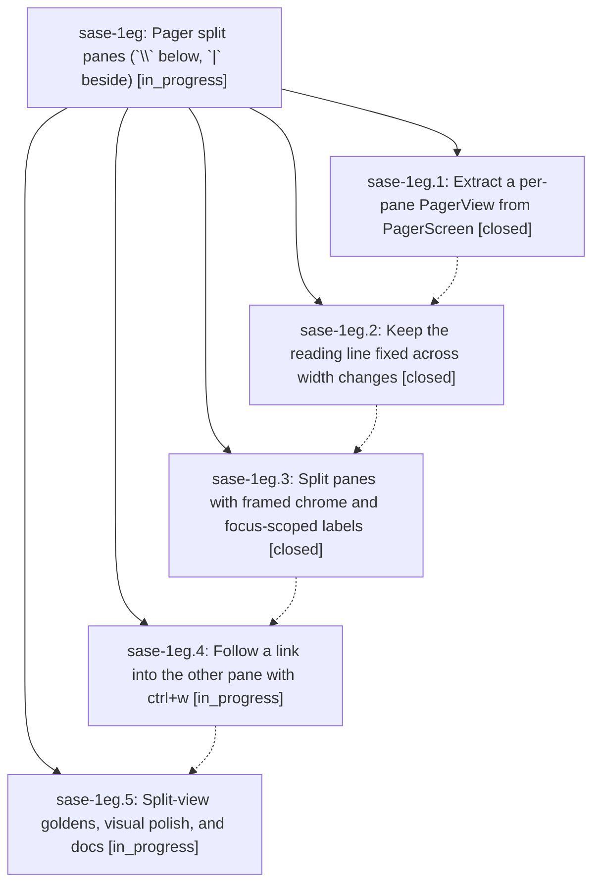

# Bead: sase-1eg — Pager split panes (\`\\\` below, \`\|\` beside)

[Bead Pages](../README.md) / sase-1eg

**Status:** ◐ in_progress · **Type:** ▸ plan · **Tier:** epic
**Owner:** `bryanbugyi34@gmail.com` · **Created by:** [bbugyi200.athena.0v1](https://github.com/sase-org/sase--agents/blob/main/sessions/bbugyi200.athena.0v1.md) · **Assignee:** `sase-1eg.land`
**Created:** 2026-10-01 15:39:30 EDT
**Plan:** [202610/pager\_split\_panes.md](https://github.com/sase-org/sase--plans/blob/main/202610/pager_split_panes.md)

## Description

The SASE pager can show two independent reading panes, split below with `\` or beside with `|`, using Agents-tab-style toggle/rotate/focus semantics, framed accent-colored panes, link labels painted only in the focused pane, ctrl+w to follow a link into the other pane, and a reading position that never jumps. Single-pane rendering stays pixel-identical to today.

## Phases

| Bead | Title | Status | Size | Created | Agents | Commits |
|---|---|---|---|---|---:|---:|
| [sase-1eg.1](sase-1eg.1.md) | Extract a per-pane PagerView from PagerScreen | ✓ closed | medium | 2026-10-01 | 1 | 1 |
| [sase-1eg.2](sase-1eg.2.md) | Keep the reading line fixed across width changes | ✓ closed | small | 2026-10-01 | 1 | 1 |
| [sase-1eg.3](sase-1eg.3.md) | Split panes with framed chrome and focus-scoped labels | ✓ closed | medium | 2026-10-01 | 1 | 1 |
| [sase-1eg.4](sase-1eg.4.md) | Follow a link into the other pane with ctrl+w | ◐ in_progress | small | 2026-10-01 | 1 | 0 |
| [sase-1eg.5](sase-1eg.5.md) | Split-view goldens, visual polish, and docs | ◐ in_progress | small | 2026-10-01 | 1 | 0 |

## Lineage

## Agents

| Agent | Bead | Commits |
|---|---|---:|
| [bbugyi200.athena.sase-1eg.1](https://github.com/sase-org/sase--agents/blob/main/agents/bbugyi200.athena.sase-1eg.1/README.md) | [sase-1eg.1](sase-1eg.1.md) | 1 |
| [bbugyi200.athena.sase-1eg.2](https://github.com/sase-org/sase--agents/blob/main/agents/bbugyi200.athena.sase-1eg.2/README.md) | [sase-1eg.2](sase-1eg.2.md) | 1 |
| [bbugyi200.athena.sase-1eg.3](https://github.com/sase-org/sase--agents/blob/main/agents/bbugyi200.athena.sase-1eg.3/README.md) | [sase-1eg.3](sase-1eg.3.md) | 1 |
| [bbugyi200.athena.sase-1eg.4](https://github.com/sase-org/sase--agents/blob/main/agents/bbugyi200.athena.sase-1eg.4/README.md) | [sase-1eg.4](sase-1eg.4.md) | 0 |
| [bbugyi200.athena.sase-1eg.5](https://github.com/sase-org/sase--agents/blob/main/agents/bbugyi200.athena.sase-1eg.5/README.md) | [sase-1eg.5](sase-1eg.5.md) | 0 |
| [bbugyi200.athena.sase-1eg.land](https://github.com/sase-org/sase--agents/blob/main/agents/bbugyi200.athena.sase-1eg.land/README.md) | [sase-1eg](README.md) | 0 |

## Commits

| Repo | Commit | Subject | Bead | Committed |
|---|---|---|---|---|
| sase | [`9023bbb`](https://github.com/sase-org/sase/commit/9023bbbab77450c1d3c39c2b8d25752156621659) | refactor(pager): extract per-pane PagerView with PagerViewHost protocol | [sase-1eg.1](sase-1eg.1.md) | 2026-10-01 17:15:30 EDT |
| sase | [`c17fc97`](https://github.com/sase-org/sase/commit/c17fc978d3d705618d31af84ac5a2dbc08f8c61e) | feat(pager): keep the reading line fixed across width changes | [sase-1eg.2](sase-1eg.2.md) | 2026-10-01 17:55:06 EDT |
| sase | [`dd32637`](https://github.com/sase-org/sase/commit/dd32637d2cb1e3e3ccfc2632dece9f2e3e1eb458) | feat(pager): split panes with framed chrome and focus-scoped labels | [sase-1eg.3](sase-1eg.3.md) | 2026-10-01 19:12:51 EDT |
