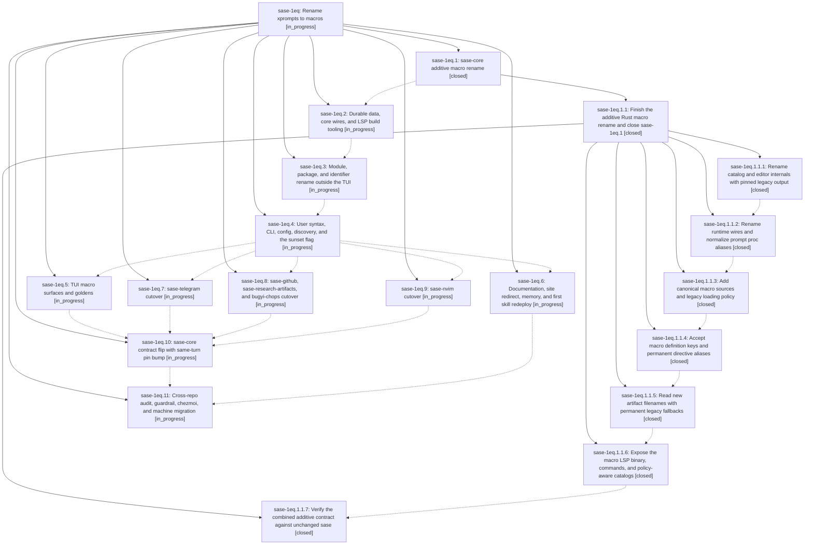

# Bead: sase-1eq — Rename xprompts to macros

[Bead Pages](../README.md) / sase-1eq

**Status:** ◐ in_progress · **Type:** ▸ plan · **Tier:** epic
**Owner:** `bryanbugyi34@gmail.com` · **Created by:** [bbugyi200.athena.0v4](https://github.com/sase-org/sase--agents/blob/main/sessions/bbugyi200.athena.0v4.md) · **Assignee:** `sase-1eq.land`
**Created:** 2026-10-02 06:51:19 EDT
**Plan:** [202610/xprompts\_to\_macros.md](https://github.com/sase-org/sase--plans/blob/main/202610/xprompts_to_macros.md)

## Description

SASE calls its reusable `#name` prompt definitions "macros" in code, CLI, config, directories, TUI, LSP, plugins, docs, memory, skills, and chezmoi. Agent artifacts, proc rows, state files, and stored prompts written before the rename still load. Retired xprompt spellings keep working behind one sunset flag until callers migrate.

## Phases

| Bead | Title | Status | Size | Created | Agents | Commits |
|---|---|---|---|---|---:|---:|
| [sase-1eq.1](sase-1eq.1.md) | sase-core additive macro rename | ✓ closed | large | 2026-10-02 | 1 | 1 |
| [sase-1eq.10](sase-1eq.10.md) | sase-core contract flip with same-turn pin bump | ◐ in_progress | large | 2026-10-02 | 1 | 0 |
| [sase-1eq.11](sase-1eq.11.md) | Cross-repo audit, guardrail, chezmoi, and machine migration | ◐ in_progress | medium | 2026-10-02 | 1 | 0 |
| [sase-1eq.2](sase-1eq.2.md) | Durable data, core wires, and LSP build tooling | ◐ in_progress | medium | 2026-10-02 | 1 | 0 |
| [sase-1eq.3](sase-1eq.3.md) | Module, package, and identifier rename outside the TUI | ◐ in_progress | large | 2026-10-02 | 1 | 0 |
| [sase-1eq.4](sase-1eq.4.md) | User syntax, CLI, config, discovery, and the sunset flag | ◐ in_progress | large | 2026-10-02 | 1 | 0 |
| [sase-1eq.5](sase-1eq.5.md) | TUI macro surfaces and goldens | ◐ in_progress | large | 2026-10-02 | 1 | 0 |
| [sase-1eq.6](sase-1eq.6.md) | Documentation, site redirect, memory, and first skill redeploy | ◐ in_progress | medium | 2026-10-02 | 1 | 0 |
| [sase-1eq.7](sase-1eq.7.md) | sase-telegram cutover | ◐ in_progress | small | 2026-10-02 | 1 | 0 |
| [sase-1eq.8](sase-1eq.8.md) | sase-github, sase-research-artifacts, and bugyi-chops cutover | ◐ in_progress | small | 2026-10-02 | 1 | 0 |
| [sase-1eq.9](sase-1eq.9.md) | sase-nvim cutover | ◐ in_progress | medium | 2026-10-02 | 1 | 0 |

## Lineage

## Agents

| Agent | Bead | Commits |
|---|---|---:|
| [bbugyi200.athena.sase-1eq.1](https://github.com/sase-org/sase--agents/blob/main/sessions/bbugyi200.athena.sase-1eq.1.md) | [sase-1eq.1](sase-1eq.1.md) | 1 |
| [bbugyi200.athena.sase-1eq.1.1.1](https://github.com/sase-org/sase--agents/blob/main/agents/bbugyi200.athena.sase-1eq.1.1.1/README.md) | [sase-1eq.1.1.1](sase-1eq.1.1.1.md) | 1 |
| [bbugyi200.athena.sase-1eq.1.1.2](https://github.com/sase-org/sase--agents/blob/main/sessions/bbugyi200.athena.sase-1eq.1.1.2.md) | [sase-1eq.1.1.2](sase-1eq.1.1.2.md) | 1 |
| [bbugyi200.athena.sase-1eq.1.1.3](https://github.com/sase-org/sase--agents/blob/main/agents/bbugyi200.athena.sase-1eq.1.1.3/README.md) | [sase-1eq.1.1.3](sase-1eq.1.1.3.md) | 1 |
| [bbugyi200.athena.sase-1eq.1.1.4](https://github.com/sase-org/sase--agents/blob/main/agents/bbugyi200.athena.sase-1eq.1.1.4/README.md) | [sase-1eq.1.1.4](sase-1eq.1.1.4.md) | 1 |
| [bbugyi200.athena.sase-1eq.1.1.5](https://github.com/sase-org/sase--agents/blob/main/agents/bbugyi200.athena.sase-1eq.1.1.5/README.md) | [sase-1eq.1.1.5](sase-1eq.1.1.5.md) | 1 |
| [bbugyi200.athena.sase-1eq.1.1.6](https://github.com/sase-org/sase--agents/blob/main/agents/bbugyi200.athena.sase-1eq.1.1.6/README.md) | [sase-1eq.1.1.6](sase-1eq.1.1.6.md) | 1 |
| [bbugyi200.athena.sase-1eq.1.1.7](https://github.com/sase-org/sase--agents/blob/main/sessions/bbugyi200.athena.sase-1eq.1.1.7.md) | [sase-1eq.1.1.7](sase-1eq.1.1.7.md) | 1 |
| [bbugyi200.athena.sase-1eq.1.1.land](https://github.com/sase-org/sase--agents/blob/main/sessions/bbugyi200.athena.sase-1eq.1.1.land.md) | [sase-1eq.1.1](sase-1eq.1.1.md) | 1 |
| [bbugyi200.athena.sase-1eq.10](https://github.com/sase-org/sase--agents/blob/main/agents/bbugyi200.athena.sase-1eq.10/README.md) | [sase-1eq.10](sase-1eq.10.md) | 0 |
| [bbugyi200.athena.sase-1eq.11](https://github.com/sase-org/sase--agents/blob/main/agents/bbugyi200.athena.sase-1eq.11/README.md) | [sase-1eq.11](sase-1eq.11.md) | 0 |
| [bbugyi200.athena.sase-1eq.2](https://github.com/sase-org/sase--agents/blob/main/agents/bbugyi200.athena.sase-1eq.2/README.md) | [sase-1eq.2](sase-1eq.2.md) | 0 |
| [bbugyi200.athena.sase-1eq.3](https://github.com/sase-org/sase--agents/blob/main/agents/bbugyi200.athena.sase-1eq.3/README.md) | [sase-1eq.3](sase-1eq.3.md) | 0 |
| [bbugyi200.athena.sase-1eq.4](https://github.com/sase-org/sase--agents/blob/main/agents/bbugyi200.athena.sase-1eq.4/README.md) | [sase-1eq.4](sase-1eq.4.md) | 0 |
| [bbugyi200.athena.sase-1eq.5](https://github.com/sase-org/sase--agents/blob/main/agents/bbugyi200.athena.sase-1eq.5/README.md) | [sase-1eq.5](sase-1eq.5.md) | 0 |
| [bbugyi200.athena.sase-1eq.6](https://github.com/sase-org/sase--agents/blob/main/agents/bbugyi200.athena.sase-1eq.6/README.md) | [sase-1eq.6](sase-1eq.6.md) | 0 |
| [bbugyi200.athena.sase-1eq.7](https://github.com/sase-org/sase--agents/blob/main/agents/bbugyi200.athena.sase-1eq.7/README.md) | [sase-1eq.7](sase-1eq.7.md) | 0 |
| [bbugyi200.athena.sase-1eq.8](https://github.com/sase-org/sase--agents/blob/main/agents/bbugyi200.athena.sase-1eq.8/README.md) | [sase-1eq.8](sase-1eq.8.md) | 0 |
| [bbugyi200.athena.sase-1eq.9](https://github.com/sase-org/sase--agents/blob/main/agents/bbugyi200.athena.sase-1eq.9/README.md) | [sase-1eq.9](sase-1eq.9.md) | 0 |
| [bbugyi200.athena.sase-1eq.land](https://github.com/sase-org/sase--agents/blob/main/agents/bbugyi200.athena.sase-1eq.land/README.md) | [sase-1eq](README.md) | 0 |

## Commits

| Repo | Commit | Subject | Bead | Committed |
|---|---|---|---|---|
| sase-core | [`sase-core@015ce7f`](https://github.com/sase-org/sase-core/commit/015ce7f6ad1cc5ade253dc6d174ce55ae9dc30d3) | feat(core-expand): rename modules and query shorthands toward macros | [sase-1eq.1](sase-1eq.1.md) | 2026-10-02 07:32:05 EDT |
| sase-core | [`sase-core@c4444ab`](https://github.com/sase-org/sase-core/commit/c4444abbf25508844d040356d4b423329e0f0dbc) | feat(core-expand): rename catalog and editor internals toward macros with pinned legacy output | [sase-1eq.1.1.1](sase-1eq.1.1.1.md) | 2026-10-02 08:36:12 EDT |
| sase-core | [`sase-core@421324b`](https://github.com/sase-org/sase-core/commit/421324bf2042cd7f7ffa8110b3027e8c0974a9ec) | feat(core-expand): rename runtime wires toward macros with pinned legacy output | [sase-1eq.1.1.2](sase-1eq.1.1.2.md) | 2026-10-02 09:58:56 EDT |
| sase-core | [`sase-core@4f0bfd3`](https://github.com/sase-org/sase-core/commit/4f0bfd33e70b2a347d555a427f00a47fcc83bd11) | feat(core-expand): add canonical macro sources and legacy loading policy | [sase-1eq.1.1.3](sase-1eq.1.1.3.md) | 2026-10-02 10:49:06 EDT |
| sase-core | [`sase-core@e6a3452`](https://github.com/sase-org/sase-core/commit/e6a3452f7134efe6a805e099a3f19ddfb918fb50) | feat(core-expand): accept macro authored keys and permanent directive aliases | [sase-1eq.1.1.4](sase-1eq.1.1.4.md) | 2026-10-02 11:26:10 EDT |
| sase-core | [`sase-core@926edfb`](https://github.com/sase-org/sase-core/commit/926edfb8baa1d8e3ba4242156961905595d0faf9) | feat(core-expand): read new macro artifact filenames with legacy fallbacks | [sase-1eq.1.1.5](sase-1eq.1.1.5.md) | 2026-10-02 12:04:07 EDT |
| sase-core | [`sase-core@be86aa9`](https://github.com/sase-org/sase-core/commit/be86aa9fff063dd17b3c58849a2bb708fe00cd2c) | feat(core-expand): expose macro LSP binary, commands, and policy-aware catalogs | [sase-1eq.1.1.6](sase-1eq.1.1.6.md) | 2026-10-02 12:54:12 EDT |
| sase-core | [`sase-core@29da6fb`](https://github.com/sase-org/sase-core/commit/29da6fb73f67e834125df346f7c654311b5bb03c) | feat(core-expand): audit residual macro terminology against starting core | [sase-1eq.1.1.7](sase-1eq.1.1.7.md) | 2026-10-02 14:26:53 EDT |
| sase-core | [`sase-core@f3818f8`](https://github.com/sase-org/sase-core/commit/f3818f817c20acc3ddc3955b2548709811dcf71f) | feat(directive): keep legacy directive contract byte-identical with hidden macros\_enabled alias | [sase-1eq.1.1](sase-1eq.1.1.md) | 2026-10-02 15:43:19 EDT |

<!-- sase:referenced-by:start -->

## Referenced By

| Relation | Artifact | Why | Uses |
| --- | --- | --- | ---: |
| read-by | [agent:44][1] | Evaluate whether xprompt->macro rename is the right decision | 1 |

[1]: https://github.com/sase-org/sase--agents/blob/main/agents/bbugyi200.athena.44/README.md

<!-- sase:referenced-by:end -->
