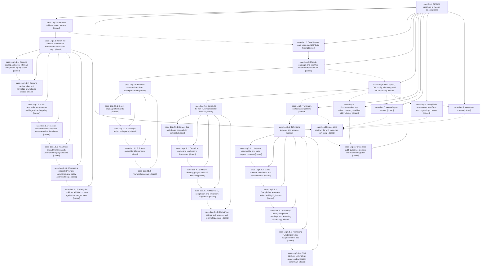

# Bead: sase-1eq — Rename xprompts to macros

[Bead Pages](../README.md) / sase-1eq

**Status:** ◐ in_progress · **Type:** ▸ plan · **Tier:** epic
**Owner:** `bryanbugyi34@gmail.com` · **Created by:** [bbugyi200.athena.0v4](https://github.com/sase-org/sase--agents/blob/main/sessions/bbugyi200.athena.0v4.md) · **Assignee:** `sase-1eq.land`
**Created:** 2026-10-02 06:51:19 EDT
**Plan:** [202610/xprompts\_to\_macros.md](https://github.com/sase-org/sase--plans/blob/main/202610/xprompts_to_macros.md)

<!-- sase:links:start -->

## Links

| Relation | Artifact | Why |
| --- | --- | --- |
| implemented-by | [plan:202610/xprompts_to_macros.md][1] | derived from the plan's `bead_id:` frontmatter field |

_Plus 4 automatic references — see [Referenced By](#referenced-by)._

[1]: https://github.com/sase-org/sase--plans/blob/main/202610/xprompts_to_macros.md

<!-- sase:links:end -->

## Description

SASE calls its reusable `#name` prompt definitions "macros" in code, CLI, config, directories, TUI, LSP, plugins, docs, memory, skills, and chezmoi. Agent artifacts, proc rows, state files, and stored prompts written before the rename still load. Retired xprompt spellings keep working behind one sunset flag until callers migrate.

## Notes

[2026-10-03T02:31:02Z · sase-1ez.land] DISCOVERED ISSUE: tests/ace/tui/test_prompt_key_perf_smoke.py::test_prompt_key_io_probe_counts_main_thread_calls fails at master 54427ed47c with FileNotFoundError for <SASE_HOME>/vcs_xprompt_mru.json (line 181). Cause: sase-1eq.2 commit 72dbae6a09 made the MRU writer macro-first (vcs_xprompt_mru_path() now returns sase_home()/VCS_MACRO_MRU_FILENAME), but this test (added by sase-1ex.1, db40a7219a) still asserts the legacy filename after _save_vcs_xprompt_mru. Fix: assert against vcs_xprompt_mru_path() / VCS_MACRO_MRU_FILENAME instead of the hard-coded legacy name. Reported as PROPOSED FOLLOW-UP by sase-1ez.2 (note #4) and sase-1ez.4 (KNOWN witness 4bd69d8aca0427947e28d2f228156ead); re-reproduced by sase-1ez.land with a single-test pytest run.

[2026-10-03T16:15:44Z · sase-1ex.land] DISCOVERED ISSUE (relayed by sase-1ex.land from sase-1ex.8 note #2, agent sase-1ex.8--1, 2026-10-03): tests/test_macro_terminology.py::test_macro_paths_avoid_xprompt_components failed identically on a clean base tree in that agent's workspace. An ignored, untracked tests/xprompt/ directory (leftover from before the xprompt->macro path move) tripped the 'xprompt' path-component guard. The guard (added by sase-1eq.3.1.4, 8de1add72c) collects scope files with Path.rglob over the working tree (tests/test_macro_terminology.py:135/158/644) instead of tracked files, so stale ignored dirs such as __pycache__-only leftovers in long-lived sase_<N> workspaces fail just check for unrelated agents. Not reproducible in sase_12 at 9f8c4c529e (no tests/xprompt dir; 22 terminology/prediction tests pass). Suggested fix: restrict the path scan to git ls-files output, or skip ignored paths.

[2026-10-04T13:33:27Z · sase-1fu.land] DISCOVERED ISSUE: sase-1fu.2 note #1 independently reported test_macro_paths_avoid_xprompt_components failing on an unallowlisted tests/xprompt/ directory. This workspace (sase_12 at 7b39db7b67) has no tests/xprompt directory, matching note #2 on this epic: the guard rglobs the working tree, so ignored leftover directories fail unrelated agents. No new task.

[2026-10-05T10:47:33Z · claude-code-interactive] DISCOVERED ISSUE: sase master is pinned to the flipped core (sase-core ecd2e074, flip in 0279de6b) but several sase-side mirrors that plan:202610/core_flip.md assigns to phase sase-1eq.10 are still pre-flip. Found while diagnosing an apollo TUI crash after a dev update; all items below reproduced on athena against a build of the pinned core.

1. FIXED in sase f0893af93b: the query-profile compiler still hashed its canonical payload under `macros` while core now hashes `shorthands`, so compile_corpus_with_profile raised "compiled profile digest does not match payload" for every built-in pane and the TUI crashed when an Artifacts pane indexed its rows.
2. Runtime: JinjaScope(kind=LEGACY_XPROMPT_JINJA_SCOPE_KIND) is still sent from _prompt_bar_save_macro.py:76, _local_macro_conversion.py:187, and _prompt_input_bar_frontmatter.py:165. Core rejects it: undeclared_variables(..., JinjaScope(kind="xprompt")) raises ValueError "unknown variant `xprompt`, expected `prompt` or `macro`". The save-as-macro message handler does not catch it, so that action likely crashes the TUI.
3. Runtime: restore_local_macros_path(environ, None) raises NameError for LOCAL_XPROMPTS_ENV (src/sase/agent/multi_prompt_macros.py:38); it is called from src/sase/axe/run_agent_runner_refresh.py:158 and :193.
4. Gate: tools/validate_sase_core_rs still expects content-layout schema 5 (core emits 6), scan snapshot 10 or 11 (core 12), and stats work-schema 7 (core 8). validate_test_environment runs it in `_setup`, so every just check, just lint, and just test dies in `_setup` against the pinned core. Its contract tests (tests/test_validate_sase_core_rs_contracts_*.py) need matching updates.
5. Nine full-lane failures reproduce identically at 6fde796604 and f0893af93b: test_macro_terminology.py::test_macro_docs_and_memory_avoid_xprompt_terms, test_validate_sase_core_rs_contracts_fleet_tool.py::test_validate_sase_core_rs_requires_stats_v7_commit_and_truncation_fields, test_github_actions_ci_master_gate.py::test_master_gate_core_wheel_job_resolves_and_caches_by_sha, test_github_actions_ci_workflow.py::test_rust_core_is_built_once_and_shared_with_source_based_jobs, four tests in test_github_actions_setup_sase.py, and test_justfile_lint.py::test_rust_lsp_install_consults_sase_core_artifact_cache.

mypy at f0893af93b reports items 2 and 3 (plus the unrelated InputType error noted on sase-1g4).

[2026-10-05T12:20:14Z · sase-1g4.2.1.land] DISCOVERED ISSUE (sase-1g4.2.1.land, 2026-10-05; relays PROPOSED FOLLOW-UP notes sase-1g4.2.1.1 #1, sase-1g4.2.1.2 #1, sase-1g4.2.1.3 #1/#3/#4, sase-1g4.2.1.4 #1): sase-core tests are red at master ecd2e074 because of the core flip 0279de6b (sase-1eq.10), and every item below reproduces identically on a clean `git archive 0279de6b` tree, before any sase-1g4.2.1 commit. (1) sase_core --lib: 14 failures (4426 passed): agent_launch launch_request_local_macros_alias_matches_legacy_key; agent_stats macro_request_keys_emit_legacy_xprompt_spellings, macro_stats_response_emits_legacy_xprompt_keys, aggregates_ranked_xprompt_usage_and_focused_breakdowns, runner_occupancy_handles_overlap_carry_in_waits_and_boundaries; content_layout ref_directories_are_canonical (asserts schema 5, core emits 6); editor diagnostics canonical_local_section_wins_on_helper_name_conflict (local_macro_entries iterates ["macros","macros"], so it reports duplicate YAML key "macros"); frontmatter duplicate_local_sections_are_an_error_naming_macros; hover builds_frontmatter_field_hover (fixture still uses an `xprompts:` key); wire completion_context_macro_variants_pin_legacy_output and macro_argument_source_accepts_old_and_new_spellings (legacy variants now rejected); macro_catalog loads_markdown_and_workflow_with_canonical_insertions; procs prompt_proc_field_accepts_both_spellings_and_emits_legacy; query patch_profile_digest_matches_python_compiler. (2) sase_core --test python_wire_parity: proc_snapshot_json_uses_canonical_proc_keys (proc schema 5 vs 4). (3) sase_core_py --lib: 6 failures, all schema pins: agent_stats/activity_stats (8 vs 7), scan_agent_artifacts capacity, memory_xprompt_bindings_expose_the_shared_contract (content layout 6 vs 5), reserve_proc_uses_proc_name_spelling and proc_store_bindings_round_trip ("reserve requires schema_version 5"). (4) sase_macro_lsp --lib: metadata_env_prefers_macro_prefix (SASE_MACRO_VCS_PROJECT_CATALOG fallback is None) and surfaces::exposes_hover_diagnostics_code_actions_and_definition (the `xprompts:` frontmatter hover unwraps None). (5) sase_macro_lsp --test jsonrpc_stdio stdio_jsonrpc_frontmatter_diagnostics HANGS forever, because it waits for the pre-flip *_xprompt_frontmatter_* codes that core no longer emits. A plain `just test` or `sase tool run check` in sase-core therefore never finishes unless that test is skipped. (6) This corroborates note #4 item 4: host `sase tool run check` dies in _setup with "sase_content_layout probe returned stale schema: got 6, expected 5" (ToolRun 288d329d9d5018830ade4224e8ff189f, sase 8c8c47f720 against core ecd2e074).

## Phases

| Bead | Title | Status | Size | Created | Agents | Commits |
|---|---|---|---|---|---:|---:|
| [sase-1eq.1](sase-1eq.1.md) | sase-core additive macro rename | ✓ closed | large | 2026-10-02 | 1 | 1 |
| [sase-1eq.10](sase-1eq.10.md) | sase-core contract flip with same-turn pin bump | ✓ closed | large | 2026-10-02 | 1 | 3 |
| [sase-1eq.11](sase-1eq.11.md) | Cross-repo audit, guardrail, chezmoi, and machine migration | ✓ closed | medium | 2026-10-02 | 1 | 2 |
| [sase-1eq.2](sase-1eq.2.md) | Durable data, core wires, and LSP build tooling | ✓ closed | medium | 2026-10-02 | 1 | 1 |
| [sase-1eq.3](sase-1eq.3.md) | Module, package, and identifier rename outside the TUI | ✓ closed | large | 2026-10-02 | 1 | 0 |
| [sase-1eq.4](sase-1eq.4.md) | User syntax, CLI, config, discovery, and the sunset flag | ✓ closed | large | 2026-10-02 | 1 | 0 |
| [sase-1eq.5](sase-1eq.5.md) | TUI macro surfaces and goldens | ✓ closed | large | 2026-10-02 | 1 | 0 |
| [sase-1eq.6](sase-1eq.6.md) | Documentation, site redirect, memory, and first skill redeploy | ✓ closed | medium | 2026-10-02 | 1 | 1 |
| [sase-1eq.7](sase-1eq.7.md) | sase-telegram cutover | ✓ closed | small | 2026-10-02 | 1 | 1 |
| [sase-1eq.8](sase-1eq.8.md) | sase-github, sase-research-artifacts, and bugyi-chops cutover | ✓ closed | small | 2026-10-02 | 1 | 2 |
| [sase-1eq.9](sase-1eq.9.md) | sase-nvim cutover | ✓ closed | medium | 2026-10-02 | 1 | 1 |

## Lineage

## Agents

| Agent | Bead | Commits |
|---|---|---:|
| [bbugyi200.athena.sase-1eq.1](https://github.com/sase-org/sase--agents/blob/main/sessions/bbugyi200.athena.sase-1eq.1.md) | [sase-1eq.1](sase-1eq.1.md) | 1 |
| [bbugyi200.athena.sase-1eq.1.1.1](https://github.com/sase-org/sase--agents/blob/main/agents/bbugyi200.athena.sase-1eq.1.1.1/README.md) | [sase-1eq.1.1.1](sase-1eq.1.1.1.md) | 1 |
| [bbugyi200.athena.sase-1eq.1.1.2](https://github.com/sase-org/sase--agents/blob/main/sessions/bbugyi200.athena.sase-1eq.1.1.2.md) | [sase-1eq.1.1.2](sase-1eq.1.1.2.md) | 1 |
| [bbugyi200.athena.sase-1eq.1.1.3](https://github.com/sase-org/sase--agents/blob/main/agents/bbugyi200.athena.sase-1eq.1.1.3/README.md) | [sase-1eq.1.1.3](sase-1eq.1.1.3.md) | 1 |
| [bbugyi200.athena.sase-1eq.1.1.4](https://github.com/sase-org/sase--agents/blob/main/agents/bbugyi200.athena.sase-1eq.1.1.4/README.md) | [sase-1eq.1.1.4](sase-1eq.1.1.4.md) | 1 |
| [bbugyi200.athena.sase-1eq.1.1.5](https://github.com/sase-org/sase--agents/blob/main/agents/bbugyi200.athena.sase-1eq.1.1.5/README.md) | [sase-1eq.1.1.5](sase-1eq.1.1.5.md) | 1 |
| [bbugyi200.athena.sase-1eq.1.1.6](https://github.com/sase-org/sase--agents/blob/main/agents/bbugyi200.athena.sase-1eq.1.1.6/README.md) | [sase-1eq.1.1.6](sase-1eq.1.1.6.md) | 1 |
| [bbugyi200.athena.sase-1eq.1.1.7](https://github.com/sase-org/sase--agents/blob/main/sessions/bbugyi200.athena.sase-1eq.1.1.7.md) | [sase-1eq.1.1.7](sase-1eq.1.1.7.md) | 1 |
| [bbugyi200.athena.sase-1eq.1.1.land](https://github.com/sase-org/sase--agents/blob/main/sessions/bbugyi200.athena.sase-1eq.1.1.land.md) | [sase-1eq.1.1](sase-1eq.1.1.md) | 2 |
| [bbugyi200.athena.sase-1eq.10](https://github.com/sase-org/sase--agents/blob/main/sessions/bbugyi200.athena.sase-1eq.10.md) | [sase-1eq.10](sase-1eq.10.md) | 3 |
| [bbugyi200.athena.sase-1eq.11](https://github.com/sase-org/sase--agents/blob/main/sessions/bbugyi200.athena.sase-1eq.11.md) | [sase-1eq.11](sase-1eq.11.md) | 2 |
| [bbugyi200.athena.sase-1eq.2](https://github.com/sase-org/sase--agents/blob/main/agents/bbugyi200.athena.sase-1eq.2/README.md) | [sase-1eq.2](sase-1eq.2.md) | 1 |
| [bbugyi200.athena.sase-1eq.3](https://github.com/sase-org/sase--agents/blob/main/sessions/bbugyi200.athena.sase-1eq.3.md) | [sase-1eq.3](sase-1eq.3.md) | 0 |
| [bbugyi200.athena.sase-1eq.3.1.1](https://github.com/sase-org/sase--agents/blob/main/sessions/bbugyi200.athena.sase-1eq.3.1.1.md) | [sase-1eq.3.1.1](sase-1eq.3.1.1.md) | 1 |
| [bbugyi200.athena.sase-1eq.3.1.2](https://github.com/sase-org/sase--agents/blob/main/agents/bbugyi200.athena.sase-1eq.3.1.2/README.md) | [sase-1eq.3.1.2](sase-1eq.3.1.2.md) | 1 |
| [bbugyi200.athena.sase-1eq.3.1.3](https://github.com/sase-org/sase--agents/blob/main/sessions/bbugyi200.athena.sase-1eq.3.1.3.md) | [sase-1eq.3.1.3](sase-1eq.3.1.3.md) | 1 |
| [bbugyi200.athena.sase-1eq.3.1.4](https://github.com/sase-org/sase--agents/blob/main/agents/bbugyi200.athena.sase-1eq.3.1.4/README.md) | [sase-1eq.3.1.4](sase-1eq.3.1.4.md) | 1 |
| [bbugyi200.athena.sase-1eq.3.1.land](https://github.com/sase-org/sase--agents/blob/main/sessions/bbugyi200.athena.sase-1eq.3.1.land.md) | [sase-1eq.3.1](sase-1eq.3.1.md) | 1 |
| [bbugyi200.athena.sase-1eq.4](https://github.com/sase-org/sase--agents/blob/main/sessions/bbugyi200.athena.sase-1eq.4.md) | [sase-1eq.4](sase-1eq.4.md) | 0 |
| [bbugyi200.athena.sase-1eq.4.1.1](https://github.com/sase-org/sase--agents/blob/main/sessions/bbugyi200.athena.sase-1eq.4.1.1.md) | [sase-1eq.4.1.1](sase-1eq.4.1.1.md) | 2 |
| [bbugyi200.athena.sase-1eq.4.1.2](https://github.com/sase-org/sase--agents/blob/main/sessions/bbugyi200.athena.sase-1eq.4.1.2.md) | [sase-1eq.4.1.2](sase-1eq.4.1.2.md) | 1 |
| [bbugyi200.athena.sase-1eq.4.1.3](https://github.com/sase-org/sase--agents/blob/main/agents/bbugyi200.athena.sase-1eq.4.1.3/README.md) | [sase-1eq.4.1.3](sase-1eq.4.1.3.md) | 1 |
| [bbugyi200.athena.sase-1eq.4.1.4](https://github.com/sase-org/sase--agents/blob/main/agents/bbugyi200.athena.sase-1eq.4.1.4/README.md) | [sase-1eq.4.1.4](sase-1eq.4.1.4.md) | 1 |
| [bbugyi200.athena.sase-1eq.4.1.5](https://github.com/sase-org/sase--agents/blob/main/agents/bbugyi200.athena.sase-1eq.4.1.5/README.md) | [sase-1eq.4.1.5](sase-1eq.4.1.5.md) | 1 |
| [bbugyi200.athena.sase-1eq.4.1.land](https://github.com/sase-org/sase--agents/blob/main/sessions/bbugyi200.athena.sase-1eq.4.1.land.md) | [sase-1eq.4.1](sase-1eq.4.1.md) | 2 |
| [bbugyi200.athena.sase-1eq.5](https://github.com/sase-org/sase--agents/blob/main/sessions/bbugyi200.athena.sase-1eq.5.md) | [sase-1eq.5](sase-1eq.5.md) | 0 |
| [bbugyi200.athena.sase-1eq.5.1.1](https://github.com/sase-org/sase--agents/blob/main/sessions/bbugyi200.athena.sase-1eq.5.1.1.md) | [sase-1eq.5.1.1](sase-1eq.5.1.1.md) | 0 |
| [bbugyi200.athena.sase-1eq.5.1.2](https://github.com/sase-org/sase--agents/blob/main/sessions/bbugyi200.athena.sase-1eq.5.1.2.md) | [sase-1eq.5.1.2](sase-1eq.5.1.2.md) | 1 |
| [bbugyi200.athena.sase-1eq.5.1.3](https://github.com/sase-org/sase--agents/blob/main/sessions/bbugyi200.athena.sase-1eq.5.1.3.md) | [sase-1eq.5.1.3](sase-1eq.5.1.3.md) | 1 |
| [bbugyi200.athena.sase-1eq.5.1.4](https://github.com/sase-org/sase--agents/blob/main/sessions/bbugyi200.athena.sase-1eq.5.1.4.md) | [sase-1eq.5.1.4](sase-1eq.5.1.4.md) | 1 |
| [bbugyi200.athena.sase-1eq.5.1.5](https://github.com/sase-org/sase--agents/blob/main/sessions/bbugyi200.athena.sase-1eq.5.1.5.md) | [sase-1eq.5.1.5](sase-1eq.5.1.5.md) | 1 |
| [bbugyi200.athena.sase-1eq.5.1.6](https://github.com/sase-org/sase--agents/blob/main/sessions/bbugyi200.athena.sase-1eq.5.1.6.md) | [sase-1eq.5.1.6](sase-1eq.5.1.6.md) | 1 |
| [bbugyi200.athena.sase-1eq.5.1.land](https://github.com/sase-org/sase--agents/blob/main/agents/bbugyi200.athena.sase-1eq.5.1.land/README.md) | [sase-1eq.5.1](sase-1eq.5.1.md) | 2 |
| [bbugyi200.athena.sase-1eq.6](https://github.com/sase-org/sase--agents/blob/main/agents/bbugyi200.athena.sase-1eq.6/README.md) | [sase-1eq.6](sase-1eq.6.md) | 1 |
| [bbugyi200.athena.sase-1eq.7](https://github.com/sase-org/sase--agents/blob/main/agents/bbugyi200.athena.sase-1eq.7/README.md) | [sase-1eq.7](sase-1eq.7.md) | 1 |
| [bbugyi200.athena.sase-1eq.8](https://github.com/sase-org/sase--agents/blob/main/agents/bbugyi200.athena.sase-1eq.8/README.md) | [sase-1eq.8](sase-1eq.8.md) | 2 |
| [bbugyi200.athena.sase-1eq.9](https://github.com/sase-org/sase--agents/blob/main/agents/bbugyi200.athena.sase-1eq.9/README.md) | [sase-1eq.9](sase-1eq.9.md) | 1 |
| [bbugyi200.athena.sase-1eq.land](https://github.com/sase-org/sase--agents/blob/main/agents/bbugyi200.athena.sase-1eq.land/README.md) | [sase-1eq](README.md) | 0 |

## Commits

| Repo | Commit | Subject | Bead | Committed |
|---|---|---|---|---|
| sase-core | [`sase-core@015ce7f`](https://github.com/sase-org/sase-core/commit/015ce7f6ad1cc5ade253dc6d174ce55ae9dc30d3) | feat(core-expand): rename modules and query shorthands toward macros | [sase-1eq.1](sase-1eq.1.md) | 2026-10-02 07:32:05 EDT |
| sase-core | [`sase-core@c4444ab`](https://github.com/sase-org/sase-core/commit/c4444abbf25508844d040356d4b423329e0f0dbc) | feat(core-expand): rename catalog and editor internals toward macros with pinned legacy output | [sase-1eq.1.1.1](sase-1eq.1.1.1.md) | 2026-10-02 08:36:12 EDT |
| sase-core | [`sase-core@421324b`](https://github.com/sase-org/sase-core/commit/421324bf2042cd7f7ffa8110b3027e8c0974a9ec) | feat(core-expand): rename runtime wires toward macros with pinned legacy output | [sase-1eq.1.1.2](sase-1eq.1.1.2.md) | 2026-10-02 09:58:56 EDT |
| sase-core | [`sase-core@4f0bfd3`](https://github.com/sase-org/sase-core/commit/4f0bfd33e70b2a347d555a427f00a47fcc83bd11) | feat(core-expand): add canonical macro sources and legacy loading policy | [sase-1eq.1.1.3](sase-1eq.1.1.3.md) | 2026-10-02 10:49:06 EDT |
| sase-core | [`sase-core@e6a3452`](https://github.com/sase-org/sase-core/commit/e6a3452f7134efe6a805e099a3f19ddfb918fb50) | feat(core-expand): accept macro authored keys and permanent directive aliases | [sase-1eq.1.1.4](sase-1eq.1.1.4.md) | 2026-10-02 11:26:10 EDT |
| sase-core | [`sase-core@926edfb`](https://github.com/sase-org/sase-core/commit/926edfb8baa1d8e3ba4242156961905595d0faf9) | feat(core-expand): read new macro artifact filenames with legacy fallbacks | [sase-1eq.1.1.5](sase-1eq.1.1.5.md) | 2026-10-02 12:04:07 EDT |
| sase-core | [`sase-core@be86aa9`](https://github.com/sase-org/sase-core/commit/be86aa9fff063dd17b3c58849a2bb708fe00cd2c) | feat(core-expand): expose macro LSP binary, commands, and policy-aware catalogs | [sase-1eq.1.1.6](sase-1eq.1.1.6.md) | 2026-10-02 12:54:12 EDT |
| sase-core | [`sase-core@29da6fb`](https://github.com/sase-org/sase-core/commit/29da6fb73f67e834125df346f7c654311b5bb03c) | feat(core-expand): audit residual macro terminology against starting core | [sase-1eq.1.1.7](sase-1eq.1.1.7.md) | 2026-10-02 14:26:53 EDT |
| sase-core | [`sase-core@f3818f8`](https://github.com/sase-org/sase-core/commit/f3818f817c20acc3ddc3955b2548709811dcf71f) | feat(directive): keep legacy directive contract byte-identical with hidden macros\_enabled alias | [sase-1eq.1.1](sase-1eq.1.1.md) | 2026-10-02 15:43:19 EDT |
| sase--plans | [`sase--plans@34151dc`](https://github.com/sase-org/sase--plans/commit/34151dcf6741964e799f91da126e0fdd10016ff7) | chore(plans): mark finish\_core\_macro\_expand epic plan done | [sase-1eq.1.1](sase-1eq.1.1.md) | 2026-10-02 15:47:00 EDT |
| sase | [`72dbae6`](https://github.com/sase-org/sase/commit/72dbae6a094ae8ceb751db3bb1376326f182d69a) | feat(xprompt): add permanent dual readers for legacy xprompt names with macro-first writers | [sase-1eq.2](sase-1eq.2.md) | 2026-10-02 18:18:37 EDT |
| sase | [`d9d0cae`](https://github.com/sase-org/sase/commit/d9d0cae9f0dc7b9f96270e189fd80861d61e7771) | refactor(ace): rename query-language status-macro concept to shorthand (sase-1eq.3.1.1) | [sase-1eq.3.1.1](sase-1eq.3.1.1.md) | 2026-10-02 20:59:08 EDT |
| sase | [`117f577`](https://github.com/sase-org/sase/commit/117f5779d32622cc51bef674030cea49c52a8db9) | refactor(sase-modules): move non-TUI xprompt packages onto macro paths (sase-1eq.3.1.2) | [sase-1eq.3.1.2](sase-1eq.3.1.2.md) | 2026-10-03 00:20:21 EDT |
| sase | [`5541d4c`](https://github.com/sase-org/sase/commit/5541d4c6974be57d680c6b2baf23da0c81c9fa0b) | refactor(sase-modules): token-aware rename of xprompt identifiers outside TUI (sase-1eq.3.1.3) | [sase-1eq.3.1.3](sase-1eq.3.1.3.md) | 2026-10-03 04:13:07 EDT |
| sase | [`8de1add`](https://github.com/sase-org/sase/commit/8de1add72ccc730866a078bd9f6d7fd3c0dbd227) | test(sase-modules): add macro terminology guard contract test (sase-1eq.3.1.4) | [sase-1eq.3.1.4](sase-1eq.3.1.4.md) | 2026-10-03 04:42:04 EDT |
| sase | [`b4e667d`](https://github.com/sase-org/sase/commit/b4e667d1eb97f8146fafc52a71f73d809508ec3d) | feat(sase-modules): curate macro terminology guard into contract set (sase-1eq.3.1) | [sase-1eq.3.1](sase-1eq.3.1.md) | 2026-10-03 06:11:25 EDT |
| sase-core | [`sase-core@4eb40d5`](https://github.com/sase-org/sase-core/commit/4eb40d59089ffe5a10398941971ef5202820cd5d) | feat(compat): shared Rust config normalization contract | [sase-1eq.4.1.1](sase-1eq.4.1.1.md) | 2026-10-03 07:29:09 EDT |
| sase | [`3c1f5c3`](https://github.com/sase-org/sase/commit/3c1f5c313e246d2e97ef694e0c472613f3955313) | feat(compat): sunset flag and shared compatibility contracts | [sase-1eq.4.1.1](sase-1eq.4.1.1.md) | 2026-10-03 07:34:07 EDT |
| sase | [`6eaa8df`](https://github.com/sase-org/sase/commit/6eaa8df521cc3b336278e2439b1cb49dafb8364a) | feat!: canonical config and local macro frontmatter (sase-1eq.4.1.2) | [sase-1eq.4.1.2](sase-1eq.4.1.2.md) | 2026-10-03 08:45:40 EDT |
| sase | [`6d0d8a0`](https://github.com/sase-org/sase/commit/6d0d8a0a2d7321a4bc89a892cbb572bfac13f98e) | feat(macros): consolidate plugin discovery on canonical sase\_macros group | [sase-1eq.4.1.3](sase-1eq.4.1.3.md) | 2026-10-03 09:44:04 EDT |
| sase | [`4f90695`](https://github.com/sase-org/sase/commit/4f90695659a6eaef0cc86e1fc8656e8a1b6a9c34) | feat!: publish canonical macro CLI, completion, and retirement diagnostics | [sase-1eq.4.1.4](sase-1eq.4.1.4.md) | 2026-10-03 10:30:08 EDT |
| sase | [`29c1471`](https://github.com/sase-org/sase/commit/29c14710fb6c7aedf5db7641deb466511c8a34b8) | feat!: finish non-TUI macro strings, skill sources, and terminology guard | [sase-1eq.4.1.5](sase-1eq.4.1.5.md) | 2026-10-03 11:32:50 EDT |
| sase-telegram | [`sase-telegram@d335fb8`](https://github.com/sase-org/sase-telegram/commit/d335fb8f9dfa5f0b534b3fdbbc591e505e7b5947) | refactor(telegram): rename xprompt surface to macros with compat alias | [sase-1eq.7](sase-1eq.7.md) | 2026-10-03 13:46:29 EDT |
| sase-github | [`sase-github@9d8a305`](https://github.com/sase-org/sase-github/commit/9d8a305edbf123cee7385729c9209322cf47263d) | feat(macros): register sase\_macros entry points and rename docs to macros | [sase-1eq.8](sase-1eq.8.md) | 2026-10-03 13:48:41 EDT |
| sase-research-artifacts | [`sase-research-artifacts@1ade90f`](https://github.com/sase-org/sase-research-artifacts/commit/1ade90f31a3fe43f82f6d97aef4039d8f1ecdd90) | feat(macros): register sase\_macros entry points and cut tests to new-first macro imports | [sase-1eq.8](sase-1eq.8.md) | 2026-10-03 13:54:07 EDT |
| sase-nvim | [`sase-nvim@09d8187`](https://github.com/sase-org/sase-nvim/commit/09d81876bfe537e02af65c8599dd6ae11ca17d9b) | feat(nvim): cut over xprompts to macros with legacy shims | [sase-1eq.9](sase-1eq.9.md) | 2026-10-03 13:55:35 EDT |
| sase | [`bca08d1`](https://github.com/sase-org/sase/commit/bca08d1242e025bbc60d2cbba54231ed8aa532bc) | feat(macro): land macro syntax cutover implementation | [sase-1eq.4.1](sase-1eq.4.1.md) | 2026-10-03 14:17:57 EDT |
| sase | [`fe53ae4`](https://github.com/sase-org/sase/commit/fe53ae4fc46f5e23b3ec44060f2bbbcac2b9bc4c) | feat(docs-memory): rename xprompt concept to macro across docs, memory, and skills | [sase-1eq.6](sase-1eq.6.md) | 2026-10-03 14:18:53 EDT |
| sase--plans | [`sase--plans@83bd226`](https://github.com/sase-org/sase--plans/commit/83bd226f816b3d23ec6584df897cfee385d81c75) | docs(plans): record macro syntax cutover plan | [sase-1eq.4.1](sase-1eq.4.1.md) | 2026-10-03 14:23:29 EDT |
| sase | [`c3914fb`](https://github.com/sase-org/sase/commit/c3914fb7c1e277dc537b0b3a51d403740146b687) | feat(ace): migrate TUI xprompt surfaces to macros | [sase-1eq.5.1.2](sase-1eq.5.1.2.md) | 2026-10-03 22:04:02 EDT |
| sase | [`e7408ed`](https://github.com/sase-org/sase/commit/e7408ed219af298cefa55af04496d778d2d05f8e) | feat(ace): rename completion and highlight roles to macro | [sase-1eq.5.1.3](sase-1eq.5.1.3.md) | 2026-10-04 02:52:32 EDT |
| sase | [`781bb0e`](https://github.com/sase-org/sase/commit/781bb0e7ae0db7c12a9622064172d9e3633acb1b) | feat(ace): rename prompt panel modules and copy | [sase-1eq.5.1.4](sase-1eq.5.1.4.md) | 2026-10-04 11:23:02 EDT |
| sase | [`6320828`](https://github.com/sase-org/sase/commit/632082887886030721d7ff3448423a60cc6d160d) | feat(tui): finish remaining TUI xprompt-to-macro identifier sweep | [sase-1eq.5.1.5](sase-1eq.5.1.5.md) | 2026-10-04 15:54:39 EDT |
| sase | [`404b0e2`](https://github.com/sase-org/sase/commit/404b0e2ac2081d84d9c198b50639277ae655f46c) | refactor(tui): finish macro terminology and PNG golden sweep | [sase-1eq.5.1.6](sase-1eq.5.1.6.md) | 2026-10-04 22:07:41 EDT |
| sase | [`cddd30c`](https://github.com/sase-org/sase/commit/cddd30c515923b444d0d2d472ec4ffdd915a0778) | test(terminology): allowlist legacy-key literals in mini-macro catalog test | [sase-1eq.5.1](sase-1eq.5.1.md) | 2026-10-04 23:27:32 EDT |
| sase--plans | [`sase--plans@d2863db`](https://github.com/sase-org/sase--plans/commit/d2863db27631ad1dfb2344c21f5a7bc95a696f49) | chore(plan): mark sase-1eq.5.1 TUI macro surfaces epic done | [sase-1eq.5.1](sase-1eq.5.1.md) | 2026-10-04 23:32:28 EDT |
| sase-core | [`sase-core@0279de6`](https://github.com/sase-org/sase-core/commit/0279de6b00a6c053fb82e0375f3c17469f581ab8) | feat(macros): flip emitted wires to macro spellings, rename LSP crate | [sase-1eq.10](sase-1eq.10.md) | 2026-10-05 00:20:07 EDT |
| sase | [`dc8aee0`](https://github.com/sase-org/sase/commit/dc8aee0fbc4f9838dac4dd4d1d04b5137fbca4cf) | feat(macros): core\_flip WIP python mirrors for macro wires | [sase-1eq.10](sase-1eq.10.md) | 2026-10-05 00:24:32 EDT |
| chezmoi | [`chezmoi@50ff3b0`](https://github.com/bbugyi200/dotfiles/commit/50ff3b078278e417b8fb9e2a6d7fc3ff73c71273) | feat(macros): install sase-macro-lsp, drop stale xprompt binary | [sase-1eq.10](sase-1eq.10.md) | 2026-10-05 00:28:59 EDT |
| sase | [`17c2907`](https://github.com/sase-org/sase/commit/17c2907d3bcfd1495ff37e11217c9911bcdf2978) | feat!: drop the sase.xprompt shim and finish audit-deploy cutover | [sase-1eq.11](sase-1eq.11.md) | 2026-10-05 09:05:12 EDT |
| chezmoi | [`chezmoi@643112d`](https://github.com/bbugyi200/dotfiles/commit/643112deb02342165681895c52609c2670f8b001) | feat(chezmoi): migrate home sase xprompts sources to macros | [sase-1eq.11](sase-1eq.11.md) | 2026-10-05 09:08:09 EDT |

<!-- sase:referenced-by:start -->

## Referenced By

| Relation | Artifact | Why | Uses |
| --- | --- | --- | ---: |
| read-by | [agent:44][1] | Evaluate whether xprompt->macro rename is the right decision | 1 |
| read-by | [agent:research.3m.cld][2] | xprompt->macro rename epic rationale and cost, precedent for naming macro invocations 'smack' | 1 |
| read-by | [agent:research.3m.final][3] | Check whether the xprompt-to-macro rename epic is still open, since its terminology guard constrains glossary edits | 1 |
| read-by | [agent:sase-1eq.5.1.land][4] | Need top-level epic notes to understand the 50--c prompt-precedence note attached to sase-1eq.5.1 | 1 |

[1]: https://github.com/sase-org/sase--agents/blob/main/agents/bbugyi200.athena.44/README.md
[2]: https://github.com/sase-org/sase--agents/blob/main/agents/bbugyi200.athena.research.3m.cld/README.md
[3]: https://github.com/sase-org/sase--agents/blob/main/agents/bbugyi200.athena.research.3m.final/README.md
[4]: https://github.com/sase-org/sase--agents/blob/main/agents/bbugyi200.athena.sase-1eq.5.1.land/README.md

<!-- sase:referenced-by:end -->
