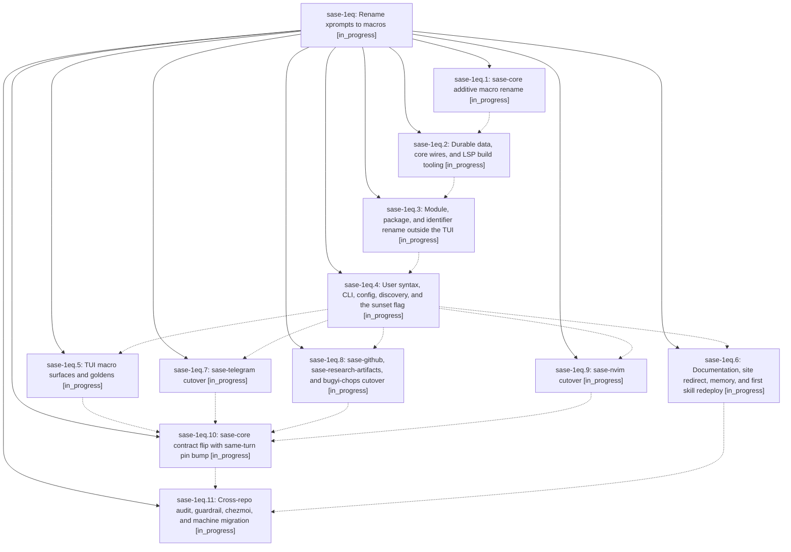

# Bead: sase-1eq — Rename xprompts to macros

[Bead Pages](../README.md) / sase-1eq

**Status:** ◐ in_progress · **Type:** ▸ plan · **Tier:** epic
**Owner:** `bryanbugyi34@gmail.com` · **Created by:** [bbugyi200.athena.0v4](https://github.com/sase-org/sase--agents/blob/main/sessions/bbugyi200.athena.0v4.md) · **Assignee:** `sase-1eq.land`
**Created:** 2026-10-02 06:51:19 EDT
**Plan:** [202610/xprompts\_to\_macros.md](https://github.com/sase-org/sase--plans/blob/main/202610/xprompts_to_macros.md)

## Description

SASE calls its reusable `#name` prompt definitions "macros" in code, CLI, config, directories, TUI, LSP, plugins, docs, memory, skills, and chezmoi. Agent artifacts, proc rows, state files, and stored prompts written before the rename still load. Retired xprompt spellings keep working behind one sunset flag until callers migrate.

## Phases

| Bead | Title | Status | Size | Created | Agents | Commits |
|---|---|---|---|---|---:|---:|
| [sase-1eq.1](sase-1eq.1.md) | sase-core additive macro rename | ◐ in_progress | large | 2026-10-02 | 1 | 1 |
| [sase-1eq.10](sase-1eq.10.md) | sase-core contract flip with same-turn pin bump | ◐ in_progress | large | 2026-10-02 | 1 | 0 |
| [sase-1eq.11](sase-1eq.11.md) | Cross-repo audit, guardrail, chezmoi, and machine migration | ◐ in_progress | medium | 2026-10-02 | 1 | 0 |
| [sase-1eq.2](sase-1eq.2.md) | Durable data, core wires, and LSP build tooling | ◐ in_progress | medium | 2026-10-02 | 1 | 0 |
| [sase-1eq.3](sase-1eq.3.md) | Module, package, and identifier rename outside the TUI | ◐ in_progress | large | 2026-10-02 | 1 | 0 |
| [sase-1eq.4](sase-1eq.4.md) | User syntax, CLI, config, discovery, and the sunset flag | ◐ in_progress | large | 2026-10-02 | 1 | 0 |
| [sase-1eq.5](sase-1eq.5.md) | TUI macro surfaces and goldens | ◐ in_progress | large | 2026-10-02 | 1 | 0 |
| [sase-1eq.6](sase-1eq.6.md) | Documentation, site redirect, memory, and first skill redeploy | ◐ in_progress | medium | 2026-10-02 | 1 | 0 |
| [sase-1eq.7](sase-1eq.7.md) | sase-telegram cutover | ◐ in_progress | small | 2026-10-02 | 1 | 0 |
| [sase-1eq.8](sase-1eq.8.md) | sase-github, sase-research-artifacts, and bugyi-chops cutover | ◐ in_progress | small | 2026-10-02 | 1 | 0 |
| [sase-1eq.9](sase-1eq.9.md) | sase-nvim cutover | ◐ in_progress | medium | 2026-10-02 | 1 | 0 |

## Lineage

## Agents

| Agent | Bead | Commits |
|---|---|---:|
| [bbugyi200.athena.sase-1eq.1](https://github.com/sase-org/sase--agents/blob/main/sessions/bbugyi200.athena.sase-1eq.1.md) | [sase-1eq.1](sase-1eq.1.md) | 1 |
| [bbugyi200.athena.sase-1eq.10](https://github.com/sase-org/sase--agents/blob/main/agents/bbugyi200.athena.sase-1eq.10/README.md) | [sase-1eq.10](sase-1eq.10.md) | 0 |
| [bbugyi200.athena.sase-1eq.11](https://github.com/sase-org/sase--agents/blob/main/agents/bbugyi200.athena.sase-1eq.11/README.md) | [sase-1eq.11](sase-1eq.11.md) | 0 |
| [bbugyi200.athena.sase-1eq.2](https://github.com/sase-org/sase--agents/blob/main/agents/bbugyi200.athena.sase-1eq.2/README.md) | [sase-1eq.2](sase-1eq.2.md) | 0 |
| [bbugyi200.athena.sase-1eq.3](https://github.com/sase-org/sase--agents/blob/main/agents/bbugyi200.athena.sase-1eq.3/README.md) | [sase-1eq.3](sase-1eq.3.md) | 0 |
| [bbugyi200.athena.sase-1eq.4](https://github.com/sase-org/sase--agents/blob/main/agents/bbugyi200.athena.sase-1eq.4/README.md) | [sase-1eq.4](sase-1eq.4.md) | 0 |
| [bbugyi200.athena.sase-1eq.5](https://github.com/sase-org/sase--agents/blob/main/agents/bbugyi200.athena.sase-1eq.5/README.md) | [sase-1eq.5](sase-1eq.5.md) | 0 |
| [bbugyi200.athena.sase-1eq.6](https://github.com/sase-org/sase--agents/blob/main/agents/bbugyi200.athena.sase-1eq.6/README.md) | [sase-1eq.6](sase-1eq.6.md) | 0 |
| [bbugyi200.athena.sase-1eq.7](https://github.com/sase-org/sase--agents/blob/main/agents/bbugyi200.athena.sase-1eq.7/README.md) | [sase-1eq.7](sase-1eq.7.md) | 0 |
| [bbugyi200.athena.sase-1eq.8](https://github.com/sase-org/sase--agents/blob/main/agents/bbugyi200.athena.sase-1eq.8/README.md) | [sase-1eq.8](sase-1eq.8.md) | 0 |
| [bbugyi200.athena.sase-1eq.9](https://github.com/sase-org/sase--agents/blob/main/agents/bbugyi200.athena.sase-1eq.9/README.md) | [sase-1eq.9](sase-1eq.9.md) | 0 |
| [bbugyi200.athena.sase-1eq.land](https://github.com/sase-org/sase--agents/blob/main/agents/bbugyi200.athena.sase-1eq.land/README.md) | [sase-1eq](README.md) | 0 |

## Commits

| Repo | Commit | Subject | Bead | Committed |
|---|---|---|---|---|
| sase-core | [`sase-core@015ce7f`](https://github.com/sase-org/sase-core/commit/015ce7f6ad1cc5ade253dc6d174ce55ae9dc30d3) | feat(core-expand): rename modules and query shorthands toward macros | [sase-1eq.1](sase-1eq.1.md) | 2026-10-02 07:32:05 EDT |
