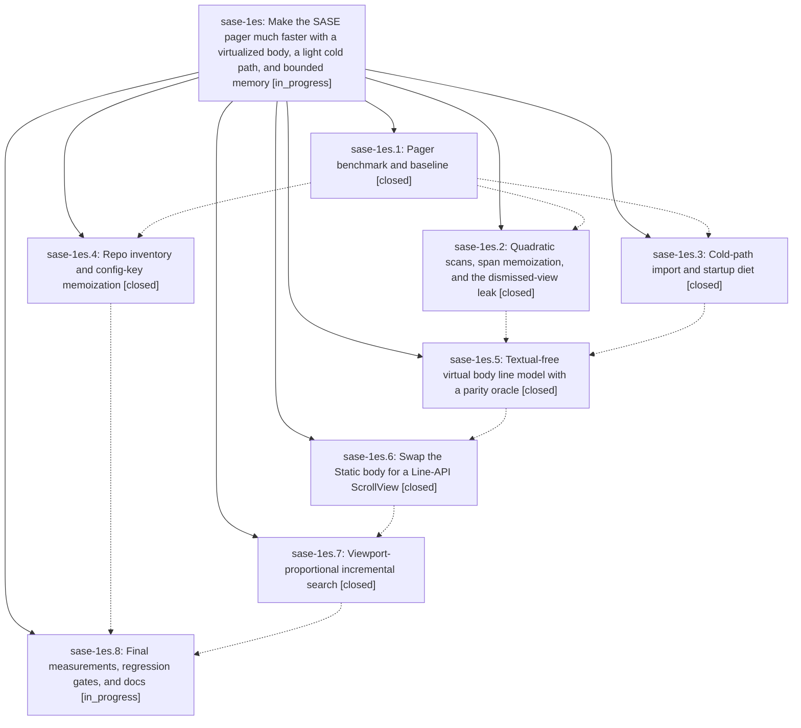

# Bead: sase-1es — Make the SASE pager much faster with a virtualized body, a light cold path, and bounded memory

[Bead Pages](../README.md) / sase-1es

**Status:** ◐ in_progress · **Type:** ▸ plan · **Tier:** epic
**Owner:** `bryanbugyi34@gmail.com` · **Created by:** [bbugyi200.athena.0v9](https://github.com/sase-org/sase--agents/blob/main/sessions/bbugyi200.athena.0v9.md) · **Assignee:** `sase-1es.land`
**Created:** 2026-10-02 08:37:43 EDT
**Plan:** [202610/pager\_performance.md](https://github.com/sase-org/sase--plans/blob/main/202610/pager_performance.md)

## Description

`sase pager`, `sase bead show`, `sase artifact read`, and every pager embedded in `sase tui` open and respond in time proportional to what is on screen rather than to document size, start without importing the ACE TUI stack, and release their memory when closed. Rendered output, keys, and navigation stay byte-for-byte identical, and the work adds no disk caches or unbounded memory.

## Notes

[2026-10-03T02:33:50Z · sase-1ez.land] DISCOVERED ISSUE: tests/pager/test_link_scan.py::test_scan_links_stays_fast_on_link_dense_input, the wall-clock budget test sase-1es.2 added in 8d1ac50c51 (assert elapsed < 1.5), failed in a loaded full just check during sase-1ez.5 and was triaged KNOWN with witness 40273fef0363a073f4b6a66931adee00 (sase-1ez.5 note #2). It passes 3/3 in isolation at master 54427ed47c (sase-1ez.land rerun). This is a load-sensitive absolute-time budget, not a regression in the epic's code. Consider an operation-count or relative bound, or a load-tolerant budget, before landing sase-1es.

## Phases

| Bead | Title | Status | Size | Created | Agents | Commits |
|---|---|---|---|---|---:|---:|
| [sase-1es.1](sase-1es.1.md) | Pager benchmark and baseline | ✓ closed | small | 2026-10-02 | 1 | 1 |
| [sase-1es.2](sase-1es.2.md) | Quadratic scans, span memoization, and the dismissed-view leak | ✓ closed | medium | 2026-10-02 | 1 | 1 |
| [sase-1es.3](sase-1es.3.md) | Cold-path import and startup diet | ✓ closed | medium | 2026-10-02 | 1 | 1 |
| [sase-1es.4](sase-1es.4.md) | Repo inventory and config-key memoization | ✓ closed | small | 2026-10-02 | 1 | 1 |
| [sase-1es.5](sase-1es.5.md) | Textual-free virtual body line model with a parity oracle | ✓ closed | medium | 2026-10-02 | 1 | 0 |
| [sase-1es.6](sase-1es.6.md) | Swap the Static body for a Line-API ScrollView | ✓ closed | large | 2026-10-02 | 1 | 1 |
| [sase-1es.7](sase-1es.7.md) | Viewport-proportional incremental search | ✓ closed | medium | 2026-10-02 | 1 | 1 |
| [sase-1es.8](sase-1es.8.md) | Final measurements, regression gates, and docs | ◐ in_progress | small | 2026-10-02 | 1 | 0 |

## Lineage

## Agents

| Agent | Bead | Commits |
|---|---|---:|
| [bbugyi200.athena.sase-1es.1](https://github.com/sase-org/sase--agents/blob/main/sessions/bbugyi200.athena.sase-1es.1.md) | [sase-1es.1](sase-1es.1.md) | 1 |
| [bbugyi200.athena.sase-1es.2](https://github.com/sase-org/sase--agents/blob/main/agents/bbugyi200.athena.sase-1es.2/README.md) | [sase-1es.2](sase-1es.2.md) | 1 |
| [bbugyi200.athena.sase-1es.3](https://github.com/sase-org/sase--agents/blob/main/sessions/bbugyi200.athena.sase-1es.3.md) | [sase-1es.3](sase-1es.3.md) | 1 |
| [bbugyi200.athena.sase-1es.4](https://github.com/sase-org/sase--agents/blob/main/sessions/bbugyi200.athena.sase-1es.4.md) | [sase-1es.4](sase-1es.4.md) | 1 |
| [bbugyi200.athena.sase-1es.5](https://github.com/sase-org/sase--agents/blob/main/sessions/bbugyi200.athena.sase-1es.5.md) | [sase-1es.5](sase-1es.5.md) | 0 |
| [bbugyi200.athena.sase-1es.6](https://github.com/sase-org/sase--agents/blob/main/sessions/bbugyi200.athena.sase-1es.6.md) | [sase-1es.6](sase-1es.6.md) | 1 |
| [bbugyi200.athena.sase-1es.7](https://github.com/sase-org/sase--agents/blob/main/agents/bbugyi200.athena.sase-1es.7/README.md) | [sase-1es.7](sase-1es.7.md) | 1 |
| [bbugyi200.athena.sase-1es.8](https://github.com/sase-org/sase--agents/blob/main/agents/bbugyi200.athena.sase-1es.8/README.md) | [sase-1es.8](sase-1es.8.md) | 0 |
| [bbugyi200.athena.sase-1es.land](https://github.com/sase-org/sase--agents/blob/main/agents/bbugyi200.athena.sase-1es.land/README.md) | [sase-1es](README.md) | 0 |

## Commits

| Repo | Commit | Subject | Bead | Committed |
|---|---|---|---|---|
| sase | [`6cca547`](https://github.com/sase-org/sase/commit/6cca547014bdb14afcaa80db5a772af29f3460aa) | feat(pager): add subprocess-isolated pager benchmark with baseline | [sase-1es.1](sase-1es.1.md) | 2026-10-02 10:27:01 EDT |
| sase | [`45f165b`](https://github.com/sase-org/sase/commit/45f165b6d52dddd812e249fe929c80a20520da4d) | perf(pager): memoize repo inventory and config-key per command | [sase-1es.4](sase-1es.4.md) | 2026-10-02 11:52:57 EDT |
| sase | [`acac8d8`](https://github.com/sase-org/sase/commit/acac8d83e010f3aa26ebebfaadc26d521fec09af) | perf(pager): lighten cold-path imports and startup work | [sase-1es.3](sase-1es.3.md) | 2026-10-02 12:52:06 EDT |
| sase | [`8d1ac50`](https://github.com/sase-org/sase/commit/8d1ac50c51706848d18aaaf8215ec0dd05745d74) | feat(pager): fix dismissed-view leak, near-linear scans, span/digest memoization, trailless search copies (sase-1es.2) | [sase-1es.2](sase-1es.2.md) | 2026-10-02 13:07:05 EDT |
| sase | [`54427ed`](https://github.com/sase-org/sase/commit/54427ed47c3ff911cd212778c13019440aa215f6) | feat(pager): virtualize body with Line-API ScrollView and bounded strip cache | [sase-1es.6](sase-1es.6.md) | 2026-10-02 22:21:58 EDT |
| sase | [`5a68eb5`](https://github.com/sase-org/sase/commit/5a68eb53a95ceb9daab3ef5e4452d78bcf24a99f) | feat(pager): viewport-proportional incremental search overlay | [sase-1es.7](sase-1es.7.md) | 2026-10-02 22:53:24 EDT |

<!-- sase:referenced-by:start -->

## Referenced By

| Relation | Artifact | Why | Uses |
| --- | --- | --- | ---: |
| read-by | [agent:0vd][1] | Determine overlap between sase-1es epic and three-pane splits work to assess safe early start | 1 |
| read-by | [agent:research.3c.cld][2] | Check in-flight pager epics and panel-row bead that overlap TUI memory history design | 2 |
| read-by | [agent:research.3c.final][3] | Determine pager virtualization phase status relative to embedding PagerView | 2 |
| read-by | [agent:research.3c.grk][4] | Need pager version-clarity, three-pane, and pager-speed epics that constrain TUI memory-history design | 1 |

[1]: https://github.com/sase-org/sase--agents/blob/main/agents/bbugyi200.athena.0vd/README.md
[2]: https://github.com/sase-org/sase--agents/blob/main/agents/bbugyi200.athena.research.3c.cld/README.md
[3]: https://github.com/sase-org/sase--agents/blob/main/agents/bbugyi200.athena.research.3c.final/README.md
[4]: https://github.com/sase-org/sase--agents/blob/main/agents/bbugyi200.athena.research.3c.grk/README.md

<!-- sase:referenced-by:end -->
