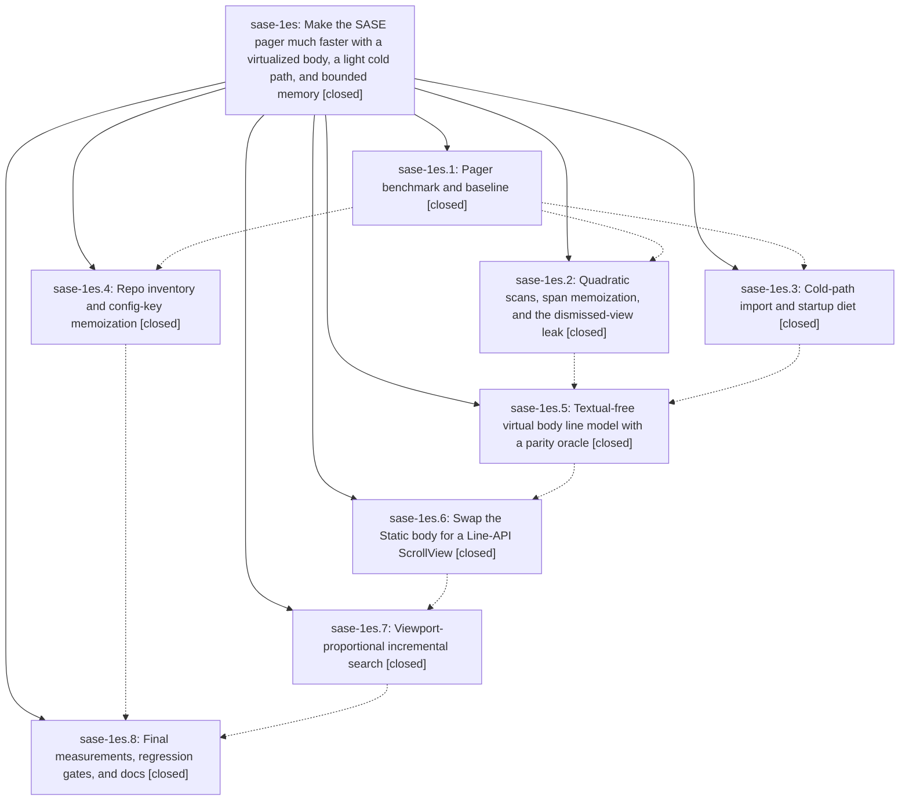

# Bead: sase-1es — Make the SASE pager much faster with a virtualized body, a light cold path, and bounded memory

[Bead Pages](../README.md) / sase-1es

**Status:** ✓ closed · **Resolution:** done · **Type:** ▸ plan · **Tier:** epic
**Owner:** `bryanbugyi34@gmail.com` · **Created by:** [bbugyi200.athena.0v9](https://github.com/sase-org/sase--agents/blob/main/sessions/bbugyi200.athena.0v9.md) · **Assignee:** `sase-1es.land`
**Created:** 2026-10-02 08:37:43 EDT · **Closed:** 2026-10-03 00:35:40 EDT
**Plan:** [202610/pager\_performance.md](https://github.com/sase-org/sase--plans/blob/main/202610/pager_performance.md)

## Description

`sase pager`, `sase bead show`, `sase artifact read`, and every pager embedded in `sase tui` open and respond in time proportional to what is on screen rather than to document size, start without importing the ACE TUI stack, and release their memory when closed. Rendered output, keys, and navigation stay byte-for-byte identical, and the work adds no disk caches or unbounded memory.

## Notes

[2026-10-03T02:33:50Z · sase-1ez.land] DISCOVERED ISSUE: tests/pager/test_link_scan.py::test_scan_links_stays_fast_on_link_dense_input, the wall-clock budget test sase-1es.2 added in 8d1ac50c51 (assert elapsed < 1.5), failed in a loaded full just check during sase-1ez.5 and was triaged KNOWN with witness 40273fef0363a073f4b6a66931adee00 (sase-1ez.5 note #2). It passes 3/3 in isolation at master 54427ed47c (sase-1ez.land rerun). This is a load-sensitive absolute-time budget, not a regression in the epic's code. Consider an operation-count or relative bound, or a load-tolerant budget, before landing sase-1es.

[2026-10-03T04:35:40Z · sase-1es.land] LANDED (sase-1es.land, base master 702c8c3167).

VERIFIED (step 1): all 8 phases closed, and every phase note was read and checked against the source.
- pager-bench: 6cca547014.
- inventory-memo: 45f165b6d5. repo_inventory_session plus name_registry_load_session are entered in pager_handler, bead cli_query and artifact read.
- cold-path-diet: acac8d83e0. Lazy sase.pager exports, leaf modules path_hints/jump_hints/hint_budgets, test_cold_path_import_cost.
- scan-leak-fixes: 8d1ac50c51. theme_changed_signal subscribe/unsubscribe in PagerView, ordered-interval scan_links, memoized spans/digests, trailless search copies.
- body-line-model and virtual-body-widget: both in 54427ed47c. _body_lines/_body_layout/_body_rows, frozen oracle tests/pager/_reference_compose.py, PagerBodyScroll ScrollView with bounded strip LRU. PagerBody(Static), compose_body and apply_gutter are gone from src. The _layout.py docstring is corrected.
- virtual-search-overlay: 5a68eb53a9. vim_search_paint_matches hook; ACE hosts keep the legacy path.
- perf-gates-docs: 702c8c3167. test_perf_gates.py, test_view_leak.py, docs/pager.md Performance, docs/perf_runbook.md, tests/perf/README.md.
- No --epic-symbol entries.
- Tests: tests/pager (non-visual) plus bench smoke, repo-inventory session, vim-search and view-files pager suites: 710 passed. The only 5 failures are the sase-1eu integration item below.
- Pager PNG check (ToolRun 1124ef25aa86aa826838e231ffc4a7ff): 107 passed, 89 unchanged, 18 drift. All 18 are timeband goldens, tracked by sase-1f8 (wall-clock title chip). Every split and three-pane golden is unchanged under the virtual body.

FIXED IN THIS LANDING (caused by the epic):
- Epic note #1: test_scan_links_stays_fast_on_link_dense_input used a load-sensitive 1.5s wall-clock budget. It is replaced by test_scan_links_stays_near_linear_on_link_dense_input, an operation-count bound: zero linear _overlaps fallbacks and exactly one bisect query per bare token on 8k link-dense lines, for both FILE and BEAD origins.
- Stale _body_lines.py docstrings that named the deleted src apply_gutter now point at the retired composer frozen in tests/pager/_reference_compose.py.
- sase tool run check cfa773a1036ba0fb5cd5208a5908b405 escalated to the full lane: 51944 passed. Its failures are all outside this epic: KNOWN symvision publication_payload_facade, plus the prompt-bar, keymap and other KNOWN items. The 3 NEW are siblings in test_prompt_bar_editor_stack, caused by sase-1ex.10 and recorded on sase-1ex.

INTEGRATION (step 2): commits since 6cca547014 were reviewed.
- Every pager commit that landed before 54427ed47c/5a68eb53a9 was absorbed by those phases.
- ba91bf93c1 and a582a422eb (memory pane/history) use history_kit only, not the old composer.
- eca4db14b8 (the _linked_repo_config split) kept the inventory memo and updated test_repo_inventory_session.
- 117f5779d3 retargeted the cold-path watch list to sase.macro.
- Semantic conflict: c62e4f1491 (sase-1eu.8) asserts on #pager-body, which 54427ed47c removed, so 5 tests in tests/pager/test_app_three_panes.py fail on master. test_view_files_pager_split_keys fails too, from sase-1eu's `|` nest semantics. Both items are claimed and already fixed by the in-flight sase-1eu landing tale (sase-1eu note #2 item 1, note #4 '24 passed'). I left that file untouched to avoid a conflicting duplicate edit.

FOLLOW-UP TRIAGE:
- New tasks:
  - sase-1fa: label-prefix key 0.1-3.8s (1es.6 #3/#4, 1es.8 #7).
  - sase-1fb: open misses targets, code-sparse/100k TIMEOUT, key-max stalls, quiet-box re-bench (1es.6 #3/#4, 1es.8 #1).
  - sase-1fc: sase-core per-link wire conversion (1es.8 #5).
  - sase-1fd: tui_perf.md one-big-Static rule (1es.8 #2; the docstring half was already done).
  - sase-1fe: AgentFilePanel/AgentPromptPanel Static shape (1es.8 #3).
  - sase-1ff: deck block_rail/panel_chrome theme-signal leak (1es.8 #4).
  - sase-1fg: tui_trace.jsonl has no rotation (1es.8 #6).
  - sase-1fh: plain-bead bench fixture (1es.1 #1, 1es.8 #8).
  - sase-1fi: test_sigterm_leaves_run_running load flake (1es.6 #1/#2).
- +1 on existing tasks:
  - sase-1f8: timeband goldens (1es.6 #2/#5, 1es.7 #1).
  - sase-1et: diff-range flip (1es.6 #2).
  - sase-1f9: history past-frame (1es.6 #5).
  - sase-1f0: demand_runs RSS (1es.4 #2, 1es.5 #2).
  - sase-1br: block_spread_bracket (1es.2 #2).
  - sase-13a: zsh sbd (1es.2 #2).
  - sase-12f: monitor_capacity_e2e fakey (1es.6 #1/#2/#6).
- Noted on epic sase-1ex: symvision PublicationPayloadFile/plan_publication_payload_batches (1es.7 #2).
- Declined:
  - directive-completion/contract x4 and the alias flake (1es.2 #1/#2, 1es.3 #1, 1es.5 #1): 14/14 pass at HEAD.
  - test_app_import_budget (1es.1 #3, 1es.2 #1, 1es.4 #1): passes at HEAD.
  - force_reuse launch-seam x6 (1es.1 #3, 1es.5 #2): fixed by closed sase-1cm; 32/32 pass.
  - 38-golden host drift (1es.2 #3): no longer reproduces; only the 18 timeband goldens drift.
  - test_unresolvable_label_toasts (1es.6 #1): one ledger failure, only in the in-flight 1es.6 tree that also had a since-fixed dangling regression; 8/8 serial passes plus full-suite passes at HEAD.
  - 20k search keystroke profiling (1es.7 #3): conditional on a 60ms gate needing it; the 1es.8 final bench measured 21-65ms per char, with no gate failing.

## Phases

| Bead | Title | Status | Size | Created | Agents | Commits |
|---|---|---|---|---|---:|---:|
| [sase-1es.1](sase-1es.1.md) | Pager benchmark and baseline | ✓ closed | small | 2026-10-02 | 1 | 1 |
| [sase-1es.2](sase-1es.2.md) | Quadratic scans, span memoization, and the dismissed-view leak | ✓ closed | medium | 2026-10-02 | 1 | 1 |
| [sase-1es.3](sase-1es.3.md) | Cold-path import and startup diet | ✓ closed | medium | 2026-10-02 | 1 | 1 |
| [sase-1es.4](sase-1es.4.md) | Repo inventory and config-key memoization | ✓ closed | small | 2026-10-02 | 1 | 1 |
| [sase-1es.5](sase-1es.5.md) | Textual-free virtual body line model with a parity oracle | ✓ closed | medium | 2026-10-02 | 1 | 0 |
| [sase-1es.6](sase-1es.6.md) | Swap the Static body for a Line-API ScrollView | ✓ closed | large | 2026-10-02 | 1 | 1 |
| [sase-1es.7](sase-1es.7.md) | Viewport-proportional incremental search | ✓ closed | medium | 2026-10-02 | 1 | 1 |
| [sase-1es.8](sase-1es.8.md) | Final measurements, regression gates, and docs | ✓ closed | small | 2026-10-02 | 1 | 1 |

## Lineage

## Agents

| Agent | Bead | Commits |
|---|---|---:|
| [bbugyi200.athena.sase-1es.1](https://github.com/sase-org/sase--agents/blob/main/sessions/bbugyi200.athena.sase-1es.1.md) | [sase-1es.1](sase-1es.1.md) | 1 |
| [bbugyi200.athena.sase-1es.2](https://github.com/sase-org/sase--agents/blob/main/agents/bbugyi200.athena.sase-1es.2/README.md) | [sase-1es.2](sase-1es.2.md) | 1 |
| [bbugyi200.athena.sase-1es.3](https://github.com/sase-org/sase--agents/blob/main/sessions/bbugyi200.athena.sase-1es.3.md) | [sase-1es.3](sase-1es.3.md) | 1 |
| [bbugyi200.athena.sase-1es.4](https://github.com/sase-org/sase--agents/blob/main/sessions/bbugyi200.athena.sase-1es.4.md) | [sase-1es.4](sase-1es.4.md) | 1 |
| [bbugyi200.athena.sase-1es.5](https://github.com/sase-org/sase--agents/blob/main/sessions/bbugyi200.athena.sase-1es.5.md) | [sase-1es.5](sase-1es.5.md) | 0 |
| [bbugyi200.athena.sase-1es.6](https://github.com/sase-org/sase--agents/blob/main/sessions/bbugyi200.athena.sase-1es.6.md) | [sase-1es.6](sase-1es.6.md) | 1 |
| [bbugyi200.athena.sase-1es.7](https://github.com/sase-org/sase--agents/blob/main/agents/bbugyi200.athena.sase-1es.7/README.md) | [sase-1es.7](sase-1es.7.md) | 1 |
| [bbugyi200.athena.sase-1es.8](https://github.com/sase-org/sase--agents/blob/main/agents/bbugyi200.athena.sase-1es.8/README.md) | [sase-1es.8](sase-1es.8.md) | 1 |
| [bbugyi200.athena.sase-1es.land](https://github.com/sase-org/sase--agents/blob/main/agents/bbugyi200.athena.sase-1es.land/README.md) | [sase-1es](README.md) | 1 |

## Commits

| Repo | Commit | Subject | Bead | Committed |
|---|---|---|---|---|
| sase | [`6cca547`](https://github.com/sase-org/sase/commit/6cca547014bdb14afcaa80db5a772af29f3460aa) | feat(pager): add subprocess-isolated pager benchmark with baseline | [sase-1es.1](sase-1es.1.md) | 2026-10-02 10:27:01 EDT |
| sase | [`45f165b`](https://github.com/sase-org/sase/commit/45f165b6d52dddd812e249fe929c80a20520da4d) | perf(pager): memoize repo inventory and config-key per command | [sase-1es.4](sase-1es.4.md) | 2026-10-02 11:52:57 EDT |
| sase | [`acac8d8`](https://github.com/sase-org/sase/commit/acac8d83e010f3aa26ebebfaadc26d521fec09af) | perf(pager): lighten cold-path imports and startup work | [sase-1es.3](sase-1es.3.md) | 2026-10-02 12:52:06 EDT |
| sase | [`8d1ac50`](https://github.com/sase-org/sase/commit/8d1ac50c51706848d18aaaf8215ec0dd05745d74) | feat(pager): fix dismissed-view leak, near-linear scans, span/digest memoization, trailless search copies (sase-1es.2) | [sase-1es.2](sase-1es.2.md) | 2026-10-02 13:07:05 EDT |
| sase | [`54427ed`](https://github.com/sase-org/sase/commit/54427ed47c3ff911cd212778c13019440aa215f6) | feat(pager): virtualize body with Line-API ScrollView and bounded strip cache | [sase-1es.6](sase-1es.6.md) | 2026-10-02 22:21:58 EDT |
| sase | [`5a68eb5`](https://github.com/sase-org/sase/commit/5a68eb53a95ceb9daab3ef5e4452d78bcf24a99f) | feat(pager): viewport-proportional incremental search overlay | [sase-1es.7](sase-1es.7.md) | 2026-10-02 22:53:24 EDT |
| sase | [`702c8c3`](https://github.com/sase-org/sase/commit/702c8c3167432347cc2800629a947f3ddaa4bdad) | perf(pager): finalize measurements, regression gates, and docs (sase-1es.8) | [sase-1es.8](sase-1es.8.md) | 2026-10-02 23:18:24 EDT |
| sase | [`b5c9e6a`](https://github.com/sase-org/sase/commit/b5c9e6a16916a3c2f2ca407ecd689a0fce733e61) | test(pager): land sase-1es with an operation-count link-scan bound and current body-line docs | [sase-1es](README.md) | 2026-10-03 00:38:39 EDT |

<!-- sase:referenced-by:start -->

## Referenced By

| Relation | Artifact | Why | Uses |
| --- | --- | --- | ---: |
| read-by | [agent:0vd][1] | Determine overlap between sase-1es epic and three-pane splits work to assess safe early start | 1 |
| read-by | [agent:research.3c.cld][2] | Check in-flight pager epics and panel-row bead that overlap TUI memory history design | 2 |
| read-by | [agent:research.3c.final][3] | Determine pager virtualization phase status relative to embedding PagerView | 2 |
| read-by | [agent:research.3c.grk][4] | Need pager version-clarity, three-pane, and pager-speed epics that constrain TUI memory-history design | 1 |

[1]: https://github.com/sase-org/sase--agents/blob/main/agents/bbugyi200.athena.0vd/README.md
[2]: https://github.com/sase-org/sase--agents/blob/main/agents/bbugyi200.athena.research.3c.cld/README.md
[3]: https://github.com/sase-org/sase--agents/blob/main/agents/bbugyi200.athena.research.3c.final/README.md
[4]: https://github.com/sase-org/sase--agents/blob/main/agents/bbugyi200.athena.research.3c.grk/README.md

<!-- sase:referenced-by:end -->
