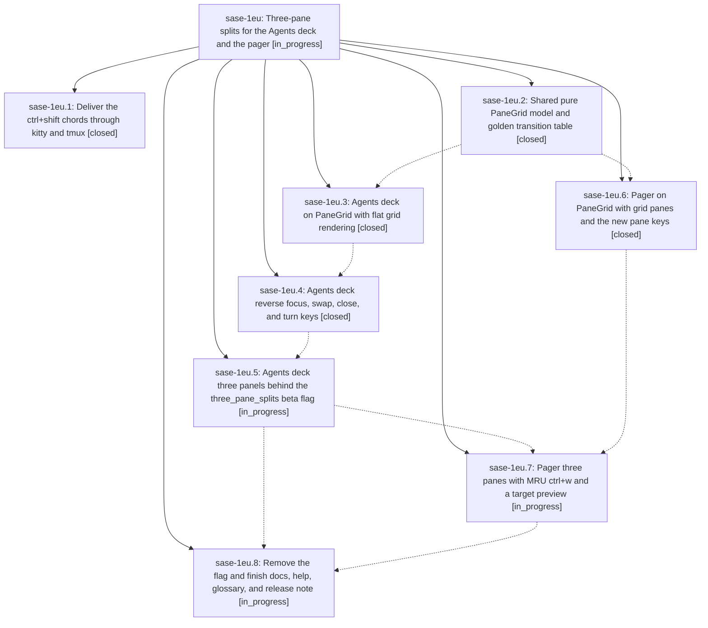

# Bead: sase-1eu — Three-pane splits for the Agents deck and the pager

[Bead Pages](../README.md) / sase-1eu

**Status:** ◐ in_progress · **Type:** ▸ plan · **Tier:** epic
**Owner:** `bryanbugyi34@gmail.com` · **Created by:** [bbugyi200.athena.0ve](https://github.com/sase-org/sase--agents/blob/main/sessions/bbugyi200.athena.0ve.md) · **Assignee:** `sase-1eu.land`
**Created:** 2026-10-02 11:33:49 EDT
**Plan:** [202610/three\_pane\_splits.md](https://github.com/sase-org/sase--plans/blob/main/202610/three_pane_splits.md)

## Description

The Agents-tab deck and the sase pager share one closed split model with seven geometries: single, two two-pane splits, and four three-pane T shapes. The existing `\` / `|` keys follow one rule: erase a full-span divider, draw one through the focused pane, or turn a three-pane layout. New keys add a focus ring (`ctrl+f` / `ctrl+b`), content swap (`ctrl+shift+f` / `ctrl+shift+b`, aliases `>` / `<`), close-focused (`ctrl+shift+d`, alias `ctrl+x`) and turn (`ctrl+t`). Rendering is spatially stable, shows exactly one full-strength frame, and never remounts a pane. The work lands without colliding with the sase-1es pager performance epic.

## Phases

| Bead | Title | Status | Size | Created | Agents | Commits |
|---|---|---|---|---|---:|---:|
| [sase-1eu.1](sase-1eu.1.md) | Deliver the ctrl+shift chords through kitty and tmux | ✓ closed | small | 2026-10-02 | 1 | 0 |
| [sase-1eu.2](sase-1eu.2.md) | Shared pure PaneGrid model and golden transition table | ✓ closed | medium | 2026-10-02 | 1 | 1 |
| [sase-1eu.3](sase-1eu.3.md) | Agents deck on PaneGrid with flat grid rendering | ✓ closed | medium | 2026-10-02 | 1 | 1 |
| [sase-1eu.4](sase-1eu.4.md) | Agents deck reverse focus, swap, close, and turn keys | ✓ closed | medium | 2026-10-02 | 1 | 1 |
| [sase-1eu.5](sase-1eu.5.md) | Agents deck three panels behind the three\_pane\_splits beta flag | ◐ in_progress | medium | 2026-10-02 | 1 | 0 |
| [sase-1eu.6](sase-1eu.6.md) | Pager on PaneGrid with grid panes and the new pane keys | ✓ closed | medium | 2026-10-02 | 1 | 1 |
| [sase-1eu.7](sase-1eu.7.md) | Pager three panes with MRU ctrl+w and a target preview | ◐ in_progress | medium | 2026-10-02 | 1 | 0 |
| [sase-1eu.8](sase-1eu.8.md) | Remove the flag and finish docs, help, glossary, and release note | ◐ in_progress | small | 2026-10-02 | 1 | 0 |

## Lineage

## Agents

| Agent | Bead | Commits |
|---|---|---:|
| [bbugyi200.athena.sase-1eu.1](https://github.com/sase-org/sase--agents/blob/main/agents/bbugyi200.athena.sase-1eu.1/README.md) | [sase-1eu.1](sase-1eu.1.md) | 0 |
| [bbugyi200.athena.sase-1eu.2](https://github.com/sase-org/sase--agents/blob/main/sessions/bbugyi200.athena.sase-1eu.2.md) | [sase-1eu.2](sase-1eu.2.md) | 1 |
| [bbugyi200.athena.sase-1eu.3](https://github.com/sase-org/sase--agents/blob/main/agents/bbugyi200.athena.sase-1eu.3/README.md) | [sase-1eu.3](sase-1eu.3.md) | 1 |
| [bbugyi200.athena.sase-1eu.4](https://github.com/sase-org/sase--agents/blob/main/agents/bbugyi200.athena.sase-1eu.4/README.md) | [sase-1eu.4](sase-1eu.4.md) | 1 |
| [bbugyi200.athena.sase-1eu.5](https://github.com/sase-org/sase--agents/blob/main/agents/bbugyi200.athena.sase-1eu.5/README.md) | [sase-1eu.5](sase-1eu.5.md) | 0 |
| [bbugyi200.athena.sase-1eu.6](https://github.com/sase-org/sase--agents/blob/main/sessions/bbugyi200.athena.sase-1eu.6.md) | [sase-1eu.6](sase-1eu.6.md) | 1 |
| [bbugyi200.athena.sase-1eu.7](https://github.com/sase-org/sase--agents/blob/main/agents/bbugyi200.athena.sase-1eu.7/README.md) | [sase-1eu.7](sase-1eu.7.md) | 0 |
| [bbugyi200.athena.sase-1eu.8](https://github.com/sase-org/sase--agents/blob/main/agents/bbugyi200.athena.sase-1eu.8/README.md) | [sase-1eu.8](sase-1eu.8.md) | 0 |
| [bbugyi200.athena.sase-1eu.land](https://github.com/sase-org/sase--agents/blob/main/agents/bbugyi200.athena.sase-1eu.land/README.md) | [sase-1eu](README.md) | 0 |

## Commits

| Repo | Commit | Subject | Bead | Committed |
|---|---|---|---|---|
| sase | [`fc8830c`](https://github.com/sase-org/sase/commit/fc8830c6bcae33187028c36075086347dfc44653) | feat(ace): add shared pure PaneGrid model with golden transition table | [sase-1eu.2](sase-1eu.2.md) | 2026-10-02 12:48:23 EDT |
| sase | [`5dff14e`](https://github.com/sase-org/sase/commit/5dff14eab43ef40616b1cde0687daa2fe4a9c2c4) | feat(pager): port pager to PaneGrid and clear sase-1eu.6 epic symbols | [sase-1eu.6](sase-1eu.6.md) | 2026-10-02 13:53:51 EDT |
| sase | [`e34386f`](https://github.com/sase-org/sase/commit/e34386fee4e4dd404183ff9f1f99a080daa6e514) | feat(decks): rebuild DeckAreaState on PaneGrid with pane-ID-keyed panels | [sase-1eu.3](sase-1eu.3.md) | 2026-10-02 14:32:08 EDT |
| sase | [`2bbc346`](https://github.com/sase-org/sase/commit/2bbc346036cc79c1069ce27ad1bc7f29788f0c0a) | feat(ace): add deck layout operations, keymaps, and palette entries | [sase-1eu.4](sase-1eu.4.md) | 2026-10-02 15:23:16 EDT |

<!-- sase:referenced-by:start -->

## Referenced By

| Relation | Artifact | Why | Uses |
| --- | --- | --- | ---: |
| read-by | [agent:research.3c.cld][1] | Check in-flight pager epics and panel-row bead that overlap TUI memory history design | 1 |
| read-by | [agent:research.3c.final][2] | Check status/scope of memory-history follow-ups to sequence the TUI design | 2 |
| read-by | [agent:research.3c.grk][3] | Need pager version-clarity, three-pane, and pager-speed epics that constrain TUI memory-history design | 1 |
| read-by | [agent:sase-1eu.3][4] | Need parent epic scope for phase sase-1eu.3 | 1 |
| read-by | [agent:sase-1eu.6--1][5] | Check parent epic status and remaining phases before closing sase-1eu.6 | 1 |

[1]: https://github.com/sase-org/sase--agents/blob/main/agents/bbugyi200.athena.research.3c.cld/README.md
[2]: https://github.com/sase-org/sase--agents/blob/main/agents/bbugyi200.athena.research.3c.final/README.md
[3]: https://github.com/sase-org/sase--agents/blob/main/agents/bbugyi200.athena.research.3c.grk/README.md
[4]: https://github.com/sase-org/sase--agents/blob/main/agents/bbugyi200.athena.sase-1eu.3/README.md
[5]: https://github.com/sase-org/sase--agents/blob/main/sessions/bbugyi200.athena.sase-1eu.6.md

<!-- sase:referenced-by:end -->
