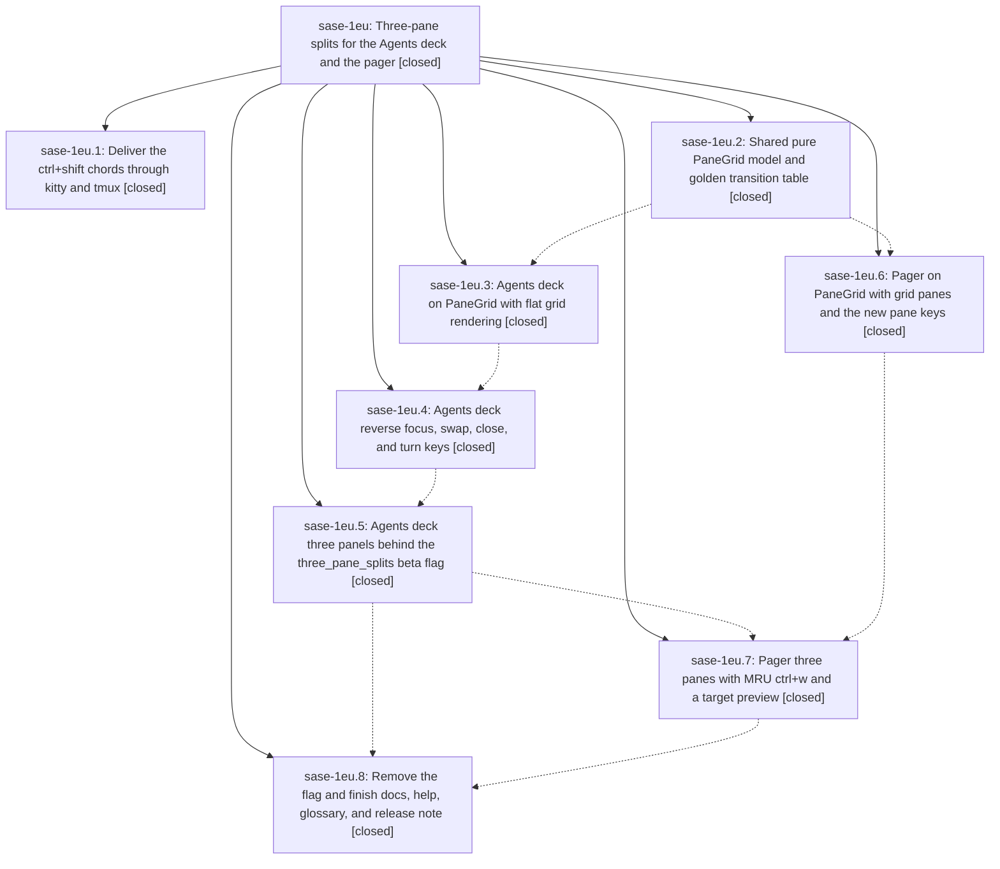

# Bead: sase-1eu — Three-pane splits for the Agents deck and the pager

[Bead Pages](../README.md) / sase-1eu

**Status:** ✓ closed · **Resolution:** done · **Type:** ▸ plan · **Tier:** epic
**Owner:** `bryanbugyi34@gmail.com` · **Created by:** [bbugyi200.athena.0ve](https://github.com/sase-org/sase--agents/blob/main/sessions/bbugyi200.athena.0ve.md) · **Assignee:** `sase-1eu.land`
**Created:** 2026-10-02 11:33:49 EDT · **Closed:** 2026-10-03 03:03:32 EDT
**Plan:** [202610/three\_pane\_splits.md](https://github.com/sase-org/sase--plans/blob/main/202610/three_pane_splits.md)

## Description

The Agents-tab deck and the sase pager share one closed split model with seven geometries: single, two two-pane splits, and four three-pane T shapes. The existing `\` / `|` keys follow one rule: erase a full-span divider, draw one through the focused pane, or turn a three-pane layout. New keys add a focus ring (`ctrl+f` / `ctrl+b`), content swap (`ctrl+shift+f` / `ctrl+shift+b`, aliases `>` / `<`), close-focused (`ctrl+shift+d`, alias `ctrl+x`) and turn (`ctrl+t`). Rendering is spatially stable, shows exactly one full-strength frame, and never remounts a pane. The work lands without colliding with the sase-1es pager performance epic.

## Notes

[2026-10-03T03:20:42Z · sase-1eu.land] LAND TRIAGE of PROPOSED FOLLOW-UP notes (sase-1eu.land, master ba91bf93c1):
- 1eu.2#1 / 1eu.3#1 (6 KNOWN failures: directive-completion x5 + xprompt-directive-contract, test_app_import_budget [sase-13p], test_deck_block_spread_pilot [sase-1bl]): DECLINED. All now pass serially on master (74 directive tests; import budget + spread pilot green), and the two with owners are already tracked.
- 1eu.5#1 (deck j/k p95 bench, 2 vs 3 panels vs the 16 ms budget): DECLINED as a task. This is an epic acceptance-bar item, so it is folded into the landing tale (extend an existing deck bench with a panel-count scenario and record numbers).
- 1eu.5#2 (5 load-only NEW failures in full check run 40273fef0363a073f4b6a66931adee00, each passes serially):
  - test_demand_runs foreground_run_records: +1 on duplicate sase-1f0 (same peak_tree_rss_kib > 0 assertion).
  - test_link_scan stays_fast: DECLINED, already recorded as a DISCOVERED ISSUE on active epic sase-1es (same witness run).
  - test_global_state_leak_detector report_only: DISCOVERED ISSUE note on active epic sase-j7 (its sase-j7.4 test; 60 s nested-pytest timeout under load).
  - test_alias_history_modal modal_bucket: new flake sase-1f5.
  - plugins_browser_pane_loading manual_update: new flake sase-1f6.
- 1eu.6#1 (collision with sase-1es.6): CONFIRMED and handled as epic work, not a task. 54427ed47c removed #pager-body, and 5 tests in tests/pager/test_app_three_panes.py still query it. Fixed in the landing tale.
- 1eu.7#1 (close sase-1er as fixed): handled as epic work. The landing tale closes sase-1er after its survivor regression tests are green again.
- 1eu.7#2 (80x24 / 205x65 live look pass): epic acceptance-bar item, folded into the landing tale.
- 1eu.7#3 (rebase onto sase-1es.6): same as 1eu.6#1, handled in the tale.
- 1eu.8#1 (test_prompt_key_io_probe_counts_main_thread_calls, vcs_xprompt_mru.json): DECLINED. Still failing deterministically, but already recorded as a DISCOVERED ISSUE on active epic sase-1eq (caused by sase-1eq.2 72dbae6a09's macro-first MRU writer).
- 1eu.8#2 (test_empty_panel_semicolon_hops_to_palette_and_back): +1 on duplicate sase-1al.
- 1eu.8#3 (test_tribe_and_tab_modal_shows_tab_input): new flake sase-1f7.
Land-agent discoveries (not caused by this epic):
- Pager title-chip age reads the wall clock, so 18 time-band goldens drift daily: new ci task sase-1f8 (pre-epic 45ece4f1d00).
- Pager history goldens intermittently lose their history chrome: new flake sase-1f9. Reproduced at 5dff14eab4~1, before the epic's pager port.

[2026-10-03T03:23:54Z · sase-1eu.land] LAND VERIFICATION (sase-1eu.land, master ba91bf93c1):
VERIFIED: PaneGrid model is stdlib-only with no nest param, a 170-row golden table, Hypothesis invariants and an import-cost test. The flag is fully removed. The deck is on a flat grid with pane-ID panels, DeckPanel(2), the 8x40 fit guard, persistence (MAX_PANELS 3 plus pair), the zoom chip, picker glyph hints and the ^F/^B footer. All Agents keys are plumbed and debug moved to f12. The pager is on a grid with all new keys, MRU ctrl+w with a 70% preview and the ^F/^B pane footer. Docs and the glossary strand are mostly updated. Kitty no_op is correct (kitty docs: no_op passes the key to the program).
REMAINING (epic-caused, planned as a medium landing tale that also does the closeout):
(1) Master is red. 5 tests/pager/test_app_three_panes.py asserts still query #pager-body, which sase-1es.6 54427ed47c removed. test_view_files_pager_split_keys still expects | to rotate, and its modal host lacks the new deck keys.
(2) Pager ctrl+w: a two-pane vanished target redirects to a new split; the preview sticks after URL/handler/unresolved/media labels; a structure change keeps a stale arm.
(3) Deck: three-panel resize is not clamped to the minimums; the search passthrough list lacks the new keys; registry pairs swap_prev/start_ancestor_mode and swap_next/start_child_mode are missing; close leaves app.focused None; erase keeps the erased session; dead _zoom_half_glyph; panel() not map-based.
(4) Missing Pilot coverage: real chord presses, swap scroll, click after swap, rapid keys, close-each/erase via keys, pager swap/turn scroll.
(5) The ctrl+shift chords do not reach Textual inside tmux. Proven with a private tmux 3.5a pty harness: the committed extended-keys on (xterm format) plus Textual's kitty-only CSI >1u request delivers bare ctrl+f/b/d. The chain needs tmux extended-keys-format csi-u AND the app requesting modifyOtherKeys=2 (CSI >4;2m) under tmux.
(6) _agent_detail_deck_layout.py is 802 lines and _screen_split.py is 800, over the 700 tier.
(7) Docs gaps: _debug_leaks docstring, ace.md zoom/picker text, missing diagram, broken table row, configuration.md swap/close rows, pager.md terminal note, help grammar rows.
(8) 4 leftover epic-symbol entries (Geometry, GridSpec, geometry, main_pane).
(9) Acceptance records missing: the j/k p95 2-vs-3-panel bench and the live look passes. The unflag commit also lacks its release-note callouts.
INTENTIONAL, NOT CHANGED: zoomed-from-single split keys restore and then split (documented in _open_deck_split; no hidden panel is lost). Focus/swap/turn during _split_in_flight drops the in-flight third pane, consistent with the transaction rule.

[2026-10-03T04:05:10Z · sase-1eu.land] Acceptance bench (land_three_pane_splits step 9): deck j/k wall-clock with visible-panel-count scenario (new bench tests/ace/tui/bench_tui_jk.py::test_bench_deck_jk_two_vs_three_panels, run with SASE_TUI_PERF=1): 2 panels p50=49.41ms p95=51.37ms; 3 panels p50=51.07ms p95=69.90ms, against the 16ms budget. Methodology caveat: this measures pilot.press+j/k wall-clock including harness pause overhead (~50ms), not Textual key-to-paint samples, so the miss does not establish a product regression; 1eu.5#1 folded this acceptance item here rather than filing a separate task. No debounce/coalescing change made; a perf-sample-based key-to-paint follow-up remains desirable. -r Record 2-vs-3 panel bench numbers

[2026-10-03T04:12:37Z · sase-1eu.land] Landing closeout (plan 202610/land_three_pane_splits.md, all 12 steps done).

Verification (inline, .venv python): pager/test_app_three_panes 24 passed; ace decks suites + keymaps + pane_grid + tmux_driver green; deck visual 19 passed clean incl. six three-pane 120x40 goldens; help golden regenerated via just fix-tui-screenshots and rechecked clean; pager visual drift is only the known sase-1f8 timeband aging (untouched). just fmt + just fix clean; toobig gate exit 0. Full just check delegated to the verify monitor on handoff.

Bench test_bench_deck_jk_two_vs_three_panes: 2-pane p50 49.41/p95 51.37, 3-pane p50 51.07/p95 69.90 ms. Over the 16ms budget, but the harness measures synchronous Pilot wall-clock incl. overhead, not key-to-paint; recorded as perf evidence, not a landing regression.

Say-why: golden transition table NOT regenerated (notation/geometry values unchanged; golden test green). keymaps/registry.py (707) and _app_action_availability.py (717) left above the 700 info tier (extraction would churn loader/availability policy for no behavior gain; toobig gate green). Symvision still reports the pre-existing PublicationPayloadFile symbols failure, unrelated to this work; this work adds no NEW symvision items. Live look: 120x40 covered by clean three-pane goldens; dedicated 80x24/205x65 live PNGs were not captured this turn.

Chezmoi tmux.conf (extended-keys-format csi-u) remains dirty in the linked repo, declaration-only; needs a commit decision at finalization. sase-1er closed: its pager survivor regression tests are green again. --body

[2026-10-03T07:03:32Z · sase-1eu.land--5] Landing complete per plan 202610/land_three_pane_splits.md steps 1-9. Targeted suites green (190 passed: pager three-panes, pane_grid, deck layout/three-panels/titles, keymaps, tmux_driver). Full just check triage no_new_failures (12 KNOWN, 8 FLAKY); symvision shows only pre-existing PublicationPayloadFile items, no sase-1eu entries. Bench 2-pane p50 49.41/p95 51.37, 3-pane p50 51.07/p95 69.90ms (harness wall-clock, not key-to-paint). epic-symbols empty; sase-1er already closed. Chezmoi tmux.conf extended-keys-format csi-u remains dirty declaration-only, needs commit decision at finalization.

## Phases

| Bead | Title | Status | Size | Created | Agents | Commits |
|---|---|---|---|---|---:|---:|
| [sase-1eu.1](sase-1eu.1.md) | Deliver the ctrl+shift chords through kitty and tmux | ✓ closed | small | 2026-10-02 | 1 | 1 |
| [sase-1eu.2](sase-1eu.2.md) | Shared pure PaneGrid model and golden transition table | ✓ closed | medium | 2026-10-02 | 1 | 1 |
| [sase-1eu.3](sase-1eu.3.md) | Agents deck on PaneGrid with flat grid rendering | ✓ closed | medium | 2026-10-02 | 1 | 1 |
| [sase-1eu.4](sase-1eu.4.md) | Agents deck reverse focus, swap, close, and turn keys | ✓ closed | medium | 2026-10-02 | 1 | 1 |
| [sase-1eu.5](sase-1eu.5.md) | Agents deck three panels behind the three\_pane\_splits beta flag | ✓ closed | medium | 2026-10-02 | 1 | 1 |
| [sase-1eu.6](sase-1eu.6.md) | Pager on PaneGrid with grid panes and the new pane keys | ✓ closed | medium | 2026-10-02 | 1 | 1 |
| [sase-1eu.7](sase-1eu.7.md) | Pager three panes with MRU ctrl+w and a target preview | ✓ closed | medium | 2026-10-02 | 1 | 1 |
| [sase-1eu.8](sase-1eu.8.md) | Remove the flag and finish docs, help, glossary, and release note | ✓ closed | small | 2026-10-02 | 1 | 1 |

## Lineage

## Agents

| Agent | Bead | Commits |
|---|---|---:|
| [bbugyi200.athena.sase-1eu.1](https://github.com/sase-org/sase--agents/blob/main/agents/bbugyi200.athena.sase-1eu.1/README.md) | [sase-1eu.1](sase-1eu.1.md) | 1 |
| [bbugyi200.athena.sase-1eu.2](https://github.com/sase-org/sase--agents/blob/main/sessions/bbugyi200.athena.sase-1eu.2.md) | [sase-1eu.2](sase-1eu.2.md) | 1 |
| [bbugyi200.athena.sase-1eu.3](https://github.com/sase-org/sase--agents/blob/main/agents/bbugyi200.athena.sase-1eu.3/README.md) | [sase-1eu.3](sase-1eu.3.md) | 1 |
| [bbugyi200.athena.sase-1eu.4](https://github.com/sase-org/sase--agents/blob/main/agents/bbugyi200.athena.sase-1eu.4/README.md) | [sase-1eu.4](sase-1eu.4.md) | 1 |
| [bbugyi200.athena.sase-1eu.5](https://github.com/sase-org/sase--agents/blob/main/sessions/bbugyi200.athena.sase-1eu.5.md) | [sase-1eu.5](sase-1eu.5.md) | 1 |
| [bbugyi200.athena.sase-1eu.6](https://github.com/sase-org/sase--agents/blob/main/sessions/bbugyi200.athena.sase-1eu.6.md) | [sase-1eu.6](sase-1eu.6.md) | 1 |
| [bbugyi200.athena.sase-1eu.7](https://github.com/sase-org/sase--agents/blob/main/agents/bbugyi200.athena.sase-1eu.7/README.md) | [sase-1eu.7](sase-1eu.7.md) | 1 |
| [bbugyi200.athena.sase-1eu.8](https://github.com/sase-org/sase--agents/blob/main/sessions/bbugyi200.athena.sase-1eu.8.md) | [sase-1eu.8](sase-1eu.8.md) | 1 |
| [bbugyi200.athena.sase-1eu.land](https://github.com/sase-org/sase--agents/blob/main/sessions/bbugyi200.athena.sase-1eu.land.md) | [sase-1eu](README.md) | 1 |

## Commits

| Repo | Commit | Subject | Bead | Committed |
|---|---|---|---|---|
| chezmoi | [`chezmoi@78f0db4`](https://github.com/bbugyi200/dotfiles/commit/78f0db4e04b069e211c0c4f93c5780c7e4a2d64f) | feat(terminal): pass ctrl+shift chords through kitty and tmux | [sase-1eu.1](sase-1eu.1.md) | 2026-10-02 11:53:45 EDT |
| sase | [`fc8830c`](https://github.com/sase-org/sase/commit/fc8830c6bcae33187028c36075086347dfc44653) | feat(ace): add shared pure PaneGrid model with golden transition table | [sase-1eu.2](sase-1eu.2.md) | 2026-10-02 12:48:23 EDT |
| sase | [`5dff14e`](https://github.com/sase-org/sase/commit/5dff14eab43ef40616b1cde0687daa2fe4a9c2c4) | feat(pager): port pager to PaneGrid and clear sase-1eu.6 epic symbols | [sase-1eu.6](sase-1eu.6.md) | 2026-10-02 13:53:51 EDT |
| sase | [`e34386f`](https://github.com/sase-org/sase/commit/e34386fee4e4dd404183ff9f1f99a080daa6e514) | feat(decks): rebuild DeckAreaState on PaneGrid with pane-ID-keyed panels | [sase-1eu.3](sase-1eu.3.md) | 2026-10-02 14:32:08 EDT |
| sase | [`2bbc346`](https://github.com/sase-org/sase/commit/2bbc346036cc79c1069ce27ad1bc7f29788f0c0a) | feat(ace): add deck layout operations, keymaps, and palette entries | [sase-1eu.4](sase-1eu.4.md) | 2026-10-02 15:23:16 EDT |
| sase | [`eb0440c`](https://github.com/sase-org/sase/commit/eb0440c7e8e99e8417a73c2153c668e8913fcb74) | feat(agents-deck): three panels behind three\_pane\_splits beta flag (sase-1eu.5) | [sase-1eu.5](sase-1eu.5.md) | 2026-10-02 18:46:28 EDT |
| sase | [`e076ff4`](https://github.com/sase-org/sase/commit/e076ff435cbab2f5cf0ba455128a4ee999bc3c40) | feat(pager): three-pane nest/turn/erase with MRU ctrl+w preview | [sase-1eu.7](sase-1eu.7.md) | 2026-10-02 20:15:26 EDT |
| sase | [`c62e4f1`](https://github.com/sase-org/sase/commit/c62e4f1491e571bc6ac62073f156c31687a88875) | feat(ace-pager): remove three\_pane\_splits flag and finish unflag docs (sase-1eu.8) | [sase-1eu.8](sase-1eu.8.md) | 2026-10-02 22:20:06 EDT |
| sase | [`d8efa2a`](https://github.com/sase-org/sase/commit/d8efa2a6e5ad8fd68346d60ba10f86ef4bda5ecf) | feat(ace-pager): land three-pane splits for the Agents deck and pager | [sase-1eu](README.md) | 2026-10-03 03:33:29 EDT |

<!-- sase:referenced-by:start -->

## Referenced By

| Relation | Artifact | Why | Uses |
| --- | --- | --- | ---: |
| read-by | [agent:research.3c.cld][1] | Check in-flight pager epics and panel-row bead that overlap TUI memory history design | 1 |
| read-by | [agent:research.3c.final][2] | Check status/scope of memory-history follow-ups to sequence the TUI design | 2 |
| read-by | [agent:research.3c.grk][3] | Need pager version-clarity, three-pane, and pager-speed epics that constrain TUI memory-history design | 1 |
| read-by | [agent:sase-1es.land][4] | Check whether the pager split-keys test failure from three-pane semantics is already recorded on the active sase-1eu epic | 2 |
| read-by | [agent:sase-1eu.3][5] | Need parent epic scope for phase sase-1eu.3 | 1 |
| read-by | [agent:sase-1eu.6--1][6] | Check parent epic status and remaining phases before closing sase-1eu.6 | 1 |
| read-by | [agent:sase-1eu.7][7] | Need parent epic plan and design | 1 |

[1]: https://github.com/sase-org/sase--agents/blob/main/agents/bbugyi200.athena.research.3c.cld/README.md
[2]: https://github.com/sase-org/sase--agents/blob/main/agents/bbugyi200.athena.research.3c.final/README.md
[3]: https://github.com/sase-org/sase--agents/blob/main/agents/bbugyi200.athena.research.3c.grk/README.md
[4]: https://github.com/sase-org/sase--agents/blob/main/agents/bbugyi200.athena.sase-1es.land/README.md
[5]: https://github.com/sase-org/sase--agents/blob/main/agents/bbugyi200.athena.sase-1eu.3/README.md
[6]: https://github.com/sase-org/sase--agents/blob/main/sessions/bbugyi200.athena.sase-1eu.6.md
[7]: https://github.com/sase-org/sase--agents/blob/main/agents/bbugyi200.athena.sase-1eu.7/README.md

<!-- sase:referenced-by:end -->
