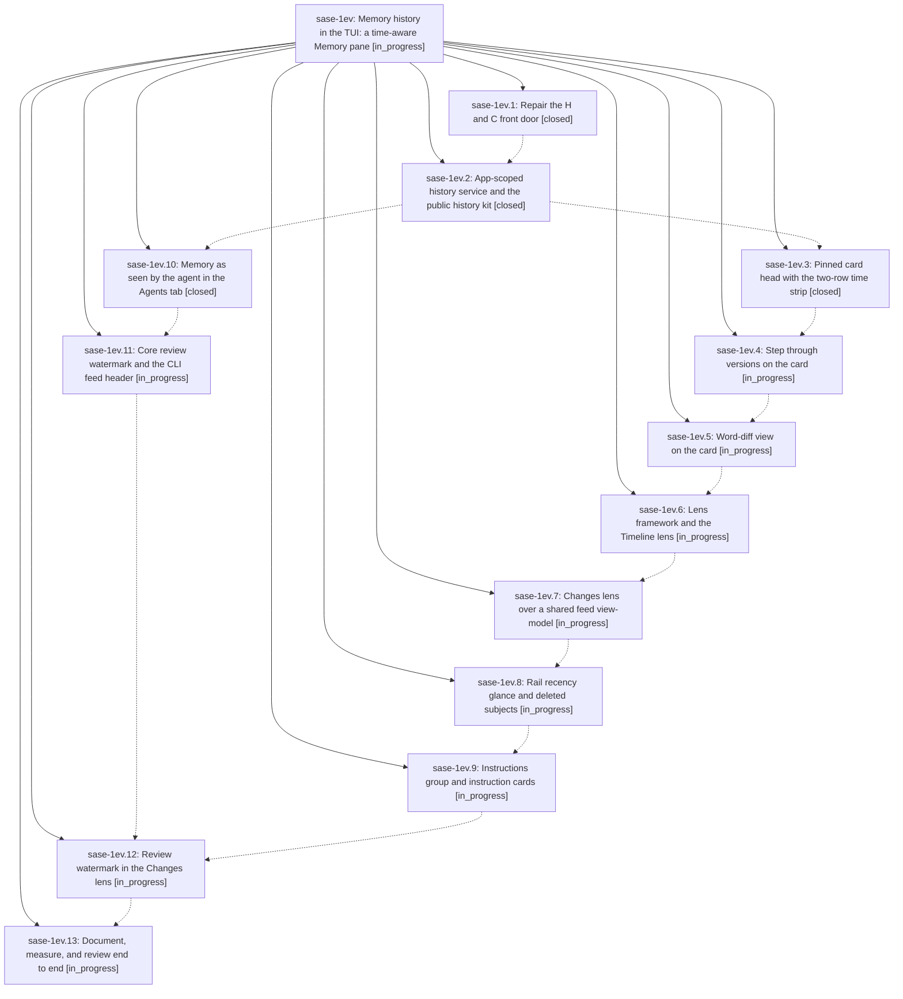

# Bead: sase-1ev — Memory history in the TUI: a time-aware Memory pane

[Bead Pages](../README.md) / sase-1ev

**Status:** ◐ in_progress · **Type:** ▸ plan · **Tier:** epic
**Owner:** `bryanbugyi34@gmail.com` · **Created by:** [bbugyi200.athena.0vj](https://github.com/sase-org/sase--agents/blob/main/sessions/bbugyi200.athena.0vj.md) · **Assignee:** `sase-1ev.land`
**Created:** 2026-10-02 14:43:02 EDT
**Plan:** [202610/memory\_history\_tui.md](https://github.com/sase-org/sase--plans/blob/main/202610/memory_history_tui.md)

## Description

The ACE Memory pane knows about time. Every memory note, web, strand, and agent instruction file can be stepped through, diffed, and reviewed in place, in the pager's exact visual language. Cross-file memory changes can be reviewed without leaving ACE, agents show which memory version they actually read, and every hand-off to the pager lands on the exact version that was on screen. No key blocks, nothing fails silently, and there is no second history engine.

## Phases

| Bead | Title | Status | Size | Created | Agents | Commits |
|---|---|---|---|---|---:|---:|
| [sase-1ev.1](sase-1ev.1.md) | Repair the H and C front door | ✓ closed | small | 2026-10-02 | 1 | 1 |
| [sase-1ev.10](sase-1ev.10.md) | Memory as seen by the agent in the Agents tab | ✓ closed | medium | 2026-10-02 | 1 | 1 |
| [sase-1ev.11](sase-1ev.11.md) | Core review watermark and the CLI feed header | ◐ in_progress | medium | 2026-10-02 | 1 | 0 |
| [sase-1ev.12](sase-1ev.12.md) | Review watermark in the Changes lens | ◐ in_progress | small | 2026-10-02 | 1 | 0 |
| [sase-1ev.13](sase-1ev.13.md) | Document, measure, and review end to end | ◐ in_progress | small | 2026-10-02 | 1 | 0 |
| [sase-1ev.2](sase-1ev.2.md) | App-scoped history service and the public history kit | ✓ closed | medium | 2026-10-02 | 1 | 1 |
| [sase-1ev.3](sase-1ev.3.md) | Pinned card head with the two-row time strip | ✓ closed | medium | 2026-10-02 | 1 | 0 |
| [sase-1ev.4](sase-1ev.4.md) | Step through versions on the card | ◐ in_progress | medium | 2026-10-02 | 1 | 0 |
| [sase-1ev.5](sase-1ev.5.md) | Word-diff view on the card | ◐ in_progress | medium | 2026-10-02 | 1 | 0 |
| [sase-1ev.6](sase-1ev.6.md) | Lens framework and the Timeline lens | ◐ in_progress | medium | 2026-10-02 | 1 | 0 |
| [sase-1ev.7](sase-1ev.7.md) | Changes lens over a shared feed view-model | ◐ in_progress | medium | 2026-10-02 | 1 | 0 |
| [sase-1ev.8](sase-1ev.8.md) | Rail recency glance and deleted subjects | ◐ in_progress | medium | 2026-10-02 | 1 | 0 |
| [sase-1ev.9](sase-1ev.9.md) | Instructions group and instruction cards | ◐ in_progress | medium | 2026-10-02 | 1 | 0 |

## Lineage

## Agents

| Agent | Bead | Commits |
|---|---|---:|
| [bbugyi200.athena.sase-1ev.1](https://github.com/sase-org/sase--agents/blob/main/agents/bbugyi200.athena.sase-1ev.1/README.md) | [sase-1ev.1](sase-1ev.1.md) | 1 |
| [bbugyi200.athena.sase-1ev.10](https://github.com/sase-org/sase--agents/blob/main/sessions/bbugyi200.athena.sase-1ev.10.md) | [sase-1ev.10](sase-1ev.10.md) | 1 |
| [bbugyi200.athena.sase-1ev.11](https://github.com/sase-org/sase--agents/blob/main/agents/bbugyi200.athena.sase-1ev.11/README.md) | [sase-1ev.11](sase-1ev.11.md) | 0 |
| [bbugyi200.athena.sase-1ev.12](https://github.com/sase-org/sase--agents/blob/main/agents/bbugyi200.athena.sase-1ev.12/README.md) | [sase-1ev.12](sase-1ev.12.md) | 0 |
| [bbugyi200.athena.sase-1ev.13](https://github.com/sase-org/sase--agents/blob/main/agents/bbugyi200.athena.sase-1ev.13/README.md) | [sase-1ev.13](sase-1ev.13.md) | 0 |
| [bbugyi200.athena.sase-1ev.2](https://github.com/sase-org/sase--agents/blob/main/agents/bbugyi200.athena.sase-1ev.2/README.md) | [sase-1ev.2](sase-1ev.2.md) | 1 |
| [bbugyi200.athena.sase-1ev.3](https://github.com/sase-org/sase--agents/blob/main/sessions/bbugyi200.athena.sase-1ev.3.md) | [sase-1ev.3](sase-1ev.3.md) | 0 |
| [bbugyi200.athena.sase-1ev.4](https://github.com/sase-org/sase--agents/blob/main/agents/bbugyi200.athena.sase-1ev.4/README.md) | [sase-1ev.4](sase-1ev.4.md) | 0 |
| [bbugyi200.athena.sase-1ev.5](https://github.com/sase-org/sase--agents/blob/main/agents/bbugyi200.athena.sase-1ev.5/README.md) | [sase-1ev.5](sase-1ev.5.md) | 0 |
| [bbugyi200.athena.sase-1ev.6](https://github.com/sase-org/sase--agents/blob/main/agents/bbugyi200.athena.sase-1ev.6/README.md) | [sase-1ev.6](sase-1ev.6.md) | 0 |
| [bbugyi200.athena.sase-1ev.7](https://github.com/sase-org/sase--agents/blob/main/agents/bbugyi200.athena.sase-1ev.7/README.md) | [sase-1ev.7](sase-1ev.7.md) | 0 |
| [bbugyi200.athena.sase-1ev.8](https://github.com/sase-org/sase--agents/blob/main/agents/bbugyi200.athena.sase-1ev.8/README.md) | [sase-1ev.8](sase-1ev.8.md) | 0 |
| [bbugyi200.athena.sase-1ev.9](https://github.com/sase-org/sase--agents/blob/main/agents/bbugyi200.athena.sase-1ev.9/README.md) | [sase-1ev.9](sase-1ev.9.md) | 0 |
| [bbugyi200.athena.sase-1ev.land](https://github.com/sase-org/sase--agents/blob/main/agents/bbugyi200.athena.sase-1ev.land/README.md) | [sase-1ev](README.md) | 0 |

## Commits

| Repo | Commit | Subject | Bead | Committed |
|---|---|---|---|---|
| sase | [`3691b88`](https://github.com/sase-org/sase/commit/3691b88ae7fe33bdae10dc5c6aeb5bba4217a759) | fix(ace-tui): open memory history pagers directly from app thread | [sase-1ev.1](sase-1ev.1.md) | 2026-10-02 15:12:30 EDT |
| sase | [`f42f9f2`](https://github.com/sase-org/sase/commit/f42f9f225ad9a78892c357312c2b9efb988bd7c2) | feat(history): shared history service with ACE SWR timeline and pager history kit | [sase-1ev.2](sase-1ev.2.md) | 2026-10-02 16:42:13 EDT |
| sase-core | [`sase-core@ba63f9d`](https://github.com/sase-org/sase-core/commit/ba63f9dfd99916765c989fcd380313591c936728) | feat(core): add memory history query and cache coverage | [sase-1ev.10](sase-1ev.10.md) | 2026-10-02 20:46:07 EDT |
