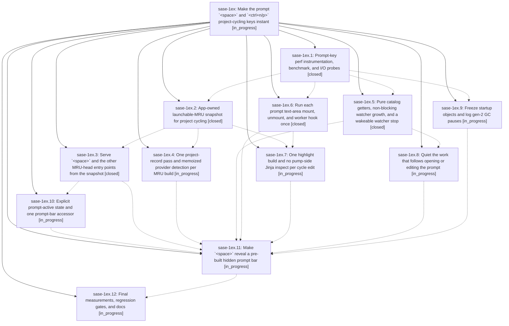

# Bead: sase-1ex — Make the prompt \`\<space\>\` and \`\<ctrl+n/p\>\` project-cycling keys instant

[Bead Pages](../README.md) / sase-1ex

**Status:** ◐ in_progress · **Type:** ▸ plan · **Tier:** epic
**Owner:** `bryanbugyi34@gmail.com` · **Created by:** [bbugyi200.athena.0vk](https://github.com/sase-org/sase--agents/blob/main/sessions/bbugyi200.athena.0vk.md) · **Assignee:** `sase-1ex.land`
**Created:** 2026-10-02 14:53:42 EDT
**Plan:** [202610/prompt\_space\_and\_project\_cycle\_latency.md](https://github.com/sase-org/sase--plans/blob/main/202610/prompt_space_and_project_cycle_latency.md)

## Description

Opening the prompt bar with `<space>` and cycling the current-project stack with `<ctrl+n>` / `<ctrl+p>` become in-memory operations. Neither key path reads or writes the VCS MRU, lists project records, spawns a subprocess, or stops, starts, or joins a watcher on the event loop. Warm `<ctrl+n/p>` key-to-paint p95 is at most 16 ms. `<space>` reveals a pre-built bar with key-to-paint p95 at most 60 ms. There are no multi-hundred-millisecond first-press or first-visit spikes. Launch, prefill, history, and cycling semantics stay unchanged.

## Phases

| Bead | Title | Status | Size | Created | Agents | Commits |
|---|---|---|---|---|---:|---:|
| [sase-1ex.1](sase-1ex.1.md) | Prompt-key perf instrumentation, benchmark, and I/O probes | ✓ closed | small | 2026-10-02 | 1 | 1 |
| [sase-1ex.10](sase-1ex.10.md) | Explicit prompt-active state and one prompt-bar accessor | ◐ in_progress | medium | 2026-10-02 | 1 | 0 |
| [sase-1ex.11](sase-1ex.11.md) | Make \`\<space\>\` reveal a pre-built hidden prompt bar | ◐ in_progress | large | 2026-10-02 | 1 | 0 |
| [sase-1ex.12](sase-1ex.12.md) | Final measurements, regression gates, and docs | ◐ in_progress | small | 2026-10-02 | 1 | 0 |
| [sase-1ex.2](sase-1ex.2.md) | App-owned launchable-MRU snapshot for project cycling | ✓ closed | medium | 2026-10-02 | 1 | 1 |
| [sase-1ex.3](sase-1ex.3.md) | Serve \`\<space\>\` and the other MRU-head entry points from the snapshot | ✓ closed | medium | 2026-10-02 | 1 | 1 |
| [sase-1ex.4](sase-1ex.4.md) | One project-record pass and memoized provider detection per MRU build | ◐ in_progress | small | 2026-10-02 | 1 | 0 |
| [sase-1ex.5](sase-1ex.5.md) | Pure catalog getters, non-blocking watcher growth, and a wakeable watcher stop | ✓ closed | medium | 2026-10-02 | 1 | 0 |
| [sase-1ex.6](sase-1ex.6.md) | Run each prompt text-area mount, unmount, and worker hook once | ✓ closed | medium | 2026-10-02 | 1 | 1 |
| [sase-1ex.7](sase-1ex.7.md) | One highlight build and no pump-side Jinja inspect per cycle edit | ◐ in_progress | medium | 2026-10-02 | 1 | 0 |
| [sase-1ex.8](sase-1ex.8.md) | Quiet the work that follows opening or editing the prompt | ◐ in_progress | small | 2026-10-02 | 1 | 0 |
| [sase-1ex.9](sase-1ex.9.md) | Freeze startup objects and log gen-2 GC pauses | ◐ in_progress | small | 2026-10-02 | 1 | 0 |

## Lineage

## Agents

| Agent | Bead | Commits |
|---|---|---:|
| [bbugyi200.athena.sase-1ex.1](https://github.com/sase-org/sase--agents/blob/main/agents/bbugyi200.athena.sase-1ex.1/README.md) | [sase-1ex.1](sase-1ex.1.md) | 1 |
| [bbugyi200.athena.sase-1ex.10](https://github.com/sase-org/sase--agents/blob/main/agents/bbugyi200.athena.sase-1ex.10/README.md) | [sase-1ex.10](sase-1ex.10.md) | 0 |
| [bbugyi200.athena.sase-1ex.11](https://github.com/sase-org/sase--agents/blob/main/agents/bbugyi200.athena.sase-1ex.11/README.md) | [sase-1ex.11](sase-1ex.11.md) | 0 |
| [bbugyi200.athena.sase-1ex.12](https://github.com/sase-org/sase--agents/blob/main/agents/bbugyi200.athena.sase-1ex.12/README.md) | [sase-1ex.12](sase-1ex.12.md) | 0 |
| [bbugyi200.athena.sase-1ex.2](https://github.com/sase-org/sase--agents/blob/main/sessions/bbugyi200.athena.sase-1ex.2.md) | [sase-1ex.2](sase-1ex.2.md) | 1 |
| [bbugyi200.athena.sase-1ex.3](https://github.com/sase-org/sase--agents/blob/main/agents/bbugyi200.athena.sase-1ex.3/README.md) | [sase-1ex.3](sase-1ex.3.md) | 1 |
| [bbugyi200.athena.sase-1ex.4](https://github.com/sase-org/sase--agents/blob/main/agents/bbugyi200.athena.sase-1ex.4/README.md) | [sase-1ex.4](sase-1ex.4.md) | 0 |
| [bbugyi200.athena.sase-1ex.5](https://github.com/sase-org/sase--agents/blob/main/agents/bbugyi200.athena.sase-1ex.5/README.md) | [sase-1ex.5](sase-1ex.5.md) | 0 |
| [bbugyi200.athena.sase-1ex.6](https://github.com/sase-org/sase--agents/blob/main/sessions/bbugyi200.athena.sase-1ex.6.md) | [sase-1ex.6](sase-1ex.6.md) | 1 |
| [bbugyi200.athena.sase-1ex.7](https://github.com/sase-org/sase--agents/blob/main/agents/bbugyi200.athena.sase-1ex.7/README.md) | [sase-1ex.7](sase-1ex.7.md) | 0 |
| [bbugyi200.athena.sase-1ex.8](https://github.com/sase-org/sase--agents/blob/main/agents/bbugyi200.athena.sase-1ex.8/README.md) | [sase-1ex.8](sase-1ex.8.md) | 0 |
| [bbugyi200.athena.sase-1ex.9](https://github.com/sase-org/sase--agents/blob/main/sessions/bbugyi200.athena.sase-1ex.9.md) | [sase-1ex.9](sase-1ex.9.md) | 0 |
| [bbugyi200.athena.sase-1ex.land](https://github.com/sase-org/sase--agents/blob/main/agents/bbugyi200.athena.sase-1ex.land/README.md) | [sase-1ex](README.md) | 0 |

## Commits

| Repo | Commit | Subject | Bead | Committed |
|---|---|---|---|---|
| sase | [`e0d3645`](https://github.com/sase-org/sase/commit/e0d36453f7a0a4a3493f3ad9a08427ae58ce2e69) | fix: Preserve panel mode when navigating between agents in Agents tab (sase-1ex) | [sase-1ex](README.md) | 2026-02-20 11:56:45 EST |
| sase | [`db40a72`](https://github.com/sase-org/sase/commit/db40a7219ac0e14d14e9965fa968ee58bc88884b) | feat(tui-perf): add prompt-key perf harness with recorded baseline | [sase-1ex.1](sase-1ex.1.md) | 2026-10-02 16:52:09 EDT |
| sase | [`8138678`](https://github.com/sase-org/sase/commit/813867849ce4ff10ae8d1ee9d146367f2e95d475) | feat(ace-tui): app-owned launchable-MRU snapshot for project cycling | [sase-1ex.2](sase-1ex.2.md) | 2026-10-02 19:38:59 EDT |
| sase | [`24cff91`](https://github.com/sase-org/sase/commit/24cff91cd3e5a737d417a5b32cd38835a4125fae) | feat(tui): dispatch prompt mount/unmount/worker hooks once (sase-1ex.6) | [sase-1ex.6](sase-1ex.6.md) | 2026-10-02 19:39:47 EDT |
| sase | [`f896b59`](https://github.com/sase-org/sase/commit/f896b59c4c0fec3d6957aebe46d4a55b8c54d5aa) | feat(ace-tui): serve space and MRU-head entry points from the launchable-MRU snapshot (sase-1ex.3) | [sase-1ex.3](sase-1ex.3.md) | 2026-10-02 20:41:58 EDT |
